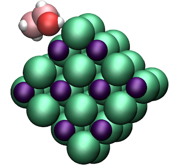

# LAMMPS tutorials #

This is the script of the webpage [LAMMPS Tutorials](https://lammpstutorials.github.io/). 
Some LAMMPS inputs can be found in the Inputs folder. 

The html/css templates are from [html5 up](https://html5up.net/) 
and [harnishdesign](http://www.harnishdesign.net/).

### Tutorials ###

  
  
  
  
  
  

### About the author ###

I am a computer physicist in soft matter and fluids at interfaces. I am 
principally using molecular simulations to study the behaviour of fluid confined 
in nanoporous materials. You can find more information on my 
[personal webpage](https://simongravelle.github.io/).

### License ###

All the LAMMPS materials given here are open source and released under the 
GNU general public license v3.0.
