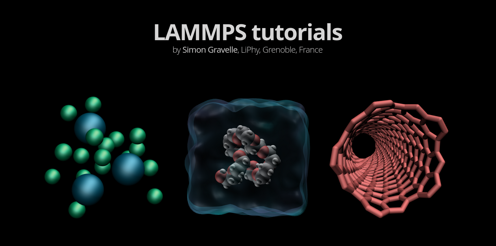
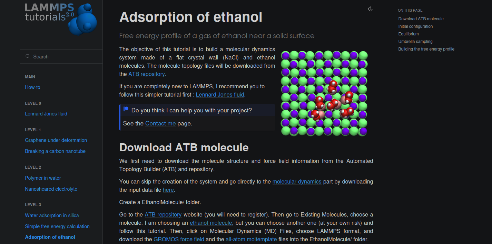

# LAMMPS tutorials

This is the script of the [LAMMPS Tutorials 2.0](https://lammpstutorials.github.io/) webpage. 
All the LAMMPS input scripts and data files can be found in the [inputs](docs/inputs/) folder.

  

  

### You noticed a mistake in one of the tutorial?

You can report issue here on Github, or send me an [email](https://simongravelle.github.io/). Your feedback is always highly appreciated.

### About me ###

I am a computer physicist in soft matter and fluids at interfaces. You can 
find more information on my [personal webpage](https://simongravelle.github.io/).

### License ###

All the inputs, scripts, and data files are released under the 
GNU general public license v3.0.
