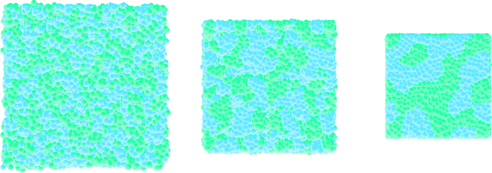

Going further with exercises
============================

Solve Lost atoms error
----------------------

For this exercise, the following input script is provided:
    
..  code-block:: lammps

    units lj
    dimension 3
    atom_style atomic
    pair_style lj/cut 2.5
    boundary p p p

    region simulation_box block -20 20 -20 20 -20 20
    create_box 1 simulation_box
    create_atoms 1 random 1000 341841 simulation_box

    mass 1 1
    pair_coeff 1 1 1.0 1.0

    dump mydmp all atom 100 dump.lammpstrj
    thermo 100
    thermo_style custom step temp pe ke etotal press

    fix mynve all nve
    fix mylgv all langevin 1.0 1.0 0.1 1530917
    timestep 0.005

    run 10000

As it is, this input returns one of the most common
error that you will encounter using LAMMPS:

..  code-block:: bash

    ERROR: Lost atoms: original 1000 current 984

The goal of this exercise is to fix the *Lost atoms* error without 
using any other command than the ones already present. You can 
only play with the values of the parameters and/or replicate every
command as many times as needed.

..  admonition:: Note
    :class: info

    This script is failing because particles are created randomly in space, some
    of them are likely overlapping, and no energy minimization is performed prior
    to start the molecular dynamics simulation.

Create a demixed dense phase
----------------------------

Starting from one of the *input* created in this tutorial, fine-tune the
parameters such as particle numbers and interaction to create a simulation
with the following properties:

- the density in particles must be high,
- both particles of type 1 and 2 must have the same size,
- particles of type 1 and 2 must demix. 

.. figure:: figures/demixing-light.png
    :alt: VMD/LAMMPS exercise molecular dynamics simulation: demixing lennard
          jones fluids
    :class: only-light

          jones fluids
    :class: only-dark

.. container:: figurelegend

    Figure: Snapshots taken at different times showing the particles of type 1 
    and type 2 progressively demixing and forming large demixed areas.  

..  admonition:: Hint
    :class: info

    An easy way to create a dense phase is to allow the box dimensions to relax
    until the vacuum disappears. You can do that by replacing the *fix nve* with *fix nph*.

From atoms to molecules
-----------------------

Add a bond between particles of *type 2* to create dumbbell molecules instead
of single particles.

.. figure:: figures/dumbell-dark.png
    :alt: Dumbbell Lennard-Jones molecules simulated using LAMMPS
    :class: only-dark

.. figure:: figures/dumbell-light.png
    :alt: Dumbbell Lennard-Jones molecules simulated using LAMMPS
    :class: only-light 

.. container:: figurelegend

    Figure: Dumbbell molecules made of 2 large spheres mixed with smaller
    particles (small spheres). See the corresponding |dumbell_video|.

.. |dumbell_video| raw:: html

    <a href="https://youtu.be/R_oHonOQi68" target="_blank">video</a>

Similarly to the dumbbell molecules, create a small polymer,
i.e. a long chain of particles linked by bonds and angles.

.. figure:: figures/polymer-dark.png
    :alt: Polymer Lennard-Jones molecules simulated using LAMMPS
    :class: only-dark

.. figure:: figures/polymer-light.png
    :alt: Polymer Lennard-Jones molecules simulated using LAMMPS
    :class: only-light 

.. container:: figurelegend

    Figure: A single small polymer molecule made of 9 large spheres mixed with
    smaller particles. See the corresponding |polymer_video|.

.. |polymer_video| raw:: html

    <a href="https://youtu.be/LfqcfP3ZQcY" target="_blank">video</a>

.. admonition:: Hints
    :class: info

    Use a *molecule template* to easily insert as many atoms connected
    by bonds (i.e. molecules) as you want. A molecule template typically
    begins as follows:

    ..  code-block:: lammps

        2 atoms
        1 bonds

        Coords

        1 0.5 0 0
        2 -0.5 0 0

        (...)

    A bond section also needs to be added, see this
    |molecule_template_lammps| for details on the formatting of a
    molecule template.

.. |molecule_template_lammps| raw:: html

    <a href="https://docs.lammps.org/molecule.html" target="_blank">page</a>
