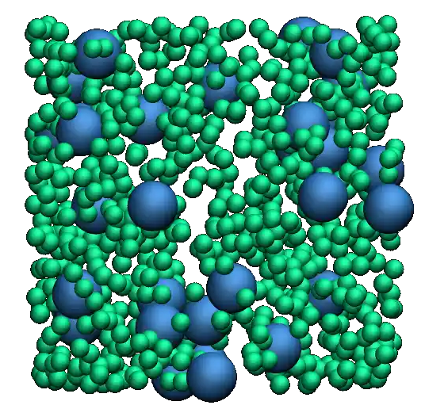

          represented as small green spheres and the atoms of type 2 as large blue spheres.
    :height: 250
    :align: right
    :class: only-dark

.. figure:: figures/lennard-jones-fluid-avatar-light.webp
    :alt: The binary mixture simulated during Tutorial 1. The atoms of type 1 are
          represented as small green spheres and the atoms of type 2 as large blue spheres.
    :height: 250
    :align: right
    :class: only-light

The objective of this tutorial is to perform the simulation of a binary
fluid using LAMMPS.

The system is a Lennard-Jones fluid composed of neutral particles with two
different diameters, contained within a cubic box with periodic boundary conditions 
In this tutorial, the temperature of the system is maintained using a Langevin
thermostat :cite:`schneider1978molecular`, and basic quantities are extracted
from the system, including the potential and kinetic energies. 

This tutorial illustrates several key ingredients of molecular dynamics
simulations, such as system initialization, energy minimization, integration
of the equations of motion, and trajectory visualization.
