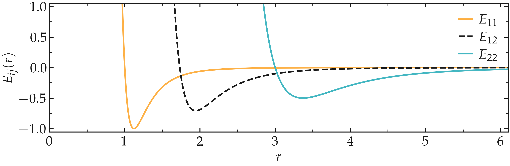
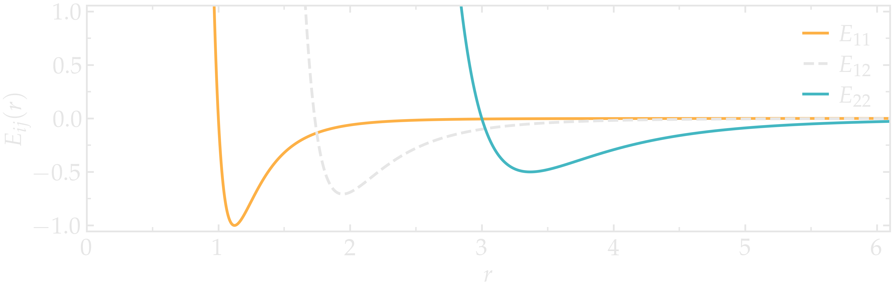
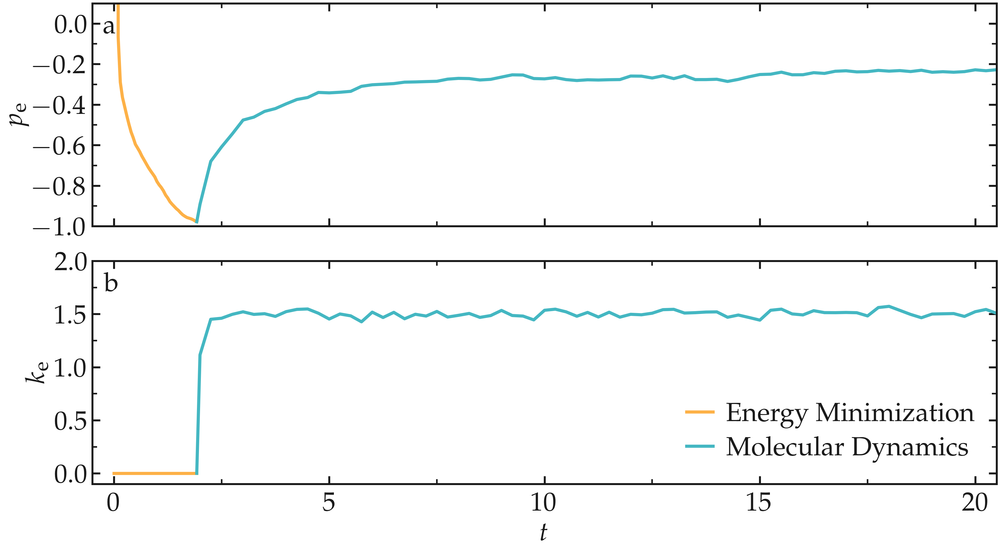
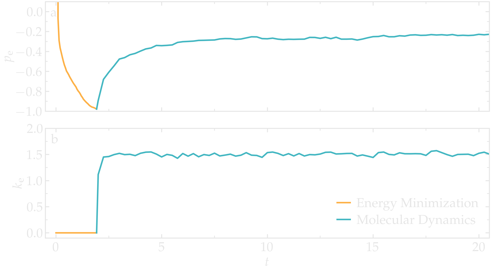
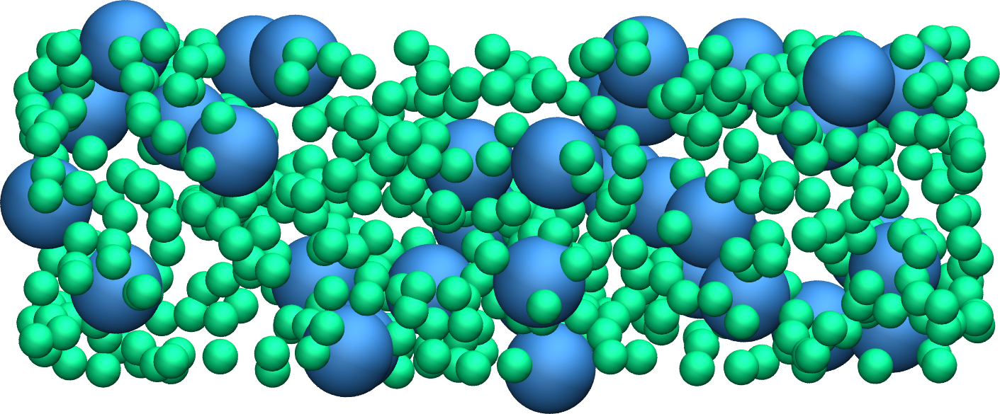
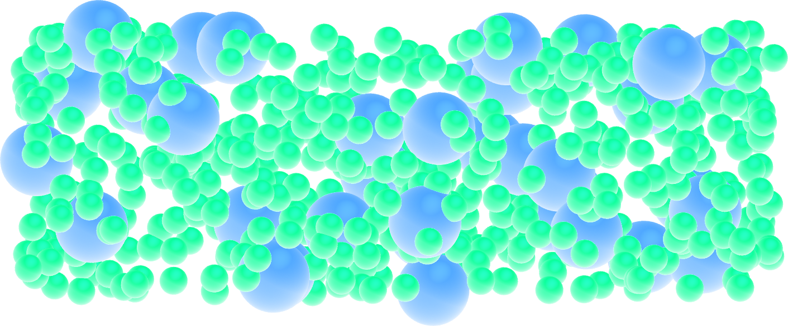
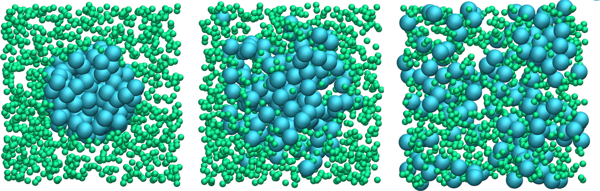
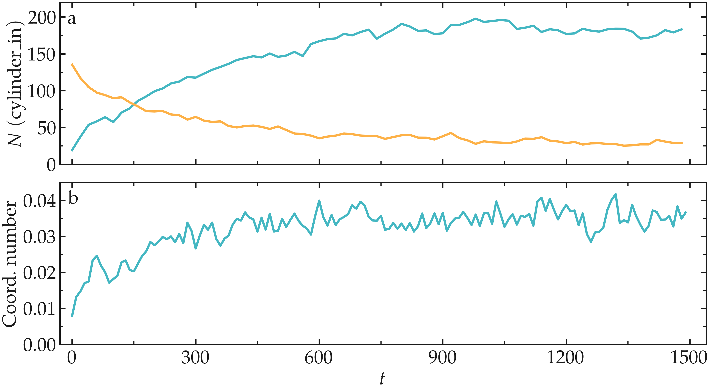
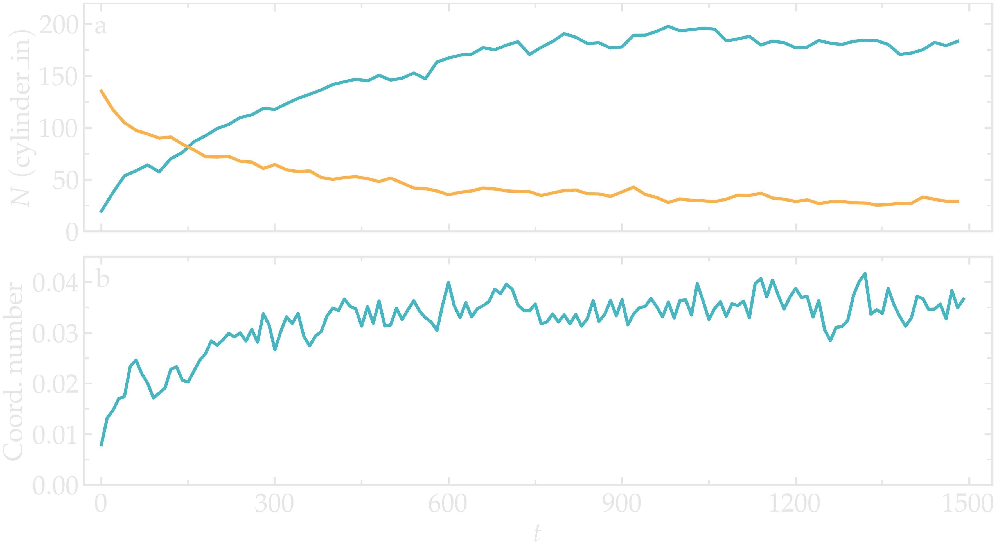

My first input
==============

To run a simulation using LAMMPS, one needs to write a series of commands
in an input script. For clarity, the input scripts written for this first
tutorial will be divided into five categories which we are going to fill up
one by one. 

Create a folder, call it *my-first-input/*, and then create a blank
text file in it called *input.lammps*. Copy the following lines
in *input.lammps*, where a line starting with a hash symbol (#)
is a comment ignored by LAMMPS:

.. code-block:: lammps

    # PART A - ENERGY MINIMIZATION
    # 1) Initialization
    # 2) System definition
    # 3) Simulation settings
    # 4) Visualization
    # 5) Run

These five categories are not required in every input script, and should not
necessarily be in that exact order. For instance, parts 3 and 4 could be
inverted, or part 4 could be omitted. Note however that LAMMPS reads input
files from top to bottom, therefore the *Initialization* and  *System definition*
categories must appear at the top of the input, and the *Run* category at
the bottom.

System initialization
---------------------

In the first section of the script, called *Initialization*,
let us indicate to LAMMPS the most basic information
about the simulation, such as:

- the conditions at the boundaries of the box (e.g. periodic or non-periodic),
- the type of atoms (e.g. uncharged single dots or spheres with angular velocities).

Enter the following lines in *input.lammps*:

..  code-block:: lammps

    # 1) Initialization
    units lj
    dimension 3
    atom_style atomic
    pair_style lj/cut 2.5
    boundary p p p

The first line, *units lj*, indicates that we want to use the unit system
called *LJ* (Lennard-Jones), in which all quantities are unitless. 
    
.. admonition:: About Lennard-Jones (LJ) units
    :class: info

    Lennard-Jones (LJ) units are a dimensionless system of units. LJ units are
    often used in molecular simulations and theoretical calculations. When using
    LJ units:

    - energies are expressed in units of :math:`\epsilon`, where :math:`\epsilon`
      is the depth of the potential of the LJ interaction,
    - distances are expressed in units of :math:`\sigma`, where :math:`\sigma` is
      the distance at which the particle-particle potential energy is zero,
    - masses are expressed in units of the atomic mass :math:`m`.

    All the other quantities are normalized by a combination of :math:`\epsilon`, :math:`\sigma`,
    and :math:`m`. For instance, time is expressed in units of :math:`\sqrt{ \epsilon / m \sigma^2}`.
    Find details on the |LAMMPS_units|.
    
.. |LAMMPS_units| raw:: html

    <a href="https://docs.lammps.org/units.html" target="_blank">LAMMPS website</a>

The second line, *dimension 3*, indicates that the simulation
is 3D. The third line, *atom_style atomic*, that the *atomic* style
will be used, therefore each atom is just a dot with a mass.

.. admonition:: About the atom style
    :class: info

    While we are keeping things as simple as possible in this tutorial,
    different *atom_style* will be used in the following tutorials.
    Notably, these other atom styles will allow us to create molecules,
    i.e. atoms with partial charges and chemical bonds. You can find the complete list
    of implemented atom styles from the |atom style page|.
    
.. |atom style page| raw:: html

    <a href="https://docs.lammps.org/atom_style.html" target="_blank">atom style page</a>

The fourth line, *pair_style lj/cut 2.5*, indicates that atoms
will be interacting through a Lennard-Jones potential with
a cut-off equal to :math:`r_c = 2.5` (unitless)
:cite:`wang2020lennard,fischer2023history`:
    
.. math::

    E_{ij} (r) = 4 \epsilon_{ij} \left[ \left( \dfrac{\sigma_{ij}}{r} \right)^{12}
    - \left( \dfrac{\sigma_{ij}}{r} \right)^{6} \right], ~ \text{for} ~ r < r_c,

where :math:`r` is the inter-particle distance,
:math:`\epsilon_{ij}` is the depth of potential well that sets the interaction strength, and
:math:`\sigma_{ij}` is the distance parameter or particle effective size.
Here, the indexes *ij* refer to the particle types *i* and *j*.

.. admonition:: About Lennard-Jones potential
    :class: info

    The Lennard-Jones potential offers a simplified representation that captures
    the fundamental aspects of interactions among atoms. It depicts a scenario where two
    particles exhibit repulsion at extremely close distances, attraction at moderate
    distances, and no interaction at infinite separation. The repulsive part of the 
    Lennard-Jones potential (i.e. the term :math:`\propto r^{-12}`) is associated
    with the Pauli exclusion principle. The attractive part (i.e. the term
    in :math:`\propto - r^{-6}`) is linked with the London dispersion forces.

The last line, *boundary p p p*, indicates that the periodic boundary
conditions will be used along all three directions of space (the 3 *p* stand
for *x*, *y*, and *z*, respectively).

At this point, the *input.lammps* is a LAMMPS input script that does nothing.
You can run it using LAMMPS to verify that the *input* contains
no mistake by typing the following command in the terminal
from the *my-first-input/*  folder:

..  code-block:: bw

    lmp -in input.lammps

Here *lmp* is linked to my compiled LAMMPS version.
Running the previous command should return:

..  code-block:: bw

    LAMMPS (2 Aug 2023 - Update 1)
    Total wall time: 0:00:00

In case there is a mistake in the input script, for example, if
*atom_stile* is written instead of *atom_style*, LAMMPS
gives you an explicit warning:

..  code-block:: bw

    LAMMPS (2 Aug 2023 - Update 1)
    ERROR: Unknown command: atom_stile  atomic (src/input.cpp:232)
    Last command: atom_stile atomic

System definition
-----------------

Let us fill the *System definition* category of the input script:

..  code-block:: lammps

# 2) System definition
region simulation_box block -20 20 -20 20 -20 20
create_box 2 simulation_box
create_atoms 1 random 1500 341341 simulation_box
create_atoms 2 random 100 127569 simulation_box

The first line, *region simulation_box (...)*, creates a region
named *simulation_box* that is a block (i.e. a rectangular cuboid) that
extends from -20 to 20 (no unit) along all 3 directions of space.

The second line, *create_box 2 simulation_box*, creates a simulation box based on
the region *simulation_box* with *2* types of atoms.

The third line, *create_atoms (...)* creates 1500 atoms of type 1
randomly within the region *simulation_box*. The integer *341341* is a
seed that can be changed in order to create different
initial conditions for the simulation. The fourth line
creates 100 atoms of type 2.

If you run LAMMPS, you should see the following information in the terminal:

..  code-block:: bw

    (...)
    Created orthogonal box = (-20 -20 -20) to (20 20 20)
    (...)
    Created 1500 atoms
    (...)
    Created 100 atoms
    (...)

From what is printed in the terminal, it is clear that
LAMMPS correctly interpreted the commands, and first created
the box with desired dimensions, then 1500 atoms, and then 100
atoms.

Simulation Settings
-------------------

Let us fill the *Simulation Settings* category section of
the *input* script:

..  code-block:: lammps

    # 3) Simulation settings
    mass 1 1
    mass 2 1
    pair_coeff 1 1 1.0 1.0
    pair_coeff 2 2 0.5 3.0

The two first commands, *mass (...)*, attribute a mass
equal to 1 (unitless) to both atoms of type 1 and 2.
Alternatively, one could have written
these two commands into one single line: *mass * 1*,
where the star symbol means *all* the atom types of the simulation. 
    
The third line, *pair_coeff 1 1 1.0 1.0*, sets the Lennard-Jones
coefficients for the interactions between atoms of type 1,
respectively the energy parameter :math:`\epsilon_{11} = 1.0` and the distance
parameter :math:`\sigma_{11} = 1.0`. 

Similarly, the last line sets the Lennard-Jones coefficients for
the interactions between atoms of type 2, :math:`\epsilon_{22} = 0.5`,
and :math:`\sigma_{22} = 3.0`.
   
.. admonition:: About cross parameters
    :class: info

    By default, LAMMPS calculates the cross coefficients between the different atom types
    using geometric average: :math:`\epsilon_{ij} = \sqrt{\epsilon_{ii} \epsilon_{jj}}`,
    :math:`\sigma_{ij} = \sqrt{\sigma_{ii} \sigma_{jj}}`. In the present case,
    and even without specifying it explicitly, we thus have:

    - :math:`\epsilon_{12} = \sqrt{1.0 \times 0.5} = 0.707`, and 
    - :math:`\sigma_{12} = \sqrt{1.0 \times 3.0} = 1.732`.

    When necessary, cross-parameters can be explicitly specified
    by adding the following line into the input file: *pair_coeff 1 2 0.707 1.732*. 
    This can be used for instance to increase the attraction between particles
    of type 1 and 2, without affecting the interactions between particles of the same type.

    Note that the arithmetic rule, also known as 
    Lorentz-Berthelot rule :cite:`lorentz1881ueber,berthelot1898melange`, where 
    :math:`\epsilon_{ij} = \sqrt{\epsilon_{ii} \epsilon_{jj}}`,
    :math:`\sigma_{ij} = (\sigma_{ii}+\sigma_{jj})/2`, is more common than the
    geometric rule. However, neither the geometric nor the arithmetic rules are
    based on rigorous arguments, so here the geometric rule will do just fine. 

Due to the chosen Lennard-Jones parameters, the two types of particles
are given different effective diameters, as can be seen by plotting
:math:`E_{11} (r)`, 
:math:`E_{12} (r)`,
and :math:`E_{22} (r)`.

..  container:: figurelegend

    Figure: The Lennard-Jones potential :math:`E_{ij} (r)`
    as a function of the inter-particle distance, where
    :math:`i, j = 1 ~ \text{or} ~ 2`. This figure was generated using Python
    with Matplotlib Pyplot, and the notebook can be accessed |lennard-jones-pyplot.ipynb|.
    The Pyplot parameters used for all figures can be accessed in a |pyplot-perso|.

.. |lennard-jones-pyplot.ipynb| raw:: html

   <a href="https://github.com/lammpstutorials/lammpstutorials.github.io/blob/2Aug2023/docs/sphinx/source/tutorials/figures/level1/lennard-jones-fluid/lennard-jones-pyplot.ipynb" target="_blank">from Github</a>

.. |pyplot-perso| raw:: html

    <a href="https://github.com/simongravelle/pyplot-perso" target="_blank">dedicated repository</a>

Energy minimization
-------------------

The system is now fully parametrized. Let us fill the two last remaining sections
by adding the following lines into *input.lammps*:

..  code-block:: lammps

    # 4) Visualization
    thermo 10
    thermo_style custom step temp pe ke etotal press

    # 5) Run
    minimize 1.0e-4 1.0e-6 1000 10000

The *thermo* command asks LAMMPS to print
thermodynamic information (e.g. temperature, energy) in the
terminal every given number of steps, here 10 steps. 
The *thermo_style custom* requires LAMMPS to print 
the system temperature (*temp*), potential energy (*pe*),
kinetic energy (*ke*), total energy (*etotal*),
and pressure (*press*). Finally, the *minimize* command
instructs LAMMPS to perform an energy minimization of the system.

.. admonition:: About energy minimization
    :class: info

    An energy minimization procedure consists of adjusting the coordinates of
    the atoms that are too close to each other until one of the stopping
    criteria is reached. By default, LAMMPS uses the conjugate
    gradient (CG) algorithm :cite:`hestenes1952methods` (see all the other
    implemented methods on the |min_style| page), which runs 
    until one of the following criteria is reached:

    - The change in energy between two iterations is less than 1.0e-4.
    - The maximum force between two atoms in the system is lower than 1.0e-6.
    - The maximum number of iterations is 1000.
    - The maximum number of times the force and the energy have been evaluated is 10000.

.. |min_style| raw:: html

    <a href="https://docs.lammps.org/min_style.html" target="_blank">min style</a>

Now running the simulation, we can see how the thermodynamic
variables evolve as the simulation progresses:

..  code-block:: bw

   Step  Temp  PotEng         KinEng    TotEng         Press     
   0     0     78840982       0         78840982       7884122      
   10    0     169.90532      0         169.90532      17.187291    
   20    0    -0.22335386     0        -0.22335386    -0.0034892297 
   30    0    -0.31178296     0        -0.31178296    -0.0027290466 
   40    0    -0.38135002     0        -0.38135002    -0.0016419218 
   50    0    -0.42686621     0        -0.42686621    -0.0015219081 
   60    0    -0.46153953     0        -0.46153953    -0.0010659992 
   70    0    -0.48581568     0        -0.48581568    -0.0014849169 
   80    0    -0.51799572     0        -0.51799572    -0.0012995545 
   (...)

These lines give us information about
the progress of the energy minimization. First, at the start
of the simulation (Step 0), the energy in the system is
huge: 78840982 (unitless). This was expected because
the atoms have been created at random positions within the
simulation box and some of them are probably overlapping,
resulting in a large initial energy which is the consequence
of the repulsive part of the Lennard-Jones interaction
potential. As the energy minimization progresses, the energy
rapidly decreases and reaches a negative value, indicating that the atoms have been
displaced at reasonable distances from each other.

.. admonition:: On the temperature during energy minimization
    :class: info

    As a side note, during energy minimization both temperature and kinetic energy remain equal to
    their initial values of 0. This is expected as the conjugate gradient
    algorithm only affects the positions of the particles based on the
    forces between them, without affecting their velocities.

Other useful information has been printed in the terminal, for example, LAMMPS
tells us that the first of the four criteria to be satisfied was the energy:

..  code-block:: bw

    Minimization stats:
    Stopping criterion = energy tolerance

Molecular dynamics
------------------

The system is now ready. Let us continue by completing the input script and
adding commands to perform a molecular dynamics simulation, starting from the
final state of the previous energy minimization step.

.. admonition:: Background Information -- What is molecular dynamics?
    :class: info

    Molecular dynamics (MD) is based on the numerical solution of the Newtonian
    equations of motion for every atom :math:`i`,

    .. math::

        \sum_{j \ne i} \boldsymbol{F}_{ji} = m_i \times \boldsymbol{a}_i,

    where :math:`\sum` is the sum over all the atoms other than :math:`i`, 
    :math:`\boldsymbol{F}_{ji}` the force between the atom pairs :math:`j-i`,
    :math:`m_i` the mass of atom :math:`i`, and :math:`\boldsymbol{a}_i` its acceleration. 
    The Newtonian equations are solved at every step to predict the
    evolution of the positions and velocities of atoms and molecules over
    time. Then, the velocity and position of each atom are updated according to the
    calculated acceleration, typically using the Verlet algorithm, or similar.
    More information can be found in Refs. :cite:`allen2017computer,frenkel2023understanding`.

In the same input script, after the *minimization* command, add the following
lines:

..  code-block:: lammps

    # PART B - MOLECULAR DYNAMICS
    # 4) Visualization
    thermo 50

Since LAMMPS reads the input from top to bottom, these lines will be
executed after the energy minimization. There is no need to re-initialize
or re-define the system. The *thermo* command is called a second time within
the same input, so the previously entered value of 10 will be replaced by
the value of 50 as soon as *PART B* starts.

Then, let us add a second *Run* section:

..  code-block:: lammps

    # 5) Run
    fix mynve all nve
    fix mylgv all langevin 1.0 1.0 0.1 1530917
    timestep 0.005
    run 10000

The *fix nve* is used to update the positions and the velocities of the
atoms in the group *all* at every step. The group *all* is a default group
that contains every atom.

The second fix applies a Langevin thermostat to the atoms of the group
*all*, with a desired initial temperature of 1.0 (unitless), and a final
temperature of 1.0 as well :cite:`schneider1978molecular`. A *damping* parameter
of 0.1 is used. The *damping* parameter determines how rapidly the temperature
is relaxed to its desired value. The number *1530917* is a seed, you can
change it to perform statistically independent simulations. Finally, the last
two lines set the value of the *timestep* and the number of steps for the *run*,
respectively, corresponding to a total duration of 50 (unitless).

.. admonition:: What is a fix?
    :class: info
    
    In LAMMPS, a *fix* is a command that performs specific tasks during a simulation,
    such as imposing constraints, applying forces, or modifying particle properties.
    Other LAMMPS-specific terms are defined in the :ref:`glossary-label`.
        
After running the simulation, similar lines should appear in the terminal:

..  code-block:: bw

    Step   Temp          PotEng         KinEng       TotEng        Press     
    388    0             -0.95476642    0           -0.95476642   -0.000304834
    400    0.68476875    -0.90831467    1.0265112    0.11819648    0.023794293  
    500    0.97168188    -0.56803405    1.4566119    0.88857783    0.02383215   
    600    1.0364167     -0.44295618    1.5536534    1.1106972     0.027985679  
    700    1.010934      -0.39601767    1.5154533    1.1194356     0.023064983  
    800    0.98641731    -0.37866057    1.4787012    1.1000406     0.023131153  
    900    1.0074571     -0.34951264    1.5102412    1.1607285     0.023520785 
    (...)

The second column shows that the temperature *Temp* starts from 0, but rapidly
reaches the requested value and stabilize itself near :math:`T=1`. 

From what has been printed in the *log* file, one can plot the potential
energy (:math:`p_\text{e}`) and the kinetic energy (:math:`k_\text{e}`) of
the system over time. The potential energy, :math:`p_\text{e}`, rapidly
decreases during energy minimization. Then, after the molecular dynamics
simulation starts, :math:`p_\text{e}` increases until it reaches a plateau
value of about -0.25. The kinetic energy, :math:`k_\text{e}`, is equal to
zero during energy minimization and then increases during molecular
dynamics until it reaches a plateau value of about 1.5.

..  container:: figurelegend

    Figure: a) Potential energy (:math:`p_\text{e}`) of the binary mixture as a function
    of the time :math:`t`. b) Kinetic energy (:math:`k_\text{e}`) as a function of :math:`t`.

Trajectory visualization
------------------------

The simulation is running well, but we would like to
visualize the trajectories of the atoms. To do so, we first need
to print the positions of the atoms in a file at a regular interval.

Add the following command to the *input.lammps* file, in the *Visualization*
section of *PART B*:

..  code-block:: lammps

    dump mydmp all atom 100 dump.lammpstrj

Run the *input.lammps* using LAMMPS again. A file named *dump.lammpstrj*
must appear within *my-first-input/*. A *.lammpstrj* file can
be opened using VMD. With Ubuntu/Linux, you can simply execute in the terminal:

..  code-block:: bw

    vmd dump.lammpstrj

Otherwise, you can open VMD and import the *dump.lammpstrj*
file manually using *File -> New molecule*.

By default, you should see a cloud of lines, but you can improve the
representation (see this :ref:`vmd-label` for basic instructions).

..  container:: figurelegend

    Figure: View of a slice of the system using VMD, with both
    types of atoms represented as spheres. See the corresponding |my_first_input_video|.

.. |my_first_input_video| raw:: html

    <a href="https://youtu.be/vdSIJM5fVJE" target="_blank">video</a>

Improving the script
====================

Let us improve the input script and perform slightly more advanced operations,
such as imposing a specific initial positions to the atoms, and restarting the simulation
from a previously saved configuration. 

Control the initial atom positions
----------------------------------

Create a new folder next to *my-first-input/*, and call it *improved-input/*.
Then, create a new input file within *improved-input/* and call it
*input.min.lammps*.
    
Similarly to what has been done previously, copy the following lines
into *input.min.lammps*:

..  code-block:: lammps

    # 1) Initialization
    units lj
    dimension 3
    atom_style atomic
    pair_style lj/cut 2.5
    boundary p p p

To create the atoms of types 1 and 2 in two separate regions, let us create
three separate regions: A cubic region for the simulation box and two
additional regions for placing the atoms:

..  code-block:: lammps

    # 2) System definition
    region simulation_box block -20 20 -20 20 -20 20
    create_box 2 simulation_box
    region region_cylinder_in cylinder z 0 0 10 INF INF side in
    region region_cylinder_out cylinder z 0 0 10 INF INF side out
    create_atoms 1 random 1000 341341 region_cylinder_out
    create_atoms 2 random 150 127569 region_cylinder_in

The *side in* and *side out* keywords
are used to define regions that are respectively inside
and outside of the cylinder of radius 10. Then, copy similar lines
as previously into *input.min.lammps*:

..  code-block:: lammps

    # 3) Simulation settings
    mass 1 1
    mass 2 1
    pair_coeff 1 1 1.0 1.0
    pair_coeff 2 2 0.5 3.0

    # 4) Visualization
    thermo 10
    thermo_style custom step temp pe ke etotal press
    dump mydmp all atom 10 dump.min.lammpstrj

    # 5) Run
    minimize 1.0e-4 1.0e-6 1000 10000
    write_data minimized_coordinate.data

The main novelty, compared to the previous input script, is the *write_data*
command. This command is used to print the final state of the simulation in
a file named *minimized_coordinate.data*. Note that the *write_data* command
is placed after the *minimize* command. This *.data* file will be used later
to restart the simulation from the final state of the energy minimization step.

Run the *input.min.lammps* script using LAMMPS.

As soon as the simulation starts, a new dump file named *dump.min.lammpstrj*
must appear in the folder. This *.lammpstrj* can be used to visualize the
atom's trajectories during minimization using VMD. At the end of the simulation,
a file named *minimized_coordinate.data* is created by LAMMPS.

If you open *minimized_coordinate.data* with a text editor, you can see that
it contains all the information necessary to restart the simulation, such as
the number of atoms, the box size, the *masses*, and the *pair_coeffs*:

..  code-block:: lammps

    1150 atoms
    2 atom types

    -20 20 xlo xhi
    -20 20 ylo yhi
    -20 20 zlo zhi

    Masses

    1 1
    2 1

    Pair Coeffs # lj/cut

    1 1 1
    2 0.5 3
    (...)

The *minimized_coordinate.data* file also contains the final
positions of the atoms:

..  code-block:: lammps

    (...)
    Atoms # atomic

    970 1 4.4615279184230525 -19.88248310680258 -19.497251754277872 0 0 0
    798 1 1.0773937287460968 -17.57843015813612 -19.353475858951473 0 0 0
    21 1 -17.542385434367777 -16.647460269156497 -18.93914807895693 0 0 0
    108 1 -15.96241088290946 -15.956274144833264 -19.016419910024062 0 0 0
    351 1 0.08197850837343444 -16.852380573900156 -19.28249747472579 0 0 0
    402 1 -5.270160783673711 -15.592291204068946 -19.6382667867645 0 0 0
    (...)

The first five columns of the *Atoms* section correspond (from left to right)
to the atom indexes (from 1 to the total number of atoms, 1150), the atom types (1 or 2
here), and the atoms positions :math:`x`, :math:`y`, :math:`z`. The last
three columns are image flags that keep track of which atoms crossed the
periodic boundary.

Restarting from a saved configuration
-------------------------------------

Let us create a new input file and start a molecular dynamics simulation
directly from the previously saved configuration. Within *improved-input/*,
create a new file named *input.md.lammps* and copy the same lines as previously:

..  code-block:: lammps

    # 1) Initialization
    units lj
    dimension 3
    atom_style atomic
    pair_style lj/cut 2.5
    boundary p p p

Here, instead of creating a new region and adding atoms to it, we can simply
import the previously saved configuration by adding the following command
to input.md.lammps:

..  code-block:: lammps

    # 2) System definition
    read_data minimized_coordinate.data

By visualizing the previously generated *dump.min.lammpstrj*
file, you may have noticed that some atoms have moved from one region to
the other during minimization. To start the simulation from a clean slate, with
only atoms of type 2 within the cylinder and atoms of type 1 outside the
cylinder, let us delete the misplaced atoms by adding the following commands
to *input.md.lammps*:

..  code-block:: lammps

    read_data minimized_coordinate.data
    region region_cylinder_in cylinder z 0 0 10 INF INF side in
    region region_cylinder_out cylinder z 0 0 10 INF INF side out
    group group_type_1 type 1
    group group_type_2 type 2
    group group_region_in region region_cylinder_in
    group group_region_out region region_cylinder_out
    group group_type_1_in intersect group_type_1 group_region_in
    group group_type_2_out intersect group_type_2 group_region_out
    delete_atoms group group_type_1_in
    delete_atoms group group_type_2_out

The two first *region* commands recreate
the previously defined regions, which is necessary since
regions are not saved by the *write_data* command.

The first two *group* commands are used to create groups containing
all the atoms of type 1 and all the atoms of type 2, respectively.
The next two *group* commands create atom groups based on their
positions at the beginning of the simulation, i.e. when the commands
are being read by LAMMPS. The last two *group* commands create atom groups
based on the intersection between the previously defined groups.

Finally, the two *delete_atoms* commands delete the
atoms of type 1 that are located within the cylinder and the atoms of
type 2 that are located outside the cylinder, respectively. 

When you run the *input.md.lammps* input using LAMMPS, you
can see in the *log* file how many atoms are in each group,
and how many atoms have been deleted:

..  code-block:: bw

    1000 atoms in group group_type_1
    150 atoms in group group_type_2
    149 atoms in group group_region_in
    1001 atoms in group group_region_out
    0 atoms in group group_type_1_in
    1 atoms in group group_type_2_out
    Deleted 0 atoms, new total = 1150
    Deleted 1 atoms, new total = 1149

Add the following lines into *input.md.lammps*.
Note the absence of *Simulation settings* section,
because the settings are taken from the *.data* file.

..  code-block:: lammps

    # 4) Visualization
    thermo 1000
    dump mydmp all atom 1000 dump.md.lammpstrj
        
Let us extract the number of atoms of each type
inside the cylinder as a function of time, by
adding the following commands to *input.md.lammps*:

..  code-block:: lammps

    variable n_type1_in equal count(group_type_1,region_cylinder_in)
    variable n_type2_in equal count(group_type_2,region_cylinder_in)
    fix myat1 all ave/time 10 200 2000 v_n_type1_in &
        file output-population1vstime.dat
    fix myat2 all ave/time 10 200 2000 v_n_type2_in &
        file output-population2vstime.dat

The two *variables* are used to count the number of atoms of a specific
group in the *region_cylinder_in* region. 

The two *fix ave/time* are calling the previously defined variables and are
printing their values into text files. By using *10 200 2000*, variables are
evaluated every 10 steps, averaged 200 times, and printed in the *.dat* files
every 2000 steps.

In addition to counting the atoms in each region, let us also extract the
coordination number per atom between atoms of types 1 and 2. The
coordination number is a measure of the average number of type 2 atoms
in the vicinity of type 1 atoms, serving as a good indicator of
the degree of mixing in a binary mixture. Add the following lines into
*input.md.lammps*:
    
..  code-block:: lammps

    compute coor12 group_type_1 coord/atom cutoff 2.0 group group_type_2
    compute sumcoor12 all reduce ave c_coor12
    fix myat3 all ave/time 10 200 2000 &
        c_sumcoor12 file coordinationnumber12.dat

The *compute ave* is used to average the per atom
coordination number that is calculated by the *coord/atom* compute.
This averaging is necessary as *coord/atom* returns an array where each value corresponds 
to a certain couple of atoms i-j. Such an array can't be printed by *fix ave/time*. 
Finally, let us complete the script by adding the following lines 
to *input.md.lammps*:

..  code-block:: lammps

    # 5) Run
    velocity all create 1.0 4928459 mom yes rot yes dist gaussian
    fix mynve all nve
    fix mylgv all langevin 1.0 1.0 0.1 1530917 zero yes
    timestep 0.005
    run 300000
    write_data mixed.data

There are a few differences from the previous simulation.
First, the *velocity create* command attributes an initial velocity to every
atom. The initial velocity is chosen so that the average initial
temperature is equal to 1 (unitless). The additional
keywords ensure that no linear momentum (*mom yes*) and no angular
momentum (*rot yes*) are given to the system and that the generated
velocities are distributed as a Gaussian. Another improvement
is the *zero yes* keyword in the Langevin thermostat, which
ensures that the total random force applied to the atoms is equal to zero.

Run *input.md.lammps* using LAMMPS and visualize the trajectory
using VMD.

.. figure:: figures/mixing-vmd-dark.png
    :alt: LAMMPS VMD tutorial molecular dynamics simulation
    :class: only-dark

.. container:: figurelegend

    Figure: Evolution of the system during mixing. The three snapshots show
    respectively the system at :math:`t=0` (left panel),
    :math:`t=75` (middle panel), and :math:`t=1500` (right panel).

After running *input.md.lammps* using LAMMPS, you can observe the number
of atoms in each region from the generated data files, as
well as the evolution of the coordination number due to mixing:

.. container:: figurelegend

    Figure: Evolution of the number of atoms within the *region_cylinder_in* region
    as a function of time (a), and evolution of the coordination number
    between atoms of types 1 and 2 (b). 
