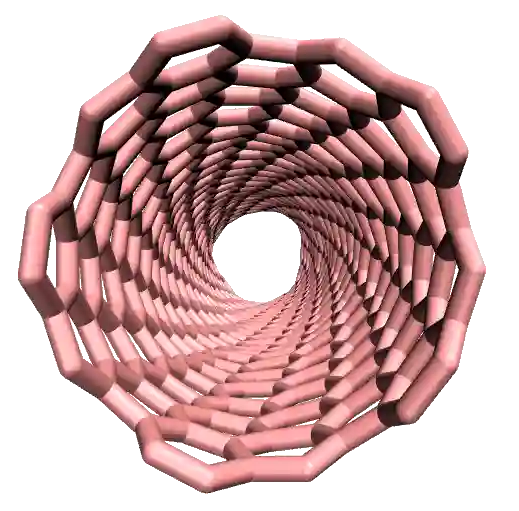

.. figure:: avatars/CNT_dark.webp
    :alt: carbon nanotube image in vacuum
    :height: 250
    :align: right
    :class: only-dark

The objective of this tutorial is to impose the deformation
of a carbon nanotube (CNT) using LAMMPS.

In this tutorial, a small carbon nanotube (CNT) is simulated
within an empty box using LAMMPS. An external 
force is imposed on the CNT, and its deformation is measured over time.

To illustrate the difference between classical and reactive force fields,
this tutorial is divided into two parts. Within the first part, a classical
force field is used and the bonds between the atoms of the CNT are
unbreakable. Within the second part, a reactive force field
(named AIREBO :cite:`stuart2000reactive`) is used, allowing for the breaking
of chemical bonds when the CNT undergoes strong deformation.
