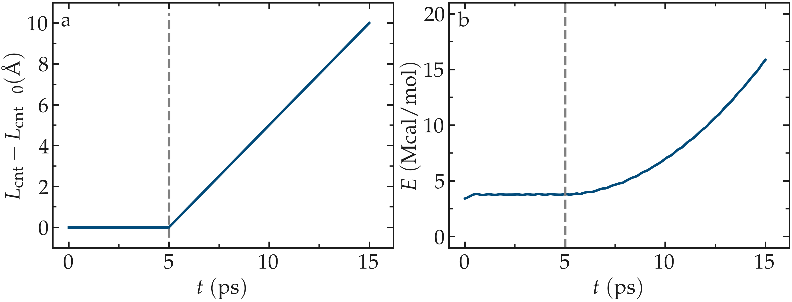
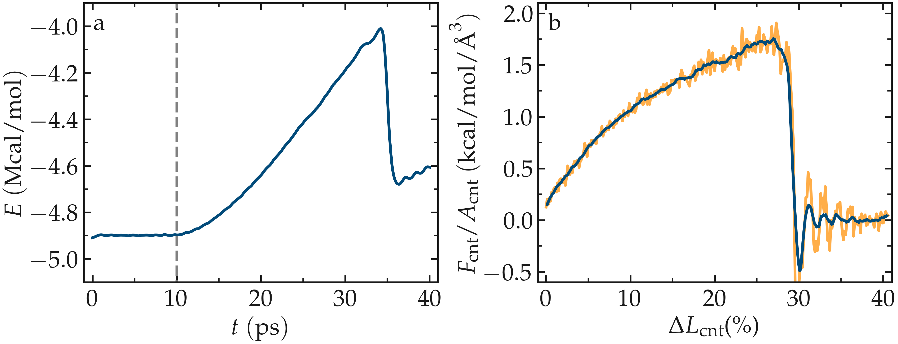

Unbreakable bonds
=================

With most conventional molecular force fields, the chemical bonds between
atoms are defined at the start of the simulation and remain fixed, regardless
of the forces applied to the atoms.  These bonds are typically modeled as springs
with equilibrium distances :math:`r_0` and force constants :math:`k_\text{b}`:
:math:`U_\text{b} = k_\text{b} \left( r - r_0 \right)^2`.  Additionally, angular and
dihedral constraints are often imposed to preserve the molecular structure
by maintaining the relative orientations of neighboring atoms.

The LAMMPS input
----------------

To begin this tutorial, if you are using LAMMPS--GUI, select
``Start Tutorial 2`` from the ``Tutorials`` menu of LAMMPS-GUI
and follow the instructions. This will select a folder, create one if
necessary, and place several files into it.  The initial input file,
set up for a single-point energy calculation, will also be loaded into
the editor under the name **unbreakable.lmp**.  Additional files
are a data file containing the CNT topology and geometry, named
**unbreakable.data**, a parameters file named **unbreakable.inc**, as well as
the scripts required for the second part of the tutorial. 

.. code-block:: lammps

    units real
    atom_style molecular
    boundary f f f

    pair_style lj/cut 14.0
    bond_style harmonic
    angle_style harmonic
    dihedral_style opls
    improper_style harmonic
    special_bonds lj 0.0 0.0 0.5

    read_data unbreakable.data
    include unbreakable.inc

    run 0 post no

.. admonition:: If you are not using LAMMPS-GUI
    :class: gui

    Create a folder if needed and
    place the initial input file, **unbreakable.lmp**, into it. Then, open the 
    file in a text editor of your choice, and copy the previous lines into it.

The chosen unit system is ``real`` (therefore distances are in
Ångströms (Å), times in femtoseconds (fs), and energies in kcal/mol), the
``atom_style`` is ``molecular`` (therefore atoms are point
particles that can form bonds with each other), and the boundary
conditions are fixed.  The boundary conditions do not matter here, as
the box boundaries were placed far from the CNT.  Just like in the
previous tutorial, :ref:`lennard-jones-label`,
the pair style is ``lj/cut`` (i.e. a Lennard-Jones potential with
cutoff) and its cutoff is set to 14 Å, which means that only the
atoms closer than this distance interact through the Lennard-Jones
potential.

The ``bond_style``, ``angle_style``, ``dihedral_style``, and ``improper_style``
commands specify the different potentials used to constrain the relative
positions of the atoms.  The ``special_bonds`` command sets the weighting factors
for the Lennard-Jones interactions between atoms directly connected by
one bond, two bonds, and three bonds, respectively.  This is done for
convenience when parameterizing the force constants for bonds, angles, and
so on.  By excluding the non-bonded (Lennard-Jones) interactions for
these pairs, those interactions do not need to be considered when determining
the force constants.

The ``read_data`` command imports the |unbreakable_data|
file that should be downloaded next to **unbreakable.lmp**. This file contains information about the box size, atom positions,
as well as the identity of the atoms that are linked by ``bonds``, ``angles``,
``dihedrals``, and ``impropers`` interactions. It was created using VMD and TopoTools
:cite:`kohlmeyer2017topotools`.

.. |unbreakable_data| raw:: html

   <a href="../../../../../.dependencies/lammpstutorials-inputs/tutorial2/unbreakable.data" target="_blank">unbreakable.data</a>

.. admonition:: Note
    :class: non-title-info

    The format details of the different sections in a data file change with different
    settings.  In particular, the ``Atoms`` section may have a different number of
    columns, or the columns may represent different properties when the ``atom_style``
    is changed.  To help users, LAMMPS and tools like VMD and TopoTools will add a
    comment (here ``# molecular``) to the ``Atoms`` header line in the data files that
    indicates the intended ``atom_style``.  LAMMPS will print a warning when the chosen
    atom style does not match what is written in that comment.

The **.data** file does not contain any sections with potential parameters; thus,  
we need to specify the parameters of both the bonded and  
non-bonded potentials.  The parameters we use are taken  
from the OPLS-AA (Optimized Potentials for Liquid Simulations-All-Atom)  
force field :cite:`jorgensenDevelopmentTestingOPLS1996`, and are given  
in a separate **unbreakable.inc** file (also downloaded during  
the tutorial setup).  This file - that must be placed  
next to **unbreakable.lmp** - contains the following lines:

.. code-block:: lammps

    pair_coeff 1 1 0.066 3.4
    bond_coeff 1 469 1.4
    angle_coeff 1 63 120
    dihedral_coeff 1 0 7.25 0 0
    improper_coeff 1 5 180

The ``pair_coeff`` command sets the parameters for non-bonded  
Lennard-Jones interactions atom type 1 to  
:math:`\epsilon_{11} = 0.066 \, \text{kcal/mol}` and  
:math:`\sigma_{11} = 3.4 \, \text{Å}`.  The ``bond_coeff`` provides  
the equilibrium distance :math:`r_0 = 1.4 \, \text{Å}` and the  
spring constant :math:`k_\text{b} = 469 \, \text{kcal/mol/Å}^2` for the  
harmonic potential imposed between two neighboring carbon atoms.  The potential  
is given by :math:`U_\text{b} = k_\text{b} ( r - r_0)^2`.  The  
``angle_coeff`` gives the equilibrium angle :math:`\theta_0` and  
constant for the potential between three neighboring atoms :  
:math:`U_\theta = k_\theta ( \theta - \theta_0)^2`.  The  
``dihedral_coeff`` and ``improper_coeff`` define the potentials  
for the constraints between 4 atoms.

.. admonition:: Note
    :class: non-title-info

    Rather than copying the contents of the file into the input, we  
    incorporate it using the ``include`` command.  Using ``include`` allows  
    us to conveniently reuse the parameter settings  
    in other inputs or switch them with others.  This will become more general  
    when using type labels, which is shown in the next  
    tutorial :cite:`typelabel_paper`.  

Prepare the initial state
-------------------------

In this tutorial, a deformation will be applied to the CNT by displacing  
the atoms located at its edges.  To achieve this, we will first isolate the  
atoms at the two edges and place them into groups named ``rtop`` and  
``rbot``.  Add the following lines to **unbreakable.lmp**,  
just before the ``run 0`` command:

.. code-block:: lammps

    group carbon_atoms type 1
    variable xmax equal bound(carbon_atoms,xmax)-0.5
    variable xmin equal bound(carbon_atoms,xmin)+0.5
    region rtop block ${xmax} INF INF INF INF INF
    region rbot block INF ${xmin} INF INF INF INF
    region rmid block ${xmin} ${xmax} INF INF INF INF

The first command includes all the atoms of type 1 (i.e. all the atoms here)  
in a group named ``carbon_atoms``.
The variable :math:`x_\text{max}` corresponds to the coordinate of the  
last atoms along :math:`x` minus :math:`0.5 \, \text{Å}`, and :math:`x_\text{min}` to the coordinate  
of the first atoms along :math:`x` plus :math:`0.5 \, \text{Å}`.  Then, three regions are defined,  
corresponding to the following: :math:`x < x_\text{min}` (``rbot``, for region  
bottom), :math:`x_\text{min} > x > x_\text{max}` (``rmid``, for region middle),  
and :math:`x > x_\text{max}` (``rtop``, for region top).

Finally, let us define 3 groups of atoms corresponding to the atoms
in each of the 3 regions by adding to **unbreakable.lmp**
just before the ``run 0`` command:

.. code-block:: lammps

    group cnt_top region rtop
    group cnt_bot region rbot
    group cnt_mid region rmid
    set group cnt_top mol 1
    set group cnt_bot mol 2
    set group cnt_mid mol 3

With the three ``set`` commands, we assign unique, otherwise unused
molecule IDs to atoms in those three groups.  We will use this IDs later to
assign different colors to these groups of atoms.

Run the simulation using LAMMPS.  The number of atoms in each group is given in
the ``Output`` window.  It is an important check to make sure that the number
of atoms in each group corresponds to what is expected, as shown here:

.. code-block:: lammps

    700 atoms in group carbon_atoms
    10 atoms in group cnt_top
    10 atoms in group cnt_bot
    680 atoms in group cnt_mid

Finally, to start from a less ideal state and create a system with some defects,
let us randomly delete a small fraction of the carbon atoms.  To avoid deleting
atoms that are too close to the edges, let us define a new region named ``rdel``
that starts at :math:`2 \, \text{Å}` from the CNT edges:

.. code-block:: lammps

    variable xmax_del equal ${xmax}-2
    variable xmin_del equal ${xmin}+2
    region rdel block ${xmin_del} ${xmax_del} INF INF INF INF
    group rdel region rdel
    delete_atoms random fraction 0.02 no rdel NULL 2793 bond yes

The ``delete_atoms`` command randomly deletes :math:`2\,\%` of the atoms from
the ``rdel`` group, here about 10 atoms.

The molecular dynamics
----------------------

Let us give an initial temperature to the atoms of the group ``cnt_mid``  
by adding the following commands to **unbreakable.lmp**:

.. code-block:: lammps

   reset_atoms id sort yes
   velocity cnt_mid create 300 48455 mom yes rot yes

Re-setting the atom IDs is necessary before using the ``velocity`` command  
when atoms were deleted, which is done here with the ``reset_atoms`` command.  
The ``velocity`` command gives initial velocities to the atoms of the middle  
group ``cnt_mid``, ensuring an initial temperature of :math:`T = 300\,\text{K}`  
for these atoms.

Let us specify the thermalization and the dynamics of the system.  Add the following
lines into **unbreakable.lmp**:

.. code-block:: lammps

    fix mynve1 cnt_top nve
    fix mynve2 cnt_bot nve
    fix mynvt cnt_mid nvt temp 300 300 100

The ``fix nve`` commands are applied to the atoms of ``cnt_top`` and  
``cnt_bot``, respectively, and will ensure that the positions of the atoms  
from these groups are recalculated at every step.  The ``fix nvt`` does the  
same for the ``cnt_mid`` group, while also applying a Nosé-Hoover thermostat  
with desired temperature of 300 K :cite:`nose1984unified, hoover1985canonical`.  
To restrain the motion of the atoms at the edges, let us add the following  
commands to **unbreakable.lmp**:

.. code-block:: lammps

   fix mysf1 cnt_top setforce 0 0 0
   fix mysf2 cnt_bot setforce 0 0 0
   velocity cnt_top set 0 0 0
   velocity cnt_bot set 0 0 0

The two ``setforce`` commands cancel the forces applied on the atoms of the  
two edges, respectively.  The cancellation of the forces is done at every step,  
and along all 3 directions of space, :math:`x`, :math:`y`, and :math:`z`, due to the use of  
``0 0 0``.  The two ``velocity`` commands set the initial velocities  
along :math:`x`, :math:`y`, and :math:`z` to 0 for the atoms of ``cnt_top`` and  
``cnt_bot``, respectively.  As a consequence of these last four commands,  
the atoms of the edges will remain immobile during the simulation (or at least  
they would if no other command was applied to them).

.. admonition:: Note
    :class: non-title-info

    The ``velocity set`` command imposes the velocity of a group of atoms at the start of a run but does  
    not enforce the velocity during the entire simulation.  When ``velocity set`` is used in combination with  
    ``setforce 0 0 0``, as is the case here, the atoms won't feel any force during the entire simulation.  
    According to the Newton equation, no force means no acceleration, meaning that the initial velocity  
    will persist during the entire simulation, thus producing a constant velocity motion.

Outputs
-------

Next, to measure the strain and stress applied to the CNT, let us create a  
variable for the distance :math:`L_\text{cnt}` between the two edges,  
as well as a variable :math:`F_\text{cnt}` for the force applied on the edges:

.. code-block:: lammps

   variable Lcnt equal xcm(cnt_top,x)-xcm(cnt_bot,x)
   variable Fcnt equal f_mysf1[1]-f_mysf2[1]

Here, the force is extracted from the fixes ``mysf1`` and ``mysf2``  
using ``f_`` , similarly to the use of ``v_`` to call a variable,  
and ``c_`` to call a compute, as seen in :ref:`lennard-jones-label`.

Let us also add a ``dump image`` command to visualize the system every 500 steps:

.. code-block:: lammps

    dump viz all image 500 myimage-*.ppm element type size 1000 400 zoom 6 shiny 0.3 fsaa yes &
        bond atom 0.8 view 0 90 box no 0.0 axes no 0.0 0.0  
    dump_modify viz pad 9 backcolor white adiam 1 0.85 bdiam 1 1.0

Let us run a small equilibration step to bring the system to the required  
temperature before applying any deformation.  Replace the ``run 0 post no``  
command in **unbreakable.lmp** with the following lines:

.. code-block:: lammps

   compute Tmid cnt_mid temp  
   thermo 100  
   thermo_style custom step temp etotal v_Lcnt v_Fcnt  
   thermo_modify temp Tmid line yaml  

   timestep 1.0  
   run 5000

With the ``thermo_modify`` command, we specify to LAMMPS that the  
temperature :math:`T_\mathrm{mid}` of the middle group, ``cnt_mid``,  
must be outputted, instead of the temperature of the entire system.  
This choice is motivated by the presence of frozen parts with an effective temperature of :math:`0~\text{K}`,  
which makes the average temperature of the entire system less relevant.  
The ``thermo_modify`` command also imposes the use of the YAML format that can easily be read by  
Python (see below).

Let us impose a constant velocity deformation on the CNT  
by combining the ``velocity set`` command with previously defined  
``fix setforce``.  Add the following lines in the **unbreakable.lmp**  
file, right after the last ``run 5000`` command:

.. code-block:: lammps

   velocity cnt_top set 0.0005 0 0  
   velocity cnt_bot set -0.0005 0 0  

   run 10000

The chosen velocity for the deformation is :math:`100\,\text{m/s}`, or  
:math:`0.001\,\text{Å/fs}`. Run the simulation using LAMMPS.  As can be seen
from the variable :math:`L_\text{cnt}`, the length
of the CNT increases linearly over time for :math:`t > 5\,\text{ps}`,
as expected from the imposed constant velocity.  What you observe in the `Slide Show`
windows should resemble the figure below.  

.. figure:: figures/colored-edge-def-dark.png
    :class: only-dark
    :alt: Evolution of the CNT energy

.. figure:: figures/colored-edge-def-light.png
    :class: only-light
    :alt: Evolution of the CNT energy

    The unbreakable CNT before (top) and after deformation (bottom).

The total energy of the system
shows a non-linear increase with :math:`t` once the deformation starts, which is expected
from the typical dependency of bond energy with bond distance,
:math:`U_\text{b} = k_\text{b} \left( r - r_0 \right)^2`.

.. figure:: figures/CNT-unbreakable-length-energy-dm.png
    :class: only-dark
    :alt: Evolution of the CNT energy

..  container:: figurelegend

    Figure: a) Evolution of the length :math:`L_\text{cnt}` of the CNT with time.  
    The CNT starts deforming at :math:`t = 5\,\text{ps}`, and :math:`L_\text{cnt-0}` is the  
    CNT initial length.  b) Evolution of the total energy :math:`E` of the system with time :math:`t`.  
    Here, the potential is OPLS-AA, and the CNT is unbreakable.

Importing YAML log file into Python
-----------------------------------

Let us import the simulation data into Python, and generate a stress-strain curve.
Here, the stress is defined as :math:`F_\text{cnt}/A_\text{cnt}`,
where :math:`A_\text{cnt} = \pi r_\text{cnt}^2` is the surface area of the
CNT, and :math:`r_\text{cnt}=5.2\,\text{Å}` the CNT radius.  The strain is defined
as :math:`(L_\text{cnt}-L_\text{cnt-0})/L_\text{cnt-0}`, where :math:`L_\text{cnt-0}` is the initial CNT length.

Right-click inside the ``Output`` window, and select
``Export YAML data to file``.  Call the output **unbreakable.yaml**, and save
it within the same folder as the input files, where a Python script named |yaml_reader| should also
be located.  When executed using Python, this .py file first imports
the **unbreakable.yaml** file.  Then, a certain pattern is
identified and stored as a string character named ``docs``.  The string is
then converted into a list, and :math:`F_\text{cnt}` and :math:`L_\text{cnt}`
are extracted.  The stress and strain are then calculated, and the result
is saved in a data file named **unbreakable.dat** using
the NumPy ``savetxt`` function.  ``thermo[0]`` can be used to access the
information from the first minimization run, and ``thermo[1]`` to access the
information from the second MD run.  The data extracted from
the **unbreakable.yaml** file can then be used to plot the stress-strain curve.

.. |yaml_reader| raw:: html

   <a href="../../../../../.dependencies/lammpstutorials-inputs/tutorial2/unbreakable-yaml-reader.py" target="_blank">unbreakable-yaml-reader.py</a>

.. figure:: figures/CNT-unbreakable-stress-strain-dm.png
    :class: only-dark
    :alt: Evolution of the carbon nanotube stress strain as calculated with LAMMPS

..  container:: figurelegend

    Figure: Stress applied on the CNT during deformation, :math:`F_\text{cnt}/A_\text{cnt}`,
    where :math:`F_\text{cnt}` is the force and :math:`A_\text{cnt}` the CNT surface area,
    as a function of the strain, :math:`\Delta L_\text{cnt} = (L_\text{cnt}-L_\text{cnt-0})/L_\text{cnt-0}`,
    where :math:`L_\text{cnt}` is the CNT length and :math:`L_\text{cnt-0}` the CNT initial length.
    Here, the potential is OPLS-AA, and the CNT is unbreakable.

Breakable bonds
===============

When using a conventional molecular force field, as we have just done,
the bonds between the atoms are non-breakable.  Let us perform a similar
simulation and deform a small CNT again, but this time with a reactive
force field that allows bonds to break if the applied deformation is
large enough.

Input file initialization
-------------------------

Open the input named |breakable_lmp|
that should have been downloaded next to **unbreakable.lmp** during
the tutorial setup.  There are only a few differences with the previous
input.  First, the AIREBO force field requires the ``metal`` units
setting instead of ``real`` for OPLS-AA.  A second difference is
the use of ``atom_style atomic`` instead of
``molecular``, since no explicit bond information is required with
AIREBO.  The following commands are setting up the AIREBO force field:

.. code-block:: lammps

    pair_style airebo 3.0
    pair_coeff * * CH.airebo C

Here, |CH_airebo| is the file containing the parameters for AIREBO,
and must be placed next to **breakable.lmp**.

.. |breakable_lmp| raw:: html

    <a href="../../../../../.dependencies/lammpstutorials-inputs/tutorial2/breakable.lmp" target="_blank">breakable.lmp</a>

.. |CH_airebo| raw:: html

    <a href="../../../../../.dependencies/lammpstutorials-inputs/tutorial2/CH.airebo" target="_blank">CH.airebo</a>

.. admonition:: Note
    :class: non-title-info

    With ``metal`` units, time values are in units of picoseconds
    (:math:`10^{-12}\,\text{s}`) instead of femtoseconds (:math:`10^{-15}\,\text{s}`) in the case of
    ``real`` units. It is important to keep this in mind when
    setting parameters that are expressed in units containing time, such as
    the timestep or the time constant of a thermostat, or velocities.

Since bonds, angles, and dihedrals do not need to be explicitly set when
using AIREBO, some simplification must be made to the **.data**
file.  The new **.data** file is named |breakable_data|
and must be placed within the same folder as the input file.  Just like
**unbreakable.data**, the **breakable.data** contains the
information required for placing the atoms in the box, but no
bond/angle/dihedral information.  Another difference between the
**unbreakable.data** and **breakable.data** files is that,
here, a larger distance of :math:`120~\text{Å}` was used for the box size along
the :math:`x`-axis, to allow for larger deformation of the CNT.

.. |breakable_data| raw:: html

    <a href="../../../../../.dependencies/lammpstutorials-inputs/tutorial2/breakable.data" target="_blank">breakable.data</a>

Start the simulation
--------------------

Here, let us perform a similar deformation as the previous one.
In **breakable.lmp**, replace the ``run 0 post no`` line with:

.. code-block:: lammps

    fix mysf1 cnt_bot setforce 0 0 0
    fix mysf2 cnt_top setforce 0 0 0
    velocity cnt_bot set 0 0 0
    velocity cnt_top set 0 0 0

    variable Lcnt equal xcm(cnt_top,x)-xcm(cnt_bot,x)
    variable Fcnt equal f_mysf1[1]-f_mysf2[1]

    dump viz all image 500 myimage.*.ppm type type size 1000 400 zoom 4 shiny 0.3 adiam 1.5 box no 0.01 view 0 90 shiny 0.1 fsaa yes
    dump_modify viz pad 5 backcolor white acolor 1 gray

    compute Tmid cnt_mid temp
    thermo 100
    thermo_style custom step temp etotal v_Lcnt v_Fcnt
    thermo_modify temp Tmid line yaml

    timestep 0.0005
    run 10000

Note the relatively small timestep of :math:`0.0005`\,ps (:math:`= 0.5`\,fs) used.  Reactive force
fields like AIREBO usually require a smaller timestep than conventional ones.  When running
**breakable.lmp** with LAMMPS, you can see that the temperature deviates
from the target temperature of :math:`300\,\text{K}` at the start of the equilibration,
but that after a few steps, it reaches the target value.

.. admonition:: Note
    :class: non-title-info

    Bonds cannot be displayed by the ``dump image`` when using
    the ``atom_style atomic``, as it contains no bonds. A
    tip for displaying bonds with the
    present system using LAMMPS is provided at the end of the tutorial.
    You can also use external tools like VMD or OVITO (see the
    tip for tutorial 3).

Launch the deformation
----------------------

After equilibration, let us set the velocity of the edges equal to
:math:`75~\text{m/s}` (or :math:`0.75~\text{Å/ps}`) and run for a longer duration than
previously.  Add the following lines into **breakable.lmp**:

.. code-block:: lammps

    velocity cnt_top set 0.75 0 0
    velocity cnt_bot set -0.75 0 0

    run 30000

Run the simulation.  Some bonds are expected to break before the end of the
simulation.

.. figure:: figures/deformed-dark.png
    :class: only-dark
    :alt: Carbon nanotube deformed using LAMMPS

..  container:: figurelegend

    Figure: Figure: CNT with broken bonds.  This image was generated using
    VMD :cite:`vmd_home,humphrey1996vmd` ``DynamicBonds`` representation.

Looking at the evolution of the energy, one can see that the total
energy :math:`E` is initially increasing with the deformation.  When bonds
break, the energy relaxes abruptly, as can be seen near :math:`t=32~\text{ps}`.
Using a similar script as previously,
i.e., |unbreakable_yaml_reader|, import the data into Python and generate
the stress-strain curve.  The stress-strain
curve reveals a linear (elastic) regime where
:math:`F_\text{cnt} \propto \Delta L_\text{cnt}` for
:math:`\Delta L_\text{cnt} < 5\,\%`, and a non-linear (plastic) regime for
:math:`5\,\% < \Delta L_\text{cnt} < 25\,\%`.

.. |unbreakable_yaml_reader| raw:: html

    <a href="../../../../../.dependencies/lammpstutorials-inputs/tutorial2/unbreakable-yaml-reader.py" target="_blank">unbreakable-yaml-reader.py</a>

..  container:: figurelegend

    Figure: Figure: a) Evolution of the total energy :math:`E` of the CNT with time :math:`t`.  b) Stress applied on the CNT
    during deformation, :math:`F_\text{cnt}/A_\text{cnt}`,
    where :math:`F_\text{cnt}` is the force and :math:`A_\text{cnt}` the CNT surface area,
    as a function of the strain, :math:`\Delta L_\text{cnt} = (L_\text{cnt}-L_\text{cnt-0}/L_\text{cnt-0})`, where
    :math:`L_\text{cnt}` is the CNT length and :math:`L_\text{cnt-0}` the CNT initial length.
    Here, the potential is AIREBO, and the CNT is breakable.

Tip: bonds representation with AIREBO
-------------------------------------

In the input file named |breakable_with_tip|,
which is an alternate solution for **breakable.lmp**, a trick is
used to represent bonds while using AIREBO.  A detailed explanation of
the script is beyond the scope of the present tutorial.  In short, the
trick is to use AIREBO with the ``molecular`` atom style, and use
the ``fix bond/break`` and ``fix bond/create/angle`` commands
to update the status of the bonds during the simulation:

.. code-block:: lammps

    fix break all bond/break 1000 1 2.5
    fix form all bond/create/angle 1000 1 1 2.0 1 aconstrain 90.0 180

This *hack* works because AIREBO does not pay any attention to bonded
interactions and computes the bond topology dynamically inside the pair
style.  Thus adding bonds of bond style ``zero`` does not add any
interactions but allows the visualization of them with ``dump image``.
It is, however, needed to change the ``special_bonds``
setting to disable any neighbor list exclusions as they are common for
force fields with explicit bonds.

.. code-block:: lammps

    bond_style zero
    bond_coeff 1 1.4
    special_bonds lj/coul 1.0 1.0 1.0

.. |breakable_with_tip| raw:: html

    <a href="../../../../../.dependencies/lammpstutorials-inputs/tutorial2/breakable-with-tip.lmp" target="_blank">breakable-with-tip.lmp</a>,
