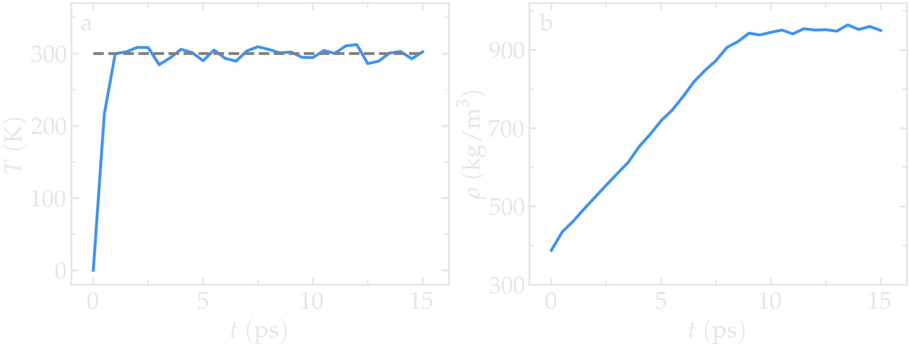
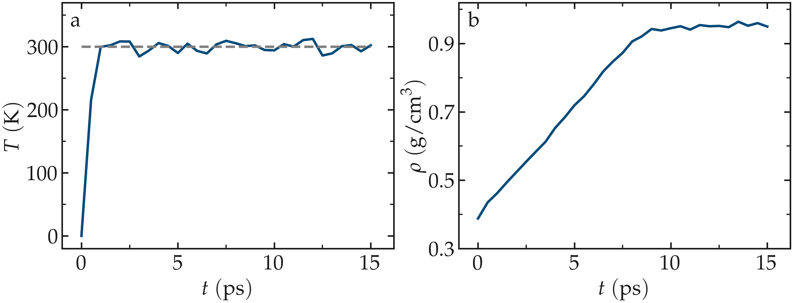
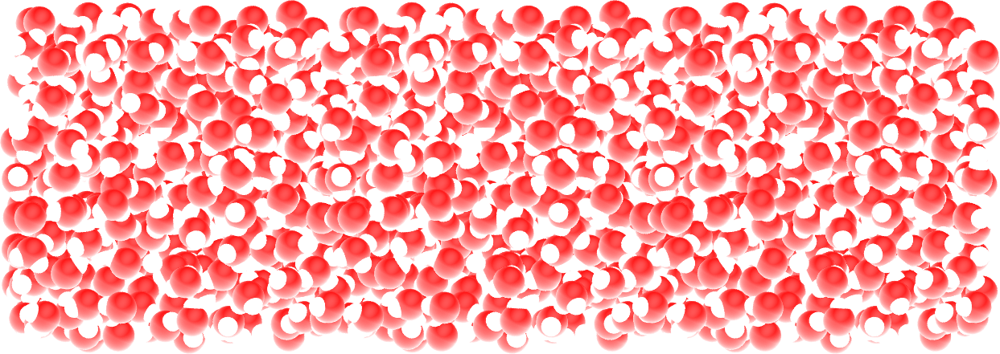
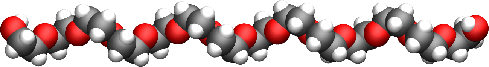
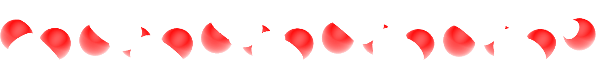
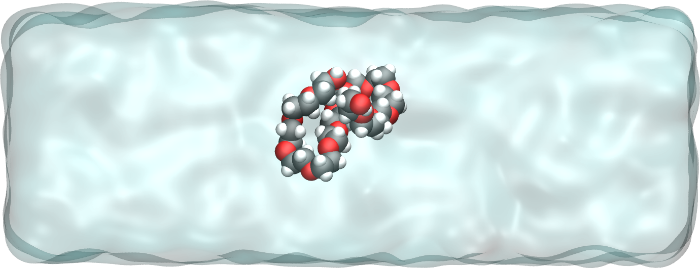
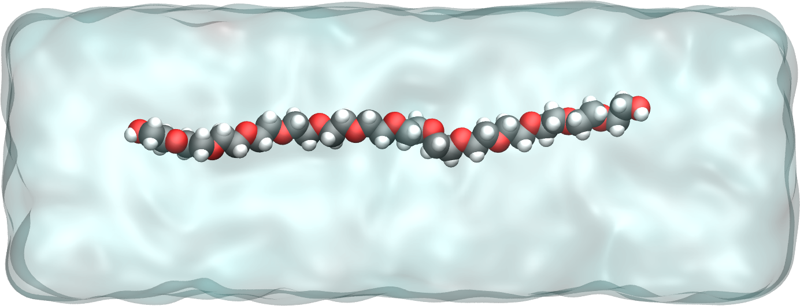
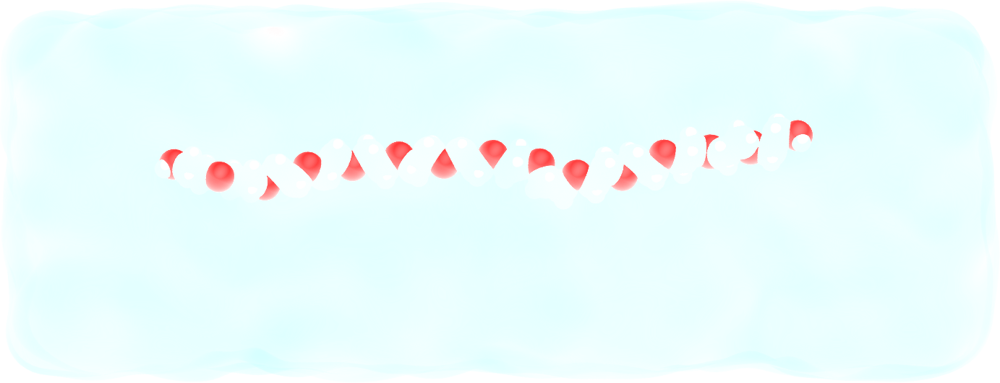
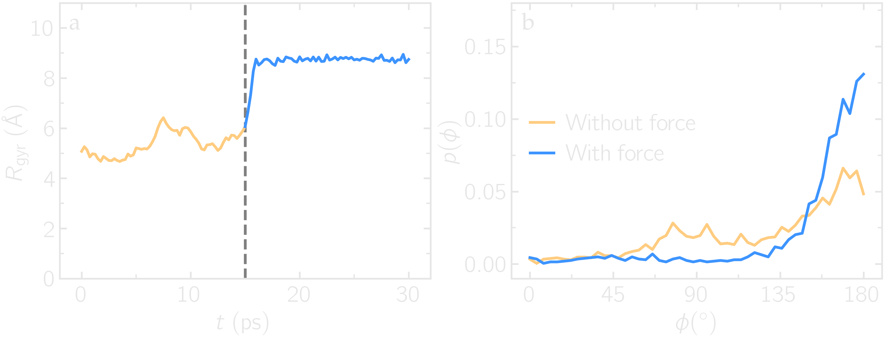
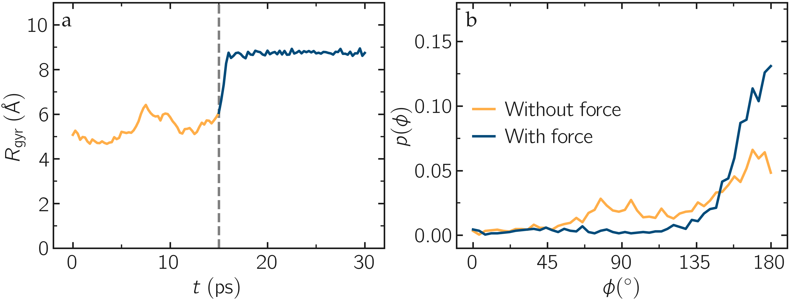

Preparing the water reservoir
=============================

In this tutorial, the water reservoir is first prepared in the absence of the polymer.
A rectangular box of water is created and equilibrated at ambient temperature and
pressure.  The SPC/Fw water model is used :cite:`wu2006flexible`, which is
a flexible variant of the rigid SPC (simple point charge) model :cite:`berendsen1981interaction`.
Create a file named **water.lmp**, and copy the following lines into it:

.. code-block:: lammps

    units real
    atom_style full
    bond_style harmonic
    angle_style harmonic
    dihedral_style harmonic
    pair_style lj/cut/coul/long 10
    kspace_style ewald 1e-5
    special_bonds lj 0.0 0.0 0.5 coul 0.0 0.0 1.0 angle yes

.. admonition:: Optional: follow this tutorial using LAMMPS-GUI
    :class: gui

    To set up this tutorial, select ``Start Tutorial 3`` from the
    ``Tutorials`` menu of LAMMPS--GUI and follow the instructions.
    The editor should display the content corresponding to **water.lmp**.

With the unit style ``real``, masses are in g/mol, distances in Å,
time in fs, and energies in kcal/mol.  With the ``atom_style full``,
each atom is a dot with a mass and a charge that can be linked
by bonds, angles, dihedrals, and/or impropers.  The
``bond_style``, ``angle_style``, and
``dihedral_style`` commands define the potentials for the bonds,
angles, and dihedrals used in the simulation, here ``harmonic``.
With the ``pair_style`` named ``lj/cut/coul/long``, atoms
interact through both a Lennard-Jones (LJ) potential and Coulomb
interactions.  The value of :math:`10\,\text{Å}` is the cutoff, and the
``ewald`` command defines the long-range solver for the Coulomb
interactions :cite:`ewald1921berechnung`.  Finally, the
``special_bonds`` command, which was already seen in
:ref:`carbon-nanotube-label`, sets the LJ and Coulomb
weighting factors for the interaction between neighboring atoms.

.. include:: ../shared/needhelp.rst

Let us create a 3D simulation box of dimensions :math:`6 \times 3 \times 3 \; \text{nm}^3`,
and make space for 8 atom types (2 for the water, 6 for the polymer), 7 bond types
(1 for the water, 6 for the polymer), 8 angle types (1 for the water, 7 for the polymer),
and 4 dihedral types (only for the polymer).  Copy the following lines into **water.lmp**:

.. code-block:: lammps

    region box block -30 30 -15 15 -15 15
    create_box 8 box bond/types 7 angle/types 8 dihedral/types 4 extra/bond/per/atom 3 &
        extra/angle/per/atom 6 extra/dihedral/per/atom 10 extra/special/per/atom 14

The ``extra/x/per/atom`` commands reserve memory for adding bond topology
data later. We use the file |parameters_inc_3|
to set all the parameters (masses, interaction energies, bond equilibrium
distances, etc).  Thus add to **water.lmp** the line:

.. |parameters_inc_3| raw:: html

    <a href="https://raw.githubusercontent.com/lammpstutorials/lammpstutorials-inputs/refs/heads/main/tutorial3/parameters.inc" target="_blank">parameters.inc</a>

.. code-block:: lammps

    include parameters.inc

.. admonition:: Note
    :class: non-title-info

    This tutorial uses type labels :cite:`gissinger2024type` to map each
    numeric atom type to a string (see the **parameters.inc** file):
    ``labelmap atom 1 OE 2 C 3 HC 4 H 5 CPos 6 OAlc 7 OW 8 HW``
    Therefore, the oxygen and hydrogen atoms of water (respectively types
    7 and 8) can be referred to as ``OW`` and ``HW``, respectively.  Similar
    maps are used for the bond types, angle types, and dihedral types.

Let us create water molecules.  To do so, let us import a molecule template called
**water.mol** and then randomly create 700 molecules.  Add the following
lines into **water.lmp**:

.. code-block:: lammps

    molecule h2omol water.mol
    create_atoms 0 random 700 87910 NULL mol h2omol 454756 overlap 1.0 maxtry 50

The first parameter is 0, meaning that the atom IDs from
the **water.mol** file will be used.
The ``overlap 1.0`` option of the ``create_atoms`` command ensures
that no atoms are placed exactly in the same position, as this would cause the
simulation to crash.  The ``maxtry 50`` asks LAMMPS to try at most 50 times
to insert the molecules, which is useful in case some insertion attempts are
rejected due to overlap.  In some cases, depending on the system and the values
of ``overlap`` and ``maxtry``, LAMMPS may not create the desired number
of molecules.  Always check the number of created atoms in the **log** file
(or in the ``Output`` window), where you should see:

.. code-block:: bw

    Created 2100 atoms

When LAMMPS fails to create the desired number of molecules, a WARNING
appears.  The molecule template called |water_mol_3| must be downloaded and saved
next to **water.lmp**.  This template contains the necessary
structural information of a water molecule, such as the number of atoms,
or the IDs of the atoms that are connected by bonds and angles.

.. |water_mol_3| raw:: html

    <a href="https://raw.githubusercontent.com/lammpstutorials/lammpstutorials-inputs/refs/heads/main/tutorial3/water.mol" target="_blank">water.mol</a>

..  container:: figurelegend

    Figure: a) Temperature, :math:`T`, of the water reservoir as a function of the
    time, :math:`t`.  The horizontal dashed line is the target temperature
    of :math:`300 \text{K}`. b) Evolution of the system density, :math:`\rho`, with :math:`t`

Then, let us organize the atoms of types OW and HW of the water
molecules in a group named ``H2O`` and perform a small energy
minimization.  The energy minimization is mandatory here because of the
small ``overlap`` value of 1 Å chosen in the ``create_atoms``
command.  Add the following lines into **water.lmp**:

.. code-block:: lammps

    group H2O type OW HW
    minimize 1.0e-4 1.0e-6 100 1000
    reset_timestep 0

Resetting the step of the simulation to 0 using the
``reset_timestep`` command is optional.
It is used here because the number of iterations performed by the ``minimize``
command is usually not a round number, since the minimization stops when one of
four criteria is reached, which can disrupt the intended frequency
of outputs such as ``dump`` commands that depend on the timestep count.
We will use ``fix npt`` to control the temperature
and pressure of the molecules with a Nosé-Hoover thermostat and barostat,
respectively :cite:`nose1984unified, hoover1985canonical, martyna1994constant`.
Add the following line into **water.lmp**:

.. code-block:: lammps

    fix mynpt all npt temp 300 300 100 iso 1 1 1000

The ``fix npt`` allows us to impose both a temperature of :math:`300\,\text{K}`
(with a damping constant of :math:`100\,\text{fs}`), and a pressure of 1 atmosphere
(with a damping constant of :math:`1000\,\text{fs}`).  With the ``iso`` keyword,
the three dimensions of the box will be re-scaled simultaneously.

Let us output the system into images by adding the following commands to **water.lmp**:

.. code-block:: lammps

    dump viz all image 250 myimage-*.ppm type type &
    shiny 0.1 box no 0.01 view 0 90 zoom 3 size 1000 600
    dump_modify viz backcolor white &
    acolor OW red acolor HW white &
    adiam OW 3 adiam HW 1.5

Let us also extract the volume and density every 500 steps:

.. code-block:: lammps

    variable myvol equal vol
    variable myoxy equal count(H2O)/3
    variable NA equal 6.022e23
    variable Atom equal 1e-10
    variable M equal 0.018
    variable rho equal ${myoxy}*${M}/(v_myvol*${NA}*${Atom}^3)
    thermo 500
    thermo_style custom step temp etotal v_myvol v_rho

Here, several variables are defined and used for converting the units of the
density in kg/mol:  The variable ``myoxy`` represents the number of
atoms divided by 3,  which corresponds to the number of molecules, :math:`N_\text{H2O}`,
and the variable ``myrho`` is the density in kg/mol:  

.. math::

    \rho = \dfrac{N_\text{H2O}}{V N_\text{A}},

where :math:`V` is the volume in :math:`\text{m}^3`, :math:`N_\text{A}` the Avogadro number, and
:math:`M = 0.018`\,kg/mol the molar mass of water.

Finally, let us set the timestep to 1.0 fs, and run the simulation for 15 ps by
adding the following lines into **water.lmp**:

.. code-block:: lammps

    timestep 1.0
    run 15000

    write_restart water.restart

The final state is saved in a binary file named **water.restart**.
Run the input using LAMMPS.  The system reaches its equilibrium temperature
after just a few picoseconds, and its equilibrium density after approximately
10 picoseconds.

.. figure:: figures/water-light.png
    :alt: Water reservoir from molecular dynamics simulations
    :class: only-light

..  container:: figurelegend

    Figure: The water reservoir after equilibration.  Oxygen atoms are in red, and
    hydrogen atoms are in white. 

.. admonition:: Note
    :class: non-title-info

    The binary file created by the ``write_restart`` command contains the
    complete state of the simulation, including atomic positions, velocities, and
    box dimensions (similar to ``write_data``), but also the groups,
    the compute, or the ``atom_style``.  Use the ``Inspect Restart``
    option of the LAMMPS--GUI to vizualize the content saved in **water.restart**.

Solvating the PEG in water
==========================

Now that the water reservoir is equilibrated, we can safely add the PEG polymer
to the water.  The PEG molecule topology was downloaded from the ATB repository
:cite:`malde2011automated, oostenbrink2004biomolecular`.  It has a formula
:math:`\text{C}_{16}\text{H}_{34}\text{O}_{9}`, and the parameters are taken from
the GROMOS 54A7 force field :cite:`schmid2011definition`.

..  container:: figurelegend

    Figure: The PEG molecule with carbon atoms in gray, oxygen atoms in red,
    and hydrogen atoms in white.

Open the file named **merge.lmp** that was downloaded
alongside **water.lmp** during the tutorial setup.  It only contain one line:

.. code-block:: lammps

    read_restart water.restart

Most of the commands that were initially present in **water.lmp**, such as
the ``units`` of the ``atom_style`` commands do not need to be repeated,
as they were saved within the **.restart** file.  There is also no need to
re-include the parameters from the **.inc** file.  The ``kspace_style``
command, however, is not saved by the ``write_restart`` command and must be
repeated.  Since Ewald summation is not the most efficient choice for such dense
system, let us use PPPM (for particle-particle particle-mesh) for the rest
of the tutorial.  Add the following command to **merge.lmp**:

.. code-block:: lammps

    kspace_style pppm 1e-5

Using the molecule template for the polymer called |peg_mol_3|,
let us create a single molecule in the middle of the box by adding the following
commands to **merge.lmp**:

.. |peg_mol_3| raw:: html

    <a href="https://raw.githubusercontent.com/lammpstutorials/lammpstutorials-inputs/refs/heads/main/tutorial3/peg.mol" target="_blank">peg.mol</a>

.. code-block:: lammps
        
    molecule pegmol peg.mol
    create_atoms 0 single 0 0 0 mol pegmol 454756

Let us create a group for the atoms of the PEG (the previously created
group H2O was saved by the restart and can be omitted):

.. code-block:: lammps

    group PEG type C CPos H HC OAlc OE

Water molecules that are overlapping with the PEG must be deleted to avoid future
crashing.  Add the following line into **merge.lmp**:

.. code-block:: lammps

    delete_atoms overlap 2.0 H2O PEG mol yes

Here the value of 2.0 Å for the overlap cutoff was fixed arbitrarily and can
be chosen through trial and error.  If the cutoff is too small, the simulation will
crash because atoms that are too close to each other undergo forces
that can be extremely large.  If the cutoff is too large, too many water
molecules will unnecessarily be deleted.

Let us use the ``fix npt`` to control the temperature, as
well as the pressure by allowing the box size to be rescaled along the :math:`x`-axis:

.. code-block:: lammps

    fix mynpt all npt temp 300 300 100 x 1 1 1000

Let us also use the ``recenter`` command to always keep the PEG at
the position :math:`(0, 0, 0)`:

.. code-block:: lammps

    fix myrct PEG recenter 0 0 0 shift all

Note that the ``recenter`` command has no impact on the dynamics,
it simply repositions the frame of reference so that any drift of the
system is ignored, which can be convenient for visualizing and analyzing
the system.

Let us create images of the systems:

.. code-block:: lammps

    dump viz all image 250 myimage-*.ppm type type size 1100 600 box no 0.1 shiny 0.1 view 0 90 zoom 3.3 fsaa yes bond atom 0.8
    dump_modify viz backcolor white acolor OW red adiam OW 0.2 acolor OE darkred adiam OE 2.6 acolor HC white adiam HC 1.4 &
        acolor H white adiam H 1.4 acolor CPos gray adiam CPos 2.8 acolor HW white adiam HW 0.2 acolor C gray  adiam C 2.8 &
        acolor OAlc darkred adiam OAlc 2.6
    thermo 500

Finally, to perform a short equilibration and save the final state to
a **.restart** file, add the following lines to the input:

.. code-block:: lammps

    timestep 1.0
    run 10000

    write_restart merge.restart

Run the simulation using LAMMPS.  From the outputs, you can make
sure that the temperature remains close to the
target value of :math:`300~\text{K}` throughout the entire simulation, and that
the volume and total energy are almost constant, indicating
that the system was in a reasonable configuration from the start.

..  container:: figurelegend

    Figure : The PEG molecule solvated in water.  Water is represented as a
    transparent field for clarity.

Stretching the PEG molecule
===========================

Here, a constant force is applied to both ends of the PEG molecule until it
stretches.  Open the file named **pull.lmp**, which
only contains two lines:

.. code-block:: lammps

    kspace_style pppm 1e-5
    read_restart merge.restart

Next, we'll create new atom groups, each containing a single oxygen atom.  The atoms of type OAlc
correspond to the hydroxyl (alcohol) group oxygen atoms located at the ends
of the PEG molecule, which we will use to apply the force.  Add the
following lines to **pull.lmp**:

.. code-block:: lammps

    group ends type OAlc
    variable xcm equal xcm(ends,x)
    variable oxies atom type==label2type(atom,OAlc)
    variable end1 atom v_oxies*(x>v_xcm)
    variable end2 atom v_oxies*(x<v_xcm)
    group topull1 variable end1
    group topull2 variable end2

These lines identify the oxygen atoms (type OAlc) at the ends of the PEG
molecule and calculates their center of mass along the :math:`x`-axis.  It then
divides these atoms into two groups, ``end1`` (i.e., the OAlc atom to
the right of the center) and ``end2`` (i.e., the OAlc atom to the right
of the center), for applying force during the stretching process.

Add the following ``dump`` command to create images of the system:

.. code-block:: lammps

    dump viz all image 250 myimage-*.ppm type type shiny 0.1 box no 0.01 &
        view 0 90 zoom 3.3 fsaa yes bond atom 0.8 size 1100 600
    dump_modify viz backcolor white acolor OW red acolor HW white acolor OE darkred acolor OAlc darkred acolor C gray acolor CPos gray &
        acolor H white acolor HC white adiam OW 0.2 adiam HW 0.2 adiam C 2.8 adiam CPos 2.8 adiam OAlc 2.6 adiam H 1.4 adiam HC 1.4 adiam OE 2.6

Let us use a single Nosé-Hoover thermostat applied to all the atoms,
and let us keep the PEG in the center of the box, by adding
the following lines to **pull.lmp**:

.. code-block:: lammps

    timestep 1.0
    fix mynvt all nvt temp 300 300 100
    fix myrct PEG recenter 0 0 0 shift all

To investigate the stretching of the PEG molecule, let us compute its radius of
gyration :cite:`fixmanRadiusGyrationPolymer1962a` and the angles of its dihedral
constraints using the following commands:

.. code-block:: lammps
        
    compute rgyr PEG gyration
    compute prop PEG property/local dtype
    compute dphi PEG dihedral/local phi

The radius of gyration can be directly printed with the ``thermo_style`` command:

.. code-block:: lammps

    thermo_style custom step temp etotal c_rgyr
    thermo 250
    dump mydmp all local 100 pull.dat index c_dphi c_prop

By contrast with the radius of gyration (compute ``rgyr``), the dihedral angle
:math:`\phi` (compute ``dphi``) is returned as a vector by the ``compute dihedral/local``
command and must be written to a file using the ``dump local`` command.

Finally, let us simulate 15 picoseconds without any external force:

.. code-block:: lammps

    run 15000

This initial run will serve as a benchmark to quantify the changes caused by
the applied force in later steps.  Next, let us apply a force to the two selected
oxygen atoms using two ``addforce`` commands, and then run the simulation
for an extra 15 ps:

.. code-block:: lammps

    fix myaf1 topull1 addforce 10 0 0
    fix myaf2 topull2 addforce -10 0 0
    run 15000

Each applied force has a magnitude of :math:`10 \, \text{kcal/mol/Å}`, corresponding to :math:`0.67 \text{nN}`.
This value was chosen to be sufficiently large to overcome both the thermal agitation and
the entropic contributions from the molecules.

..  container:: figurelegend

    Figure: PEG molecule stretched along the :math:`x` direction in water.

Run the **pull.lmp** file using LAMMPS.  From the generated images of the system,
you should observe that the PEG molecule eventually aligns in the direction of
the applied force. The evolutions of the radius of gyration over
time indicates that the PEG quickly adjusts to the external force.  Additionally,
from the values of the dihedral angles
printed in the **pull.dat** file, you can create a histogram
of dihedral angles for a specific type.  For example, the angle :math:`\phi` for dihedrals
of type 1 (C-C-OE-C) is shown below.

..  container:: figurelegend

    Figure: a) Evolution of the radius of gyration :math:`R_\text{gyr}` of the PEG molecule,
    with the force applied starting at :math:`t = 15\,\text{ps}`.  b) Histograms of
    the dihedral angles of type 1 in the absence (orange) and in the presence (blue) of the applied force.

Tip: using external visualization tools
---------------------------------------

Trajectories can be visualized using external tools such as VMD or
OVITO :cite:`humphrey1996vmd, stukowski2009visualization`.  To do so, the IDs and
positions of the atoms must be regularly written to a file during the
simulation.  This can be accomplished by adding a ``dump`` command
to the input file.  For instance, create a duplicate of
**pull.lmp** and name it |pull_with_tip_lmp_3|.
Then, replace the existing ``dump`` and ``dump_modify`` commands with:

.. |pull_with_tip_lmp_3| raw:: html

    <a href="https://raw.githubusercontent.com/lammpstutorials/lammpstutorials-inputs/refs/heads/main/tutorial3/pull-with-tip.lmp" target="_blank">pull-with-tip.lmp</a>

.. code-block:: lammps

    dump mydmp all atom 1000 pull.lammpstrj

Running the **pull-with-tip.lmp** file using LAMMPS will generate a trajectory file
named **pull.lammpstrj**, which can be opened in OVITO or VMD.

.. admonition:: Note
    :class: non-title-info

    Since the trajectory dump file does not contain information about
    topology and elements, it is usually preferred to first write out a
    data file and import it directly (in the case of OVITO) or convert it
    to a PSF file (for VMD).  This allows the topology to be loaded before
    *adding* the trajectory file to it.  When using LAMMPS--GUI,
    this process can be automated through the ``View in OVITO`` or
    ``View in VMD`` options in the ``Run`` menu.  Afterwards
    only the trajectory dump needs to be added.