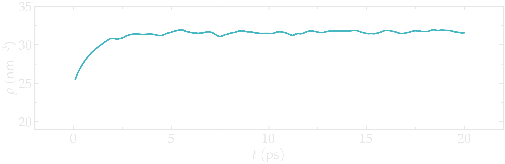
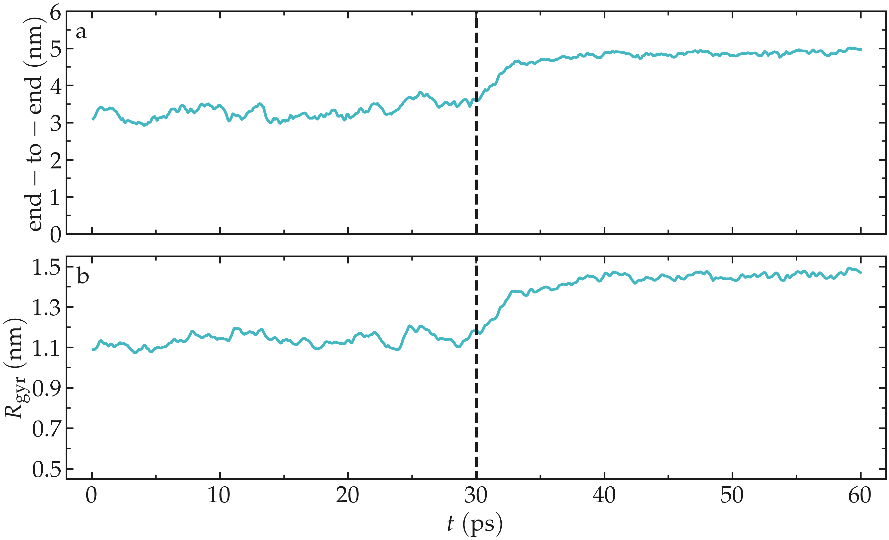

Preparing the water reservoir
=============================

In this tutorial, the water reservoir is first prepared in the absence of
the polymer. A rectangular box of water is created and
equilibrated at ambient temperature and ambient pressure.
The SPC/Fw water model is used :cite:`wu2006flexible`, which is
a flexible variant of the rigid SPC (simple point charge)
model :cite:`berendsen1981interaction`.

Create a folder named *pureH2O/*. Inside this folder, create
an empty text file named *input.lammps*. Copy the following
lines into it:

..  code-block:: lammps

    units real
    atom_style full
    bond_style harmonic
    angle_style harmonic
    dihedral_style harmonic
    pair_style lj/cut/coul/long 10
    kspace_style pppm 1e-5
    special_bonds lj 0.0 0.0 0.5 coul 0.0 0.0 1.0 angle yes

With the unit style *real*, masses are in grams per
mole, distances in Ångstroms, time in femtoseconds, and energies
in Kcal/mole. With the *atom_style full*, each atom is a dot
with a mass and a charge that can be
linked by bonds, angles, dihedrals, and/or impropers. The *bond_style*,
*angle_style*, and *dihedral_style* commands define the
potentials for the bonds, angles, and dihedrals used in the simulation,
here *harmonic*.

Always refer to the LAMMPS |lammps_documentation| if you have doubts about the
potential used by LAMMPS. For instance, this |lammps_documentation_angle_harmonic|
gives the expression for the harmonic angular potential.

.. |lammps_documentation| raw:: html

   <a href="https://docs.lammps.org/" target="_blank">documentation</a>

.. |lammps_documentation_angle_harmonic| raw:: html

   <a href="https://docs.lammps.org/angle_harmonic.html" target="_blank">page</a>

Finally, the *special_bonds* command, which was already seen in
the previous tutorial, :ref:`carbon-nanotube-label`, sets the LJ and Coulomb
weighting factors for the interaction between neighboring atoms.

.. admonition:: About *special bonds*
    :class: info

    Usually, molecular dynamics force fields are parametrized assuming that
    the first neighbors within a molecule do not
    interact directly through LJ or Coulomb potential. Here, since we
    use *lj 0.0 0.0 0.5* and *coul 0.0 0.0 1.0*, the first and second
    neighbors in a molecule only interact through direct bond interactions.
    For the third neighbor (here third neighbor only concerns the PEG molecule,
    not the water), only half of the LJ interaction will be taken into account,
    and the full Coulomb interaction will be used.   

With the *pair_style* named *lj/cut/coul/long*, atoms
interact through both a Lennard-Jones (LJ) potential and
Coulomb interactions. The value of :math:`10\,\text{Å}` is 
the cutoff.

.. admonition:: About cutoff in molecular dynamics
    :class: info

    The cutoff of :math:`10\,\text{Å}` applies to both LJ and Coulomb
    interactions, but in a different way. For LJ *cut*
    interactions, atoms interact with each other only if they
    are separated by a distance smaller than the cutoff. For
    Coulomb *long*, interactions between atoms closer than
    the cutoff are computed directly, and interactions between
    atoms outside that cutoff are computed in the reciprocal space.

Finally, the *kspace* command defines the long-range solver for the
Coulomb interactions. The *pppm* style refers to
particle-particle particle-mesh :cite:`luty1996calculating`.

.. admonition:: About PPPM
    :class: info

    Extracted from |Luty and van Gunsteren|:
    The PPPM method is based on separating the total interaction
    between particles into the sum of short-range
    interactions, which are computed by direct
    particle-particle summation, and long-range interactions,
    which are calculated by solving Poisson's equation using
    periodic boundary conditions (PBCs) :cite:`luty1996calculating`.

.. |Luty and van Gunsteren| raw:: html

   <a href="https://doi.org/10.1021/jp9518623" target="_blank">Luty and van Gunsteren</a>

Then, let us create a 3D simulation box of dimensions :math:`9 \times 3 \times 3 \; \text{nm}^3`,
and make space for 9 atom types (2 for
the water + 7 for the polymer), 7 bond types (1 for
the water + 6 for the polymer), 8
angle types (1 for the water + 7 for the polymer), and 4 dihedral types
(for the polymer only).
Copy the following lines into *input.lammps*:

..  code-block:: lammps

    region box block -45 45 -15 15 -15 15
    create_box 9 box &
    bond/types 7 &
    angle/types 8 &
    dihedral/types 4 &
    extra/bond/per/atom 3 &
    extra/angle/per/atom 6 &
    extra/dihedral/per/atom 10 &
    extra/special/per/atom 14

.. admonition:: About extra per atom commands
    :class: info

    The *extra/x/per/atom* commands are here for
    memory allocation. These commands ensure that enough memory space is left for a
    certain number of attributes for each atom. We won't worry
    about those commands in this tutorial, just keep that in mind if one day
    you see the following error
    message *ERROR: Molecule topology/atom exceeds system topology/atom*.

Let us create a *PARM.lammps* file containing all the
parameters (masses, interaction energies, bond equilibrium
distances, etc). In *input.lammps*, add the following line:

..  code-block:: lammps

    include ../PARM.lammps

Then, download and save the |PARM_PEG.data| file
next to the *pureH2O/* folder.

.. |PARM_PEG.data| raw:: html

   <a href="../../../../../lammpstutorials-inputs/level2/polymer-in-water/PARM.lammps" target="_blank">parameter</a>

Within *PARM.lammps*, the *mass* and *pair_coeff* of atoms
of types 8 and 9 are for water and the 
atoms of types 1 to 7 are for the polymer
molecule. Similarly, the *bond_coeff 7* and 
*angle_coeff 8* are for water, while all
the other parameters are for the polymer.

Let us create water molecules. To do so, let us
import a molecule template called
*H2O-SPCFw.mol* and then let us randomly create 1050 molecules.
Add the following lines into *input.lammps*:

..  code-block:: lammps

    molecule h2omol H2O-SPCFw.mol
    create_atoms 0 random 1050 87910 NULL mol &
        h2omol 454756 overlap 1.0 maxtry 50

The *overlap 1* option of the *create_atoms* command ensures that no atoms are
placed exactly in the same position, as this would cause the simulation to
crash. The *maxtry 50* asks LAMMPS to try at most
50 times to insert the molecules, which is useful in case some
insertion attempts are rejected due to overlap. In some cases, depending on
the system and the values of *overlap*
and *maxtry*, LAMMPS may not create the desired number of molecules.
Always check the number of created atoms in the *log* file after
starting the simulation:

..  code-block:: bw

    Created 3150 atoms

When LAMMPS fails to create the desired number of molecules, a WARNING
appears in the *log* file.

The molecule template named *H2O-SPCFw.mol*
can be |download_FlexibleH2O|
and saved in the *pureH2O/* folder.
This template contains the necessary structural
information of a water molecule, such as the number of atoms, or the IDs
of the atoms that are connected by bonds, angles, etc.

.. |download_FlexibleH2O| raw:: html

   <a href="../../../../../lammpstutorials-inputs/level2/polymer-in-water/pureH2O/H2O-SPCFw.mol" target="_blank">downloaded</a>

Then, let us organize the atoms of types 8 and 9 of the water molecules
in a group named *H2O* and perform a small energy minimization. The
energy minimization is mandatory here given the small *overlap* value
of 1 Ångstrom chosen in the *create_atoms* command. Add the following lines
to *input.lammps*:

..  code-block:: lammps

    group H2O type 8 9
    minimize 1.0e-4 1.0e-6 100 1000
    reset_timestep 0

In general, resetting the step of the simulation to 0 using the
*reset_timestep* command is optional. It is used here because the number
of iterations performed by the *minimize* command is usually not a round
number (since the minimization stops when one of four criteria is reached).

Let us use the *fix npt* to
control the temperature of the molecules with a Nosé-Hoover thermostat and
the pressure of the system with a Nosé-Hoover barostat 
:cite:`nose1984unified, hoover1985canonical, martyna1994constant`,
by adding the following line into *input.lammps*:

..  code-block:: lammps

    fix mynpt all npt temp 300 300 100 iso 1 1 1000

The *fix npt* allows us to impose both a temperature of :math:`300\,\text{K}`
(with a damping constant of :math:`100\,\text{fs}`),
and a pressure of 1 atmosphere (with a damping constant of :math:`1000\,\text{fs}`).
With the *iso* keyword, the three dimensions of the box will be re-scaled
simultaneously.

Let us print the atom positions in a *.lammpstrj* file every 1000
steps (i.e. 1 ps), print the temperature volume, and
density every 100 steps in 3 separate data files, and
print the information in the terminal every 1000 steps:

..  code-block:: lammps

    dump mydmp all atom 1000 dump.lammpstrj
    variable mytemp equal temp
    variable myvol equal vol
    fix myat1 all ave/time 10 10 100 v_mytemp file temperature.dat
    fix myat2 all ave/time 10 10 100 v_myvol file volume.dat
    variable myoxy equal count(H2O)/3
    variable mydensity equal ${myoxy}/v_myvol
    fix myat3 all ave/time 10 10 100 v_mydensity file density.dat
    thermo 1000

The variable *myoxy* corresponds to the number of atoms
divided by 3, i.e. the number of molecules.

.. admonition:: On calling variables in LAMMPS
    :class: info

    Both dollar sign and underscore can be used to call a previously defined
    variable. With the dollar sign, the initial value of the variable is returned,
    while with the underscore, the instantaneous value of the variable is returned. 
    To probe the temporal evolution of a variable with time,
    the underscore must be used.

Finally, let us set the timestep to 1.0 fs,
and run the simulation for 20 ps by adding the
following lines into *input.lammps*:

..  code-block:: lammps

    timestep 1.0
    run 20000

    write_data H2O.data

The final state is written into *H2O.data*.

If you open the *dump.lammpstrj* file using VMD, you should
see the system quickly reaching its equilibrium volume and density.

.. figure:: figures/water-light.png
    :alt: Curves showing the equilibration of the water reservoir
    :class: only-light

.. figure:: figures/water-dark.png
    :alt: Curves showing the equilibration of the water reservoir
    :class: only-dark

.. container:: figurelegend

    Figure: Water reservoir after equilibration. Oxygen atoms are in red, and
    hydrogen atoms are in white.

Open the *density.dat* file to ensure that the system converged
toward a (reasonably) well-equilibrated liquid water system during the 20 ps of simulation.

.. container:: figurelegend

    Figure: Evolution of the density of water with time. The
    density :math:`\rho` reaches
    a plateau after :math:`\approx 10\,\text{ps}`.

.. admonition:: Insufficient simulation duration
    :class: info

    A duration of :math:`20~\text{ps}` is not sufficient to reach the actual equilibrium density.
    Increase this duration to at least :math:`500~\text{ps}` to obtain a density value that
    is comparable with the values given in Ref. :cite:`wu2006flexible`.

If needed, you can |download_H2O.data| the water reservoir I have
equilibrated and use it to continue with the tutorial.

.. |download_H2O.data| raw:: html

    <a href="../../../../../lammpstutorials-inputs/level2/polymer-in-water/pureH2O/H2O.data" target="_blank">download</a>

Solvating the PEG in water
==========================

Now that the water reservoir is equilibrated, we can safely
include the PEG polymer in the water.

The PEG molecule topology was downloaded from the |atb_repo|
repository :cite:`malde2011automated, oostenbrink2004biomolecular`.
It has a formula :math:`\text{C}_{28}\text{H}_{58}\text{O}_{15}`,
and the parameters are taken from
the GROMOS 54A7 force field :cite:`schmid2011definition`.

.. |atb_repo| raw:: html

   <a href="https://atb.uq.edu.au/" target="_blank">ATB</a>

.. figure:: figures/singlePEG-dark.png
    :alt: PEG in vacuum as simulated with LAMMPS
    :class: only-dark

..  container:: figurelegend

    Figure: The PEG molecule in vacuum. The carbon atoms are in gray,
    the oxygen atoms in red, and the hydrogen atoms in white.

Create a second folder alongside *pureH2O/*
and call it *mergePEGH2O/*. Create a new blank file in it,
call it *input.lammps*. Within *input.lammps*, copy the same first lines as
previously:

..  code-block:: lammps

    units real
    atom_style full
    bond_style harmonic
    angle_style harmonic
    dihedral_style harmonic
    pair_style lj/cut/coul/long 10
    kspace_style pppm 1e-5
    special_bonds lj 0.0 0.0 0.5 coul 0.0 0.0 1.0 angle yes dihedral yes

Then, import the previously generated data file *H2O.data*
as well as the *PARM.lammps* file:

..  code-block:: lammps

    read_data ../pureH2O/H2O.data &
        extra/bond/per/atom 3 &
        extra/angle/per/atom 6 &
        extra/dihedral/per/atom 10 &
        extra/special/per/atom 14
    include ../PARM.lammps

Download the molecule |download_PEG| for the PEG molecule, and then
create a single molecule in the middle of the box:

.. |download_PEG| raw:: html

   <a href="../../../../../lammpstutorials-inputs/level2/polymer-in-water/mergePEGH2O/PEG-GROMOS.mol" target="_blank">template</a>

..  code-block:: lammps

    molecule pegmol PEG-GROMOS.mol
    create_atoms 0 single 0 0 0 mol pegmol 454756

Let us create 2 groups to differentiate the PEG from the H2O,
by adding the following lines into *input.lammps*:

..  code-block:: lammps

    group H2O type 8 9
    group PEG type 1 2 3 4 5 6 7

Water molecules that are overlapping with the PEG must be deleted to avoid
future crashing. Add the following line into *input.lammps*:

..  code-block:: lammps

    delete_atoms overlap 2.0 H2O PEG mol yes

Here, the value of 2 Ångstroms for the overlap cutoff was fixed arbitrarily
and can be chosen through trial and error. If the cutoff is too small, the 
simulation will crash. If the cutoff is too large, too many water molecules
will unnecessarily be deleted.

Finally, let us use the *fix npt* to control the temperature, as well as
the pressure by allowing the box size to be rescaled along the *x* axis:

..  code-block:: lammps

    fix mynpt all npt temp 300 300 100 x 1 1 1000
    timestep 1.0

Once more, let us dump the atom positions as well as the system temperature
and volume:

..  code-block:: lammps

    dump mydmp all atom 100 dump.lammpstrj
    thermo 100
    variable mytemp equal temp
    variable myvol equal vol
    fix myat1 all ave/time 10 10 100 v_mytemp file temperature.dat
    fix myat2 all ave/time 10 10 100 v_myvol file volume.dat

Let us also print the total enthalpy:

..  code-block:: lammps

    variable myenthalpy equal enthalpy
    fix myat3 all ave/time 10 10 100 v_myenthalpy file enthalpy.dat

Finally, let us perform a short equilibration and print the
final state in a data file. Add the following lines into the data file:

..  code-block:: lammps

    run 30000
    write_data mix.data

If you open the *dump.lammpstrj* file using VMD
or have a look at the evolution of the volume in *volume.dat*,
you should see that the box dimensions slightly evolve along *x*
to accommodate the new configuration. In addition, the temperature remains
close to the target value of :math:`300~\text{K}` throughout the entire simulation,
and the enthalpy is almost constant, suggesting that the system was close
to equilibrium from the start.

.. figure:: figures/solvatedPEG_light.png
   :alt: PEG in water
   :class: only-light

.. figure:: figures/solvatedPEG_dark.png
   :alt: PEG in water
   :class: only-dark

.. container:: figurelegend

   Figure: A single PEG molecule in water. Water molecules are represented as
   a transparent continuum field for clarity.

Stretching the PEG molecule
===========================

Here, a constant forcing is applied to the two ends of the PEG molecule
until it stretches. Create a new folder next to the previously created
folders, call it *pullonPEG/*, and create a new input file in it
called *input.lammps*.

First, let us create a variable *f0* corresponding to the magnitude
of the force we are going to apply:

..  code-block:: lammps

    variable f0 equal 5

The force magnitude of :math:`1\,\text{kcal/mol/Å}` corresponds
to :math:`67.2\,\text{pN}` and was chosen to be large enough to overcome
the thermal agitation and the entropic contribution from both water and PEG
molecules (it was chosen by trial and error). Then, copy the same lines as previously:

..  code-block:: lammps

    units real
    atom_style full
    bond_style harmonic
    angle_style harmonic
    dihedral_style harmonic
    pair_style lj/cut/coul/long 10
    kspace_style pppm 1e-5
    special_bonds lj 0.0 0.0 0.5 coul 0.0 0.0 1.0 angle yes dihedral yes

Start the simulation from the equilibrated PEG-water system and include
again the parameter file by adding the following lines into the *input.lammps*:

..  code-block:: lammps

    read_data ../mergePEGH2O/mix.data
    include ../PARM.lammps

Then, let us create 4 atom groups: H2O and PEG (as previously), as well
as 2 groups containing only the 2 oxygen atoms of types 6 and 7,
respectively. Atoms of types 6 and 7 correspond to the oxygen atoms
located at the ends of the PEG molecule, which we are going to use to pull
on the PEG molecule. Add the following lines into the *input.lammps*:

..  code-block:: lammps

    group H2O type 8 9
    group PEG type 1 2 3 4 5 6 7
    group topull1 type 6
    group topull2 type 7

Add the following *dump* command to the input to print the atom positions
every 1000 steps:

..  code-block:: lammps

    dump mydmp all atom 1000 dump.lammpstrj

Let us use a single Nosé-Hoover thermostat applied to all the atoms by
adding the following lines into *input.lammps*:

..  code-block:: lammps

    timestep 1.0
    fix mynvt all nvt temp 300 300 100

Let us also print the end-to-end distance of the PEG,
here defined as the distance between the groups *topull1*
and *topull2*, as well as the temperature of the system and the gyration
radius of the molecule :cite:`fixmanRadiusGyrationPolymer1962a`
by adding the following lines into *input.lammps*:

..  code-block:: lammps

    variable mytemp equal temp
    fix myat1 all ave/time 10 10 100 v_mytemp file output-temperature.dat
    variable x1 equal xcm(topull1,x)
    variable x2 equal xcm(topull2,x)
    variable y1 equal xcm(topull1,y)
    variable y2 equal xcm(topull2,y)
    variable z1 equal xcm(topull1,z)
    variable z2 equal xcm(topull2,z)
    variable delta_r equal sqrt((v_x1-v_x2)^2+(v_y1-v_y2)^2+(v_z1-v_z2)^2)
    fix myat2 all ave/time 10 10 100 v_delta_r &
        file output-end-to-end-distance.dat
    compute rgyr PEG gyration
    fix myat3 all ave/time 10 10 100 c_rgyr file gyration-radius.dat
    thermo 1000

Finally, let us simulate 30 picoseconds without any external forcing:

..  code-block:: lammps

    run 30000

This first run will serve as a benchmark to later quantify the changes
induced by the forcing. Then, let us apply a forcing on the 2 oxygen
atoms using two *add_force* commands, and run for an extra 30 ps:

..  code-block:: lammps

    fix myaf1 topull1 addforce ${f0} 0 0
    fix myaf2 topull2 addforce -${f0} 0 0
    run 30000

Run the *input.lammps* file using LAMMPS. If you open the *dump.lammpstrj*
file using *VMD*, you should see that the PEG molecule eventually aligns
in the direction of the force.

.. figure:: figures/pulled_peg_dark.png
    :alt: PEG molecule in water
    :class: only-dark

.. figure:: figures/pulled_peg_light.png
    :alt: PEG molecule in water
    :class: only-light

.. container:: figurelegend

    Figure: PEG molecule stretched along the *x* direction in water.
    Water molecules are represented as a transparent continuum 
    field for clarity. See the corresponding |pulled_on_peg|.

.. |pulled_on_peg| raw:: html

    <a href="https://youtu.be/mjc6O6d9F-Y" target="_blank">video</a>

The evolution of the end-to-end distance over time
shows the PEG adjusting to the external forcing:

.. container:: figurelegend

    Figure: a) Evolution of the end-to-end distance of the PEG molecule
    with time. The forcing starts at :math:`t = 30` ps. b) Evolution of the
    gyration radius :math:`R_\text{gyr}` of the PEG molecule. 

There is a follow-up to this polymer in water tutorial as :ref:`mda-label`,
where the trajectory is imported in Python using MDAnalysis.
