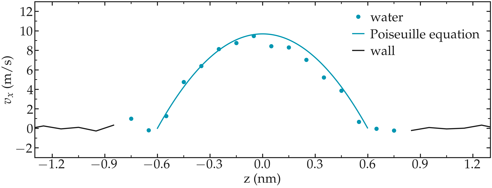
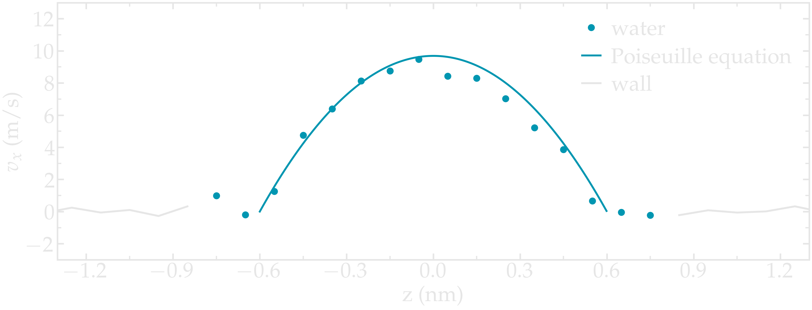

Going further with exercises
============================

Induce a Poiseuille flow
------------------------

Instead of inducing a shearing of the fluid using the walls,
induce a net flux of the liquid in the direction tangential
to the walls. The walls must be kept immobile.

Extract the velocity profile, and make sure that the
resulting velocity profile is consistent with the Poiseuille equation,
which can be derived from the Stokes equation :math:`\eta \nabla \textbf{v} = - \textbf{f} \rho`
where :math:`f` is the applied force,
:math:`\rho` is the fluid density,
:math:`\eta` is the fluid viscosity.

..  container:: figurelegend

    Figure: Velocity profiles of the water molecules along the *z* axis (disks).
    The line is the Poiseuille equation.

An important step is to choose the proper value for the additional force.
