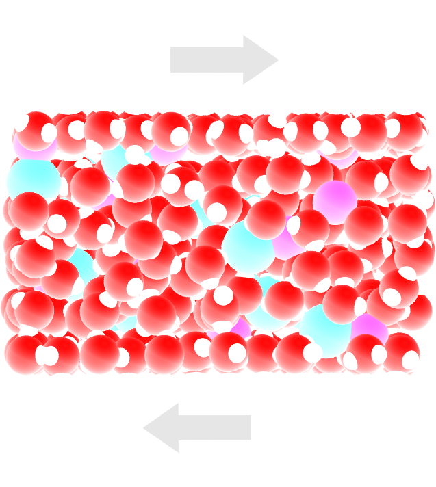

.. figure:: avatars/nanoconfined-electrolyte-light.png
    :height: 250
    :alt: Electrolyte nano-confined in a slit pore
    :class: only-light
    :align: right

The objective of this tutorial is to simulate an electrolyte nanoconfined
and sheared by two walls. The density and velocity profiles of the fluid in
the direction normal to the walls are extracted to highlight the effect of
confining a fluid on its local properties. 

This tutorial illustrates some key aspects of
combining a fluid and a solid in the same simulation.
A major difference from :ref:`all-atoms-label` is that
here a rigid four-points water model named TIP4P is used :cite:`abascal2005general`.
TIP4P is one of the most common water models due to its high accuracy.
