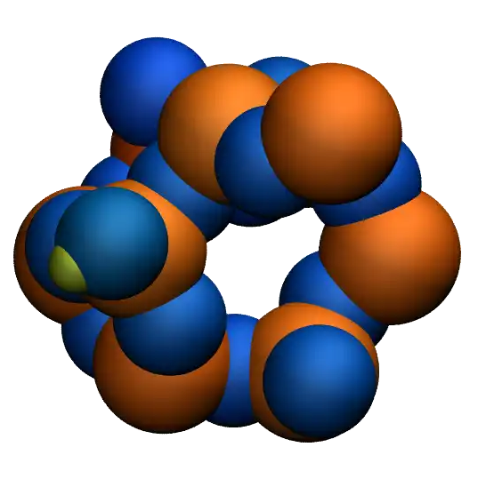
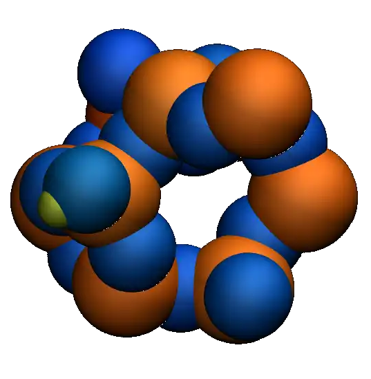

The objective of this tutorial is to demonstrate how the reactive force field ReaxFF
can be used to calculate the partial charges of a system undergoing deformation, as well as
the formation and breaking of chemical bonds :cite:`van2001reaxff, zou2012investigation`.
The system simulated in this tutorial is a block of silicon dioxide :math:`\text{SiO}_2` (Fig.~\ref{fig:SIO})
which is deformed until it ruptures.  Particular attention is given to the evolution
of atomic charges during deformation, with a focus on tracking chemical reactions
resulting from the deformation over time.

