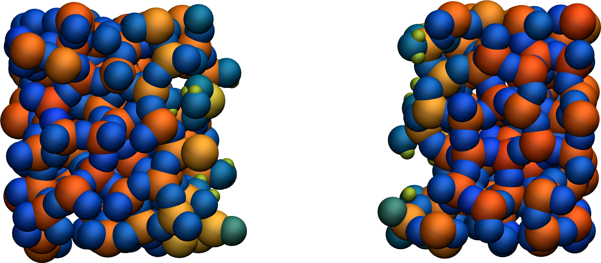

Prepare and relax
=================

The first step is to relax the structure with ReaxFF, which which will be achieved using
molecular dynamics.  To ensure the system equilibrates properly, we will monitor certain
parameters over time, such as the system volume.

Create a folder if needed and
place the initial input file, **relax.lmp**, into it. Then, open the 
file in a text editor of your choice, and copy the following into it:

.. code-block:: lammps

    units real
    atom_style full

    read_data silica.data

.. admonition:: If you are using LAMMPS-GUI
    :class: gui

    To begin this tutorial, select ``Start Tutorial 5`` from the
    ``Tutorials`` menu of LAMMPS--GUI and follow the instructions.
    The editor should display the following content corresponding to **relax.lmp**

So far, the input is very similar to what was seen in the previous tutorials.
Some basic parameters are defined (``units`` and ``atom_style``),
and a **.data** file is imported by the ``read_data`` command.

The initial topology given by |silica_data_5|
is a small amorphous silica structure.  This structure was created using a force field called
Vashishta :cite:`vashishta1990interaction`.  If you open the **silica.data**
file, you will find in the ``Atoms`` section that all silicon atoms have a
charge of :math:`q = 1.1\,\text{e}`, and all oxygen atoms have a charge of :math:`q = -0.55\,\text{e}`.

.. |silica_data_5| raw:: html

    <a href="../../../../../.dependencies/lammpstutorials-inputs/tutorial5/silica.data" target="_blank">silica.data</a>

.. admonition:: Note
    :class: non-title-info

    Assigning the same charge to all atoms of the same type is common with many
    force fields, including the force fields used in the previous tutorials.  This
    changes once ReaxFF is used: the charge of each atom will adjust to its local
    environment.

Next, copy the following three crucial lines into the **relax.lmp** file:

.. code-block:: lammps

    pair_style reaxff NULL safezone 3.0 mincap 150
    pair_coeff * * reaxCHOFe.inc Si O
    fix myqeq all qeq/reaxff 1 0.0 10.0 1.0e-6 reaxff maxiter 400

In this case, the ``pair_style reaxff`` is used without a control file.  The
``safezone`` and ``mincap`` keywords are added to prevent
allocation issues, which sometimes can trigger segmentation faults and
``bondchk`` errors.  The ``pair_coeff`` command uses the |reaxCHOFe_inc_5|
file, which should have been downloaded during the tutorial set up.  Finally, the
``fix qeq/reaxff`` is used to perform charge equilibration :cite:`rappe1991charge`,
which occurs at every step.  The values 0.0 and 10.0 represent the
low and the high cutoffs, respectively, and :math:`1.0 \text{e} -6` is the tolerance.
The ``maxiter`` sets an upper limit to the number of attempts to
equilibrate the charge.

.. |reaxCHOFe_inc_5| raw:: html

    <a href="../../../../../.dependencies/lammpstutorials-inputs/tutorial5/reaxCHOFe.inc" target="_blank">reaxCHOFe.inc</a>

Next, add the following commands to the **relax.lmp** file to track the
evolution of the charges during the simulation:

.. code-block:: lammps

    group grpSi type Si
    group grpO type O
    variable qSi equal charge(grpSi)/count(grpSi)
    variable qO equal charge(grpO)/count(grpO)
    variable vq atom q

To print the averaged charges ``qSi`` and ``qO`` using the
``thermo_style`` command, and create images of the system.  Add the
following lines to **relax.lmp**:

.. code-block:: lammps

    thermo 100
    thermo_style custom step temp etotal press vol v_qSi v_qO
    dump viz all image 100 myimage-*.ppm q type shiny 0.1 box no 0.01 view 180 90 zoom 2.3 size 1200 500
    dump_modify viz adiam Si 2.6 adiam O 2.3 backcolor white amap -1 2 ca 0.0 3 min royalblue 0 green max orangered

Here, the atoms are colored by their charges ``q``, ranging from royal blue
(when :math:`q=-1\,\text{e}`) to orange-red (when :math:`q=2\,\text{e}`).

.. figure:: figures/silicon-light.png
    :alt: Amorphous silica colored by charges using VMD
    :class: only-light

..  container:: figurelegend

    Figure: Amorphous silicon oxide. The atoms are colored by their
    charges.  Dangling oxygen groups appear in greenish, bulk Si atoms with a charge of
    about :math:`1.8~\text{e}`  appear in red/orange, and bulk O atoms with a charge of
    about :math:`-0.9 ~ \text{e}` appear in blue.

We can generate histograms of the charges for each atom type using
``fix ave/histo`` commands:

.. code-block:: lammps

    fix myhis1 grpSi ave/histo 10 500 5000 -1.5 2.5 1000 v_vq file relax-Si.histo mode vector
    fix myhis2 grpO ave/histo 10 500 5000 -1.5 2.5 1000 v_vq file relax-O.histo mode vector

We can also use the ``fix reaxff/species`` to evaluate what species are
present within the simulation.  It will be useful later when the system is deformed,
and bonds are broken:

.. code-block:: lammps

    fix myspec all reaxff/species 5 1 5 relax.species element Si O

Here, the information will be printed every 5 steps in a file called **relax.species**.
Let us perform a very short run using the anisotropic NPT command and relax the
density of the system:

.. code-block:: lammps

    velocity all create 300.0 32028
    fix mynpt all npt temp 300.0 300.0 100 aniso 1.0 1.0 1000
    timestep 0.5

    run 5000

    write_data relax.data

Run the **relax.lmp** file using LAMMPS.  As seen from **relax.species**,
only one species is detected, called ``O384Si192``, representing the entire system.

As the simulation progresses, the charge of every atom fluctuates
because it is adjusting to the local environment of the atom.
It is also observed that the averaged charges for silicon and oxygen
atoms fluctuate significantly at the beginning of the simulation, corresponding
to a rapid change in the system volume, which causes interatomic distances to
shift quickly.  The atoms with the
most extreme charges are located at structural defects,
such as dangling oxygen groups.

.. figure:: figures/SIO-charge-dm.png
    :class: only-dark
    :alt: Average charge per atom of the silicon

..  container:: figurelegend

    Figure: a) Average charge per atom of the silicon, :math:`q_\text{Si}`, atoms as
    a function of time, :math:`t`, during equilibration of the :math:`\text{SiO}_2`
    system.  b) Volume of the system, :math:`V`, as a function of :math:`t`.

.. figure:: figures/silicon-light.png
    :alt: Amorphous silica colored by charges using VMD
    :class: only-light

..  container:: figurelegend

    Figure: A slice of the amorphous silica, where atoms are colored by their charges.
    Dangling oxygen groups appear in greenish, bulk Si atoms with a charge of about
    :math:`1.8~\text{e}`  appear in red/orange, and bulk O atoms with a charge of about
    :math:`-0.9~\text{e}` appear in blue.

Finally, the generated **.histo** files can be used to
plot the probability distributions, :math:`P(q)`.

.. figure:: figures/SIO-distribution.png
    :class: only-light
    :alt: Average charge per atom of the silicon

..  container:: figurelegend

    Figure: a) Probability distributions of charge of silicon (positive, blue) and oxygen
    (negative, orange) atoms during the equilibration of the :math:`\text{SiO}_2`
    system.  b) Same probability distributions as in panel (a) after the deformation.

Deform the structure
--------------------

Let us apply a deformation to the structure to force some :math:`\text{Si}-\text{O}`
bonds to break (and eventually re-assemble).  Open the **deform.lmp**
file, which must contain the following lines:

.. code-block:: lammps

    units real
    atom_style full

    read_data relax.data

    pair_style reaxff NULL safezone 3.0 mincap 150
    pair_coeff * * reaxCHOFe.inc Si O
    fix myqeq all qeq/reaxff 1 0.0 10.0 1.0e-6 reaxff maxiter 400

    group grpSi type Si
    group grpO type O
    variable qSi equal charge(grpSi)/count(grpSi)
    variable qO equal charge(grpO)/count(grpO)
    variable vq atom q

    thermo 200
    thermo_style custom step temp etotal press vol v_qSi v_qO
    dump viz all image 100 myimage-*.ppm q type shiny 0.1 box no 0.01 view 180 90 zoom 2.3 size 1200 500
    dump_modify viz adiam Si 2.6 adiam O 2.3 backcolor white amap -1 2 ca 0.0 3 min royalblue 0 green max orangered

    fix myhis1 grpSi ave/histo 10 500 5000 -1.5 2.5 1000 v_vq file deform-Si.histo mode vector
    fix myhis2 grpO ave/histo 10 500 5000 -1.5 2.5 1000 v_vq file deform-O.histo mode vector
    fix myspec all reaxff/species 5 1 5 deform.species element Si O

The only difference with the previous **relax.lmp** file is the path to
the **relax.data** file.

Next, let us use ``fix nvt`` instead of ``fix npt`` to apply a
Nosé-Hoover thermostat without a barostat:

.. code-block:: lammps

    fix mynvt all nvt temp 300.0 300.0 100
    timestep 0.5

Here, no barostat is used because the change in the box volume will be imposed
by the ``fix deform``.

Let us run for 5000 steps without deformation, then apply the ``fix deform``
to progressively elongate the box along the :math:`x`-axis during 25000 steps.  Add
the following line to **deform.lmp**:

.. code-block:: lammps

    run 5000

    fix mydef all deform 1 x erate 5e-5

    run 25000

    write_data deform.data

Run the **deform.lmp** file using LAMMPS.  During the deformation, the charge
values progressively evolve until the structure eventually breaks down.  After the
structure breaks down, the charges equilibrate near new average values that differ
from the initial averages.  The difference
between the initial and the final charges can be explained by the presence of
defects, as well as new solid/vacuum interfaces, and the fact that surface atoms
typically have different charges compared to bulk atoms.
You can also see a sharp increase in temperature during the rupture of
the material.

.. figure:: figures/deformed-charge-dm.png
    :class: only-dark
    :alt: Evolution of the pressure and distance for the elecrolyte

..  container:: figurelegend

    Figure: a) Average charge per atom of the silicon, :math:`q_\text{Si}`, atoms as
    a function of time, :math:`t`, during deformation of the :math:`\text{SiO}_2` system.
    The break down of the
    silica structure occurs near :math:`t = 11` ps.  b) Temperature, :math:`T`, of the
    system as a function of :math:`t`.

You can examine the charge distribution after deformation, as well as during
deformation.  As expected, the final
charge distribution slightly differs from the previously calculated one.  If
no new species were formed during the simulation, the **deform.species** file
should look like this:

.. code-block:: lammps

    #  Timestep   No_Moles   No_Specs  O384Si192
            5            1          1          1
    (...)
    #  Timestep   No_Moles   No_Specs  O384Si192
        30000            1          1          1

Sometimes, :math:`\text{O}_2` molecules are formed during the deformation.  If this occurs,
a new column ``O2`` appears in the **deform.species** file.

Decorate the surface
--------------------

Under ambient conditions, some of the surface :math:`\text{SiO}_2` atoms become chemically
passivated by forming covalent bonds with hydrogen (H) atoms :cite:`sulpizi2012silica`.
We will add hydrogen atoms randomly to the cracked silica and observe how the
system evolves.  To do so, we first need to modify the previously generated data
file **deform.data** and make space for a third atom type.
Copy **deform.data**, name the copy **deform-mod.data**, and modify the
first lines of **deform-mod.data** as follows:

.. code-block:: lammps

    576 atoms
    3 atom types

    (...)

    Atom Type Labels

    1 Si
    2 O
    3 H

    Masses

    Si 28.0855
    O 15.999
    H 1.008

    (...)

Open the **decorate.lmp** file, which must contain the following lines:

.. code-block:: lammps

    units real
    atom_style full

    read_data deform-mod.data
    displace_atoms all move -12 0 0 # optional

    pair_style reaxff NULL safezone 3.0 mincap 150
    pair_coeff * * reaxCHOFe.inc Si O H
    fix myqeq all qeq/reaxff 1 0.0 10.0 1.0e-6 reaxff maxiter 400

The ``displace_atoms`` command is used to move the center of the
crack near the center of the box.  This step is optional but makes for a nicer
visualization.  A different value for the shift may be needed in
your case, depending on the location of the crack.  A difference with the previous
input is that three atom types are specified in the ``pair_coeff`` command, i.e.
``Si O H``.

Then, let us adapt some familiar commands to measure the charges of all three
types of atoms, and output the charge values into log files:

.. code-block:: lammps

    group grpSi type Si
    group grpO type O
    group grpH type H
    variable qSi equal charge(grpSi)/count(grpSi)
    variable qO equal charge(grpO)/count(grpO)
    variable qH equal charge(grpH)/(count(grpH)+1e-10)

    thermo 5
    thermo_style custom step temp etotal press v_qSi v_qO v_qH

    dump viz all image 100 myimage-*.ppm q type shiny 0.1 box no 0.01 view 180 90 zoom 2.3 size 1200 500
    dump_modify viz adiam Si 2.6 adiam O 2.3 adiam H 1.0 backcolor white amap -1 2 ca 0.0 3 min royalblue 0 green max orangered

    fix myspec all reaxff/species 5 1 5 decorate.species element Si O H

Here, the :math:`+1 \mathrm{e}{-10}` was added to the denominator of the ``variable qH``
to avoid dividing by 0 at the beginning of the simulation.  Finally, let us
create a loop with 10 steps, and create two hydrogen atoms at random locations at
every step:

.. code-block:: lammps

    fix mynvt all nvt temp 300.0 300.0 100
    timestep 0.5

    label loop
    variable a loop 10

    variable seed equal 35672+${a}
    create_atoms 3 random 2 ${seed} NULL overlap 2.6 maxtry 50

    run 2000

    next a
    jump SELF loop

Run the simulation with LAMMPS.  When the simulation is over,
it can be seen from the **decorate.species** file that
all the created hydrogen atoms reacted with the :math:`\text{SiO}_{2}` structure to
form surface groups (such as hydroxyl (-OH) groups).

.. code-block:: lammps

    (...)
    # Timestep   No_Moles No_Specs H20O384Si192
    20000      1        1        1

At the end of the simulation, hydroxyl (-OH) groups can be seen at the interfaces.

.. figure:: figures/decorated-dark.png
    :class: only-dark
    :alt: Cracked silicon oxide after the addition of hydrogen atoms simulated using LAMMPS molecular dynamics

..  container:: figurelegend

    Figure: Cracked silicon oxide after the addition of hydrogen atoms.
    The atoms are colored by their charges, with the newly added hydrogen atoms appearing as small
    greenish spheres.