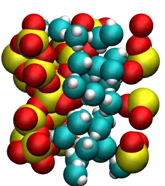

.. figure:: avatars/avatar-dark.webp
    :height: 250
    :alt: Water molecules adsorbed in silica SiO2 porous inorganic material
    :class: only-dark
    :align: right

The objective of this tutorial is to combine molecular dynamics and
grand canonical Monte Carlo simulations to compute the adsorption of water
molecules in cracked silica material.  This tutorial
illustrates the use of the grand canonical ensemble in molecular simulation, an
open ensemble where the number of atoms or molecules in the simulation box can vary.
By employing the grand canonical ensemble, we will set the chemical
potential of water within a nanoporous :math:`\text{SiO}_2` structure.

