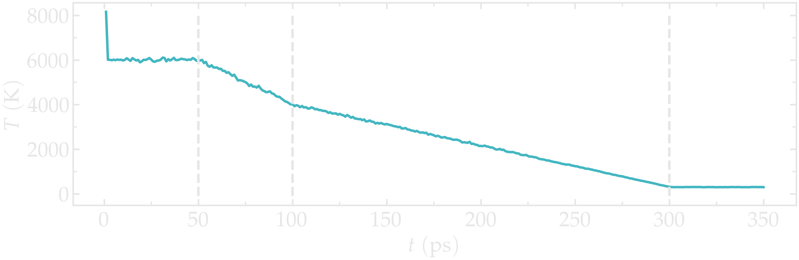
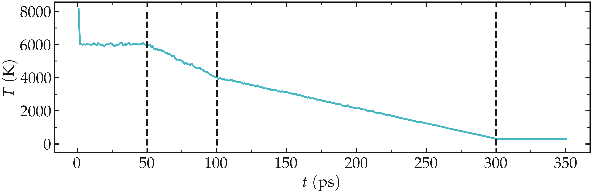
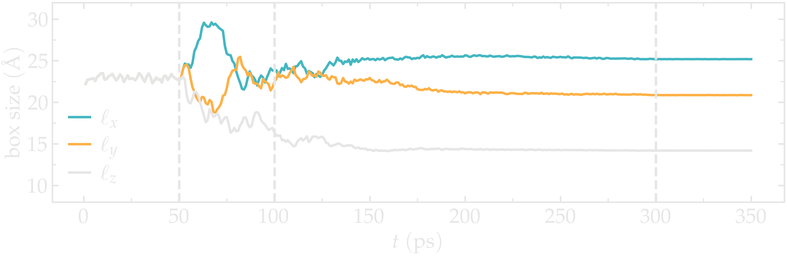
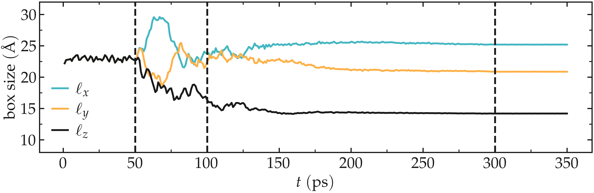
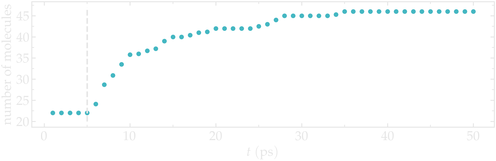
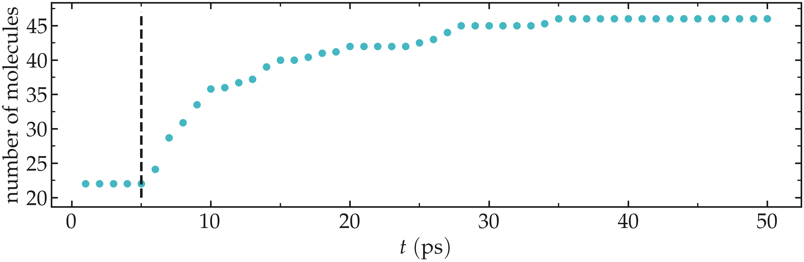

Generation of the silica block
==============================

Let us first generate a block of amorphous silica (SiO2). To do
so, we are going to replicate a building block containing 3
Si and 6 O atoms. 

.. admonition:: Not interested in the annealing procedure ?
    :class: info

    You can skip this part by downloading the final silica structure
    |download_silica_block| and continue with the tutorial.

.. |download_silica_block| raw:: html

   <a href="../../../../../lammpstutorials-inputs/level3/water-adsorption-in-silica/SilicaBlock/amorphousSiO.data" target="_blank">here</a>

Create two folders side by side, and name them respectively *Potential/*
and *SilicaBlock/*.

An initial data file for the SiO atoms can be
downloaded by clicking |download_SiO.data|.
Save it in *SilicaBlock/*. This data file
contains the coordinates of the 9 atoms, their masses, and
their charges. The *.data* file can be directly read by LAMMPS using the
*read_data* command. Let us replicate these atoms using
LAMMPS, and apply an annealing procedure to obtain a block
of amorphous silica.

.. admonition:: About annealing procedure
    :class: info

    The annealing procedure consists of adjusting the system temperature in successive steps.
    Here, a large initial temperature is chosen to ensure the melting of the SiO2 structure.
    Then, several steps are used to progressively cool down the system until it solidifies and forms 
    amorphous silica. Depending on the material, different cooling velocities can sometimes
    lead to different crystal structures or different degrees of defect.

Create a new input file named *input.lammps* in the *SilicaBlock/* folder, and copy
the following lines into it:

.. |download_SiO.data| raw:: html

   <a href="../../../../../lammpstutorials-inputs/level3/water-adsorption-in-silica/SilicaBlock/SiO.data" target="_blank">here</a>

..  code-block:: lammps

    units metal
    boundary p p p
    atom_style full
    pair_style vashishta
    neighbor 1.0 bin
    neigh_modify delay 1

The main difference with some of the previous tutorials is the use of 
the *Vashishta* pair style. Download the *Vashishta* potential by
clicking |download_vashishta|, and copy it within the *Potential/* folder.

.. |download_vashishta| raw:: html

   <a href="../../../../../lammpstutorials-inputs/level3/water-adsorption-in-silica/Potential/SiO.1990.vashishta" target="_blank">here</a>

.. admonition:: About the Vashishta potential
    :class: info

    The |website_vashishta|
    potential is a bond-angle energy-based potential, it
    deduces the bonds between atoms from their relative
    positions :cite:`vashishta1990interaction`. Therefore, there is no need to
    provide the bond and angle information as we do with classic force fields
    like GROMOS or AMBER. When used with LAMMPS, the *Vashishta*
    potential requires the use of the *metal* units system. 
    Bond-angle energy-based potentials
    are more computationally heavy than classical force
    fields and require the use of a smaller timestep, but
    they allow for the modeling of bond formation and
    breaking, which is what we need here as we want to create
    a crack in the silica.

.. |website_vashishta| raw:: html

   <a href="https://pubmed.ncbi.nlm.nih.gov/9993674/" target="_blank">Vashishta</a>

Let us then import the system made of 9 atoms, and replicate it four times in all three
directions of space, thus creating a system with 576 atoms. Add the following lines
to *input.lammps*:

..  code-block:: lammps

    read_data SiO.data
    replicate 4 4 4

Then, let us specify the pair coefficients by indicating
that the first atom type is *Si*, and
the second is *O*. Let us also
add a dump command for printing out the positions of the
atoms every 5000 steps:

..  code-block:: lammps

    pair_coeff * * ../Potential/SiO.1990.vashishta Si O

Let us add some commands to *input.lammps* to help us follow the evolution of the system,
such as its temperature, volume, and potential energy:

..  code-block:: lammps

    dump dmp all atom 5000 dump.lammpstrj
    variable myvol equal vol
    variable mylx equal lx
    variable myly equal ly
    variable mylz equal lz
    variable mypot equal pe
    variable mytemp equal temp
    fix myat1 all ave/time 10 100 1000 v_mytemp file temperature.dat
    fix myat2 all ave/time 10 100 1000 & 
    v_myvol v_mylx v_myly v_mylz file dimensions.dat
    fix myat3 all ave/time 10 100 1000 v_mypot file potential-energy.dat
    thermo 1000

Finally, let us create the last part of our script. The
annealing procedure is made of four consecutive runs.
First, a :math:`50\,\text{ps}`
phase at :math:`T = 6000\,\text{K}`
and isotropic pressure coupling with desired pressure :math:`p = 100\,\text{atm}`:

..  code-block:: lammps

    velocity all create 6000 4928459 rot yes dist gaussian
    fix npt1 all npt temp 6000 6000 0.1 iso 100 100 1
    timestep 0.001
    run 50000

Then, a second phase during which the system is cooled down
from :math:`T = 6000\,\text{K}`
to :math:`T = 4000\,\text{K}`.
An anisotropic pressure coupling is used, allowing all three
dimensions of the box to evolve independently from one another:

..  code-block:: lammps

    fix npt1 all npt temp 6000 4000 0.1 aniso 100 100 1
    run 50000
    
Then, let us cool down the system
further while also reducing the pressure, then perform a
small equilibration step at the final desired condition, :math:`T = 300\,\text{K}`
and :math:`p = 1\,\text{atm}`.

..  code-block:: lammps

    fix npt1 all npt temp 4000 300 0.1 aniso 100 1 1
    run 200000
    fix npt1 all npt temp 300 300 0.1 aniso 1 1 1
    run 50000

    write_data amorphousSiO.data

*Disclaimer --* I created this procedure by intuition and
not from proper calibration, do not copy it without
making your tests if you intend to publish your results.

.. admonition:: Anisotropic versus isotropic barostat
    :class: info

    Here, an isotropic barostat is used for the melted phase at :math:`T = 6000\,\text{K}`,
    and then an anisotropic barostat is used for all following phases. With the anisotropic 
    barostat, all three directions of space are adjusted independently from one another. Such
    anisotropic barostat is usually a better choice for a solid phase. For a
    liquid or a gas, the isotropic barostat is usually the best choice.

The simulation takes about 15-20 minutes on 4 CPU cores.

Let us check the evolution of the temperature from the *temperature.dat* file.
Apart from an initial spike (which may be due to an initial
bad configuration, probably harmless here),
the temperature follows well the desired annealing procedure.

..  container:: figurelegend

    Figure: Temperature of the system during annealing. The vertical dashed lines
    mark the transition between the different phases of the simulations.

Let us also make sure that the box was indeed deformed isotropically during the first 
stage of the simulation, and then anisotropically by plotting the evolution of the
box dimensions over time.

..  container:: figurelegend

    Figure: Box dimensions during annealing. The vertical dashed lines
    mark the transition between the different phases of the simulations.

.. figure:: figures/generated-silica-dark.png
    :alt: silica block generated by temperature annealing using LAMMPS
    :class: only-dark

.. figure:: figures/generated-silica-light.png
    :alt: silica block generated by temperature annealing using LAMMPS
    :class: only-light

..  container:: figurelegend

    Figure: Snapshot of the final amorphous silica (SiO2) with Si atom in yellow and
    O atoms in red.

After running the simulation, the final LAMMPS topology file named
*amorphousSiO.data* will be located in *SilicaBlock/*.

.. admonition:: Tip for research project
    :class: info

    In the case of a research project, the validity of the generated
    structure must be tested and compared to reference values, ideally from
    experiments. For instance, radial distribution functions or Young modulus
    can both be compared to experimental values. This is beyond the
    scope of this tutorial.

Cracking the silica
===================

Let us dilate the block of silica until a
crack forms. Create a new folder called *Cracking/* next to *SilicaBlock/*,
as well as a new *input.lammps* file starting with familiar lines as
previously:

..  code-block:: lammps

    units metal
    boundary p p p
    atom_style full
    neighbor 1.0 bin
    neigh_modify delay 1

    read_data ../SilicaBlock/amorphousSiO.data

    pair_style vashishta
    pair_coeff * * ../Potential/SiO.1990.vashishta Si O
    dump dmp all atom 1000 dump.lammpstrj

Let us progressively increase the size of the
box in the :math:`x` direction, thus forcing the silica to deform
and eventually crack. To do
so, a loop based on the jump command is used. At
every step of the loop, the box dimension over :math:`x` will
be multiplied by a scaling factor 1.005. Add the following lines into
the *input.lammps*:

.. code-block:: lammps

    fix nvt1 all nvt temp 300 300 0.1
    timestep 0.001
    thermo 1000
    variable var loop 45
    label loop
    change_box all x scale 1.005 remap
    run 2000
    next var
    jump input.lammps loop
    run 20000
    write_data dilatedSiO.data

The *fix nvt* is used to control the temperature of the system, while the
*change_box* command imposes incremental deformations of the box.
Different scaling factors or/and different numbers of 
steps can be used to generate different defects in the silica.

.. admonition:: On using barostat during deformation
    :class: info

    Here, box deformations are applied in the x direction, while the 
    y and z box dimensions are kept constants. 

    Another possible choice is to apply a barostat along the y and z 
    directions, allowing for the system to adjust to the stress. In LAMMPS, 
    this can be done by using :

    .. code-block:: lammps

        fix npt1 all npt temp 300 300 0.1 y 1 1 1 z 1 1 1

    instead of:

    .. code-block:: lammps

        fix nvt1 all nvt temp 300 300 0.1

.. figure:: figures/cracked-dark.png
    :alt: silica block with crack
    :class: only-dark

.. figure:: figures/cracked-light.png
    :alt: silica block with crack
    :class: only-light

..  container:: figurelegend

    Figure: Block of silica after deformation with Si atom in yellow and O
    atoms in red. Some holes are visible

After the expansion, a final equilibration step of a duration of 20
picoseconds is performed. If you look at the *dump.lammpstrj* file
using VMD, you can see the expansion occurring step-by-step, and the
atoms progressively adjusting to the box dimensions. 

At first, the deformations
are reversible (elastic regime). At some point, bonds
start breaking and dislocations appear (plastic regime). 
    
Alternatively, you can download the final state directly by clicking
|download_silica_dilated|.

.. |download_silica_dilated| raw:: html

   <a href="../../../../../lammpstutorials-inputs/level3/water-adsorption-in-silica/Cracking/dilatedSiO.data" target="_blank">here</a>

.. admonition:: Passivated silica
    :class: info

    In ambient conditions, some of the surface SiO2 atoms are chemically
    passivated by forming covalent bonds with hydrogen (H)
    atoms. For the sake of simplicity, we are not going to
    add surface hydrogen atoms here. An example of a procedure allowing
    for properly inserting hydrogen atoms is used
    in :ref:`reactive-silicon-dioxide-label`.

Adding water
============

In order to add the water molecules to the silica, we are
going to use the Monte Carlo method in the grand canonical
ensemble (GCMC). In short, the system is put into contact
with a virtual reservoir of a given chemical potential
:math:`\mu`, and multiple attempts to insert water
molecules at random positions are made. Each attempt is
either accepted or rejected based on energy considerations. Find more details
in classical textbooks :cite:`frenkel2023understanding`.

Using hydrid potentials
-----------------------

Create a new folder called *Addingwater/*. Download and save the
|download_TIP4P2005| file for the
water molecule within *Addingwater/*.

.. |download_TIP4P2005| raw:: html

   <a href="../../../../../lammpstutorials-inputs/level3/water-adsorption-in-silica/AddingWater/H2O.mol" target="_blank">template</a>

Create a new input file called *input.lammps*
within *Addingwater/*, and copy the
following lines into it:

..  code-block:: lammps

    units metal
    boundary p p p
    atom_style full
    neighbor 1.0 bin
    neigh_modify delay 1
    pair_style hybrid/overlay vashishta lj/cut/tip4p/long 3 4 1 1 0.1546 10
    kspace_style pppm/tip4p 1.0e-4
    bond_style harmonic
    angle_style harmonic

There are several differences with the previous input files
used in this tutorial. From now on, the system will combine water and silica,
and therefore two force fields are combined: Vashishta for
SiO, and lj/cut/tip4p/long for TIP4P water model (here 
the TIP4P/2005 model is used :cite:`abascal2005general`).
Combining the two force fields is done using the *hybrid/overlay* pair style.

.. admonition:: About hybrid and hybrid/overlay pair style
    :class: info

    From the LAMMPS documentation:
    The hybrid and hybrid/overlay styles enable the use
    of multiple pair styles in one simulation. With the hybrid style,
    exactly one pair style is assigned to each pair of atom types.
    With the hybrid/overlay and hybrid/scaled styles, one or more pair
    styles can be assigned to each pair of atom types.

The *kspace* solver is used to calculate the long
range Coulomb interactions associated with *tip4p/long*.
Finally, the style for the bonds and angles
of the water molecules are defined, although they are not important
since it is a rigid water model.

Before going further, we also need to make a few changes to our data file.
Currently, *dilatedSiO.data* only includes two atom types, but
we need four. Copy the previously generated *dilatedSiO.data*
file within *Addingwater/*. Currently, *dilatedSiO.data* starts with:

..  code-block:: lammps

    576 atoms
    2 atom types

    -5.512084438507452 26.09766215010596 xlo xhi
    -0.12771230207837192 20.71329001367807 ylo yhi
    3.211752393088563 17.373825318513106 zlo zhi

    Masses

    1 28.0855
    2 15.9994

    Atoms # full

    (...)

Make the following changes to allow for the addition of water
molecules. Modify the file so that it looks like the following 
(with 4 atom types, 1 bond type, 1 angle type, and four masses):

..  code-block:: lammps

    576 atoms
    4 atom types
    1 bond types
    1 angle types

    2 extra bond per atom
    1 extra angle per atom
    2 extra special per atom

    0.910777522101565 19.67480018949893 xlo xhi
    2.1092682236518137 18.476309487947546 ylo yhi
    -4.1701120819606885 24.75568979356097 zlo zhi

    Masses

    1 28.0855
    2 15.9994
    3 15.9994
    4 1.008

    Atoms # full

    (...)

Doing so, we anticipate that there will be 4 atom types in
the simulations, with O and H of H2O having indexes 3 and 4,
respectively. There will also be 1 bond type and 1 angle
type. The extra bond, extra angle, and extra special lines
are here for memory allocation. 

We can continue to fill in the
*input.lammps* file, by adding the system definition:

..  code-block:: lammps

    read_data dilatedSiO.data
    molecule h2omol H2O.mol
    lattice sc 3
    create_atoms 0 box mol h2omol 45585
    lattice none 1

    group SiO type 1 2
    group H2O type 3 4

After reading the data file and defining the h2omol molecule
from the *.txt* file, the *create_atoms* command is used to
include some water molecules in the system on a 
simple cubic lattice. Not adding a molecule before starting the
GCMC steps usually lead to failure. Note that here,
most water molecules overlap with the silica. These 
overlapping water molecules will be deleted before 
starting the simulation. 

Then, add the following settings to *input.lammps*:

..  code-block:: lammps

    pair_coeff * * vashishta ../Potential/SiO.1990.vashishta Si O NULL NULL
    pair_coeff * * lj/cut/tip4p/long 0 0
    # epsilonSi = 0.00403, sigmaSi = 3.69
    # epsilonO = 0.0023, sigmaO = 3.091
    pair_coeff 1 3 lj/cut/tip4p/long 0.0057 4.42
    pair_coeff 2 3 lj/cut/tip4p/long 0.0043 3.12
    pair_coeff 3 3 lj/cut/tip4p/long 0.008 3.1589
    pair_coeff 4 4 lj/cut/tip4p/long 0.0 0.0
    bond_coeff 1 0 0.9572
    angle_coeff 1 0 104.52

    variable oxygen atom "type==3"
    group oxygen dynamic all var oxygen
    variable nO equal count(oxygen)
    fix myat1 all ave/time 100 10 1000 v_nO file numbermolecule.dat

    fix shak H2O shake 1.0e-4 200 0 b 1 a 1 mol h2omol

The force field Vashishta applies only to Si (type 1)
and O of SiO2 (type 2),
and not to the O and H of H2O, thanks to the NULL
parameters used for atoms of types 3 and 4. 

Pair coefficients for lj/cut/tip4p/long are
defined between O atoms, as well as between
O(SiO)-O(H2O) and Si(SiO)-O(H2O). Therefore, the fluid-solid 
interactions will be set by Lennard-Jones and Coulomb potentials. 

The number of oxygen atoms from water molecules (i.e. the number of molecules)
will be printed in the file *numbermolecule.dat*.

The SHAKE algorithm is used to
maintain the shape of the water molecules over time. Some of
these features have been seen in previous tutorials.

Let us delete the overlapping water molecules, and print the
positions of the remaining atoms in a *.lammpstrj* file by adding the following
lines into *input.lammps*:

..  code-block:: lammps

    delete_atoms overlap 2 H2O SiO mol yes
    dump dmp all atom 1000 dump.init.lammpstrj

GCMC simulation
---------------

To prepare for the GCMC simulation,
let us make the first equilibration step
by adding the following lines into *input.lammps*:

..  code-block:: lammps

    compute_modify thermo_temp dynamic yes
    compute ctH2O H2O temp
    compute_modify ctH2O dynamic yes
    fix mynvt1 H2O nvt temp 300 300 0.1
    fix_modify mynvt1 temp ctH2O
    compute ctSiO SiO temp
    fix mynvt2 SiO nvt temp 300 300 0.1
    fix_modify mynvt2 temp ctSiO
    timestep 0.001
    thermo 1000
    run 5000

.. admonition:: On thermostating groups instead of the entire system
    :class: info

    Two different thermostats are used for SiO and H2O, respectively. Using 
    separate thermostats is usually better when the system contains two separate
    species, such as a solid and a liquid. It is particularly important to use two thermostats
    here because the number of water molecules will fluctuate with time.

The *compute_modify* with 
*dynamic yes* for water is used to specify that the
number of molecules is not constant.

Finally, let us use the *fix gcmc* and perform the grand
canonical Monte Carlo steps. Add the following lines into *input.lammps*:

..  code-block:: lammps

    variable tfac equal 5.0/3.0
    variable xlo equal xlo+0.1
    variable xhi equal xhi-0.1
    variable ylo equal ylo+0.1
    variable yhi equal yhi-0.1
    variable zlo equal zlo+0.1
    variable zhi equal zhi-0.1
    region system block ${xlo} ${xhi} ${ylo} ${yhi} ${zlo} ${zhi} 
    fix fgcmc H2O gcmc 100 100 0 0 65899 300 -0.5 0.1 &
        mol h2omol tfac_insert ${tfac} group H2O shake shak &
        full_energy pressure 10000 region system
    run 45000
    write_data SiOwithwater.data
    write_dump all atom dump.lammpstrj

.. admonition:: Dirty fix
    :class: info

    The region *system* was created to avoid the error *Fix gcmc
    region extends outside simulation box*
    which seems to occur with the 2Aug2023 LAMMPS version.

The *tfac_insert* option ensures that the correct estimate is
made for the temperature of the inserted water molecules by
taking into account the internal degrees of freedom. Running
this simulation, you should see the number of molecules
increasing progressively. When using the pressure argument,
LAMMPS ignores the value of the chemical potential [here :math:`\mu = -0.5\,\text{eV}`,
which corresponds roughly to ambient conditions (i.e. :math:`\text{RH} \approx 50\,\%`)
:cite:`gravelle2020multi`.] The large pressure value of 10000 bars was chosen to ensure that 
some successful insertions of molecules would occur during the 
extremely short duration of this simulation.

When you run the simulation, make sure that some water molecules 
remain in the system after the *delete_atoms* command. You can control 
that either using the log file or using the *numbermolecule.dat* data file.

You can see, by looking at the log file, that 280 molecules
were added by the *create_atoms* command (the exact number you get may differ):

..  code-block:: bw

    Created 840 atoms

You can also see that 258 molecules were immediately deleted,
leaving 24 water molecules (the exact number you get may differ):

..  code-block:: bw

    Deleted 774 atoms, new total = 642
    Deleted 516 bonds, new total = 44
    Deleted 258 angles, new total = 22

After just a few GCMC steps, the number of molecules starts increasing.
Once the crack is filled with water molecules, the number of
molecules reaches a plateau.

..  container:: figurelegend

    Figure: Number of molecules in the system as a function of the time :math:`t`.
    The dashed vertical line marks the beginning of the GCMC step.

The final number of molecules depends on the imposed pressure, 
temperature, and on the interaction between water and silica (i.e. its hydrophilicity). 

.. figure:: figures/solvated-dark.png
    :alt: silica block with water and crack
    :class: only-dark

.. figure:: figures/solvated-light.png
    :alt: silica block with water and crack
    :class: only-light

..  container:: figurelegend

    Figure: Snapshot of the silica system after the adsorption of the water molecules,
    with the oxygen of the water molecules represented in cyan.

Note that GCMC simulations of such dense phases are usually slow to converge due to the
very low probability of successfully inserting a molecule. Here, the short simulation 
duration was made possible by the use of a large pressure.

.. admonition:: Vizualising varying number of molecules
    :class: info

    By default, VMD fails to properly render systems with varying numbers of atoms.
