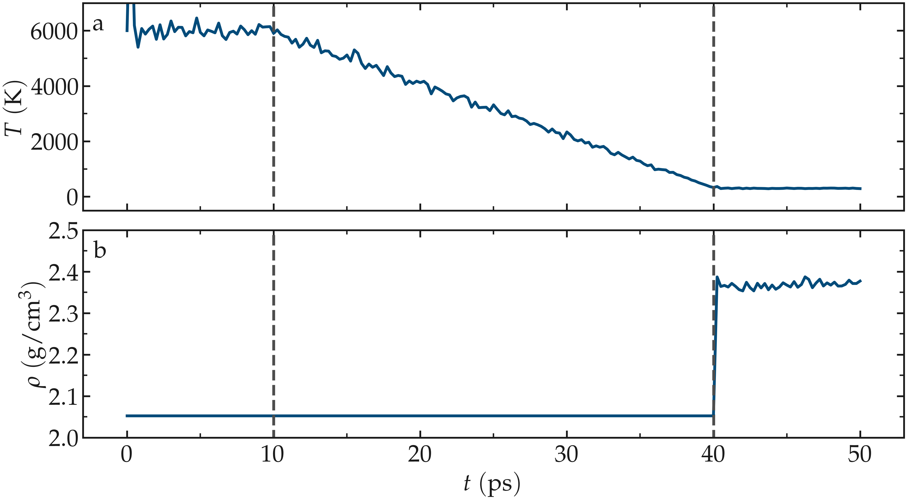

Generation of the silica block
==============================

To begin this tutorial, if you are using LAMMPS--GUI, select ``Start Tutorial 6``
from the ``Tutorials`` menu and follow the instructions. Alternatively, if you are
not using LAMMPS--GUI, create a new folder and add a file named
**generate.lmp**. Open the file in a text editor and paste in the following
content:

.. code-block:: lammps

    units metal
    boundary p p p
    atom_style full
    pair_style vashishta
    neighbor 1.0 bin
    neigh_modify delay 1

The main difference from some of the previous tutorials is the use of the ``Vashishta``
pair style.  The Vashishta potential implicitly models atomic bonds through
energy terms dependent on interatomic distances and angles :cite:`vashishta1990interaction`.

.. include:: ../shared/needhelp.rst

Let us create a box for two atom types, ``Si``
of mass 28.0855 g/mol and ``O`` of mass 15.9994 g/mol.
Add the following lines to **generate.lmp**:

.. code-block:: lammps
        
    region box block -18.0 18.0 -9.0 9.0 -9.0 9.0
    create_box 2 box
    labelmap atom 1 Si 2 O
    mass Si 28.0855
    mass O 15.9994
    create_atoms Si random 240 5802 box overlap 2.0 maxtry 500
    create_atoms O random 480 1072 box overlap 2.0 maxtry 500

The ``create_atoms`` commands are used to place
240 Si atoms and 480 O atoms, respectively.  This corresponds to
an initial density of approximately :math:`2 \, \text{g/cm}^3`, which is close
to the expected final density of amorphous silica at 300 K.

Now, specify the pair coefficients by indicating that the first atom type
is ``Si`` and the second is ``O``:

.. code-block:: lammps

    pair_coeff * * SiO.1990.vashishta Si O

Ensure that the |SiO_1990_vashishta_6| file is located in the same directory as **generate.lmp**.

.. |SiO_1990_vashishta_6| raw:: html

    <a href="https://raw.githubusercontent.com/lammpstutorials/lammpstutorials-inputs/refs/heads/main/tutorial6/SiO.1990.vashishta" target="_blank">SiO.1990.vashishta</a>

Next, add a ``dump image`` command to **generate.lmp** to follow the
evolution of the system with time:

.. code-block:: lammps

    dump viz all image 250 myimage-*.ppm type type shiny 0.1 box no 0.01 view 180 90 zoom 3.4 size 1700 700
    dump_modify viz backcolor white acolor Si yellow adiam Si 2.5 acolor O red adiam O 2

..  container:: figurelegend

    Figure: Amorphous silica (:math:`\text{SiO}_2`). Silicon atoms are
    represented in yellow, and oxygen atoms in red.

Let us also print the box volume and system density, alongside the
temperature and total energy:

.. code-block:: lammps

    thermo 250
    thermo_style custom step temp etotal vol density

Finally, let us implement the annealing procedure which
consists of three consecutive runs.  This procedure was inspired
by Ref. :cite:`della1992molecular`.  First, to melt the system,
a :math:`10\,\text{ps}` phase at :math:`T = 6000\,\text{K}` is performed:

.. code-block:: lammps

    velocity all create 6000 8289 rot yes dist gaussian
    fix mynvt all nvt temp 6000 6000 0.1
    timestep 0.001
    run 10000

Next, a second phase, during which the system is cooled down from :math:`T = 6000\,\text{K}`
to :math:`T = 300\,\text{K}`, is implemented as follows:

.. code-block:: lammps

    fix mynvt all nvt temp 6000 300 0.1
    run 30000

In the third step, the system is equilibrated at the final desired
conditions, :math:`T = 300\,\text{K}` and :math:`p = 1\,\text{atm}`,
using an anisotropic pressure coupling:

.. code-block:: lammps

    unfix mynvt

    fix mynpt all npt temp 300 300 0.1 aniso 1 1 1
    run 10000

    write_data generate.data

Here, an anisotropic barostat is used.
Anisotropic barostats adjust the dimensions independently, which is
generally suitable for a solid phase.

Run the simulation using LAMMPS.  From the ``Charts`` window, the temperature
evolution can be observed, showing that it closely follows the desired annealing procedure.
The evolution of the box dimensions over time confirms that the box is deforming during the
last stage of the simulation.  After the simulation completes, the final LAMMPS topology
file called **generate.data** will be located next to **generate.lmp**.

.. figure:: figures/GCMC-dimension-dm.png
    :class: only-dark
    :alt: Temperature and density of the silicon

..  container:: figurelegend

    Figure: a) Temperature, :math:`T`, as a function of time, :math:`t`, during the annealing
    of the silica system.  b) System density, :math:`\rho`, during the annealing process.  The vertical dashed lines
    mark the transition between the different phases of the simulation.

Cracking the silica
===================

Create a new file called **cracking.lmp**, and copy the following familiar lines:

.. code-block:: lammps

    units metal
    boundary p p p
    atom_style full
    pair_style vashishta
    neighbor 1.0 bin
    neigh_modify delay 1

    read_data generate.data

    pair_coeff * * SiO.1990.vashishta Si O

    dump viz all image 250 myimage-*.ppm type type shiny 0.1 box no 0.01 view 180 90 zoom 3.4 size 1700 700
    dump_modify viz backcolor white acolor Si yellow adiam Si 2.5 acolor O red adiam O 2

    thermo 250
    thermo_style custom step temp etotal vol density

.. admonition:: If you are using LAMMPS-GUI
    :class: gui

    Open the **cracking.lmp** file.

Let us progressively increase the size of the box in the :math:`x` direction,
forcing the silica to deform and eventually crack.  To achive this,
the ``fix deform`` command is used, with a rate
of :math:`0.005\,\text{ps}^{-1}`.  Add the following lines to
the **cracking.lmp** file:

.. code-block:: lammps

    timestep 0.001
    fix nvt1 all nvt temp 300 300 0.1
    fix mydef all deform 1 x erate 0.005
    run 50000

    write_data cracking.data

The ``fix nvt`` command integrates the Nosé-Hoover equations
of motion and is employed to control the temperature of the system.
As observed from the generated images, the atoms
progressively adjust to the changing box dimensions.  At some point,
bonds begin to break, leading to the appearance of
dislocations.

.. admonition:: Note
    :class: non-title-info

    Although the Nosé-Hoover equations were originally formulated to sample the
    NVT ensemble, using the ``fix nvt`` command does not guarantee that 
    a simulation actually samples the NVT ensemble.

.. figure:: figures/cracked-dark.png
    :class: only-dark
    :alt: Amorphous cracked silica block

.. figure:: figures/cracked-light.png
    :class: only-light
    :alt: Amorphous cracked silica block

..  container:: figurelegend

    Figure: Block of silica after deformation.  Silicon atoms are represented in yellow,
    and oxygen atoms in red.  The crack was induced by the
    imposed deformation of the box along the :math:`x`-axis (i.e., the horizontal axis).

Adding water
============

To add the water molecules to the silica, we will employ the Monte Carlo
method in the grand canonical ensemble (GCMC).  In short, the system is
placed into contact with a virtual reservoir of a given chemical
potential :math:`\mu`, and multiple attempts to insert water molecules at
random positions are made.  Each attempt is either accepted or rejected
based on energy considerations.  For further details, please refer to
classical textbooks like Ref. :cite:`frenkel2023understanding`.

Adapting the pair style
-----------------------

For this next step, we need to define the parameters for the water molecules and
the cross-interactions between water and silica. The TIP4P/2005 model is employed
for the water :cite:`abascal2005general`, while no specific parameters are set
for the silica itself. The atoms of the silica will remain frozen during this part.
Only the cross-interactions between water and silica need
to be defined. Create a new file called **gcmc.lmp**, and copy the following
lines into it:

.. code-block:: lammps

    units metal
    boundary p p p
    atom_style full
    neighbor 1.0 bin
    neigh_modify delay 1
    pair_style lj/cut/tip4p/long OW HW OW-HW HW-OW-HW 0.1546 10
    kspace_style pppm/tip4p 1.0e-5
    bond_style harmonic
    angle_style harmonic

.. admonition:: If you are using LAMMPS-GUI
    :class: gui

    Open the **gcmc.lmp** file.

The PPPM solver :cite:`luty1996calculating` is specified with the ``kspace``
command, and is used to compute the long-range Coulomb interactions associated
with ``tip4p/long``.  Finally, the style for the bonds
and angles of the water molecules are defined; however, these specifications are
not critical since TIP4P/2005 is a rigid water model.

.. admonition:: Note
    :class: non-title-info

    In practice, it is possible to use both ``vashishta`` and
    ``lj/cut/tip4p/long`` pair styles by employing the ``pair_style hybrid``
    command.  However, hybridizing force fields should be done with caution, as there
    is no guarantee that the resulting force field will produce meaningful results.

The water molecule template called |H2O_mol_6|
must be downloaded and located next to **gcmc.lmp**.

.. |H2O_mol_6| raw:: html

    <a href="https://raw.githubusercontent.com/lammpstutorials/lammpstutorials-inputs/refs/heads/main/tutorial6/H2O.mol" target="_blank">H2O.mol</a>

Before going further, we need to make a few changes to our data file.
Currently, the **cracking.data** file includes only two atom types, but we require four.
Copy the previously generated **cracking.data**, and name the duplicate **cracking-mod.data**.
Make the following changes to the beginning of **cracking-mod.data**
to ensure it matches the following format (with 4 atom types,
1 bond type, 1 angle type, the proper type labels, and four masses):

.. code-block:: lammps
        
    720 atoms
    4 atom types
    1 bond types
    1 angle types

    2 extra bond per atom
    1 extra angle per atom
    2 extra special per atom

    -22.470320800269317 22.470320800269317 xlo xhi
    -8.579178758211475 8.579178758211475 ylo yhi
    -8.491043517346204 8.491043517346204 zlo zhi

    Atom Type Labels

    1 Si
    2 O
    3 OW
    4 HW

    Bond Type Labels

    1 OW-HW

    Angle Type Labels

    1 HW-OW-HW

    Masses

    1 28.0855
    2 15.9994
    3 15.9994
    4 1.008

    Atoms # full

    (...)

Doing so, we anticipate that there will be 4 atom types in the simulations,
with the oxygens and hydrogens of :math:`\text{H}_2\text{O}` having
types ``OW`` and ``HW``, respectively.  There
will also be 1 bond type (``OW-HW``) and 1 angle type (``OW-HW-HW``).
The ``extra bond``, ``extra angle``, and
``extra special`` lines are here for memory allocation.

We can now proceed to complete the **gcmc.lmp** file by adding the system definition:

.. code-block:: lammps

    read_data cracking-mod.data
    molecule h2omol H2O.mol
    create_atoms 0 random 3 3245 NULL mol h2omol 4585 overlap 2.0 maxtry 50

    group SiO type Si O
    group H2O type OW HW

After reading the data file and defining the ``h2omol`` molecule from the **H2O.mol**
file, the ``create_atoms`` command is used to include three water molecules
in the system.  Then, add the following ``pair_coeff`` (and
``bond_coeff`` and ``angle_coeff``) commands
to **gcmc.lmp**:

.. code-block:: lammps
        
    pair_coeff * * 0 0
    pair_coeff Si OW 0.0057 4.42
    pair_coeff O OW 0.0043 3.12
    pair_coeff OW OW 0.008 3.1589
    pair_coeff HW HW 0.0 0.0
    bond_coeff OW-HW 0 0.9572
    angle_coeff HW-OW-HW 0 104.52

Pair coefficients for the ``lj/cut/tip4p/long``
potential are defined between O(:math:`\text{H}_2\text{O}`) and between H(:math:`\text{H}_2\text{O}`)
atoms, as well as between O(:math:`\text{SiO}_2`)-O(:math:`\text{H}_2\text{O}`) and
Si(:math:`\text{SiO}_2`)-O(:math:`\text{H}_2\text{O}`).  Thus, the fluid-fluid and the
fluid-solid interactions will be adressed with by the ``lj/cut/tip4p/long`` potential.
The ``bond_coeff`` and ``angle_coeff`` commands set the ``OW-HW``
bond length to 0.9572 Å, and the ``HW-OW-HW``
angle to :math:`104.52^\circ`, respectively :cite:`abascal2005general`.

.. admonition:: Note
    :class: non-title-info

    The pair coefficients for interactions between Si(:math:`\text{SiO}_2`)
    and O(:math:`\text{SiO}_2`) are set by the first command, ``pair_coeff * * 0 0``,
    which effectively means that they do not interact. This is acceptable here because
    the silica atoms remain frozen during this part of the tutorial.

Add the following lines to **gcmc.lmp** as well:

.. code-block:: lammps

    variable oxygen atom type==label2type(atom,OW)
    group oxygen dynamic all var oxygen
    variable nO equal count(oxygen)

    fix shak H2O shake 1.0e-5 200 0 b OW-HW a HW-OW-HW mol h2omol

The number of oxygen atoms from water molecules (i.e. the number of molecules)
is calculated by the ``nO`` variable.  The SHAKE algorithm is used to
maintain the shape of the water molecules over time :cite:`ryckaert1977numerical, andersen1983rattle`.

Finally, let us create images
of the system using ``dump image``:

.. code-block:: lammps

    dump viz all image 250 myimage-*.ppm type type &
    shiny 0.1 box no 0.01 view 180 90 zoom 3.4 size 1700 700
    dump_modify viz backcolor white &
    acolor Si yellow adiam Si 2.5 &
    acolor O red adiam O 2 &
    acolor OW cyan adiam OW 2 &
    acolor HW white adiam HW 1

GCMC simulation
---------------

To prepare for the GCMC simulation, let us add the
following lines into **gcmc.lmp**:

.. code-block:: lammps

    compute ctH2O H2O temp
    compute_modify thermo_temp dynamic/dof yes
    compute_modify ctH2O dynamic/dof yes
    fix mynvt H2O nvt temp 300 300 0.1
    fix_modify mynvt temp ctH2O
    timestep 0.001

Here, the ``fix nvt`` applies only to the water molecules, so
the atoms in the silica remain fixed.  The ``compute_modify`` command with
the ``dynamic/dof yes`` option is used for water to account for the fact
that the number of molecules is not constant.

Finally, let us use the ``fix gcmc`` and perform the grand canonical Monte
Carlo steps.  Add the following lines into **gcmc.lmp**:

.. code-block:: lammps
        
    variable tfac equal 5.0/3.0
    fix fgcmc H2O gcmc 100 100 0 0 65899 300 -0.5 0.1 mol h2omol tfac_insert ${tfac} shake shak full_energy pressure 100

The ``fix gcmc`` command performs grand canonical Monte Carlo
moves to insert, delete, or swap molecules. Here, 100 attempts are made every
100 steps.  The ``mol h2omol`` keyword specifies the
molecule type being inserted/deleted, while ``shake shak`` enforces rigid
molecular constraints during these moves. With the ``pressure 100`` keyword,
a fictitious reservoir with a pressure of 100 atmospheres is used.
The ``tfac_insert`` option ensures the correct estimate for the temperature
of the inserted water molecules by taking into account the internal degrees of
freedom.

.. admonition:: Note
    :class: non-title-info
        
    At a pressure of :math:`p = 100\,\text{bar}`, the chemical potential of water vapor at :math:`T = 300\,\text{K}`
    can be calculated using as :math:`\mu = \mu_0 + RT \ln (\frac{p}{p_0}),` where :math:`\mu_0` is the standard
    chemical potential (typically taken at a pressure :math:`p_0 = 1 \, \text{bar}`), :math:`R = 8.314\, \text{J/mol·K}`
    is the gas constant, :math:`T = 300\,\text{K}` is the temperature.

Finally, let us print some information and run for 25 ps:

.. code-block:: lammps

    thermo 250
    thermo_style custom step temp etotal v_nO f_fgcmc[3] f_fgcmc[4] f_fgcmc[5] f_fgcmc[6]

    run 25000

The ``f_`` keywords extract the Monte Carlo move statistics output by the
``fix gcmc`` command.

.. admonition:: Note
    :class: non-title-info
        
    When using the pressure argument, LAMMPS ignores the value of the
    chemical potential (here :math:`\mu = -0.5\,\text{eV}`, which corresponds roughly to
    ambient conditions, i.e. to a relative humidity :math:`\text{RH} \approx 50\,\%` :cite:`gravelle2020multi`.)
    The large pressure value of 100 bars was chosen to ensure that some successful
    insertions of molecules would occur during the short duration of this simulation.

.. figure:: figures/GCMC-number-dm.png
    :class: only-dark
    :alt: Number of water molecules from GCMC somulations

.. figure:: figures/GCMC-number.png
    :class: only-light
    :alt: Number of water molecules from GCMC somulations

..  container:: figurelegend

    Figure: Number of water molecules, :math:`N_\text{H2O}`, as a function of time, :math:`t`.

Running this simulation using LAMMPS, one can see that
after a few GCMC steps, the number of molecules starts increasing.  Once the
crack is filled with water molecules, the total number of molecules reaches a plateau.  The final number of
molecules depends on the imposed pressure, temperature, and the interaction
between water and silica (i.e. its hydrophilicity).  Note that GCMC simulations
of such dense phases are usually slow to converge due to the very low probability
of successfully inserting a molecule.  Here, the short simulation duration was
made possible by the use of a high pressure.

.. figure:: figures/solvated-dark.png
    :class: only-dark
    :alt: Amorphous cracked silica block solvated with water

.. figure:: figures/solvated-light.png
    :class: only-light
    :alt: Amorphous cracked silica block solvated with water

..  container:: figurelegend

    Figure: Snapshot of the silica system after the adsorption of water molecules.
    The oxygen atoms of the water molecules are represented in cyan, the silicon
    atoms in yellow, and the oxygen atoms of the solid in red.