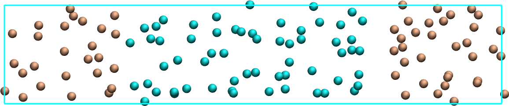
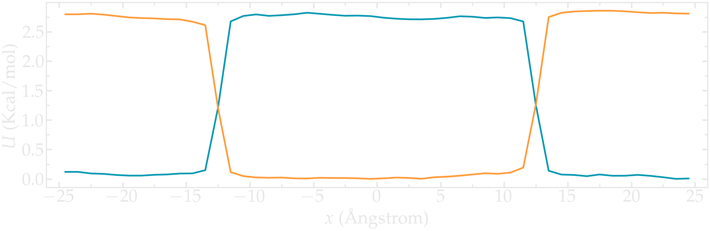
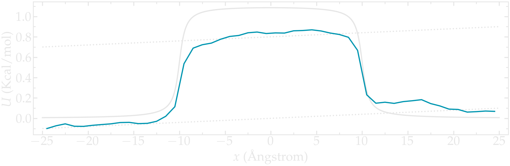
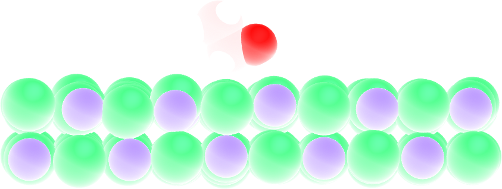
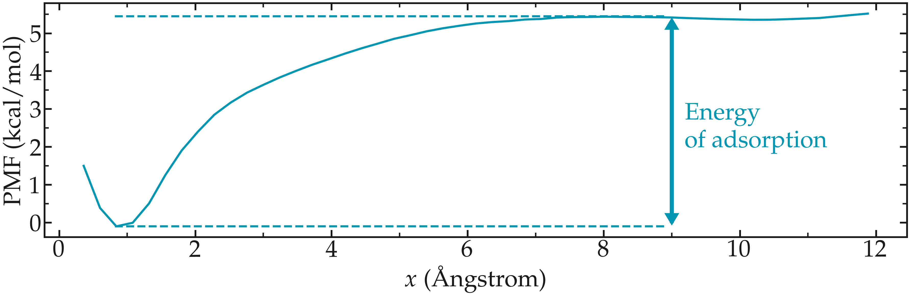
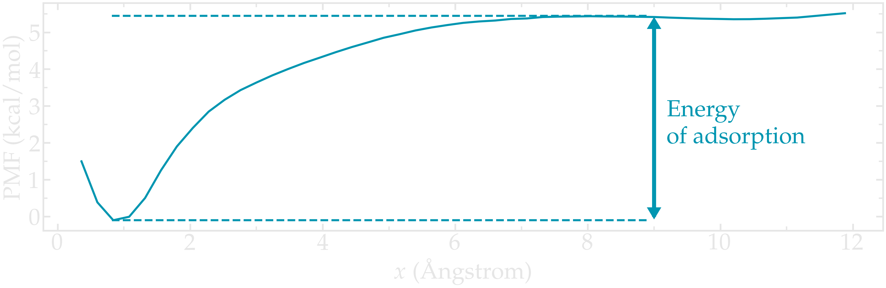

Going further with exercises
============================

The binary fluid that won't mix
-------------------------------

**1 - Create the system**

Create a molecular simulation with two species of respective types 1 and 2.
Apply different potentials :math:`U1` and :math:`U2` on particles of
types 1 and 2, respectively, so that particles of type 1 are excluded
from the center of the box, while at the same time particles
of type 2 are excluded from the rest of the box.

.. figure:: figures/exercice2-dark.png
    :alt: Particles of type 1 and 2 separated by two different potentials
    :class: only-dark

..  container:: figurelegend

    Figure: Particles of type 1 and 2 separated by two different potentials.

**2 - Measure the PMFs**

Using the same protocol as the one used in the tutorial
(i.e. umbrella sampling with the wham algorithm),
extract the PMF for each particle type.

.. figure:: figures/exercice-binary-light.png
    :alt: PMF in the presence of binary species
    :class: only-light

..  container:: figurelegend

    Figure: PMFs calculated for both atom types. 

Particles under convection
--------------------------

Use a similar simulation as the one from the tutorial,
with a repulsive potential in the center
of the box. Add force to the particles
and force them to flow in the :math:`x` direction.

Re-measure the potential in the presence of the flow, and observe the difference
with the reference case in the absence of flow.

.. figure:: figures/exercice-convection-light.png
    :alt: PMF in the presence of forcing
    :class: only-light

..  container:: figurelegend

    Figure: PMF calculated in the presence of a net force that is inducing
    the convection of the particles from left to right. 

Surface adsorption of a molecule
--------------------------------

Apply umbrella sampling to calculate the free energy profile
of ethanol in the direction normal to a crystal solid surface
(here made of sodium chloride). Find the |topology-ethanol|
and |parameter-ethanol|.

.. |topology-ethanol| raw:: html

   <a href="../../../../../lammpstutorials-inputs/level3/free-energy-calculation/Exercises/MoleculeAdsorption/init.data" target="_blank">topology files</a>

.. |parameter-ethanol| raw:: html

   <a href="../../../../../lammpstutorials-inputs/level3/free-energy-calculation/Exercises/MoleculeAdsorption/PARM.lammps" target="_blank">parameter file</a>

Use the following lines for starting the *input.lammps*:

..  code-block:: lammps

    units real # style of units (A, fs, Kcal/mol)
    atom_style full # molecular + charge
    bond_style harmonic
    angle_style harmonic
    dihedral_style harmonic
    boundary p p p # periodic boundary conditions
    pair_style lj/cut/coul/long 10 # cut-off 1 nm
    kspace_style pppm 1.0e-4
    pair_modify mix arithmetic tail yes

The PMF normal to a solid wall serves to indicate the free energy of adsorption,
which can be calculated from the difference between the PMF far
from the surface, and the PMF at the wall.

.. figure:: figures/ethanol-light.png
    :alt: Ethanol molecule next to NaCl
    :class: only-light

..  container:: figurelegend

    Figure: A single ethanol molecule next to a crystal NaCl(100) wall.

The PMF shows a minimum near the solid surface, which indicates a good
affinity between the wall and the molecule.

..  container:: figurelegend

    Figure: PMF for a single ethanol molecule next to a NaCl
    solid surface. The position of the wall is in :math:`x=0`.
    The arrow highlights the difference between the energy of the 
    molecule when adsorbed to the solid surface, and
    the energy far from the surface. This difference corresponds to the
    free energy of adsorption.

Alternatively to using ethanol, feel free to download the molecule of your choice, for 
instance from the Automated Topology Builder (ATB). Make your life simpler
by choosing a small molecule like CO2.
