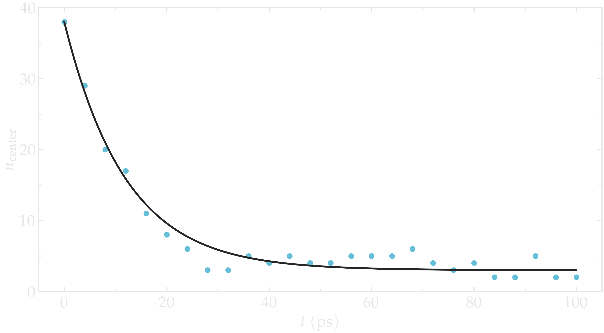

.. admonition:: What is free energy
    :class: info

    The *free energy* refers to the potential energy of a system that
    is available to perform work. In molecular simulations, it is
    common to calculate free energy differences between different states
    or conformations of a molecular system. This can be useful in understanding
    the thermodynamics of a system, predicting reaction pathways, and
    determining the stability of different molecular configurations.

Method 1: Free sampling
=======================

The most direct way to estimate a free energy profile is to sample
the Boltzmann distribution using a classical (i.e.unbiased) molecular dynamics
simulation, and compute relative Gibbs free energies from the relative probabilities
of states using

.. math::
    :label: eq_G

    \Delta G = -RT \ln(\rho/\rho_0),

where :math:`\Delta G` is the free energy difference, :math:`R` is the gas constant, :math:`T`
is the temperature, :math:`\rho` is the density, and :math:`\rho_0` is a reference density.
As an illustration, let us apply this method to a simple configuration
that consists of a particles in a box in the presence of a
position-dependent repulsive force that makes the center of the box a less
favorable area to explore.

.. include:: ../shared/needhelp.rst

Basic LAMMPS parameters
-----------------------

To begin this tutorial, if you are using LAMMPS--GUI, select ``Start Tutorial 7``
from the ``Tutorials`` menu and follow the instructions. Alternatively, if you are
not using LAMMPS--GUI, create a new folder and add a file named
**free-sampling.lmp**. Open the file in a text editor and paste in the following
content:

.. code-block:: lammps

    variable sigma equal 3.405
    variable epsilon equal 0.238
    variable U0 equal 1.5*${epsilon}
    variable dlt equal 1.0
    variable x0 equal 10.0

    units real
    atom_style atomic
    pair_style lj/cut $(2^(1/6)*v_sigma)
    pair_modify shift yes
    boundary p p p

Here, we begin by defining variables for the Lennard-Jones interaction
:math:`\sigma` and :math:`\epsilon` and for the repulsive potential
:math:`U`, which are :math:`U_0`, :math:`\delta`, and
:math:`x_0` [see Eqs. :eq:`eq_U`-:eq:`eq_F` below].  The cut-off value of
:\math:`2^{1/6} \sigma = 3.822` was chosen to create a Weeks-Chandler-Andersen
(WCA) potential, which is a truncated and purely repulsive LJ potential :cite:`weeks1971role`. 
The potential is also shifted to be equal to 0 at the cut-off
using the ``pair_modify`` command.

.. admonition:: Note
    :class: non-title-info

    The syntax ``$(...)``, where a dollar sign is followed by parentheses, allows
    you to evaluate a numeric formula immediately, without having to assign it
    to a named variable first.

System creation and settings
----------------------------

Let us define the simulation box and randomly add atoms by addying the
following lines to **free-sampling.lmp**:

.. code-block:: lammps

    region myreg block -50 50 -15 15 -50 50
    create_box 1 myreg
    create_atoms 1 random 200 34134 myreg overlap 3 maxtry 50

    mass * 39.95
    pair_coeff * * ${epsilon} ${sigma}

The variables :math:`U_0`, :math:`\delta`, and :math:`x_0`, defined in the previous subsection, are
used here to create the repulsive potential, restricting the atoms from exploring
the center of the box:

.. math::
    :label: eq_U

    U = U_0 \left[ \arctan \left( \dfrac{x+x_0}{\delta} \right)
    - \arctan \left(\dfrac{x-x_0}{\delta} \right) \right].

Taking the derivative of the potential with respect to :math:`x`, we obtain the expression
for the force that will be imposed on the atoms:

.. math::
    :label: eq_F

    F = \dfrac{U_0}{\delta} \left[ \dfrac{1}{(x-x_0)^2/\delta^2+1}
    - \dfrac{1}{(x+x_0)^2/\delta^2+1} \right].

The figure below shows the potential :math:`U` and force :math:`F` along the :math:`x`-axis.
With :math:`U_0 = 1.5 \epsilon = 0.36\,\text{kcal/mol},` :math:`U_0` is of the same order of magnitude as the
thermal energy :math:`k_\text{B} T = 0.24\,\text{kcal/mol}`, where :math:`k_\text{B} = 0.002\,\text{kcal/mol/K}`
is the Boltzmann constant and :math:`T = 119.8\,\text{K}` is the temperature
used in this simulation.  Under these conditions, particles are expected to
frequently overcome the energy barrier due to thermal agitation.

.. figure:: figures/US-potential-dm.png
    :class: only-dark
    :alt: Potential imporsed to the atoms

..  container:: figurelegend

    Figure: Potential :math:`U` given in Eq. :eq:`eq_U` (a) and force :math:`F` given in
    Eq. :eq:`eq_F` (b) as functions of the coordinate :math:`x`. Here,
    :math:`U_0 = 0.36~\text{kcal/mol}`, :math:`\delta = 1.0~\text{Å}`, and :math:`x_0 = 10~\text{Å}`.

We impose the force :math:`F(x)` to the atoms in the simulation
using the ``fix addforce`` command.  Add the following
lines to **free-sampling.lmp**:

.. code-block:: lammps
        
    variable U atom ${U0}*atan((x+${x0})/${dlt})-${U0}*atan((x-${x0})/${dlt})
    variable F atom ${U0}/((x-${x0})^2/${dlt}^2+1)/${dlt}-${U0}/((x+${x0})^2/${dlt}^2+1)/${dlt}
    fix myadf all addforce v_F 0.0 0.0 energy v_U

Next, we combine the ``fix nve`` with a ``fix langevin`` thermostat:

.. code-block:: lammps

    fix mynve all nve
    fix mylgv all langevin 119.8 119.8 500 30917

When combining these two commands, the MD simulation operates
in the NVT ensemble, maintaining a constant number of
atoms :math:`N`, constant volume :math:`V`, and a temperature :math:`T` that
fluctuates around a target value.

To ensure that the equilibration time is sufficient, we will track the evolution of
the number of atoms in the central - energetically unfavorable - region,
referred to as ``mymes``, using the ``n_center`` variable:

.. code-block:: lammps

    region mymes block -${x0} ${x0} INF INF INF INF
    variable n_center equal count(all,mymes)
    thermo_style custom step temp etotal v_n_center
    thermo 10000

For visualization, use one of the following options: the ``dump image`` command to
create .ppm images of the system, or the ``dump atom`` command to write a
VMD-compatible trajectory to a file:

.. code-block:: lammps

    # Option 1
    dump viz1 all image 50000 myimage-*.ppm type type shiny 0.1 box yes 0.01 view 180 90 zoom 6 size 1600 500 fsaa yes
    dump_modify viz1 backcolor white acolor 1 cyan adiam 1 3 boxcolor black

    # Option 2
    dump viz2 all atom 50000 free-sampling.lammpstrj

Finally, let us perform an equilibration of 50000 steps,
using a timestep of :math:`2\,\text{fs}`, corresponding to a total duration of :math:`100\,\text{ps}`:

.. code-block:: lammps

    timestep 2.0
    run 50000

Run the simulation with LAMMPS.  The number of atoms in the
central region, :math:`n_\mathrm{center}`, reaches its equilibrium value after approximately :math:`40\,\text{ps}`.

.. figure:: figures/US-density-evolution.png
    :class: only-light
    :alt: Evolution of the number of atoms

..  container:: figurelegend

    Figure: Evolution of the number of atoms :math:`n_\text{center}` in the central
    region ``mymes`` as a function of time :math:`t` during equilibration.  The dark line
    is :math:`n_\text{center} = 22 \exp(-t/160)+5` and serves as a guide for the eyes.
    Here, :math:`U_0 = 0.36~\text{kcal/mol}`, :math:`\delta = 1.0~\text{Å}`, and :math:`x_0 = 10~\text{Å}`.

Run and data acquisition
------------------------

Once the system is equilibrated, we will record the density profile of
the atoms along the :math:`x`-axis using the ``ave/chunk`` command.
Add the following line to **free-sampling.lmp**:

.. code-block:: lammps

    # undump viz2 # Uncomment this line if you're using Option 2
    reset_timestep 0

    thermo 200000

    compute cc1 all chunk/atom bin/1d x 0.0 2.0
    fix myac all ave/chunk 100 20000 2000000 cc1 density/number file free-sampling.dat

    run 2000000

The step count is reset to 0 using ``reset_timestep`` to synchronize it
with the output times of ``fix density/number``.  Run the simulation using
LAMMPS.

..  container:: figurelegend

    Figure: Snapshot of the system simulated during the free sampling step of the tutorial.
    The atoms density is the lowest in the central part of the box, ``mymes``.  Here,
    :math:`U_0 = 0.36~\text{kcal/mol}`, :math:`\delta = 1.0~\text{Å}`, and :math:`x_0 = 10~\text{Å}`.

Data analysis
-------------

Once the simulation is complete, the density profile from **free-sampling.dat**
shows that the density in the center of the box is
about two orders of magnitude lower than inside the reservoir.
Next, we plot :math:`-R T \ln(\rho/\rho_\mathrm{bulk})`, where :math:`\rho/\rho_\mathrm{bulk}`
is the the density ratio,  and compare it
with the imposed potential :math:`U` from Eq. :eq:`eq_U`.
The reference density, :math:`\rho_\text{bulk} = 0.0009~\text{Å}^{-3}`,
was estimated by measuring the density of the reservoir from the raw density
profiles.  The agreement between the MD results and the imposed energy profile
is excellent, despite some noise in the central part, where fewer data points
are available due to the repulsive potential.

.. figure:: figures/US-density-dm.png
    :class: only-dark
    :alt: Density from umbrella sampling simulations

..  container:: figurelegend

    Figure: a) Fluid density, :math:`\rho`, along the :math:`x` direction. b) Potential, :math:`U`, as a
    function of :math:`x` measured using free sampling (disks)
    compared to the imposed potential given in Eq. :eq:`eq_U` (line).
    Here, :math:`U_0 = 0.36~\text{kcal/mol}`, :math:`\delta = 1.0~\text{Å}`, :math:`x_0 = 10~\text{Å}`,
    and the measured reference density in the reservoir is :math:`\rho_\text{bulk} = 0.0009~\text{Å}^{-3}`.

The limits of free sampling
---------------------------

Increasing the value of :math:`U_0` reduces the average number of atoms in the central
region, making it difficult to achieve a high-resolution free energy profile.
For example, running the same simulation with :math:`U_0 = 10 \epsilon`,
corresponding to :math:`U_0 \approx 10 k_\text{B} T`, results in no atoms exploring
the central part of the simulation box during the simulation.
In such a case, employing an enhanced sampling method is recommended, as done in the next section.

Method 2: Umbrella sampling
===========================

Umbrella sampling is a biased molecular dynamics method in which
additional forces are added to a chosen atom to force it to explore the
more unfavorable areas of the system
:cite:`kastner2011umbrella, allen2017computer, frenkel2023understanding`.
Here, to encourage one
of the atoms to explore the central region of the box, we apply a
potential :math:`V` and force it to move along the :math:`x`-axis. The chosen path
is called the axis of reaction. Several simulations (called windows)
will be conducted with varying positions for the center of the applied
biasing. The results will be analyzed using the weighted histogram
analysis method (WHAM) :cite:`kumar1992weighted,kumar1995multidim`, which
allows for the removal of the biasing effect and ultimately deduces the
unbiased free energy profile.

LAMMPS input script
-------------------

If you are using LAMMPS--GUI, open the file named **umbrella-sampling.lmp**.  
Alternatively, if you are not using LAMMPS--GUI, create a new input file  
and paste in the following content:

.. code-block:: lammps

    variable sigma equal 3.405
    variable epsilon equal 0.238
    variable U0 equal 10*${epsilon}
    variable dlt equal 1.0
    variable x0 equal 10
    variable k equal 0.5

    units real
    atom_style atomic
    pair_style lj/cut $(2^(1/6)*v_sigma)
    pair_modify shift yes
    boundary p p p

The first difference from the previous case is the larger value
for the repulsive potential :math:`U_0`, which makes the central area
of the system very unlikely to be visited by free particles.  The second
difference is the introduction of the variable :math:`k`, which will be used for
the biasing potential.

Let us create a simulation box with two atom types, including a single particle of type 2,
by adding the following lines to **umbrella-sampling.lmp**:

.. code-block:: lammps

    region myreg block -50 50 -15 15 -50 50
    create_box 2 myreg
    create_atoms 2 single 0 0 0
    create_atoms 1 random 199 34134 myreg overlap 3 maxtry 50

Next, we assign the same mass and LJ parameters to both atom types
1 and 2, and place the atoms of type 2 into a group named ``topull``:

.. code-block:: lammps

    mass * 39.948
    pair_coeff * * ${epsilon} ${sigma}
    group topull type 2

Then, the same potential :math:`U` and force :math:`F` are applied to all the atoms,
together with the same ``fix nve`` and ``fix langevin`` commands:

.. code-block:: lammps

    variable U atom ${U0}*atan((x+${x0})/${dlt})-${U0}*atan((x-${x0})/${dlt})
    variable F atom ${U0}/((x-${x0})^2/${dlt}^2+1)/${dlt}-${U0}/((x+${x0})^2/${dlt}^2+1)/${dlt}
    fix myadf all addforce v_F 0.0 0.0 energy v_U

    fix mynve all nve
    fix mylgv all langevin 119.8 119.8 500 30917

Next, we perform a brief equilibration to prepare for the
umbrella sampling run:

.. code-block:: lammps

    thermo 5000

    # Option 1
    dump viz1 all image 50000 myimage-*.ppm type type shiny 0.1 box yes 0.01 view 180 90 zoom 6 size 1600 500 fsaa yes
    dump_modify viz1 backcolor white acolor 1 cyan acolor 2 red adiam 1 3 adiam 2 3 boxcolor black

    # Option 2
    dump viz2 all atom 50000 umbrella-sampling.lammpstrj

    timestep 2.0
    run 50000

So far, our code resembles that of Method 1, except for the additional particle
of type 2.  Particles of types 1 and 2 are identical, with the same mass
and LJ parameters.  However, the particle of type 2 will also
be exposed to the biasing potential :math:`V`, which forces it to explore the
central part of the box.

.. 
    TOFIX: Add a figure with one single particle exploring the central part of the system.
    Add FIGURE US-system-biased Snapshot of the system simulated during the umbrella sampling
    step of \hyperref[umbrella-sampling-label]{Tutorial 7}, showing type-1 atoms
    in cyan and the type-2 atom in red.  Only the type-2 atom explores the central part of the box,
    ``mymes``, due to the additional biasing potential :math:`V`. Parmaeters are
    :math:`U_0 = 2.38~\text{kcal/mol}`, :math:`\delta = 1.0~\text{Å}`, and :math:`x_0 = 10~\text{Å}`.

Now, we create a loop with 15 steps and progressively move the center of the
bias potential by increments of 0.4 nm.  Add the following lines to **umbrella-sampling.lmp**:

.. code-block:: lammps

    variable a loop 25
    label loop

    variable xdes equal 4*${a}-32
    variable xave equal xcm(topull,x)
    fix mytth topull spring tether ${k} ${xdes} 0 0 0

    run 20000

    fix myat1 all ave/time 10 10 100 v_xave v_xdes file umbrella-sampling.${a}.dat

    run 200000
    unfix myat1
    next a
    jump SELF loop

The ``spring`` command imposes the additional harmonic potential :math:`V` with
the previously defined spring constant :math:`k`.  The center of the harmonic
potential, :math:`x_\text{des}`, successively takes values
from :math:`-28\,\text{Å}` to :math:`28\,\text{Å}`.  For each value of :math:`x_\text{des}`,
an equilibration step of 40 ps is performed, followed by a step
of 400 ps during which the position of the particle of
type 2 along the :math:`x`-axis, :math:`x_\text{ave}`, is saved in data files named **umbrella-sampling.i.dat**,
where :math:`i` ranges from 1 to 15.  Run the **umbrella-sampling.lmp** file using LAMMPS.

.. admonition:: Note
    :class: non-title-info
        
    The value of :math:`k` should be chosen with care:
    if :math:`k` is too small the particle won't follow the biasing potential,
    and if :math:`k` is too large there will be no overlapping between
    the different windows, leading to poor reconstruction of the free energy profile.
    See the section :ref:`side-note-k`.

WHAM algorithm
--------------

To generate the free energy profile from the particle positions saved in
the **umbrella-sampling.i.dat** files, we use the
WHAM :cite:`kumar1992weighted,kumar1995multidim` algorithm as implemented
by Alan Grossfield :cite:`grossfieldimplementation`.  You can download it
from |Alan_Grossfield|'s website.  Make sure you download the WHAM code version
2.1.0 or later which introduces the ``units`` command-line option
used below. The executable called ``wham`` generated by following
the instructions from the website must be placed next to
**umbrella-sampling.lmp**.  To apply the WHAM algorithm to our
simulation, we need a metadata file containing:

.. |Alan_Grossfield| raw:: html

    <a href="http://membrane.urmc.rochester.edu/?page_id=126" target="_blank">Alan Grossfield</a>

- the paths to all the data files,
- the values of :math:`x_\text{des}`,
- the values of :math:`k`.

Download the |umbrella_sampling_meta| file and save it next to **umbrella-sampling.lmp**.
Then, run the WHAM algorithm by typing the following command in the terminal:

.. |umbrella_sampling_meta| raw:: html

    <a href="https://raw.githubusercontent.com/lammpstutorials/lammpstutorials-inputs/refs/heads/main/tutorial7/umbrella-sampling.meta" target="_blank">umbrella-sampling.meta</a>

.. code-block:: bash

    ./wham units real -30 30 50 1e-8 119.8 0 umbrella-sampling.meta umbrella-sampling.dat

where -30 and 30 are the boundaries, 50 is the number of bins, 1e-8 is the tolerance,
and 119.8 is the temperature in Kelvin.  A file called **umbrella-sampling.dat** is created,
containing the free energy profile in kcal/mol.  The resulting PMF can be compared
with the imposed potential :math:`U`, showing excellent agreement. 

.. figure:: figures/US-free-energy-dm.png
    :class: only-dark
    :alt: Density from umbrella sampling simulations

.. figure:: figures/US-free-energy.png
    :class: only-light
    :alt: Density from umbrella sampling simulations

..  container:: figurelegend

    Figure: The potential, :math:`U`, as a function of :math:`x`, measured using umbrella
    sampling (disks), is compared to the imposed potential given in Eq. :eq:`eq_U`
    (line).  Parameters are :math:`U_0 = 2.38~\text{kcal/mol}`, :math:`\delta = 1.0~\text{Å}`,
    and :math:`x_0 = 10~\text{Å}`.

Remarkably, this excellent agreement is achieved despite
the very short calculation time and the high value for the energy barrier.
Achieving similar results through free sampling would require performing extremely
long and computationally expensive simulations.

.. _side-note-k:

Side note: On the choice of :math:`k`
-------------------------------------

One difficult part of umbrella sampling is choosing the value of :math:`k`.
Ideally, you want the biasing potential to be strong enough to force
the chosen atom or molecule to move along the chosen axis, while also allowing
fluctuations in its position large enough to ensure some overlap in the
probability density between neighboring positions. Here, as an illustration,
three different values of :math:`k` are tested:

- If :math:`k` is too small, the biasing potential is too weak to
  force the particle to explore the region of interest, making it
  impossible to reconstruct the PMF (see panel a in the figure below).

- If :math:`k` is "appropriate", the particle explores the entire axis,
  and the probability distributions are strongly impacted by the
  potential one wants to probe, as shown in panel b.

- If :math:`k` is too large, the biasing potential dominates over the
  potential one wants to probe, which reduces the 
  sensitivity of the method (panel c).

.. figure:: figures/overlap-light.png
    :alt: Averaged density profile
    :class: only-light

.. figure:: figures/overlap-dark.png
    :alt: Averaged density profile
    :class: only-dark

..  container:: figurelegend

    Figure: Probability density for each run with :math:`k = 0.15\,\text{kcal}/\text{mol}/\mathrm{Å}^2` (a)
    (a value that is too small to bring the particle into the central region),
    :math:`k = 1.5\,\text{kcal}/\text{mol}/\mathrm{Å}^2` (b) (a value that allows the particle to explore
    the entire path), and :math:`k = 15\,\text{kcal}/\text{mol}/\mathrm{Å}^2` (c) (a value so strong that
    it becomes difficult to perceive the effect of the probed potential).
