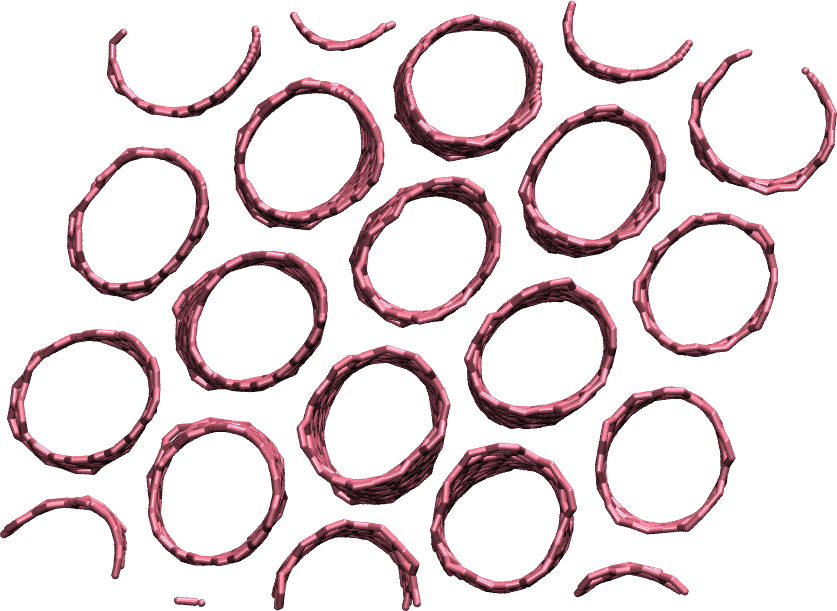
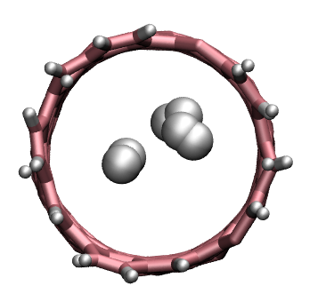

.. _`carbon-nanotube-label`:

Breaking a carbon nanotube
***************************

..  container:: justify

   This tutorial is part of the *2D materials* series.

.. container:: hatnote

   In this tutorial, the breaking of the bonds of a carbon nanotube under
   extreme deformation is simulated.
   
..  container:: justify
   
   The main aspect of this tutorial is that a reactive force field (airebo) is used.
   This force field allows one to simulate the formation and breaking of chemical 
   bonds between the atoms of a structure.

.. figure:: ../figures/carbonnanotube/cnt_dark.png
    :alt: carbon nanotube image in vacuum
    :height: 250
    :align: right
    :class: only-dark

.. include:: ../../contact/needhelp.rst

System creation
===============

..  container:: justify

   Use the same protocol as the one used in the
   previous tutorial (:ref:`graphene-label`) to
   generate a carbon nanotube. Use topotool to 
   save the topology in a file called cnt.data.
   Before generating the CNT, untick "bonds".

   The reason the bonds are not needed here is that 
   a reactive force field is used. Such force field 
   deduces the bonds between atoms on the fly based on the positions of the atoms.
   When two initially bonded atoms are separated by a 
   distance that is too large, the bond may break. 

   Alternatively, you can download the file I did generate 
   by clicking |download_CNT.data|.

.. |download_CNT.data| raw:: html

   <a href="../../../../../inputs/2Dmaterials/carbonnanotube/cnt.data" target="_blank">here</a>

Input file
==========

..  container:: justify

   Then, create a LAMMPS input file, call is input.lammps, and type in it:

..  code-block:: lammps
   :caption: *to be copied in input.lammps*

   # Initialisation
   variable T equal 300

   units metal
   atom_style full
   boundary p p p
   pair_style airebo 2.5 1 1

..  container:: justify

   The first difference with the previous tutorial (:ref:`graphene-label`) 
   is the units: 'metal' instead of 'real', a choice
   that is imposed by the force field we are going to use
   (careful, the time is in pico second with 'metal' instead of femto
   second with 'real'). The second
   difference is the pair_style. We use airebo, which is a
   reactive force field.

   Then, let us import the LAMMPS data file, and set the
   pair_coeff:

..  code-block:: lammps
   :caption: *to be copied in input.lammps*

   # System definition
   read_data cnt.data
   pair_coeff * * CH.airebo C

..  container:: justify

   The CH.airebo file can be downloaded |download_CH.airebo|.
   The rest of the script is very similar to the previous tutorial (:ref:`graphene-label`):

.. |download_CH.airebo| raw:: html

   <a href="../../../../../inputs/2Dmaterials/carbonnanotube/CH.airebo" target="_blank">here</a>

..  code-block:: lammps
   :caption: *to be copied in input.lammps*

   # Simulation settings
   group gcar type 1
   variable zmax equal bound(gcar,zmax)-0.5
   variable zmin equal bound(gcar,zmin)+0.5
   region rtop block INF INF INF INF ${zmax} INF
   region rbot block INF INF INF INF INF ${zmin}
   region rmid block INF INF INF INF ${zmin} ${zmax}

   group gtop region rtop
   group gbot region rbot
   group gmid region rmid

   velocity gmid create ${T} 48455 mom yes rot yes
   fix mynve all nve
   compute Tmid gmid temp
   fix myber gmid temp/berendsen ${T} ${T} 0.1
   fix_modify myber temp Tmid

..  container:: justify

   For a change, let us impose a constant velocity to the atoms
   of one edge, while maintaining the other edge fix. Do to so,
   one needs to cancel the forces (thus the acceleration) on
   the atoms of the edges using the setforce command, and set
   the value of the velocity along the z direction.

Equilibration
=============

..  container:: justify

   First, as an equilibration step, let us set the velocity to 0.

..  code-block:: lammps
   :caption: *to be copied in input.lammps*

   fix mysf1 gbot setforce NULL NULL 0
   fix mysf2 gtop setforce NULL NULL 0
   velocity gbot set NULL NULL 0
   velocity gtop set NULL NULL 0

   variable pos equal xcm(gtop,z)
   fix at1 all ave/time 10 100 1000 v_pos file cnt_deflection.dat
   fix at2 all ave/time 10 100 1000 f_mysf1[1] f_mysf2[1] file force.dat
   dump mydmp all atom 1000 dump.lammpstrj

   thermo 100
   thermo_modify temp Tmid

   # Run
   timestep 0.0005
   run 5000

..  container:: justify

   At the start of the equilibration, you can see that the
   temperature deviates from the target temperature of 300 K
   (after a few picoseconds the temperature reaches the target
   value):

..  code-block:: bw

   Step          Temp          E_pair         E_mol          TotEng         Press     
   0   300           -5084.7276      0             -5058.3973     -1515.7017    
   100   237.49462     -5075.4114      0             -5054.5671     -155.05545    
   200   238.86589     -5071.9168      0             -5050.9521     -498.15029    
   300   220.04074     -5067.1113      0             -5047.7989     -1514.8516    
   400   269.23434     -5069.6565      0             -5046.0264     -174.31158    
   500   274.92241     -5068.5989      0             -5044.4696     -381.28758    
   600   261.91841     -5065.985       0             -5042.9971     -1507.5577    
   700   288.47709     -5067.7301      0             -5042.4111     -312.16669    
   800   289.85177     -5066.5482      0             -5041.1086     -259.84893    
   900   279.34891     -5065.0216      0             -5040.5038     -1390.8508    
   1000   312.27343     -5067.6245      0             -5040.217      -465.74352

Deformation
===========

..  container:: justify

   Then, let us set the velocity to 30 m/s and run for a longer time:

..  code-block:: lammps
   :caption: *to be copied in input.lammps*

   # 0.15 A/ps = 30 m/s
   velocity gtop set NULL NULL 0.15
   run 280000

..  container:: justify

   The CNT should break around timestep 250000.

   When looking at the lammpstrj file using VMD, you will see
   the bonds breaking, similar to |video_lammps_cnt|. Use
   the DynamicBonds representation.

.. |video_lammps_cnt| raw:: html

   <a href="https://www.youtube.com/watch?v=f1ve1j3yA6w" target="_blank">this video</a>

   Carbon nanotube after being broken.

.. container:: justify

   There are two main way to analyse data from a MD simulation: (1) on-the-fly analysis, 
   like what we did with the two fix ave/time, and (2) post-mortem analysis. 

.. admonition:: About bonds in VMD
   :class: info

   Note that VMD guesses bonds based on the distances
   between atoms, and not based on the presence of actual
   bonds between atoms in the LAMMPS simulation. Therefore what is seen
   in VMD can sometimes be misleading.

Post-mortem analysis
====================

.. container:: justify

   Analysis can be performed after the simulation is over, using
   the atom coordinate saved in the lammpstrj file.

   Here, let us use the open source Python library MDAnalysis.

   Open a new Jupyter notebook within the same folder, call it bond_evolution.ipynb.
   First, let us import libraries.

..  code-block:: python
   :caption: *to be copied in bond_evolution.ipynb*

   import MDAnalysis as mda
   import numpy as np

..  container:: justify

   Then, let us create a MDAnalysis universe using the LAMMPS
   data file (for the topology information) and the dump file 
   (for the coordinate evolution over time). Let us detect the
   original bonds using the bond guesser of MDAnalysis.  Let us also create 
   a single atom group containing all the carbon atoms: 

..  code-block:: python
   :caption: *to be copied in bond_evolution.ipynb*

   # create a universe from the dump file
   # guess bond based on distance from the initial topology
   u = mda.Universe("cnt.data", "dump.lammpstrj",
                  topology_format="data", format="lammpsdump",
                  guess_bonds=True, vdwradii={'1':1.7})
   # create a group
   cnt = u.select_atoms("type 1")

..  container:: justify

   Note : The bond guesser of MDAnalysis will not update the list of bond over time, so we will 
   need to use a few trick.

   Then, let us loop over the trajectory and extract bond length and number over time:

..  code-block:: python
   :caption: *to be copied in bond_evolution.ipynb*

   nbond_vs_time = []
   lbond_vs_time = []
   # loop over trajectory
   for ts in u.trajectory:
      # sabe the bond of the timestep ts in a list
      all_bonds_ts = []
      # loop over all initially detected bond
      for id1, id2 in cnt.atoms.bonds.indices:
         # detect positions
         pos1 = u.atoms.positions[u.atoms.indices == id1]
         pos2 = u.atoms.positions[u.atoms.indices == id2]
         d = pos1-pos2
         r = np.sqrt(d[:, 0]**2 + d[:, 1]**2 + d[:, 2]**2)
         if r < 1.8: # assume that bond longer than 1.8 angstroms are broken
               all_bonds_ts.append(r)
      lbond_vs_time.append([ts.time*5000*0.0005, np.mean(all_bonds_ts)]) 
      nbond_vs_time.append([ts.time*5000*0.0005, len(all_bonds_ts)/2]) # divide by 2 to avoid counting twice
   nbond_vs_time = np.array(nbond_vs_time)
   lbond_vs_time = np.array(lbond_vs_time)

..  container:: justify

   The array nbond_vs_time contains the number of bond as a function of time, and 
   lbond_vs_time the bond length:

   Evolution of the bond length (left) and number (right) as a function of time.

.. include:: ../../contact/accessfile.rst

Going further with exercises
============================

.. include::  ../../contact/requestsolution.rst

.. figure:: ../figures/carbonnanotube/shared-dark.png
    :alt: deformed membrane of CNT
    :width: 200
    :align: right
    :class: only-dark

**Exercise 1 : shear deformation of a CNT membrane**

..  container:: justify

   Replicate the CNT along x and y, and equilibrate the system to 
   create a membrane, just like the image on the right. 

   Then, apply a shear deformation along xy.

   *Hint --* The box must be converted to triclinic to support deformation
   along xy.

**Exercise 2 : decorate the CNT with hydrogen**

..  container:: justify

   Add hydrogen atoms randomly to the system (using the same force field). 

   Equilibrate the system. After some time, some hydrogen atoms will 
   decorate the free carbon atoms at the edge of the CNT. Some 
   other hydrogen atoms will bond and form H2 molecules. 

**Exercise 3 : no thermostating**

..  container:: justify

   When a rubber band is streched up, it heats up due to entropy change. 
   In the current simulation, the thermostating prevent the temperature
   to evolve with time.

   Remove the thermostat and observe the evolution of the temperature of an
   'isolated' carbon nanotube being deformed. Does it heat-up?

.. include:: ../../contact/contactme.rst
