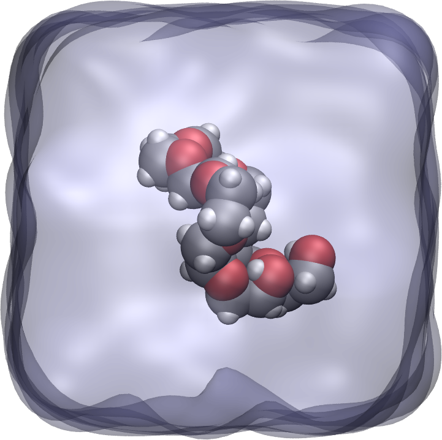
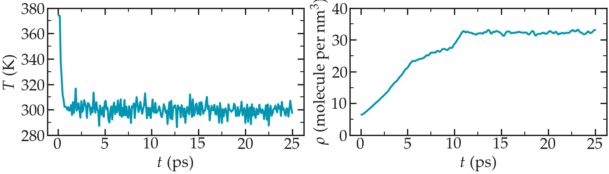

.. _`all-atoms-label`:

Polymer in water
****************

..  container:: justify

   This tutorial is part of the *Bulk fluids* series.

.. container:: hatnote

   A small PEG molecule is immersed in water and its ends are pulled

..  container:: justify

   The objective of this tutorial is to use LAMMPS and
   create a small hydrophilic polymer (PEG -
   PolyEthylene Glycol) in a reservoir of water. 
   An all atoms description is used, with charged atoms 
   connected by bonds constraints.

   Once the system created, a constant force will be applied to the 2
   ends of the polymer, and its length will be measured with time.

Bulk water
==========

..  container:: justify

   Here a rectangular box of water is created, then
   equilibrated at ambient temperature and ambient pressure.

   Create a folder named pureH2O/. Inside this folder, create
   an empty text file named input.lammps. Copy the following
   lines in it:

..  code-block:: bash
   :caption: *to be copied in pureH2O/input.lammps*

   # LAMMPS input script
   units real
   atom_style full
   bond_style harmonic
   angle_style charmm
   dihedral_style charmm
   pair_style lj/cut/tip4p/long 1 2 1 1 0.1546 12.0
   kspace_style pppm/tip4p 1.0e-4

..  container:: justify

   **Explanations:** There are many differences with respect to
   the previous tutorial (:ref:`lennard-jones-label`), mostly
   because here a system with molecules and charges will be
   modeled (instead of neutral dot particles as in tutorial
   01). With the unit style 'real', masses are in grams per
   mole, distances in Ångstroms, time in femtoseconds, energies
   in Kcal/mole. With the atom style 'full', each atom is a dot
   with a mass and a charge. In addition, each atom can be
   linked by bonds, angles, dihedrals and impropers potentials
   (for example to form molecules). The 'bond_style',
   'angle_style', and 'dihedral_style' commands define the
   styles of bond angle, and dihedrals used in the simulation,
   respectively, and the 'harmonic' and 'charmm' keywords
   impose the potential to use.

   *Remark --* The future merging of the water with the PEG
   has already been anticipated as the charmm angle_style
   and dihedral_style are requirements of the PEG's model.

   *Remark --* A rigid water model will be used, so the bond
   and angle styles do not matter to the water, they will
   only matter to the PEG when it is added.

   With the 'pair_style' named 'lj/cut/tip4p/long', atoms
   interact through both a Lennard-Jones (LJ) potential and
   through Coulombic interactions. This style is specific to
   four points water model, and automatically accounts for the
   additional massless site. The six numbers are, respectively,

-  **1 -** the atom type for the oxygen O of the tip4p
   water,
-  **2 -** the atom type for the hydrogen H of the tip4p
   water,
-  **3 -** the OH bond type,
-  **4 -** the HOH angle type,
-  **5 -** the distance from O atom to massless charge,
-  **6 -** the cutoff in Ångstroms.

..  container:: justify

   *Note --* The cutoff applies to both LJ and Coulombic
   interactions, but in a different way. For LJ 'cut'
   interactions, atoms interact with each other only if they
   are separated by a distance smaller than the cutoff. For
   Coulombic 'long', interaction between atoms closer than
   the cutoff are computed directly, and interaction between
   atoms outside that cutoff are computed in reciprocal
   space.

   Finally the kspace command defines the long-range solver for
   Coulombic interactions. The pppm style refers to
   particle-particle particle-mesh.

..  container:: justify

   **About PPPM**
   From `Luty and van Gunsteren'
   paper <https://doi.org/10.1021/jp9518623>`__: "The PPPM
   method is based on separating the total interaction
   between particles into the sum of short-range
   interactions, which are computed by direct
   particle-particle summation, and long-range interactions,
   which are calculated by solving Poisson's equation using
   periodic boundary conditions (PBCs)."

   Then, let us create a 3D simulation box of dimensions 8 x 3
   x 3 nm:math:`^3`, and make space for 7 atom types (1 and 2 for
   the water oxygen and hydrogen, respectively, and 3, 4, 5, 6
   and 7 for the PEG molecule (see below)), 6 bond types, 9
   angle types, and 14 dihedrals types.

..  code-block:: bash
   :caption: *to be copied in pureH2O/input.lammps*

   region box block -40 40 -15 15 -15 15
   create_box 7 box &
   bond/types 6 &
   angle/types 9 &
   dihedral/types 14 &
   extra/bond/per/atom 2 &
   extra/angle/per/atom 1 &
   extra/special/per/atom 2

..  container:: justify

   *Note -* The extra/X/per/atom commands are related to
   memory allocation, they ensure space is left for a
   certain number of attribute for each atom, we wont worry
   about those commands in this tutorial.

   Let us include a parameter file containing all the
   parameters (masses, interaction energies, bond equilibrium
   distances, etc):

..  code-block:: bash
   :caption: *to be copied in pureH2O/input.lammps*

   include ../PARM.lammps

..  container:: justify

   Next to the pureH2O/ folder, create a blank file called
   PARM.lammps and copy the following lines in it:

..  code-block:: bash
   :caption: *to be copied in PARM.lammps*

   # Mass

   mass 1 15.9994 # H2O O
   mass 2 1.008 # H2O H
   mass 3 12.011 # CC32A
   mass 4 15.9994 # OC30A
   mass 5 1.008 # HCA2
   mass 6 15.9994 # OC311
   mass 7 1.008 # HCP1

   # Pair Coeff

   pair_coeff 1 1 0.185199 3.1589 # H2O O
   pair_coeff 2 2 0.0 0.0 # H2O H
   pair_coeff 3 3 0.056 3.58141 # CC32A
   pair_coeff 4 4 0.100 2.93997 # OC30A
   pair_coeff 5 5 0.035 2.38761 # HCA2
   pair_coeff 6 6 0.192 3.14487 # OC311
   pair_coeff 7 7 0.046 0.40001 # HCP1

   # Bond coeff

   bond_coeff 1 0 0.9572 # H2O O-H
   bond_coeff 2 222.35 1.5300
   bond_coeff 3 308.79 1.1111
   bond_coeff 4 359.76 1.1415
   bond_coeff 5 427.715 1.1420
   bond_coeff 6 544.635 0.9600

   # Angle coeff

   angle_coeff 1 0 104.52 0 0 # H2O H-O-H
   angle_coeff 2 50.0000 109.0000 0.0000 0.0000
   angle_coeff 3 26.5000 110.1000 22.5300 2.179   
   angle_coeff 4 45.0000 111.5000 0.0000 0.0000 
   angle_coeff 5 13.0258 109.4000 0.0000 0.0000
   angle_coeff 6 35.5000 109.0000 5.4000 1.802
   angle_coeff 7 55.0000 108.8900 0.0000 0.0000
   angle_coeff 8 75.7000 110.1000 0.0000 0.0000
   angle_coeff 9 95.0000 109.7000 0.0000 0.0000
         
   # Dihedral coeff

   dihedral_coeff 1 0.57 1 0 0
   dihedral_coeff 2 0.29 2 0 0
   dihedral_coeff 3 0.43 3 0 0
   dihedral_coeff 4 0.59 1 180 0
   dihedral_coeff 5 1.16 2 0 0 
   dihedral_coeff 6 0.12 1 0 0 
   dihedral_coeff 7 0.42 2 0 0
   dihedral_coeff 8 0.29 3 0 0
   dihedral_coeff 9 2.87 1 180 0
   dihedral_coeff 10 0.03 2 0 0
   dihedral_coeff 11 0.23 3 0 0
   dihedral_coeff 12 1.36 1 180 0
   dihedral_coeff 13 0.16 2 0 0
   dihedral_coeff 14 1.01 3 0 0

..  container:: justify

   If you want to know which column refers to which
   parameter, you can refer to the LAMMPS documentation. For
   this tutorial, we will just trust that these parameters
   are correct and will lead to physically consistent
   behavior.
   Now, let us create water molecules. To do so, let us
   define a water molecule using a molecule template called
   H2OTip4p.txt, and randomly create 700 of those.

..  code-block:: bash
   :caption: *to be copied in pureH2O/input.lammps*

   molecule h2omol H2OTip4p.txt
   create_atoms 0 random 700 456415 NULL mol h2omol 454756

..  container:: justify

   Alternatively, you can
   `download <../../../../../../inputs/bulkfluids/allatoms/pureH2O/H2O.data>`__
   the water reservoir I have equilibrated and continue with
   the tutorial.

   The molecule template named H2OTip4p.txt must be
   `downloaded <../../../../../../inputs/bulkfluids/allatoms/pureH2O/H2OTip4p.txt>`__
   and saved in the same folder (named pureH2O/) as the
   input.lammps file.

   This template contains all the necessary structural
   information of a water molecule, such as the number of atoms, 
   which pair of atoms are connected by bonds, which
   groups of atoms are connected by angles, etc.
   Then, let us group the atoms of the water in a group named
   H2O, and then delete the overlapping molecules:

..  code-block:: bash
   :caption: *to be copied in pureH2O/input.lammps*

   group H2O type 1 2
   delete_atoms overlap 2 H2O H2O mol yes

..  container:: justify

   *Note --* Deleting overlapping molecules is required here
   because the molecules where placed randomly in space by
   the "create_atoms" command, and some of them may be too
   close from each other, which may force the simulation to
   crash.

   Let us use the shake algorithm in order to constrain the
   shape of the water molecules. Let us also use the fix NPT to
   control both the temperature and the pressure:

..  code-block:: bash
   :caption: *to be copied in pureH2O/input.lammps*

   fix myshk H2O shake 1.0e-5 200 0 b 1 a 1 mol h2omol
   fix mynpt all npt temp 300 300 100 iso 1 1 1000

..  container:: justify

   **Explanations:** The parameters of the fix shake specify to
   which group (H2O) the shake algorithm applied, with what
   tolerance (1e-5). Still in the shake command, we also supply
   the molecule template (h2omol) previously defined, and
   specify to which bond/angle type shake mush apply, i.e. the
   bond of type 1 and the angle of type 1.

   *Note -* With shake, water molecules behave as rigid. If
   you want to study the vibration of the O-H bonds and
   H-O-H angles, you will have to use a flexible water
   model. If you want to study the hydrogen transfer, you
   will have to use a reactive force field.

   *Note -* Here only the water molecules will be rigid, the
   PEG molecule (which will be added in the next part) will
   be fully flexible.

   Let us print the atom positions in a dump file every 1000
   timesteps (i.e. 1 ps), print the temperature volume, and
   density every 100 timesteps in 3 separate data files, and
   print the information in the terminal every 1000 timesteps:

..  code-block:: bash
   :caption: *to be copied in pureH2O/input.lammps*

   dump mydmp all atom 1000 dump.lammpstrj
   variable mytemp equal temp
   variable myvol equal vol
   fix myat1 all ave/time 10 10 100 v_mytemp file temperature.dat
   fix myat2 all ave/time 10 10 100 v_myvol file volume.dat
   variable myoxy equal count(H2O)/3 # divide by 3 to get the number of molecule, not atom
   variable mydensity equal ${myoxy}/v_myvol
   fix myat3 all ave/time 10 10 100 v_mydensity file density.dat
   thermo 1000

..  container:: justify

   Note that in the formula for the density (number of
   molecule divided by volume), the underscore '_' is used to
   call the volume variable because this variable is expected
   to evolve in time, but the dollar sign '$' is used as the
   number of molecules is not expected to evolve during the
   simulation (the number of molecule changes after the
   delete_atoms command is used, but this is done before the
   simulation starts).
   Finally, let us set the timestep to 2.0 fs (allowed
   because we use shake), and run the simulation for 50 ps:

..  code-block:: bash
   :caption: *to be copied in pureH2O/input.lammps*

   timestep 2.0
   run 25000
   write_data H2O.data

..  container:: justify

   Looking at the log file, one can see how many atoms have
   been deleted (the number will vary depending on the random
   number you choose).

..  code-block:: bash

   Deleted 714 atoms, new total = 1386
   Deleted 476 bonds, new total = 924
   Deleted 238 angles, new total = 462

..  container:: justify

   About 30 % the molecules were deleted due to overlapping,
   together with their respective bonds and angles.
   At the end of the simulation, the final state is printed
   in the H2O.data file, which will be used later.

   *Note -* This simulation may be a bit slow to complete.
   You can speed it up by running it on multiple CPUs using
   something like "mpirun -np 4 lmp -in input.lammps" (the
   command may vary, depending on your OS and LAMMPS
   version).

   *Note -* No energy minimization was performed here (NPT
   molecular dynamics was started straight away). This is a
   bit risky, but it works here because overlapping
   molecules were deleted, and because the initial density
   is very low.

   If you open the dump.lammpstrj file using VMD, you should
   see the system reaching its equilibrium volume:

   Video: water molecules during NPT equilibration.

..  container:: justify

   You can also open the temperature.dat and density.dat files
   to ensure that the system converged toward an equilibrated
   liquid system during the 50 ps of simulation:

    The graph on the left shows the evolution of the temperature
    with time, and the graph on the right the evolution of the
    density.

..  container:: justify

   Alternatively, you can
   `download <../../../../../../inputs/bulkfluids/allatoms/pureH2O/H2O.data>`__
   the water reservoir I have equilibrated and continue with
   the tutorial.

PEG molecule
============

..  container:: justify

   Now that the water box is ready, let us prepare the PEG
   molecule. Create a second folder next to pureH2O/, call it
   singlePEG/, and create a new blank file called input.lammps
   in it. Copy the same first lines as previously:

..  code-block:: bash
   :caption: *to be copied in singlePEG/input.lammps*

   units real
   atom_style full
   bond_style harmonic
   angle_style charmm
   dihedral_style charmm
   pair_style lj/cut/tip4p/long 1 2 1 1 0.1546 12.0
   kspace_style pppm/tip4p 1.0e-4

..  container:: justify

   Let us also add the special_bonds command to cancel the
   Lennard-Jones and Coulomb interactions between the closest
   atoms of a same molecule:

..  code-block:: bash
   :caption: *to be copied in singlePEG/input.lammps*

   special_bonds lj 0.0 0.0 0.5

..  container:: justify

   Let us include the original position of the PEG molecule, as
   well as the same parameter file as previously:

..  code-block:: bash
   :caption: *to be copied in singlePEG/input.lammps*

   read_data init.data
   include ../PARM.lammps

..  container:: justify

   `Download <../../../../../../inputs/bulkfluids/allatoms/singlePEG/init.data>`__
   the init.data file and save it in the singlePEG/ folder.
   It contains the initial parameters of the PEG molecules
   (atoms, bonds, charges, etc.), and was prepared using a
   Python script I wrote: `PEG
   generator <https://github.com/simongravelle/PEGgenerator>`__.
   To make our life simpler later, let use use the exact same
   box size for the PEG as for the water (the merging will be
   simpler, see below). Open the previously generate H2O.data
   file, and copy the 3 lines corresponding to the box
   dimensions. In my case, its:

..  code-block:: bash

   -21.64201909795004 21.64201909795004 xlo xhi
   -8.115757161731125 8.115757161731125 ylo yhi
   -8.115757161731125 8.115757161731125 zlo zhi

..  container:: justify

   Then, replace the box dimensions in the init.data file with
   these 3 lines.

   Let us print the atom positions and thermodynamic
   information very frequently (because we anticipate that the
   energy minimization will be short):

..  code-block:: bash
   :caption: *to be copied in singlePEG/input.lammps*

   dump mydmp all atom 10 dump.lammpstrj
   thermo 1

..  container:: justify

   Next, let us perform a minimisation of energy. Here, this
   step is required because the initial configuration of the
   PEG molecule is really far from equilibrium.

..  code-block:: bash
   :caption: *to be copied in singlePEG/input.lammps*

   minimize 1.0e-4 1.0e-6 100 1000

..  container:: justify

   After the minimisation, the high resolution dump command is
   cancelled, and a new dump command with lower frequency is
   used (see below). We also reset the time to 0 with
   reset_timestep command:

..  code-block:: bash
   :caption: *to be copied in singlePEG/input.lammps*

   undump mydmp
   reset_timestep 0

..  container:: justify

   The PEG is then equilibrated in the NVT ensemble (fix NVE +
   temperature control = NVT). No box relaxation is required as
   the PEG is in vacuum:

..  code-block:: bash
   :caption: *to be copied in singlePEG/input.lammps*

   fix mynve all nve
   fix myber all temp/berendsen 300 300 100

..  container:: justify

   Let us print the temperature in a file:

..  code-block:: bash
   :caption: *to be copied in singlePEG/input.lammps*

   dump mydmp all atom 1000 dump.lammpstrj
   dump_modify mydmp append yes
   thermo 1000
   variable mytemp equal temp
   fix myat1 all ave/time 10 10 100 v_mytemp file temperature.dat

..  container:: justify

   The *dump_modify* ensures that the coordinates are written 
   in the existing dump.lammpstrj file. 
   Finally let us run the simulation for a very short time (10 ps):

..  code-block:: bash
   :caption: *to be copied in singlePEG/input.lammps*

   timestep 1
   run 10000
   write_data PEG.data

..  container:: justify

   If you open the dump.lammpstrj file
   using VMD, you can see the PEG molecule starting from
   an extremely elongated and unrealistic shape, and 
   gently equilibrating until reaching a reasonable state.

.. figure:: ../figures/allatoms/singlePEG-light.webp
    :alt: PEG in vacuum
    :class: only-light

    A PEG molecule in vacuum during an energy
    minimisation step, followed by a short NVT molecular dynamics.

..  container:: justify

   Alternatively, you can
   `download <../../../../../../inputs/bulkfluids/allatoms/singlePEG/PEG.data>`__
   the PEG molecule I have equilibrated and continue with the tutorial.

Solvation of the PEG molecule
=============================

..  container:: justify

   Now, we merge the PEG molecule and the equilibrated
   water reservoir. We do it by (1) importing both
   previously generated data files (PEG.data and
   H2O.data) into the same simulation, (2) deleting the
   overlapping molecules, and (3) re-equilibrating the new
   system. 

   Create a third folder alongside pureH2O/ and singlePEG/,
   and call it mergePEGH2O/. Create a new blank file in it,
   called input.lammps. Copy the same first lines as
   previously in it:

..  code-block:: bash
   :caption: *to be copied in mergePEGH2O/input.lammps*

   units real
   atom_style full
   bond_style harmonic
   angle_style charmm
   dihedral_style charmm
   pair_style lj/cut/tip4p/long 1 2 1 1 0.1546 12.0
   kspace_style pppm/tip4p 1.0e-4
   special_bonds lj 0.0 0.0 0.5

..  container:: justify

   Then, import the two previously generated data files:

..  code-block:: bash
   :caption: *to be copied in mergePEGH2O/input.lammps*

   read_data ../singlePEG/PEG.data
   read_data ../pureH2O/H2O.data add append
   include ../PARM.lammps

..  container:: justify

   When using the read_data command more than once, one needs
   to use the *add append* keyword. In that case the
   simulation box is only initialized by the first read_data.
   Let us create 2 groups to differentiate the PEG from the H2O:

..  code-block:: bash
   :caption: *to be copied in mergePEGH2O/input.lammps*

   group H2O type 1 2
   group PEG type 3 4 5 6 7

..  container:: justify

   Water molecules that are overlapping with the PEG must be
   deleted to avoid crashing:

..  code-block:: bash
   :caption: *to be copied in mergePEGH2O/input.lammps*

   delete_atoms overlap 2.0 H2O PEG mol yes

..  container:: justify

   *Note --* The value of 2 Angstroms was fixed arbitrary,
   and can be chosen through trial and error. The "mol yes"
   option ensures that entire molecule are deleted and not
   just single atoms.

   Finally, let us use shake to keep the water
   molecules as rigid, and use the NPT command to control the
   temperature, as well as the pressure along x:

..  code-block:: bash
   :caption: *to be copied in mergePEGH2O/input.lammps*

   fix myshk H2O shake 1.0e-4 200 0 b 1 a 1
   fix mynpt all npt temp 300 300 100 x 1 1 1000
   timestep 1.0

..  container:: justify

   *Note --* The box dimension will only adjust along the
   x dimension here.

   Once more, let us dump the atom positions and a few
   information about the evolution simulation:

..  code-block:: bash
   :caption: *to be copied in mergePEGH2O/input.lammps*

   dump mydmp all atom 100 dump.lammpstrj
   thermo 100
   variable mytemp equal temp
   variable myvol equal vol
   fix myat1 all ave/time 10 10 100 v_mytemp file temperature.dat
   fix myat2 all ave/time 10 10 100 v_myvol file volume.dat

..  container:: justify

   Let us also print the total enthalpy:

..  code-block:: bash
   :caption: *to be copied in mergePEGH2O/input.lammps*

   variable myenthalpy equal enthalpy
   fix myat3 all ave/time 10 10 100 v_myenthalpy file enthalpy.dat

..  container:: justify

   Finally, let us perform a short equilibration and print the
   final state in a data file:

..  code-block:: bash
   :caption: *to be copied in mergePEGH2O/input.lammps*

   run 10000
   write_data mix.data

..  container:: justify

   If you open the dump.lammpstrj file using VMD, you should
   see that the box dimension slightly shrink along x.
   The system looks like that:

   PEG molecule in water. Water is represented as a continuous field for clarity.

Stretching the PEG molecule
===========================

..  container:: justify

   Here, a constant forcing is applied to the two ends of the
   PEG molecule until it stretches. Create a new folder next
   to the 3 previously created folders, call it pullonPEG/
   and create a new input file in it called input.lammps.
   First, let us create a variable containing the magnitude
   of the force we are going to apply. The force magnitude is
   chosen to be large enough to overcome the thermal
   agitation and the entropic contribution from both water
   and PEG molecules (it was chosen by trial and error). Copy
   in the input file:

..  code-block:: bash
   :caption: *to be copied in pullonPEG/input.lammps*

   variable f0 equal 5 # kcal/mol/A # 1 kcal/mol/A = 67.2 pN

..  container:: justify

   Then, as previouly, copy:

..  code-block:: bash
   :caption: *to be copied in pullonPEG/input.lammps*

   units real
   atom_style full
   bond_style harmonic
   angle_style charmm
   dihedral_style charmm
   pair_style lj/cut/tip4p/long 1 2 1 1 0.1546 12.0
   kspace_style pppm/tip4p 1.0e-4
   special_bonds lj 0.0 0.0 0.5

..  container:: justify

   Start the simulation from the equilibrated PEG + water
   system, and include again the parameters:

..  code-block:: bash
   :caption: *to be copied in pullonPEG/input.lammps*

   read_data ../mergePEGH2O/mix.data
   include ../PARM.lammps

..  container:: justify

   Then, let us create 4 atom groups: H2O and PEG (as
   previously) as well as 2 groups containing one single atom
   corresponding respectively to the oxygen atoms ocated at the
   ends of the PEG molecule:

..  code-block:: bash
   :caption: *to be copied in pullonPEG/input.lammps*

   group H2O type 1 2
   group PEG type 3 4 5 6 7
   group oxygen_end1 id 65
   group oxygen_end2 id 4

..  container:: justify

   Let us print again the atom positions in a dump:

..  code-block:: bash
   :caption: *to be copied in pullonPEG/input.lammps*

   dump mydmp all atom 1000 dump.lammpstrj
   # write_dump all atom dump.lammpstrj
   # dump myxtc xtc atom 1000 dump.xtc

..  container:: justify

   *Note --* To generate smaller dump files, use the
   compressed xtc format. You can do it by commenting the
   mydmp line and by uncommenting both the write_dump and
   myxtc lines. This is useful for generating higher
   resolution trajectories without using too much space.

   Let us use a simple thermostating and shake:

..  code-block:: bash
   :caption: *to be copied in pullonPEG/input.lammps*

   timestep 1
   fix myshk H2O shake 1.0e-4 200 0 b 1 a 1
   fix mynvt all nvt temp 300 300 100

Let us print the end-to-end distance of the PEG (and the
temperature of the entire system):

..  code-block:: bash
   :caption: *to be copied in pullonPEG/input.lammps*

   variable mytemp equal temp
   fix myat1 all ave/time 10 10 100 v_mytemp file temperature.dat
   variable x1 equal xcm(oxygen_end1,x)
   variable x2 equal xcm(oxygen_end2,x)
   variable delta_x equal abs(v_x1-v_x2)
   fix myat2 all ave/time 10 10 100 v_delta_x file end-to-end-distance.dat
   thermo 5000

..  container:: justify

   The distance between the two ends are here extracted
   directly using the LAMMPS internal commands, but the same
   information can also be extracted from the dump file after
   the simulation is over.
   Finally, let us run the simulation for 10 ps (without
   any external forcing):

..  code-block:: bash
   :caption: *to be copied in pullonPEG/input.lammps*

   run 10000

..  container:: justify

   Then, let us apply a forcing on the 2 oxygen atoms using 2
   add_force commands, and run for 100 ps (for a total duration
   of the simulation of 110 ps):

..  code-block:: bash
   :caption: *to be copied in pullonPEG/input.lammps*

   fix myaf1 oxygen_end1 addforce ${f0} 0 0
   fix myaf2 oxygen_end2 addforce -${f0} 0 0
   run 50000

..  container:: justify

   If you open the dump.lammpstrj file using VMD , you should
   see this (here the water is represented as a continuum
   field):

    PEG molecule streched in water.

..  container:: justify

   The evolution of the end-to-end
   distance over time show the PEG adjusting
   to the external forcing:

    Evolution of the end-to-end distance of the PEG molecule
    with time. The forcing starts at :math:`t = 10` ps.

.. include:: ../../contact/accessfile.rst

Going further with exercises
============================

.. include::  ../../contact/requestsolution.rst

**Exercise 1 : generate a PEG-H2O mixture**

..  container:: justify

   Use the same script and a similar procedure and create a
   PEG-H2O mixture with several PEG molecules hydrated in a
   cubic box.

   Hint: LAMMPS has internal commands allowing to replicate
   a molecule or a system.

**Exercise 2 : end-to-end distance**

..  container:: justify

   Create 2 simulations, one with a PEG molecule in vacuum, one
   with a PEG molecule in water, and measure their respective
   end-to-end equilibrium distance. PEG are hydrophilic and
   form hbonds with water molecules, therefore, when immersed
   in water, a PEG molecule slightly unfold, which changes it
   equilibrium end-to-end length.

**Exercise 3 : post-mortem analysis**

..  container:: justify

   Import the trajectory using Python, and re-extract the
   end-to-end distance.

   Hint: you can import lammpstrj file using MDAnalysis:

::

   u = mda.Universe("dump.lammpstrj", format = "LAMMPSDUMP")

..  container:: justify

   **Motivation:** In today research, most data analyses are
   done after the simulation is over, and it is important for
   LAMMPS users to know how to do it.

.. include:: ../../contact/contactme.rst
