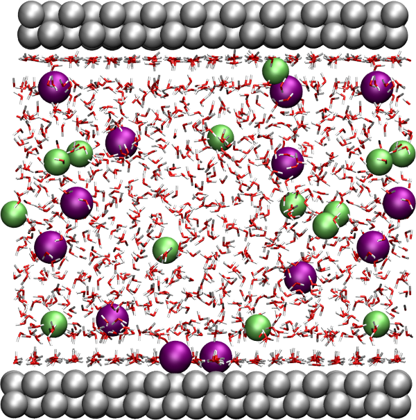
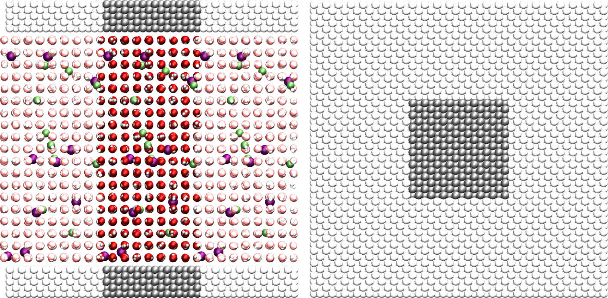
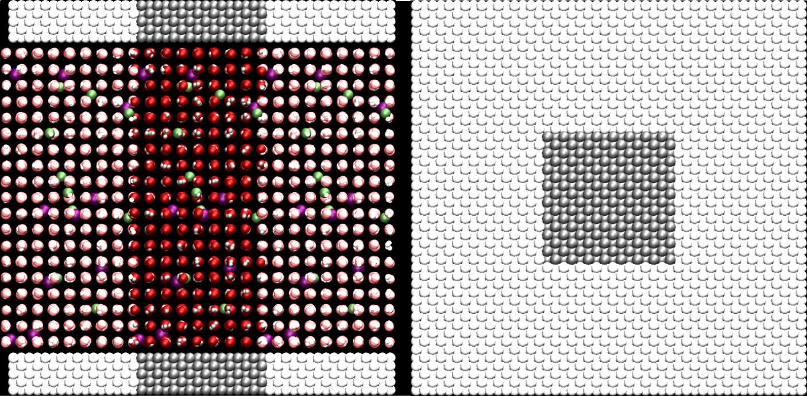
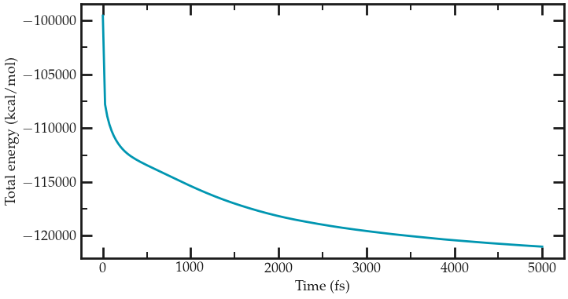
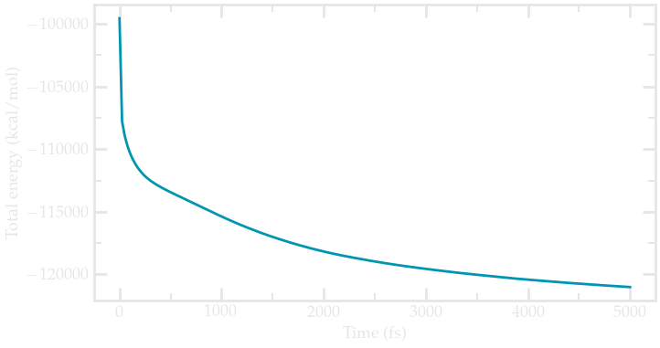
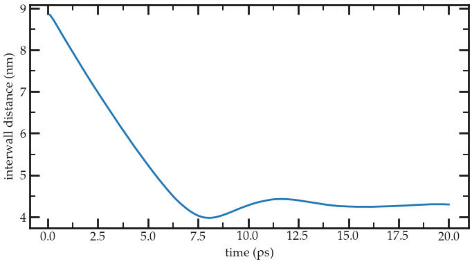
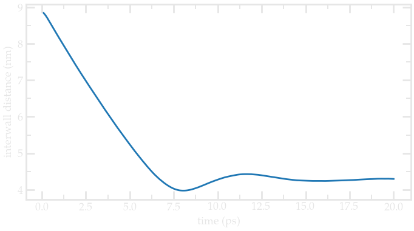
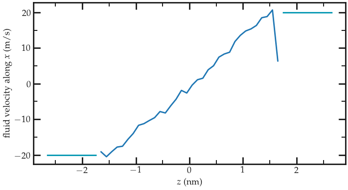
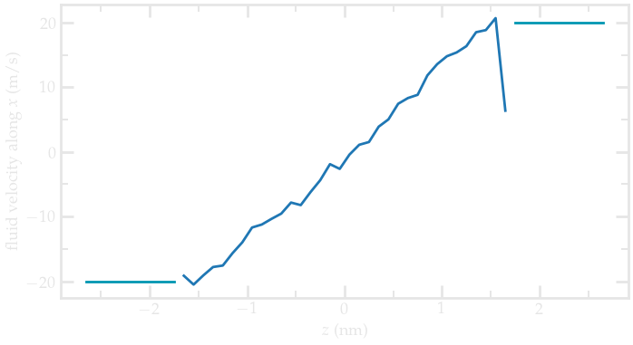

.. _sheared-confined-label:

Nanosheared electrolyte
***********************

..  container:: justify

    This tutorial is part of the *Bulk fluids* series.

.. container:: hatnote

    Molecular dynamics simulation of an aqueous NaCl
    solution sheared between two solid walls

.. figure:: ../figures/sheared/nanoconfined-electrolyte-dark.png
    :height: 250
    :alt: Electrolyte nano-confined in a slit pore
    :class: only-dark
    :align: right

..  container:: justify

    The objective of this tutorial is to use molecular
    dynamics and simulate an electrolyte sheared by two
    walls. The velocity profile of the electrolyte 
    will be extracted. 

    This tutorial illustrates some aspects of
    combining a fluid and a solid in the same simulation.

    All inputs and data files can be found on the
    Github repository of LAMMPStutorials.

System generation
=================

..  container:: justify

    Create a new folder called SystemCreation/. Open a blank
    page in it using a text editor, and call it input.lammps.
    Copy the following lines into input.lammps:

..  code-block:: bash
   :caption: *to be copied in SystemCreation/input.lammps*

    # LAMMPS input file
    units real
    atom_style full
    bond_style harmonic
    angle_style harmonic
    pair_style lj/cut/tip4p/long 1 2 1 1 0.1546 12.0
    kspace_style pppm/tip4p 1.0e-4

..  container:: justify

    Let us create the box: copy the following lines into the
    input file:

..  code-block:: bash
   :caption: *to be copied in SystemCreation/input.lammps*

    # ------------- System definition
    lattice fcc 4.04
    region box block -4 4 -4 4 -13 13
    create_box 5 box &
                bond/types 1 &
                angle/types 1 &
                extra/bond/per/atom 2 &
                extra/angle/per/atom 1 &
                extra/special/per/atom 2

..  container:: justify

    **Explanations:** The 'lattice' command defines the unit
    cell. Here face-centered cubic (fcc) with a scale factor of
    4.04 has been chosen for the future positioning of the atoms
    of the walls. The 'region' command defines a geometric
    region of space, and by choosing 'xlo=-4' and 'xhi=4', and
    because we have previously chosen a lattice with scale
    factor of 4.04, the region box extends from -16.16 to 16.16
    Ångström (units of lengths are in Ångstrom because we have
    chosen the unit style 'real'). Finally, the 'create_box'
    command creates a simulation box with 5 types of atoms in
    the simulation: oxygen and hydrogen atoms of the water, Na,
    Cl, and the atoms of the walls.

    The create box command extends over 6 lines thanks to the
    '&' character. The second and third lines are used to
    specify that the simulation contains 1 type of bond and 1
    type of angle (for the water molecule). The parameters of
    these bond and angle constraints will be given later. The
    three last lines are for memory allocation.

    We can now add atoms to the system. First, we create two
    sub-regions corresponding respectively to the two solid
    walls, and create a larger region from the union of the two
    regions. Then we create atoms of type 5 within the two
    regions:

..  code-block:: bash
   :caption: *to be copied in SystemCreation/input.lammps*

    # create the walls
    region rbotwall block -4 4 -4 4 -12 -10
    region rtopwall block -4 4 -4 4 10 12
    region rwall union 2 rbotwall rtopwall
    create_atoms 5 region rwall

..  container:: justify

    Atoms will be placed at the positions of the previously
    defined lattice.

    In order to add the water molecules, we first need to
    download the
    `TIP4P2005.txt <../../../../../../inputs/bulkfluids/sheared/SystemCreation/TIP4P2005.txt>`__
    file and place it in the same folder. It contains all the
    necessary information about the water molecule, such as
    positions, bonds, and angle. Then, add the following lines
    to input.lammps:

..  code-block:: bash
   :caption: *to be copied in SystemCreation/input.lammps*

    # create the fluid
    region rliquid block -4 4 -4 4 -9 9
    molecule h2omol TIP4P2005.txt
    lattice sc 4.04
    create_atoms 0 region rliquid mol h2omol 482793

..  container:: justify

    **Explanations:** With the last four lines, a region used to
    deposit the water is created on the last defined lattice,
    which is 'fcc 4.04'. Then, on the next line, we define a new
    simple cubic lattice in order to position the water
    molecules on it, with a distance of 4.04 Ångstroms between
    each water molecule (note: the new lattice replaces the
    previous one as LAMMPS reads a script from top to bottom).
    Note that 4.04 Ångstroms is larger than the typical
    equilibrium distance between water molecules in a liquid,
    but this will allow us to insert ions more safely. Then, the
    'molecule' command opens the 'TIP4P2005.txt' file, and name
    the associated molecule 'h2omol'. Finally, molecules are
    created on the sc lattice by the 'create_atoms' command. The
    first parameter is '0' because we use the atom id from the
    'TIP4P2005.txt' file. The number '482793' is a seed that is
    required by LAMMPS, it can be any positive integer.

    Finally, let us deposit 20 ions (10 Na+, 10
    Cl-) in between the water molecules by adding these
    two lines to input.01.lammps:

..  code-block:: bash
   :caption: *to be copied in SystemCreation/input.lammps*

    fix mydep1 all deposit 10 3 1 56513 region rliquid near 0.3
    fix mydep2 all deposit 10 4 1 58613 region rliquid near 0.3

..  container:: justify

    Each 'fix deposit' will add one ion at a random position
    within the 'rliquid' region every timestep. So we can just
    make a very short simulation of 10 timesteps and save the
    generated configuration. Feel free to increase the salt
    concentration by increasing both number of steps and number
    of desired ions in the 'deposit' fixes.

    We need to define the parameters of the simulation: the mass
    of the 6 atoms (O, H, Na+, Cl-, and wall), the
    pairwise interaction parameters (here the parameters for the
    Lennard-Jones potential), and the bond and angle parameters.
    Copy the following line into input.lammps:

..  code-block:: bash
   :caption: *to be copied in SystemCreation/input.lammps*

    # settings
    include ../PARM.lammps

..  container:: justify

    Create a new text file, call it 'PARM.lammps', and copy it
    next to the SystemCreation/ folder. Copy the following lines
    into PARM.lammps:

..  code-block:: bash
   :caption: *to be copied in PARM.lammps*

    # Parameter file
    mass 1 15.9994 # water
    mass 2 1.008 # water
    mass 3 28.990 # ion
    mass 4 35.453 # ion
    mass 5 26.9815 # wall

    pair_coeff 1 1 0.185199 3.1589 # water
    pair_coeff 2 2 0.0 0.0 # water
    pair_coeff 3 3 0.04690 2.4299 # ion
    pair_coeff 4 4 0.1500 4.04470 # ion
    pair_coeff 5 5 11.697 2.574 # wall

    bond_coeff 1 0 0.9572 # water

    angle_coeff 1 0 104.52 # water

..  container:: justify

    Explanations: The parameters for water (mass 1, mass 2,
    pair_coeff 1 1, pair coeff 2 2, bond_coeff 1 and angle_coeff
    1) are given by the TIP4P/2005 force field, the parameters
    for Na+ and Cl- (mass 3, mass 4, pair_coeff 3
    3, pair_coeff 4 4) are given by the CHARMM-27 force field,
    and the parameters for the wall (mass 5 and pair_coeff 5 5)
    are parameters for the wall atoms. Each 'mass' command
    assigns a mass in grams/mole to an atom type. Each
    'pair_coeff' assigns respectively the depth of the potential
    in Kcal/mole, and the distance at which the
    particle-particle potential energy in Ångstrom.

    Only assigned pairwise interaction between atoms of
    identical type we assign. By default, LAMMPS calculates
    the pair coefficients for the interactions between atoms
    of different types (i and j) by using geometrical
    average: :math:`\epsilon_{ij} = \epsilon_i + \epsilon_j)/2`, 
    :math:`\sigma_{ij} = (\sigma_i + \sigma_j)/2.`

    Other rules for cross coefficients can be set with the
    'pair_modify' command, but for the sake of simplicity,
    let us keep the default option here.

    The bond coefficient (here for the O-H bond of the water
    molecule) sets respectively the energy of the harmonic
    potential and the equilibrium distance in Ångstrom. The
    value is '0' for the energy, because we are going to use a
    rigid model for the water molecule. The shape of the
    molecule will be preserved later by the shake algorithm.
    Similarly, the angle coefficient (here for the H-O-H angle
    of the water molecule) sets the energy of the harmonic
    potential (also 0) and the equilibrium angle is in degree.

    Finally, add the following lines to the input file:

..  code-block:: bash
   :caption: *to be copied in SystemCreation/input.lammps*

    # run
    run 10

    set type 3 charge 1.0
    set type 4 charge -1.0

    write_data system.data
    write_dump all atom dump.lammpstrj

..  container:: justify

    **Explanations:** With 'run 10', the simulation will run for
    10 timesteps.

    The value of the timestep (1 fs by default) does not
    matter yet because the atoms are not moving.

    We also need to specify the charge of the newly added ions,
    which is done using the 'set' commands. The write
    'data_file' finally creates a file named 'system.data'
    containing all the information required to restart the
    simulation from the final configuration generated by this
    input file. The 'write_dump' command print the final
    positions of the atoms, and can be used with VMD or ovito.

    This input script is ready to be ran with LAMMPS. When the
    run is over, open the log file and make sure that atoms have
    been created (look for lines like 'Created 3648 atoms'), or
    just look at the dump file with VMD:

    Left: side view. Periodic images are represented in light
    color. Water molecules are in red and white, Na+
    ions in purple, Cl- ions in lime, and walls in
    gray. Right: top view. Note the absence of atomic defect
    at the cell boundaries.

..  container:: justify

    Always check that your system has been correctly created
    by showing the periodic images. Atomic defects often
    occur at the boundary.

Energy minimisation
===================

..  container:: justify

    **Why is this step necessary?**
    It is clear from the way the system has been created that
    the atoms are not at equilibrium distances from each
    others. Indeed, some of the ions added using the 'fix
    deposit' commands are too close to the water molecules.
    If we were to start a 'normal' molecular dynamics
    simulation now (i.e. solve the equations of motion) with
    a 'normal' timestep (1 or 2 femto-seconds), the atoms
    would exert huge forces on each others, accelerate
    brutally, and the simulation would fail (you can try).

    MD simulations failing due to overlapping atoms are
    extremely common, and I can almost guarantee that you
    will face a similar issue at some point. If it occurs,
    you can either

    - (1) delete the overlapping atoms,
    - (2) move the atoms to more reasonable distances using some kind of energy minization before the simulation starts (here, this is what we do).

    Here we need to find a way to move the atoms and place them
    in a more favorable position before starting the simulation.
    This step is called 'energy minimization', and is often
    necessary.

    To perform the energy minimization with our system, let us
    create a new folder named Minimization/, and create a new
    input file named input.lammps in it. The first lines will be
    very similar to the previous input file:

..  code-block:: bash
   :caption: *to be copied in Minimization/input.lammps*

    # Initialisation
    boundary p p p
    units real
    atom_style full
    bond_style harmonic
    angle_style harmonic
    pair_style lj/cut/tip4p/long 1 2 1 1 0.1546 12.0
    kspace_style pppm/tip4p 1.0e-4

    # System definition
    read_data ../SystemCreation/system.data

    # settings
    include ../PARM.lammps

..  container:: justify

    The only difference with the previous input is that, instead
    of creating a new box and atoms, we open and read the
    previously created file system.data which contains the
    definition of the simulation box and the positions of the
    atoms.

Next, let us create a group for the water:

..  code-block:: bash
   :caption: *to be copied in Minimization/input.lammps*

    group gH2O type 1 2

..  container:: justify

    Creating groups allows us to apply different dynamics to the
    liquid and to the walls.

    Let us print the atoms positions in a dump file:

..  code-block:: bash
   :caption: *to be copied in Minimization/input.lammps*

    dump mydmp all atom 1000 dump.lammpstrj

..  container:: justify

    Now, we can include the most important commands for the
    minimization:

..  code-block:: bash
   :caption: *to be copied in Minimization/input.lammps*

    fix mynve all nve/limit 0.1
    fix myber all temp/berendsen 1 1 1

..  container:: justify

    The fix 'nve/limit' performs constant NVE integration to
    update positions and velocities of the atoms at each
    timestep, but limit the maximum motion an atom can do at
    every timestep. The temp/berendsen fix rescales the
    velocities of the atoms every timestep in order to reset the
    temperature.

    Since we want to perform a minimization step, both initial
    and final temperatures have been chosen equal to 1K. The
    third parameter is the damping factor, in time units, which
    determines how rapidly the temperature is relaxed. Such
    damping factor of 1 fs would be too small for a regular
    molecular dynamics simulation, but is acceptable for a
    minimization step during which we just want the atoms to
    move slightly from their initial positions..

    If we were to run the simulation as it is, it would fail
    because nothing maintains the shape of the water molecules
    (and the bond and angle energies are equal to 0). Let us use
    the shake algorithm in order to maintain the shape of the
    molecules. In addition, let us add a fix 'recenter' in order
    to maintain the system centered in the middle of the box in
    the \\(z\\) direction.

..  code-block:: bash
   :caption: *to be copied in Minimization/input.lammps*

    fix myshk gH2O shake 1.0e-4 200 0 b 1 a 1
    fix myrct all recenter NULL NULL INIT

..  container:: justify

    Fix recenter has no influence on the dynamics.

    Finally, let us choose a small timestep (because we
    anticipate that the atoms are initially too close to each
    others) and run for 1000 timesteps (with the command thermo
    1000, thermodynamic info are printed in the terminal every
    1000 timesteps).

..  code-block:: bash
   :caption: *to be copied in Minimization/input.lammps*

    timestep 0.5
    thermo 50
    run 10000
    write_data system.data

..  container:: justify

    When running the input.lammps file, you should see that the
    total energy of the system decreases as expected (fifth
    colum):

..  code-block:: bash

    Step   Temp          E_pair         E_mol          TotEng         Press     
        0   0             -99554.799      0             -99554.799     -1008.4767    
    50   3.492673      -107825.17      0             -107786.32     -19733.701    
    100   2.6260191     -108926.18      0             -108896.97     -20225.668    
    150   2.2025292     -109692.83      0             -109668.34     -20319.962 
    (...)
    9800   1.0233163     -120975.23      0             -120963.85     -12590.345    
    9850   1.022532      -120988.11      0             -120976.74     -12582.803    
    9900   1.0222164     -121000.48      0             -120989.11     -12573.028    
    9950   1.0215887     -121012.78      0             -121001.42     -12562.843    
    10000   1.0206449     -121024.53      0             -121013.18     -12551.132 

..  container:: justify

    You can easily import log file into python using the
    [lammps_logfile](https://pypi.org/project/lammps-logfile/) tool:

    Energy as a function of time extracted from the log file using python and
    lammps_logfile.

..  container:: justify

    If you look at the trajectory using VMD, you will see some
    of the atoms (the one that where initially in a problematic
    position) slightly move from each others, as seen in `this
    video <https://youtu.be/JWGZnFN4TOo>`__.

System equilibration
====================

..  container:: justify

    Now, let us properly equilibrate the system by letting bot
    fluid and piston relax.

    Create a new folder called Equilibration/, create a new
    input file in it. Add the following lines:

..  code-block:: bash
   :caption: *to be copied in Equilibration/input.lammps*

    # Initialisation
    boundary p p p
    units real
    atom_style full
    bond_style harmonic
    angle_style harmonic
    pair_style lj/cut/tip4p/long 1 2 1 1 0.1546 12.0
    kspace_style pppm/tip4p 1.0e-4

    # System definition
    read_data ../Minimization/system.data

    # Simulation settings
    include ../PARM.lammps

    # Define groups
    group gH2O type 1 2
    group gNa type 3
    group gCl type 4
    group gliquid type 1 2 3 4
    group gwall type 5
    region rtop block INF INF INF INF 0 INF
    region rbot block INF INF INF INF INF 0
    group gtop region rtop
    group gbot region rbot
    group gwalltop intersect gwall gtop
    group gwallbot intersect gwall gbot

..  container:: justify

    Here several groups to differentiate between solid, liquid
    (salt+water), Na\\(^+\\), etc. have been defined (although
    not all are used). In addition, groups containing only the
    top wall (gwalltop) and the bottom wall (gwallbot) have been
    created using the intersect keyword: the intersection
    between all the atom on the top part of the box (gtop) and
    all the atom of type 5 (gwall) corresponds to the top wall.

    Then, add the following lines for the visualisation :

..  code-block:: bash
   :caption: *to be copied in Equilibration/input.lammps*

    # visualisation
    dump mydmp all atom 1000 dump.lammpstrj
    thermo 50
    variable walltopz equal xcm(gwalltop,z)
    variable wallbotz equal xcm(gwallbot,z)
    variable deltaz equal v_walltopz-v_wallbotz
    fix myat1 all ave/time 10 10 100 v_deltaz file interwall_distance.dat

..  container:: justify

    The two variables allow to extract the centers of mass of
    the two walls, respectively, and the deltaz variable
    calculates the difference between the two centers of mass.

    Finally, add the end of the input:

..  code-block:: bash
   :caption: *to be copied in Equilibration/input.lammps*

    # Dynamics
    fix mynve all nve
    compute tliq gliquid temp
    fix myber1 gliquid temp/berendsen 300 300 100
    fix_modify myber1 temp tliq
    compute twall gwall temp
    fix myber2 gwall temp/berendsen 300 300 100
    fix_modify myber2 temp twall
    fix myshk gH2O shake 1.0e-4 200 0 b 1 a 1
    fix myrct all recenter NULL NULL INIT

    timestep 1.0
    run 20000
    write_data system.data

..  container:: justify

    The main differences with the previous step (minimize) are

    - 1) the timestep is 1 fs instead of 0.5 fs,
    - 2) the thermostating imposes a temperature of 300 K, for which the fluid is expected to behave as a liquid,
    - 3) two thermostats are used instead of one: one for the fluid, one for the solid (fix_modify ensure that the right temperature is used by the temp/berenden).

    Run the input script. Note, I am running on 4 CPU using:

..  code-block:: bash

    mpirun -np 4 lmp -in input.lammps

..  container:: justify

    To complete the 20000 steps (20 ps), it takes about 6 minutes. The duration 
    may differ on your computer.

    The distance between the two walls
    reduces until it reaches an equilibrium value, see the evolution
    of the distance between the walls (printed in a data file by fix myat1):

    Distance between the walls as a function of time. After 10 ps, the 
    distance between the wall is very close to its equilibrium distance. 
    
..  container:: justify

    Note: For actual reseach, run this equilibration step for longer times
    to make sure that proper equilibration was reached. Here, the slowest
    process is the ionic diffusion, so at the very least the equilibration 
    should be longer than the typical diffusion time of the ions over the 
    size of the pore (~3 nm), i.e. of the order of the nanosecond. 

Imposed nanoshearing
====================

..  container:: justify

    From the equilibrated configuration, let us impose the
    shearing of the two walls. In a new folder called Shearing/,
    create a new input that starts like the previous ones:

..  code-block:: bash
   :caption: *to be copied in Shearing/input.lammps*

    # Initialisation
    boundary p p p
    units real
    atom_style full
    bond_style harmonic
    angle_style harmonic
    pair_style lj/cut/tip4p/long 1 2 1 1 0.1546 12.0
    kspace_style pppm/tip4p 1.0e-4

    # System definition
    read_data ../Equilibration/system.data
    change_box all z final -40 40

    # Simulation settings
    include ../PARM.lammps

    # Groups
    group gH2O type 1 2
    group gNa type 3
    group gCl type 4
    group gliquid type 1 2 3 4
    group gwall type 5
    region rtop block INF INF INF INF 0 INF
    region rbot block INF INF INF INF INF 0
    group gtop region rtop
    group gbot region rbot
    group gwalltop intersect gwall gtop
    group gwallbot intersect gwall gbot

    # Dynamics
    fix mynve all nve
    compute tliq gliquid temp/partial 0 1 1
    fix myber1 gliquid temp/berendsen 300 300 100
    fix_modify myber1 temp tliq
    compute twall gwall temp/partial 0 1 1
    fix myber2 gwall temp/berendsen 300 300 100
    fix_modify myber2 temp twall
    fix myshk gH2O shake 1.0e-4 200 0 b 1 a 1
    fix myrct all recenter NULL NULL INIT

..  container:: justify

    The main difference with the equilibration step, so far, is
    the use of temp/partial 0 1 1. This is meant to exclude the
    x coordinate from the thermalisation, since a large velocity
    will be imposed along x. Another difference is the
    change_box, used to reduce a little the amount of vacuum
    along z.

    Then, let us cancel the forces along x on each walls,
    and set the value of the velocity along x:

..  code-block:: bash
   :caption: *to be copied in Shearing/input.lammps*

    fix mysf1 gwalltop setforce 0 NULL NULL
    fix mysf2 gwallbot setforce 0 NULL NULL
    velocity gwallbot set -20e-5 NULL NULL
    velocity gwalltop set 20e-5 NULL NULL

..  container:: justify

    The setforce commands cancel the forces on a group of atoms at
    every timestep, so the atoms of the group do not
    experience any force from the rest of the system. In absence of force
    acting on those atoms, their velocity never changes.

    The velocity set command acts only once, and imposes
    the velocity of the atoms. Used in
    combination with setforce, the atoms will keep that
    imposed velocity regardless of the other atoms.

    Finally, let us dump the atom positions, extract the
    velocity profile using the ave/chunk command, extract the
    force applied on the walls, and then run for 20 ps (or 200 ps if you 
    comment/uncomment the appropriate lines):

..  code-block:: bash
   :caption: *to be copied in Shearing/input.lammps*

    # vizualisation
    dump mydmp all atom 5000 dump.lammpstrj
    thermo 500
    thermo_modify temp tliq

    compute cc1 gliquid chunk/atom bin/1d z 0.0 1.0
    #fix myac1 gliquid ave/chunk 10 15000 200000 cc1 vx file vel.profile.dat # tag:200ps
    fix myac1 gliquid ave/chunk 10 1500 20000 cc1 vx file vel.profile.dat # tag:20ps
    compute cc2 gwall chunk/atom bin/1d z 0.0 1.0
    fix myac2 gwall ave/chunk 10 15000 200000 cc2 vx file vel.solid.dat # tag:200ps
    #fix myac2 gwall ave/chunk 10 1500 20000 cc2 vx file vel.solid.dat # tag:20ps

    #fix myat1 all ave/time 10 100 1000 f_mysf1[1] f_mysf2[1] file forces.dat # tag:200ps
    fix myat1 all ave/time 10 100 1000 f_mysf1[1] f_mysf2[1] file forces.dat # tag:20ps

    timestep 1.0
    #run 200000 # tag:200ps
    run 20000 # tag:20ps
    write_data system.data

..  container:: justify

    **Note** 20 ps is too short to measure meaningfull quantities. If you
    want just uncomment all lines tagged with "200ps", and
    comment the lines tagged "20ps". Of course the simulation 
    will take a longer time to complete (about one hour using 4 CPU).

    The velocity profile I got (running for 200ps) is the
    following:

    Velocity profile of the fluid and walls.

..  container:: justify

    From the force applied by the fluid on the solid, one can
    extract the stress within the fluid, which allows one to
    measure its viscosity :math:`\dot{\eta}` according to
    `gravelle2021 <https://pure.tudelft.nl/ws/portalfiles/portal/89280267/PhysRevFluids.6.034303.pdf>`__:
    :math:`\eta = \tau / \dot{\gamma}` where :math:`\tau`
    is the stress applied bythe fluid on the shearing wall, and
    :math:`\dot{\gamma}` the shear rate (which is imposed
    here). Here the shear rate is approximatively 6.25e9
    s-1, and using a surface area of 1e-17 m2, I
    get a viscosity for the fluid equal to 2.25 mPa.s

    The viscosity calculated at such high shear rate may
    differ from the bulk value. I recommand using a lower
    shear rate. Note that for lower shear rate, the ratio noise-to-signal
    is larger, and longer simulation must be performed.

    Also note that the viscosity of a fluid next to a solid surface is
    typically larger than in bulk due to interaction with the
    walls. Therefore one expect the present simulation to return 
    a viscosity that is slightly larger than what would be measured with 
    the fluid alone.

.. include:: ../../contact/accessfile.rst

Going further with exercises
============================

.. include::  ../../contact/requestsolution.rst

**Exercise 1 : Extract more data from the simulation**

..  container:: justify

    Perform an equilibrium simulation, and extract both density
    profiles and diffusion coefficients in all 3 directions of
    space.

    Hint: in general, data extraction can ne done either (1)
    using the internal LAMMPS commands (e.g. variable/compute
    + fix ave/time), or (2) using a post-processing analysis
    tool (e.g. Python).

**Exercise 2 : Poiseuille flow**

..  container:: justify

    Instead of inducing shearing using the walls, induce a flow
    of the liquid in the direction tangential to the walls, and
    extract the the velocity profile.

    Advice: the forcing must be chosen with care. If too
    large, the system will be strongly out-of-equilibrium. If
    too small, no net velocity will be measured because of
    the thermal noise.

    Question: Is the velocity profile you obtain consistent with
    Poiseuille's predictions?