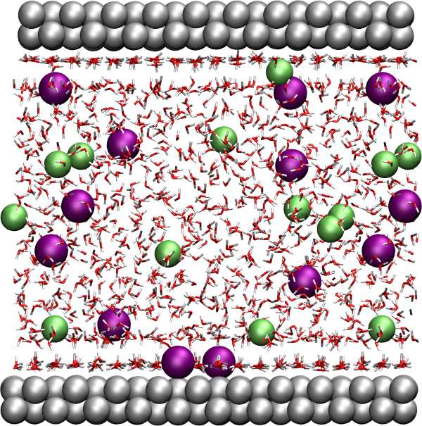
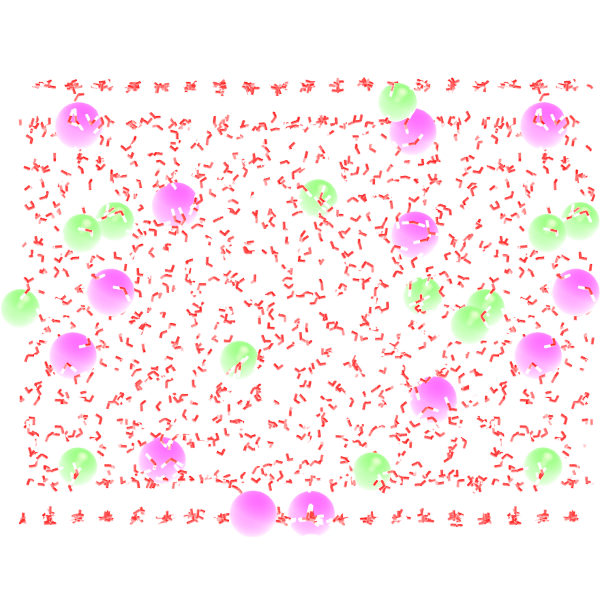

.. _umbrella-sampling-label:

Water adsorption in silica
**************************

..  container:: justify

    This tutorial is part of the *Monte Carlo* series.

.. container:: hatnote

    Adsorption of water in a silica crack using the
    grand canonical Monte Carlo method

..  container:: justify

    The objective of this tutorial is to combine molecular
    dynamics and grand canonical Monte Carlo simulations to
    simulate the adsorption of water molecules in a cracked
    silica.

    This tutorial illustrates the use of the grand canonical
    ensemble in molecular simulation, an ensemble in which the number of 
    molecule/atom is not constant.
