.. _umbrella-sampling-label:

Simple free energy calculation
******************************

..  container:: justify

    This tutorial is part of the *Free energy* series.

.. container:: hatnote

    A simple sampling of a free energy barrier using WHAM

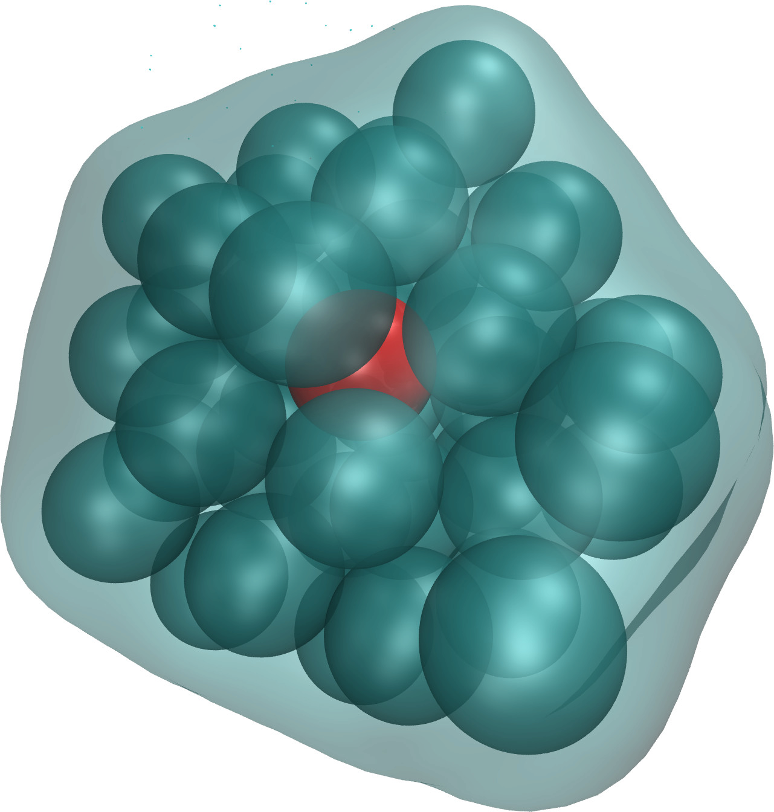

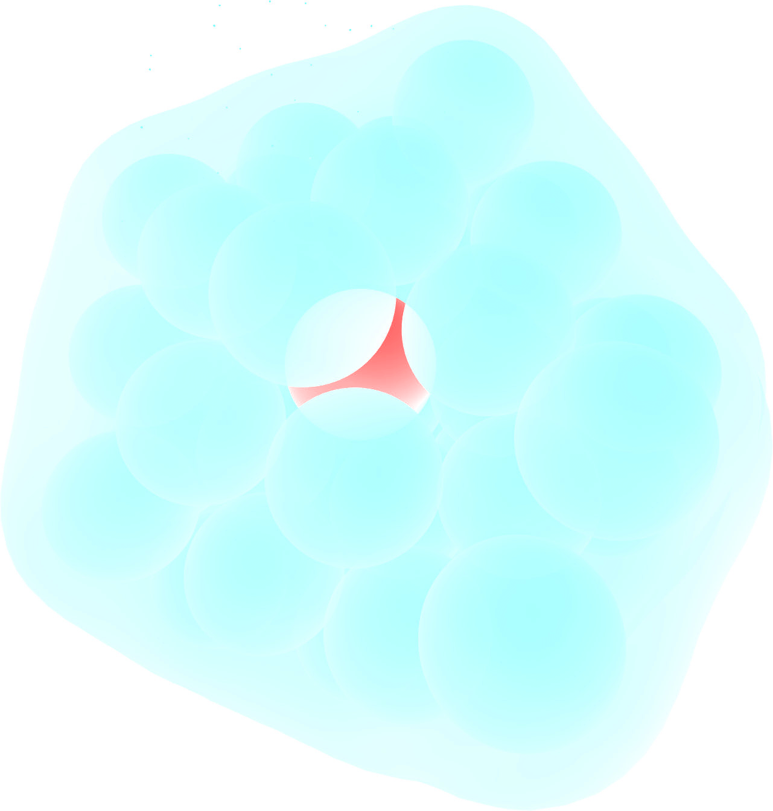

..  container:: justify

    The objective of this tutorial is to measure the free
    energy profile across a barrier potential using two methods:
    free sampling and umbrella sampling. For the sake of
    simplicity and in order to reduce computation time, the
    barrier potential will be imposed artificially to the atoms.
    The procedure is valid for more complex
    systems, and can be adapted to many other situations (e.g.
    for measuring adsorption barrier near a wall, or translocation
    barrier through a membrane).

Method 1: Free sampling
=======================

..  container:: justify

    One way to calculate the free energy profile is to extract
    the partition function from a classic (unbiased) molecular
    dynamics simulation, and then to estimate the Gibbs free
    energy using :math:`\Delta G = -RT \ln(p/p_0)`, where
    :math:`\Delta G` is the free energy difference, R the
    gas constant, T the temperature, p the
    pressure, and :math:`p_0` the reference pressure.
    As an illustration, let us apply this method to an
    extremely simple configuration that consists in a few
    particles diffusing in a box in presence of a
    position-dependent repealing force that makes the centre
    of the box a relatively unfavourable area to explore.

Basic LAMMPS parameters
-----------------------

..  container:: justify

    Create a folder named FreeSampling/, and create an input script named input.lammps in it. Copy the following lines:

..  code-block:: bash
    :caption: *to be copied in FreeSampling/input.lammps*

    # define some variables
    variable sigma equal 3.405 # Angstrom
    variable epsilon equal 0.238 # Kcal/mol
    variable U0 equal 2*${epsilon} # Kcal/mol
    variable dlt equal 0.5 # Angstrom
    variable x0 equal 5  # Angstrom

    # initialise the simulation
    units real
    atom_style atomic
    pair_style lj/cut 3.822 # 2^(1/6) * 3.405 WCA potential
    pair_modify shift yes
    boundary p p p

..  container:: justify

    Here we start by defining variables for the Lennard-Jones
    interaction :math:`\sigma` and :math:`\epsilon` and for
    the repulsive potential :math:`U (x)`: :math:`U_0`, :math:`\delta`, and :math:`x_0`, 
    see the analytical expression below.

    The system of unit 'real' (for which energy is in kcal/mol, distance in Ångstrom,
    time in femtosecond) has been chosen for practical reason,
    as the WHAM algorithm we are going to use in the second
    part of the tutorial automatically assumes the energy to
    be in kcal/mol. Atoms will interact through a
    Lennard-Jones potential with a cut-off equal to 
    :math:`\sigma \times 2 ^ {1/6}` (i.e. a WCA repulsive
    potential). The potential is shifted to be equal to 0 at
    the cut-off using the pair_modify.

System creation and settings
----------------------------

..  container:: justify

    Let us define the simulation block and randomly add atoms:

..  code-block:: bash
    :caption: *to be copied in FreeSampling/input.lammps*

    # define the system
    region myreg block -25 25 -20 20 -20 20
    create_box 1 myreg
    create_atoms 1 random 60 341341 myreg

    # settings
    mass * 39.95
    pair_coeff * * ${epsilon} ${sigma}
    neigh_modify every 1 delay 4 check yes

..  container:: justify

    Argon has been chosen as the gas of interest, which explains
    the values of the Lennard-Jones parameters :math:`\sigma` and
    :math:`\epsilon`, as well as the mass m = 39.95
    grams/mole. The variables :math:`U_0`, :math:`\delta`, and
    :math:`x_0` are used to create the potential. I have chosen it
    to be of the form: 

.. math::

    U(x) / U_0 = \arctan \left( \dfrac{x+x_0}{\delta} \right)- \arctan \left(\dfrac{x-x_0}{\delta} \right). 
    
..  container:: justify

    From the derivative of the
    potential with respect to :math:`x`, we obtain the expression
    for the force that we are going to impose to the particles
    in the simulation,

.. math::

    F(x)=U_0/((x-x_0)^2/\delta^2+1)/\delta-U_0/((x+x_0)^2/\delta^2+1)/\delta.

..  container:: justify

    The potential and force as a function of :math:`x` resemble:

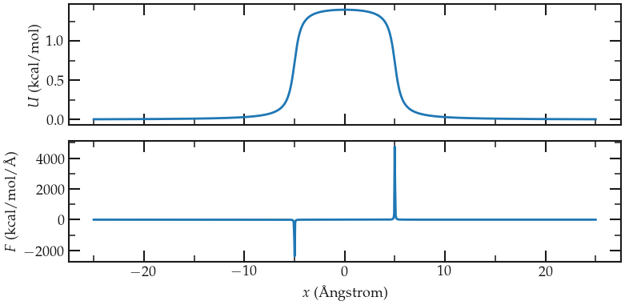

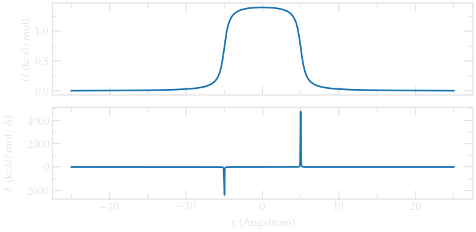

   Potential :math:`U` and force :math:`F` imposed to the particle.

**Energy minimization and equilibration**

..  container:: justify

    Let us minimize the energy, and then impose \\(F(x)\\) to
    all of the atoms in the simulation using the 'addforce'
    command:

..  code-block:: bash
    :caption: *to be copied in FreeSampling/input.lammps*

    # --------------------- Run
    minimize 1e-4 1e-6 100 1000
    reset_timestep 0

    variable U atom ${U0}*atan((x+${x0})/${dlt})-${U0}*atan((x-${x0})/${dlt})
    variable F atom ${U0}/((x-${x0})^2/${dlt}^2+1)/${dlt}-${U0}/((x+${x0})^2/${dlt}^2+1)/${dlt}
    fix myadf all addforce v_F 0.0 0.0 energy v_U

..  container:: justify

    Finally, let us combine the fix nve with a Langevin
    thermostat to run a molecular dynamics simulation. With
    these two commands, the MD simulation is effectively in the
    NVT ensemble (constant number of atoms:math:`N`, constant
    volume :math:`V`, and constant temperature :math:`T`. Let us
    perform an equilibration step of 2000000 timestep (4
    nanoseconds). To make sure that 4 ns is long enough, let us
    record the evolution of the number of atoms in the central
    (energetically unfavorable) region called 'mymes':

..  code-block:: bash
    :caption: *to be copied in FreeSampling/input.lammps*

    fix mynve all nve
    fix mylgv all langevin 119.8 119.8 100 1530917

    region mymes block -5 5 INF INF INF INF 
    variable n_center equal count(all,mymes)
    fix myat all ave/time 100 500 50000 v_n_center file density_evolution.dat

    timestep 2.0
    thermo 100000
    run 2000000

Run and data acquisition
------------------------

..  container:: justify

    Finally, let us record the density profile of the atoms
    along the :math:`x` axis using the 'ave/chunk' command. A
    total of ten density profiles will be printed. Timestep is
    reset to 0 to synchronize with the output times of
    density/number, and the fix 'myat' is canceled (it has to be
    canceled before a reset time).

..  code-block:: bash
    :caption: *to be copied in FreeSampling/input.lammps*

    unfix myat
    reset_timestep 0

    compute cc1 all chunk/atom bin/1d x 0.0 1.0
    fix myac all ave/chunk 10 1000000 10000000 cc1 density/number file density_profile_10run.dat
    dump mydmp all atom 100000 dump.lammpstrj

    run 10000000

..  container:: justify

    The simulation needs a few minutes to complete. You can
    visualize the dump file using VMD.

Data analysis
--------------

..  container:: justify

    First, let us make sure that the equilibration duration of 4
    ns is long enough by looking at the 'density_evolution.dat'
    file (left panel):

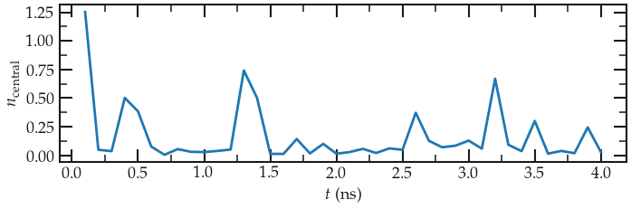

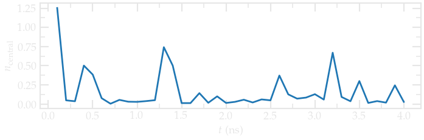

   Evolution of the number of atoms in the central region during equilibration. 
   
..  container:: justify

    Here we can clearly see that the number of atom in the
    central region quickly evolves to an equilibrium value.
    Therefore the chosen equilibration of 4 ns is long enough.

    Let us also plot the equilibrium density profile :math:`\rho`:

.. figure:: ../figures/umbrellasampling/density_profile-light.png
   :alt: Averaged density profile
   :class: only-light

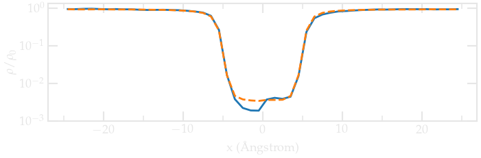

   Averaged density profile (the dashed line is a 200 ns simulation, the full line is 20 ns). 
   The value :math:`\rho_0 = 0.0011` was estimated from the raw density profile.

..  container:: justify

    Then, let us plot :math:`-R T \ln(\rho/\rho_0)` and compare it
    with the imposed (reference) potential :math:`U`:

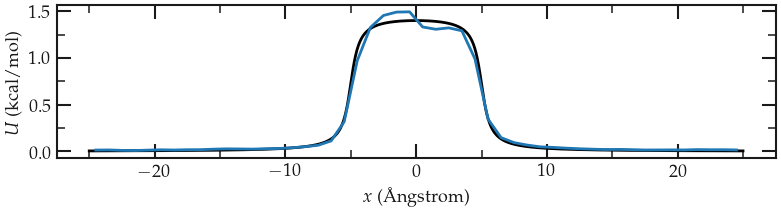

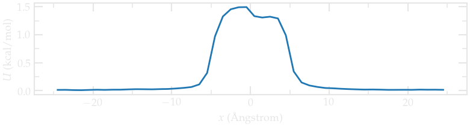

   Calculated potential :math:`-R T \ln(\rho/\rho_0)` compared to imposed potential.
   The calculated potential is in blue. The simulation is 20 ns long.

..  container:: justify

    The agreement with the expected energy profile
    (despite a bit of noise in the central part). For longer simulations, the 
    agreement gets better:

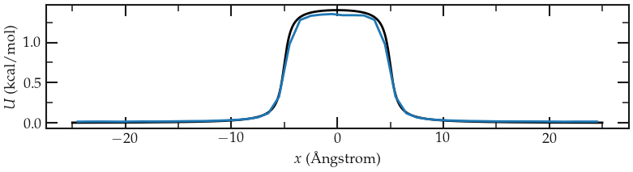

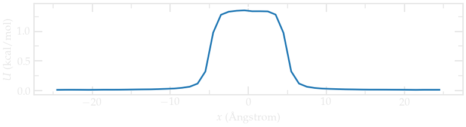

   Calculated potential :math:`-R T \ln(\rho/\rho_0)` compared to imposed potential.
   The calculated potential is in blue. The simulation is 200 ns long.

The limits of free sampling
---------------------------

..  container:: justify

    If we increase the value of :math:`U_0`, the average number of
    atoms in the central region will decrease, making it
    difficult to obtain a good resolution for the free energy
    profile. For instance, multiplying :math:`F` by a factor of 5,
    one gets an average concentration :math:`\rho \sim 0` in
    the central part, which makes it impossible to estimate
    :math:`U (x)` (unless running the simulation for a much longer
    time (possibly days)).

    In that case, it is better to use more evolved methods,
    such as umbrella sampling, to extract free energy profiles.
    This is what we are going to do next.

Method 2: Umbrella sampling
===========================

..  container:: justify

    Umbrella sampling is a 'biased molecular dynamics' method,
    i.e a method in which additional forces are added to the
    atoms in order to make the 'unfavourable states' more likely
    to be explored: here, we are going to force a single atom to
    explore the central region. Starting from the same system as
    previously, we are going to add a potential :math:`V` to one
    of the particle, and force it to move along the axe :math:`x`.
    The chosen path is called the axe of reaction. The final
    simulation will be analysed using the weighted histogram
    analysis method (WHAM), which allows to remove the effect of
    the bias and eventually deduce the unbiased free energy
    profile.

**LAMMPS input script**

..  container:: justify

    Create a new folder called BiasedSampling/, and create a new input file 
    named input.lammps in it, copy the following lines:

..  code-block:: bash
    :caption: *to be copied in BiasedSampling/input.lammps*

    # define a bunch of variables
    variable sigma equal 3.405 # Angstrom
    variable epsilon equal 0.238 # Kcal/mol
    variable U0 equal 10*${epsilon} # Kcal/mol
    variable dlt equal 0.5 # Angstrom
    variable x0 equal 5.0  # Angstrom
    variable k equal 1.5 # Kcal/mol/Angstrom^2

    # initialise the simulation
    units real
    atom_style atomic
    pair_style lj/cut 3.822 # 2^(1/6) * 3.405 WCA potential
    pair_modify shift yes
    boundary p p p

    # define the system
    region myreg block -25 25 -20 20 -20 20
    create_box 2 myreg
    create_atoms 2 single 0 0 0
    create_atoms 1 random 5 341341 myreg

    # settings
    mass * 39.948
    pair_coeff * * ${epsilon} ${sigma}
    neigh_modify every 1 delay 4 check yes
    group topull type 2

    # run
    variable U atom ${U0}*atan((x+${x0})/${dlt})-${U0}*atan((x-${x0})/${dlt})
    variable F atom ${U0}/((x-${x0})^2/${dlt}^2+1)/${dlt}-${U0}/((x+${x0})^2/${dlt}^2+1)/${dlt}
    fix pot all addforce v_F 0.0 0.0 energy v_U

    fix mynve all nve
    fix mylgv all langevin 119.8 119.8 100 1530917
    timestep 2.0
    thermo 100000
    run 2000000
    reset_timestep 0

    dump mydmp all atom 1000000 dump.lammpstrj

..  container:: justify

    So far, this code resembles the one of Method 1,
    except for the additional particle of type 2. This
    particle is identical to the particles of type 1 (same
    mass and Lennard-Jones parameters), and will be the only
    one to feel the biasing potential.

    The value of the potential :math:`U_0` was chosen to be larger than in part 1, 
    just because we can.

    Let us create a loop with 67 steps, and move progressively
    the centre of the bias potential by increment of 0.3 nm:

..  code-block:: bash
    :caption: *to be copied in BiasedSampling/input.lammps*

    variable a loop 50
    label loop
    variable xdes equal ${a}-25
    variable xave equal xcm(topull,x)
    fix mytth topull spring tether ${k} ${xdes} 0 0 0
    run 200000
    fix myat1 all ave/time 10 10 100 v_xave v_xdes file position.${a}.dat
    run 200000
    unfix myat1
    next a
    jump SELF loop

..  container:: justify

    The spring command serves to impose the
    additional harmonic potential with spring constant :math:`k`.
    Note that the value of :math:`k` should be chosen with care,
    if its too small, the particle wont follow the biasing potential
    center, if its too large, there will be no overlapping between the 
    different windows.

    The centre of the harmonic potential :math:`x_\text{des}`
    successively takes values from -25 to 25. For each value of
    :math:`x_\text{des}`, an equilibration step of 400 ps is
    performed, followed by a step of 400 ps during which the
    position along :math:`x` of the particle is saved in data
    files (one data file per value of :math:`x_\text{des}`). You
    can increase the duration of the run for better samplings,
    but 0.4 ps returns reasonable results despite being really
    fast (it should only take a few minutes).

On the choice of k
------------------

..  container:: justify

    As already stated, the difficult part is to choose the value of :math:`k`. You
    want the biasing potential to be strong enough to force
    the atom to move along the axis, and you also want the
    fluctuations of the atom position to be large enough to
    have some overlap in the density probability of two
    neighbor positions, like we have here:

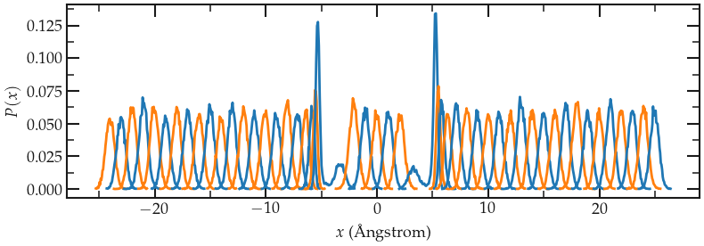

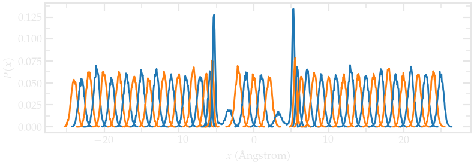

    Density probability for each run with :math:`k = 1.5` Kcal/mol/Å^2. Note the good
    overlapping between neighbor distributions.

..  container:: justify

    If :math:`k` is too small, the particle never explore the 
    region of interest:

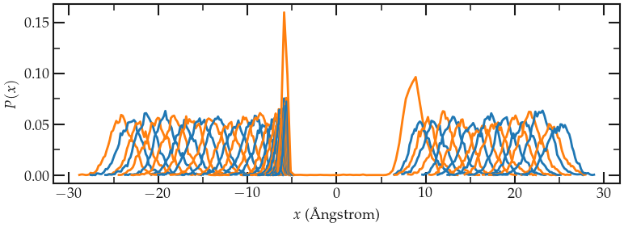

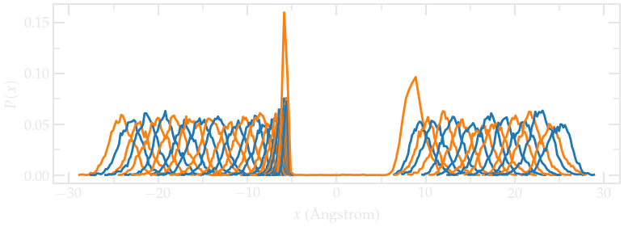

    Density probability for each run with :math:`k = 0.15` Kcal/mol/Å^2. 
    The particle doesn't even explore the middle region.

..  container:: justify

    If :math:`k` is too large, the biasing potential is too large 
    compared to the thermal energy:

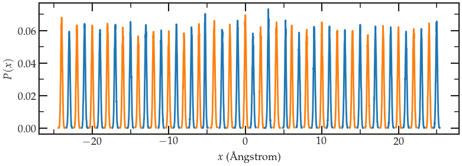

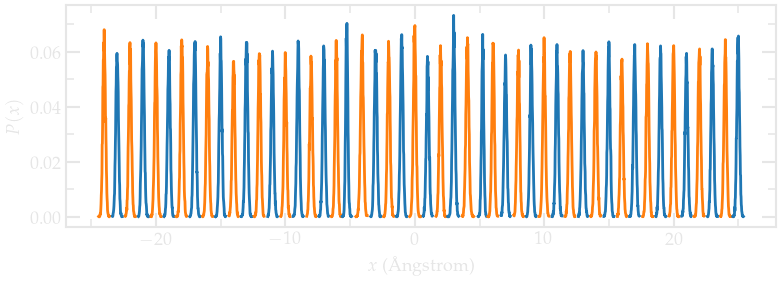

    Density probability for each run with :math:`k = 15` Kcal/mol/Å^2. 
    Note the bad overlap between neighbor windows.

WHAM algorithm
--------------

..  container:: justify

    In order to generate the free energy profile from the density distribution, we are going to use the WHAM
    algorithm. You can download and compile the version of `Alan
    Grossfield <http://membrane.urmc.rochester.edu/?page_id=126>`__.
    It can be compiled by simply running:

..  code-block:: bash

    cd wham
    make clean
    make

..  container:: justify

    It creates an executable called wham that you can 
    copy in the BiasedSampling folder.

    In order to apply the WHAM algorithm to our simulation, we
    first need to create a metadata file. This file simply
    contains the paths of the data files, the value of
    :math:`x_\text{des}`, and the values of :math:`k`. To generate
    the file more easily, you can run this script using Octave
    or Matlab (assuming that the wham algorithm is located in
    the same folder as the LAMMPS simulations):

..  code-block:: bash

    file=fopen('metadata.dat','wt');
    for a=1:50
        X=['./position.',num2str(a),'.dat ',num2str(a-25),' 1.5'];
        fprintf(file,X);
        fprintf(file,'\n');
    end

..  container:: justify

    The generated file named metadata.dat looks like that:

..  code-block:: bash

    ./position.1.dat -24 1.5
    ./position.2.dat -23 1.5
    ./position.3.dat -22 1.5
    ./position.4.dat -21 1.5
    ./position.5.dat -20 1.5
    (...)
    ./position.48.dat 23 1.5
    ./position.49.dat 24 1.5
    ./position.50.dat 25 1.5

..  container:: justify

    Here you can download my `metadata.dat <../../../../../../inputs/freeenergy/BiasedSampling/metadata.dat>`__ file.

    Then, simply run the following command in the terminal:

..  code-block:: bash

    ./wham -25 25 50 1e-8 119.8 0 metadata.dat PMF.dat

..  container:: justify

    where -25 and 25 are the boundaries, 50 the number of bins,
    1e-8 the tolerance, and 119.8 the temperature. A file named
    PMF.dat has been created, and contains the free energy
    profile in Kcal/mol.

**Results**

..  container:: justify

    We can compare the PMF with we the imposed potential, and
    the agreement in again quite good despite the very short
    calculation time:

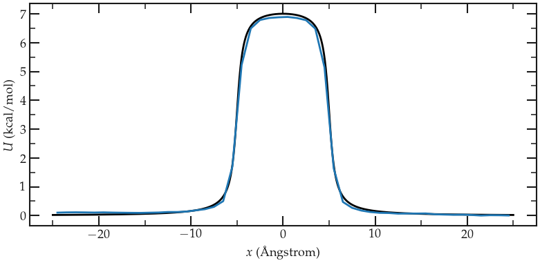

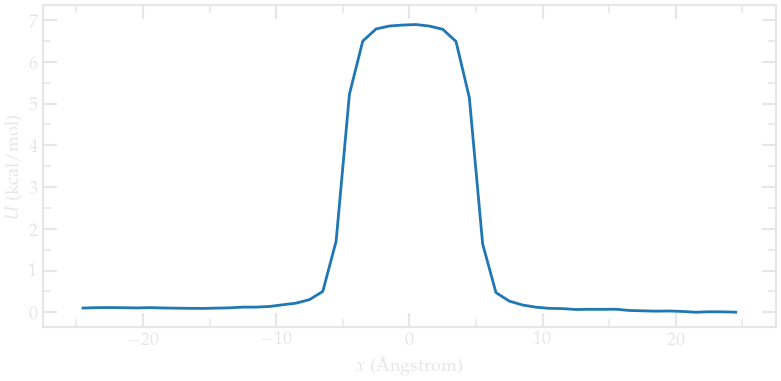

    Calculated potential using umbrella sampling compared to the imposed potential.
    The calculated potential is in blue.

Going further with exercises
============================

.. include::  ../../contact/requestsolution.rst
        
**Exercise 1: Monte Carlo versus molecular dynamics**

..  container:: justify

    Use a Monte Carlo procedure to equilibrate the system
    instead of molecular dynamics. Is it more efficient than
    molecular dynamics?

    Pure MC move can be made using the fix gcmc.

**Exercise 2 : Binary fluid simulation**

..  container:: justify

    Create a molecular simulation with two species, and apply a
    different potential on them using addforce to create the
    following situation:

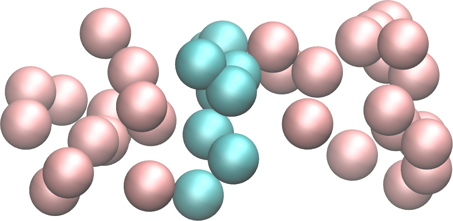

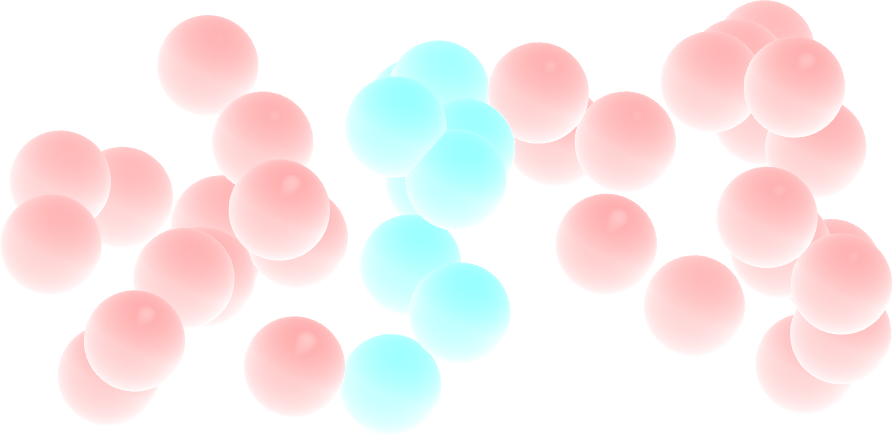

**Exercise 3 : Adsorption energy of a molecule at a solid wall**

..  container:: justify

    Apply umbrella sampling to calculate the free energy profile
    of a molecule of your choice normally to a solid wall.

.. include:: ../../contact/contactme.rst

.. 

    A non-equilibrated system containing a few ethanol
    molecules can be downloaded:
    `here <https://github.com/lammpstutorials/lammpstutorials.github.io/tree/main/inputs/06-FreeEnergy/exercice3>`__
    (the method to create this system using molecules
    structures downloaded from the ATB is given in the
    `solutions to the
    exercises <https://www.patreon.com/molecularsimulations>`__)
