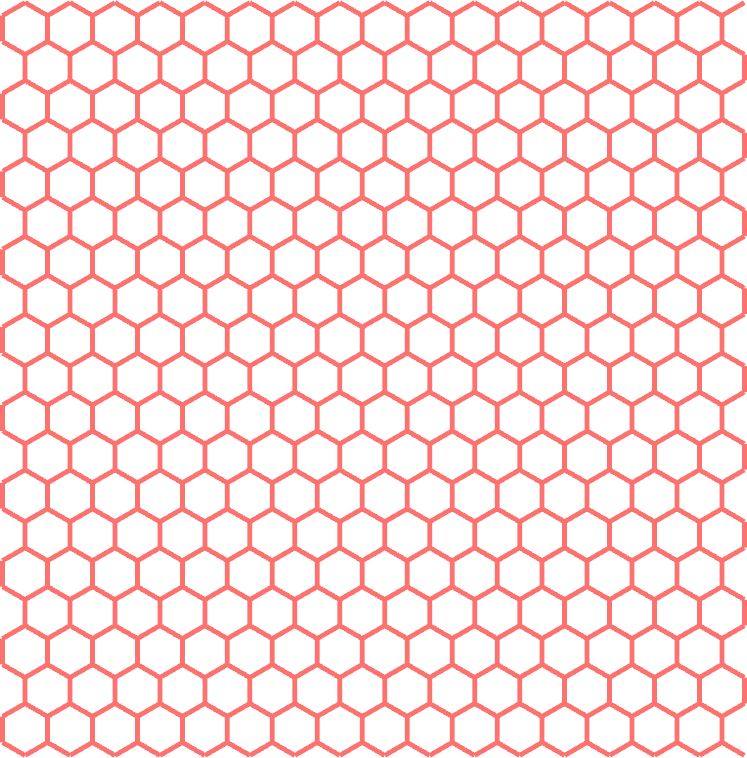
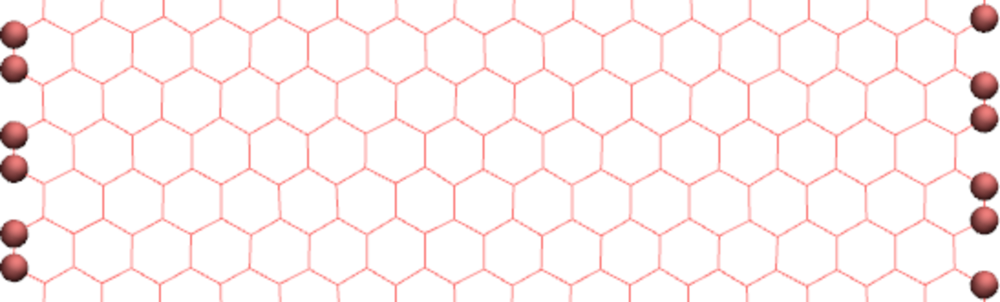

.. _`graphene-label`:

Graphene under deformation
**************************

.. container:: hatnote

   Longitudinal deformation of a small graphene sheet

..  container:: justify

   In this tutorial, a graphene sheet
   is generated using VMD and topotool, and is then
   deformed using an applied displacement.

.. include:: ../contact/needhelp.rst

Generation of the system
========================

..  container:: justify

   The initial configuration (atoms positions, bonds, angles,
   etc.) is generated using |VMD_uiuc|. Open VMD,
   and go to Extensions, Modeling, Nanotube Builder. A window
   named Carbon Nanostructures opens up, allowing us to choose
   between generating sheet and nanotube of graphene or BN. For
   this tutorial, let us generate a 4 nm per 4 nm sheet of
   graphene. Simply change the values of "Edge length along x"
   and "Edge length along y" to 4, and click on "Generate
   Sheet(s)". You should something like the image on the right 
   (here I changed the original color a little bit, 
   but that is not necessary).

.. |VMD_uiuc| raw:: html

   <a href="https://www.ks.uiuc.edu/Research/vmd/" target="_blank">VMD</a>

.. figure:: figures/graphene/vmd_dark.png
    :alt: graphene in vacuum image VMD
    :width: 250
    :align: right
    :class: only-dark

..  container:: justify

    At this point, this is not a molecular dynamics simulations,
    but a cloud of dots that looks like graphene. 
    In the VMD terminal, set the box
    dimensions by typing the following command in the VMD
    terminal:

..  code-block:: bw
    :caption: *to be written in the VMD terminal*

    molinfo top set a 80  
    molinfo top set b 80            
    molinfo top set c 80 

..  container:: justify

    The values of 80 in each direction have been chosen
    so that the box is much larger than the graphene sheet.

    In order to
    generate the initial LAMMPS data file, let us use Topotool:
    to generate the LAMMPS data file, enter the following command:

..  code-block:: bw
    :caption: *to be written in the VMD terminal*

    topo writelammpsdata carbon.data molecular

..  container:: justify

    Here molecular refers to the LAMMPS atom_style, and carbon.data
    to the name of the file. 

    Note that I am using TopoTools v1.7. Older or newer versions 
    may require slightly different commands. 

    More details about these commands can be found on the
    personal page of |Axel_webpage|.
    In short, Topotool deduces the location of bonds, angles,
    dihedrals, and impropers from the positions of the atoms,
    and generates a file that can be read by LAMMPS.

.. |Axel_webpage| raw:: html

   <a href="https://sites.google.com/site/akohlmey/software/topotools" target="_blank">Axel Kohlmeyer</a>

..  container:: justify

    The keyword "full" corresponds to the LAMMPS atom full
    style (other possibilities include atomic, bond, charge,
    etc). The parameters of the constraints (bond length,
    dihedral coefficients, etc.) will be given later.

    A new file named "carbon.data" has been created, it starts
    like that:

..  code-block:: lammps

    LAMMPS data file. CGCMM style. atom_style molecular generated by VMD/TopoTools v1.7 on Tue Apr 04 15:58:11 CEST 2023
    680 atoms
    983 bonds
    1894 angles
    3665 dihedrals
    608 impropers
    1 atom types
    1 bond types
    1 angle types
    1 dihedral types
    1 improper types
    -20.965628 59.034372  xlo xhi
    -19.438999 60.561001  ylo yhi
    -40.000000 40.000000  zlo zhi

..  container:: justify

    As you can see, the carbon.data file contains information
    about the positions of the carbons atoms, as well as the
    identity of the atoms that are linked by bonds, angles, dihedrals,
    and impropers constraints.

    Save the "carbon.data" file in the same folder as your
    future LAMMPS input script.

    We are done with the system
    generation, we can start the molecular dynamics simulations.

    Alternatively, you can download the file I did generate 
    by clicking  |download_carbon_data|, and continue with the tutorial.

.. |download_carbon_data| raw:: html

   <a href="../../../../inputs/graphene-under-deformation/carbon.data" target="_blank">here</a>

LAMMPS input script
===================

..  container:: justify

   Create a new text file and name it "input.lammps". Copy the
   following lines in it:

..  code-block:: lammps
   :caption: *to be copied in input.lammps*

   # Initialisation

   variable T equal 300

   units real
   atom_style molecular
   boundary f f f
   pair_style lj/cut 14

   bond_style harmonic
   angle_style harmonic
   dihedral_style opls
   improper_style harmonic

   special_bonds lj 0.0 0.0 0.5

   read_data carbon.data

..  container:: justify

    The unit system is real (distance are in Angstrom, time in femtosecond),
    atom style is molecular (atoms are dots that can be bonded with each other),
    and the boundary conditions are fixed. The boundary conditions
    do not matter much here, as the box boundaries are far from the graphene sheet. 

    Here the pair style is lj/cut (i.e. a Lennard Jones potential 
    with a short range cutoff) with
    parameter 14, which means that the atoms closer than 14
    Angstroms from each others interact through a Lennard-Jones
    potential. Notice that there is no Coulombic interaction
    because all the atoms in pure graphene have a charge of 0.
    The bond, angle, dihedral, and improper styles specify the
    different potentials used to restrain the positions of the
    atoms. For more details, have a look at the LAMMPS website
    (see for example the |OPLS|).

.. |OPLS| raw:: html

   <a href="https://lammps.sandia.gov/doc/dihedral_opls.html" target="_blank">OPLS dihedral style</a>

..  container:: justify

    The last command (read_data) imports the carbon.data file
    previously generated with VMD, which contains the
    information about the box size, atoms positions, etc.

.. admonition:: About interaction between neighbors atoms
    :class: info
        
    Atoms connected by a bond do not typically interact through
    Lennard-Jones interaction. This is ensured here by the
    special_bonds command. The three numbers of the
    special_bonds command are weighting factors for the
    Lennard-Jones interaction between atoms connected by bond
    (respectively directly bounded C-C, separated by two bonds C-C-C,
    and separated by three bonds C-C-C-C). For instance, the
    first weighting factor, with a
    value of 0, imposes that two atoms connected by a bond do
    not interact through a Lennard-Jones potential (therefore
    they only interact through the harmonic potential that bond the atoms
    of the graphene).

Parameters for the graphene
===========================

..  container:: justify

    Next, we need to specify the parameters of both bonded and
    non-bonded interactions. Create a new text file in the same
    folder and name it "PARM.lammps". Copy the following lines
    in it:

..  code-block:: lammps
    :caption: *to be copied in PARM.lammps*

    pair_coeff 1 1 0.066047 3.4
    bond_coeff 1 469 1.4
    angle_coeff 1 63 120
    dihedral_coeff 1 0 7.25 0 0
    improper_coeff 1 5 180

..  container:: justify

    The pair_coeff sets the Lennard-jones parameters
    :math:`\epsilon` and :math:`\sigma` for the only type of
    atom of the simulation: carbon atom of type 1. The
    bond_coeff provides the equilibrium distance :math:`r_0` as
    well as the spring constant :math:`K` for the harmonic
    potential imposed between two neighboring carbon atoms,
    where the potential is :math:`E = K_r ( r - r_0)^2`. The
    angle_coeff gives the equilibrium angle \\(\\theta_0\\) and
    constant for the potential between three neighbors atoms :
    :math:`E = K_\theta ( \theta - \theta_0)^2`. The dihedral_coeff
    and improper_coeff give the potential for the constraints
    between 4 atoms. The file PARM.lammps need to be included in the
    simulation by adding the following line to input.lammps:

..  code-block:: lammps
    :caption: *to be copied in input.lammps*

    include PARM.lammps

Recenter the atoms in the box
=============================

..  container:: justify

    The graphene sheet generated by topotool is not centered in the box. 
    The box itself is not symmetric, as its coordinates are 

..  code-block:: lammps

    -20.965628 59.034372  xlo xhi
    -19.438999 60.561001  ylo yhi
    -40.000000 40.000000  zlo zhi

..  container:: justify

    Let us create a cleaner initial state by recentering the graphene
    at the origin (0, 0, 0), and symmetrize the box.

    In the LAMMPS input, copy:

..  code-block:: lammps
    :caption: *to be copied in input.lammps*

    group gcar type 1
    variable xcm equal -1*xcm(gcar,x)
    variable ycm equal -1*xcm(gcar,y)
    variable zcm equal -1*xcm(gcar,z)
    displace_atoms gcar move ${xcm} ${ycm} ${zcm}

..  container:: justify

    The first command includes all of the atoms of type one
    (i.e. all the atoms here) in a group named 'gcar'. 
    The 3 variables measure the current position of the group gcar
    along all 3 directions, respectively. Then, the displace atoms 
    command move the group gcar, ensuring that its center of mass 
    is located at the origin (0, 0, 0).

    Let us also slightly reduce the box size, and give it cleaner and symmetric value.

..  code-block:: lammps
    :caption: *to be copied in input.lammps*

    change_box all x final -35.0 35.0 y final -35.0 35.0 z final -15.0 15.0

.. admonition:: About the atom style
    :class: info

    A cleaner initial state, as we did here, wont make any difference to the simulation, but 
    can make the future data analysis more practical.

Separate the atoms into 3 groups
================================

..  container:: justify

   The main goal of the present tutorial is to impose a
   deformation to the sheet. To do so, we will isolate the
   atoms from the two edges of the graphene sheets and place them into groups.
   Then, the displacement will be applied to the atoms of the edges.
   Add the following lines to the input script :

..  code-block:: lammps
   :caption: *to be copied in input.lammps*

   variable xmax equal bound(gcar,xmax)-0.5
   variable xmin equal bound(gcar,xmin)+0.5
   region rtop block ${xmax} INF INF INF INF INF
   region rbot block INF ${xmin} INF INF INF INF
   region rmid block ${xmin} ${xmax} INF INF INF INF

..  container:: justify
   
   The variable :math:`x_\mathrm{max}` corresponds to
   the coordinate of the last atoms along \\(x\\) minus 0.5
   Angstroms, and :math:`x_\mathrm{min}` to the coordinate of
   the first atoms along :math:`x` plus 0.5 Angstroms. Then, 3
   regions are defined, and correspond respectively to: :math:`x < x_\mathrm{min}`, 
   :math:`x_\mathrm{min} > x > x_\mathrm{max}`, and  
   :math:`x > x_\mathrm{max}`.
   
   Finally, let us define 3 groups of atoms
   corresponding to the atoms located in each of the 3 regions,
   respectively:

..  code-block:: lammps
   :caption: *to be copied in input.lammps*

   group gtop region rtop
   group gbot region rbot
   group gmid region rmid

..  container:: justify

    The atoms of the edges as selected within the gtop and gbot groups 
    are represented by spheres:

.. figure:: figures/graphene/group-dark.png
    :alt: graphene in vacuum image VMD with selected groups at the edges
    :class: only-dark

.. admonition:: Tip
    :class: info

    ..  container:: justify

        When running a simulation, the number of atoms in each
        group is printed in the terminal (and in the log.lammps
        file). Alway control that the number of atoms is the one you expect.

        Here I see:

    ..  code-block:: bash

        20 atoms in group gtop
        20 atoms in group gbot
        640 atoms in group gmid

    ..  container:: justify

        which is consistent with what I expect when looking at the system 
        using VMD.

Thermalisation and dynamics
===========================

..  container:: justify

   Let us specify the thermalisation and the dynamics of the
   system. Add the following lines to input.lammps:

..  code-block:: lammps
   :caption: *to be copied in input.lammps*

   velocity gmid create ${T} 48455 mom yes rot yes
   fix mynve all nve
   compute Tmid gmid temp
   fix myber gmid temp/berendsen ${T} ${T} 100
   fix_modify myber temp Tmid

..  container:: justify

   The "velocity create" command gives initial velocities to
   the atoms of the group gmid, assuring an initial temperature
   of 300 K for these atoms. 
   
   The fix nve is applied to all
   atoms so that atoms positions are recalculated
   every timestep, and a Berendsen thermostat is applied to the atoms
   of the group gmid only. The "fix modify" ensures that the
   fix Berendsen uses the temperature of the group gmid as an
   input, instead of the temperature of whole system (as the 
   frozen edges would biase the temperature). The atoms
   of the edges are not thermalised because their motion will
   be restrained in the next part of the input.

.. admonition:: Deal with semi-frozen system
    :class: info

    Always be carefull when part of a system is frozen. In that 
    case, the total temperature of the system is effectively lower
    than the applied temperature because the frozen atoms 
    have a temperature of 0. If you have any doubt about the procedure
    you are using, simply print the temperature of the non-frozen group using fix ave/time:

    ..  code-block:: lammps
        :caption: *to be copied in input.lammps*

        fix at1 all ave/time 10 100 1000 c_Tmid file temperature.dat

Restrain the motion of the edges
================================

..  container:: justify

   To restrain the motion of the atoms at the edges, add the
   following commands:

..  code-block:: lammps
   :caption: *to be copied in input.lammps*

   fix mysf1 gtop setforce 0 NULL 0
   fix mysf2 gbot setforce 0 NULL 0
   velocity gtop set 0 NULL 0
   velocity gbot set 0 NULL 0

..  container:: justify

   The two setforce commands cancel the forces applied on the
   atoms of the two edges, respectively. Fix setforce apply during the whole
   simulation, and are here applying only along :math:`x` and :math:`z`. The two velocity
   commands set the initial velocities along :math:`x` and
   :math:`z` to 0 for the atoms of the edges. Therefore, the
   atoms of the edges will remain immobile during the
   simulation (or at least they would if no other command was applied to them).

.. admonition:: On imposing a constant velocity to a system
    :class: info

    The 'velocity set' commands impose the velocity of a group of atoms *when it is 
    read*, but do not enforce the velocity during the entire simulation. 

    When 'velocity set' is used in combination with 'setforce 0', the atoms will
    feel no force from the rest of the simulation. Accoring to the Newton equation,
    no force means no acceleration, meaning that the initial velocity will persist.

Data extraction
===============

..  container:: justify

    Next, in order to measure the strain and stress suffered by the
    graphene sheet, let us extract the distance :math:`L` between
    the two edges as well as the force applied on the edges. Let
    us also add a command to print the atom coordinates in a
    lammpstrj file every 1000 timeteps:

..  code-block:: lammps
    :caption: *to be copied in input.lammps*

    variable L equal xcm(gtop,x)-xcm(gbot,x)
    fix at2 all ave/time 10 100 1000 v_L file length.dat
    fix at3 all ave/time 10 100 1000 f_mysf1[1] f_mysf2[1] file force.dat
    dump mydmp all atom 1000 dump.lammpstrj

.. admonition:: About `f_`, `v_`, and `c_`
    :class: info

    Notice that the values of the force on each edge are
    extracted from the fixes setforce 'mysf1' and 'mysf2', by
    calling them using `f_`, the same way variables are called
    using `v_` and computes are called using `c_`. A fix
    setforce cancels all the forces on a group of atoms every
    timestep, but allows one to extract the values of the force
    before its cancellation.

Run
===

..  container:: justify

    Let us run a small equilibration step to bring the system 
    to the required temperature without applying any deformation:

..  code-block:: lammps
    :caption: *to be copied in input.lammps*

    thermo 100
    thermo_modify temp Tmid

    timestep 1.0
    run 5000

..  container:: justify

    With the 'thermo_modify' command, we specify to LAMMPS that we
    want the temperature :math:`T_\mathrm{mid}` to be printed in
    the terminal, not the temperature of the entire system
    (because of the frozen edges, the temperature of the entire
    system is not relevant). 
    
Option A: Incremental elongation  
--------------------------------
    
..  container:: justify

    Let us perform a loop:

..  code-block:: lammps
    :caption: *to be copied in input.lammps*

    variable var loop 10
        label loop
        displace_atoms gtop move 0.1 0 0
        displace_atoms gbot move -0.1 0 0
        run 1000
        next var
        jump input.lammps loop

..  container:: justify
    
    At each step of the loop, the edges are slightly displaced, and
    the simulation runs for 1000. Then the variable 'var' is iterated
    by the 'next var', and the simulation 'jumps' back to the beginning of 
    the loop. It will be repeated 10 times, for a total elongation of the 
    graphene sheet of 2 x 0.1 x 10 = 2 Angstroms.

    What you observe should resemble |video_lammps_graphene|. The
    sheet is progressively elongated, and the carbon honeycombs
    are being deformed. You can increase the number of iteration
    of the loop (variable var) to force a larger elongation.

.. |video_lammps_graphene| raw:: html

   <a href="https://www.youtube.com/embed/o5IoCVWpPKg" target="_blank">this video</a>

..  container:: justify

   Always remember that what you measure and observe is only
   as good as your force field.

..  container:: justify

   With the present force field, no matter how large is the
   imposed deformation, the bonds will never break. To study
   such bond breaking, one has to use a reactive force
   field, which is done in some other tutorials here (like :ref:`carbon-nanotube-label`).

Option B: Constant-velocity elongation
--------------------------------------

..  container:: justify

    Instead of the loop, the deformation of the sheet can be ensured 
    using the velocity set command + the fix setforce (which are already there).

    To obtain the same elongation as previously (i.e. 2 Angstroms, or 1 Angstrom 
    per edge), using a velocity 
    for each edge of 0.0005 Angstroms per femtosecond (i.e. 50 meters per second), the simulation 
    must last 1 / 0.0005 = 2000 femtoseconds. 

..  code-block:: lammps
    :caption: *to be copied in input.lammps*

    velocity gtop set 0.0005 NULL 0
    velocity gbot set -0.0005 NULL 0
    run 2000

.. include:: ../contact/accessfile.rst

Going further with exercices
============================

Strain-stress curve (with solution)
-----------------------------------

Adapt the current script and extract a full strain-stress curve.

.. figure:: figures/graphene/strain-stain-curve-dark.png
    :alt: strain stain curve for determining the young modulus of graphene
    :class: only-dark

.. admonition:: Solution
    :class: dropdown

    The following steps are optional, but give a better result:

    - move fix at2 and at3 after the equilibration, so that it only records during the production run
    - reduce the velocity to perform a nice and slow graphene pull
    - increase the magnitude of the total elongation (10 Angstroms in total per edge)

    The strain can be calculated as the relative elongation of the sheet: strain = L - Linit / Linit,
    and the stress, in pressure unit, can be calculated as the force divided by the surface area
    of the graphene sheet: A = Ly x dC, where Ly in the length of the graphene sheet along y, here 4 nanometers,
    and dC the diameter of the carbon atoms (I used dC = 3.4 Angstrom, this choice is debatable).

    The python script I used to generate the stress-strain curve is |jupyter-notebook-stress-strain|. 

.. |jupyter-notebook-stress-strain| raw:: html

    <a href="../../../../inputs/graphene-under-deformation/exercice-stress-strain-curve/plot_stress_strain.py" target="_blank">here</a>

.. include:: ../contact/contactme.rst
