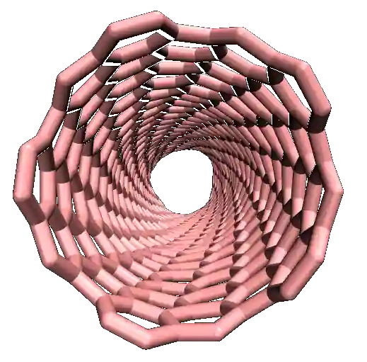
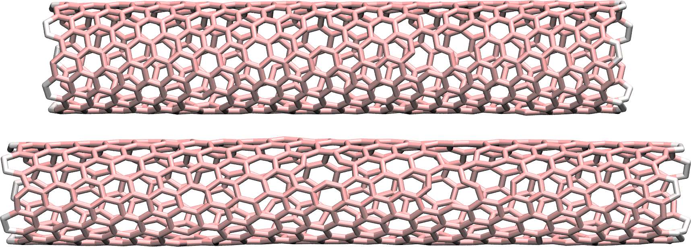

.. _carbon-nanotube-label:

Pulling on a carbon nanotube
****************************

.. container:: hatnote

   Stretching a carbon nanotube until it breaks

.. figure:: ../figures/level1/breaking-a-carbon-nanotube/CNT_light.webp
    :alt: carbon nanotube image in vacuum
    :height: 250
    :align: right
    :class: only-light

.. container:: abstract

    In this tutorial, a slightly more advanced system than the LJ gas
    in :ref:`lennard-jones-label` is used.
    The system is a small carbon nanotube (CNT) in vacuum. Some external 
    forcing are imposed to the CNT, and its deformation is measured.
    Two different force fields are used. First,
    a classical force field is used, for which the bonds between atoms
    are unbreakable. Second, a reactive force field named AIREBO is used.
    With AIREBO, the breaking of bonds under strong deformation is possible.

.. include:: ../../contact/recommand-lj.rst

.. include:: ../../contact/needhelp.rst

.. include:: ../../contact/2Aug2023.rst

Unbreakable bonds
=================

.. container:: justify

    With most classical molecular dynamics force fields, the chemical bonds
    between the atoms are set at the start of the simulation. Regardless of the 
    forces applied on the atoms during the simulations, the bonds remain intact.
    The bonds between neighbor atoms typically consist of springs with
    given equilibrium distances :math:`r_0` and
    constant :math:`k_b`:

.. math::

    U_b = k_b \left( r -r_0 \right)^2.

.. container:: justify

    Additionally, angular and dihedral constraints are usually applied to maintain
    the relative orientations of neighbor atoms. 

Create topology with VMD
------------------------

.. container:: justify

    When the system has a complex topology, like is the case of a CNT, 
    it is better to use an external preprocessing tool to create it.
    Many preprocessing tools exist, see a |prepross| on 
    the LAMMPS website. Here,|VMD_uiuc| is used.
    Alternatively, you can skip this part of the tutorial by downloading the 
    CNT topology I did create by clicking |download_cnt_molecular_data|, 
    and continue with the tutorial.

.. |download_cnt_molecular_data| raw:: html

   <a href="../../../../../inputs/level1/breaking-a-carbon-nanotube/unbreakable-bonds/cnt_molecular.data" target="_blank">here</a>

.. |prepross| raw:: html

    <a href="https://www.lammps.org/prepost.html" target="_blank">non-exhaustive list</a>

.. |VMD_uiuc| raw:: html

   <a href="https://www.ks.uiuc.edu/Research/vmd/" target="_blank">VMD</a>

.. container:: justify

    Open VMD, go to Extensions, Modeling, and then Nanotube Builder.
    A window named Carbon Nanostructures opens up, allowing us to choose
    between generating a sheet or a nanotube, made either of graphene or
    of Boron Nitride (BN). For this tutorial, let us generate a carbon nanotube.
    Keep all default values, and click on *Generate
    Nanotube*.

    At this point, this is not a molecular dynamics simulation,
    but a cloud of unconnected dots. In the VMD terminal, set the
    box dimensions by typing the following commands in the VMD terminal:

.. code-block:: bw

    molinfo top set a 80  
    molinfo top set b 80            
    molinfo top set c 80 

.. container:: justify

    The values of 80 in each direction have been chosen
    so that the box is much larger than the carbon nanotube.

    In order to generate the initial LAMMPS data file, let us use Topotool:
    to generate the LAMMPS data file, enter the following command
    in the VMD terminal:

.. code-block:: bw

    topo writelammpsdata cnt_molecular.data molecular

.. container:: justify

    Here *molecular* refers to the LAMMPS *atom_style*, and
    *cnt_molecular.data* is the name of the file. 

.. admonition:: About TopoTools
    :class: dropdown

    Note that I am using TopoTools v1.7. Older or newer versions 
    may require slightly different commands. 

    More details about these commands can be found on the
    personal page of |Axel_webpage|.
    In short, Topotools deduces the location of bonds, angles,
    dihedrals, and impropers from the respective positions of the atoms,
    and generates a *.data* file that can be read by LAMMPS.

.. |Axel_webpage| raw:: html

   <a href="https://sites.google.com/site/akohlmey/software/topotools" target="_blank">Axel Kohlmeyer</a>

.. container:: justify

    The parameters of the constraints (bond length,
    dihedral coefficients, etc.) will be given later.
    A new file named *cnt_molecular.data* has been created, it starts
    like that:

.. code-block:: lammps

    700 atoms
    1035 bonds
    2040 angles
    4030 dihedrals
    670 impropers
    1 atom types
    1 bond types
    1 angle types
    1 dihedral types
    1 improper types
    -40.000000 40.000000  xlo xhi
    -40.000000 40.000000  ylo yhi
    -12.130411 67.869589  zlo zhi
    (...)

.. container:: justify

    The *cnt_molecular.data* file contains information
    about the positions of the carbons atoms, as well as the
    identity of the atoms that are linked by *bonds*, *angles*, *dihedrals*,
    and *impropers* constraints.

    Save the *cnt_molecular.data* file in a folder named *unbreakable-bonds/*.

Starting the LAMMPS input
-------------------------

.. container:: justify

   Create a new text file within *unbreakable-bonds/* and name
   it *input.lammps*. Copy the following lines in it:

.. code-block:: lammps

   # Initialisation

   variable T equal 300

   units real
   atom_style molecular
   boundary f f f
   pair_style lj/cut 14

   bond_style harmonic
   angle_style harmonic
   dihedral_style opls
   improper_style harmonic

   special_bonds lj 0.0 0.0 0.5

   read_data cnt_molecular.data

.. container:: justify

    The chosen unit system is *real* (therefore distances are in Angstrom, time in femtosecond),
    the *atom_style* is molecular (therefore atoms are dots that can be bonded with each other),
    and the boundary conditions are fixed. The boundary conditions
    do not really matter here, as the box boundaries were placed far from the CNT. 

.. container:: justify

    Just like in :ref:`lennard-jones-label`,
    the pair style is *lj/cut* (i.e. a Lennard-Jones potential 
    with a short range cutoff) with
    parameter 14, which means that only the atoms closer than 14
    Angstroms from each others interact through a Lennard-Jones
    potential.

.. container:: justify

    The *bond_style*, *angle_style*, *dihedral_style*, and *improper_style* commands specify the
    different potentials used to restrain the relative positions of the
    atoms. For more details about the potentials used here, you can have a look
    at the LAMMPS website, see for example the page of the |OPLS|.

.. |OPLS| raw:: html

    <a href="https://lammps.sandia.gov/doc/dihedral_opls.html" target="_blank">OPLS dihedral style</a>

.. container:: justify

    The last command, *read_data*, imports the *cnt_molecular.data* file
    previously generated with VMD, which contains the
    information about the box size, atoms positions, etc.

.. admonition:: About interaction between neighbors atoms
    :class: info
        
    Atoms connected by a bond do not typically interact through
    Lennard-Jones interaction. Therefore, atoms that are
    bounded must be excluded from the LJ potential calculation.  
    Here, this is done by the
    *special_bonds* command. The three numbers of the
    *special_bonds* command are weighting factors for the
    LJ interaction between atoms connected by bond
    (respectively directly bounded :math:`C-C`, separated by two bonds :math:`C-C-C`,
    and separated by three bonds :math:`C-C-C-C`). For instance, the
    first weighting factor, with a
    value of 0, imposes that two atoms connected by a bond do
    not interact through a Lennard-Jones potential (therefore
    they only interact through the harmonic potential that bond the atoms
    of the graphene).

CNT parameters
--------------

.. container:: justify

    We need to specify the parameters of both bonded and
    non-bonded potentials. Create a new text file in the *unbreakable-bonds/*
    folder and name it *parm.lammps*. Copy the following lines in it:

.. code-block:: lammps

    pair_coeff 1 1 0.066047 3.4
    bond_coeff 1 469 1.4
    angle_coeff 1 63 120
    dihedral_coeff 1 0 7.25 0 0
    improper_coeff 1 5 180

.. container:: justify

    The *pair_coeff* command sets the LJ parameters
    :math:`\epsilon` and :math:`\sigma` for the only type of
    atom of the simulation: carbon atom of type 1. The
    *bond_coeff* provides the equilibrium distance :math:`r_0` as
    well as the spring constant :math:`k_b` for the harmonic
    potential imposed between two neighboring carbon atoms,
    where the potential is :math:`U_b = k_b ( r - r_0)^2`. The
    *angle_coeff* gives the equilibrium angle :math:`theta_0` and
    constant for the potential between three neighbors atoms :
    :math:`U_\theta = k_\theta ( \theta - \theta_0)^2`. The *dihedral_coeff*
    and *improper_coeff* give the potential for the constraints
    between 4 atoms. 
    
.. container:: justify
    
    The file *parm.lammps* is included in the
    simulation by adding the following line to the *input.lammps* file:

.. code-block:: lammps

    include parm.lammps

Prepare initial state
---------------------

.. container:: justify

    Before starting the molecular dynamics simulation,
    let us make sure that we start from a clean initial state
    by recentering the CNT at the origin (0, 0, 0). In addition, 
    let us make sure that the box boundaries 
    are symmetric with respect to (0, 0, 0), which is not initially the case,
    as seen in *cnt_molecular.data*:

.. code-block:: lammps

    -40.000000 40.000000  xlo xhi
    -40.000000 40.000000  ylo yhi
    -12.130411 67.869589  zlo zhi
    
.. container:: justify

    Let us recenter the CNT by adding the following lines
    to *input.lammps*:

.. code-block:: lammps

    group carbon_atoms type 1
    variable carbon_xcm equal -1*xcm(carbon_atoms,x)
    variable carbon_ycm equal -1*xcm(carbon_atoms,y)
    variable carbon_zcm equal -1*xcm(carbon_atoms,z)
    displace_atoms carbon_atoms move ${carbon_xcm} ${carbon_ycm} ${carbon_zcm}

.. container:: justify

    The first command includes all the atoms of type 1
    (i.e. all the atoms here) in a group named *carbon_atoms*. 
    The 3 variables, *carbon_xcm*, *carbon_ycm*, and *carbon_zcm* 
    are used to measure
    the current position of the group *carbon_atoms*
    along all 3 directions, respectively. Then, the *displace_atoms* 
    command move the group *carbon_atoms*, ensuring that its center of mass 
    is located at the origin (0, 0, 0).

.. container:: justify

    Let us also change the box boundaries by adding the 
    following line to *input.lammps*:

.. code-block:: lammps

    change_box all x final -40 40 y final -40 40 z final -40 40

.. admonition:: Note
    :class: info

    Such cleaner and more symmetrical initial state can simplify
    future data analysis, but won't make any difference to 
    the molecular dynamics.

.. container:: justify

    A displacement will be imposed to the edges of the CNT. To do so, let us isolate the
    atoms from the two edges and place them into groups named *rtop*
    and *rbot*, respectively.
    Add the following lines to *input.lammps*:

.. code-block:: lammps

    variable zmax equal bound(carbon_atoms,zmax)-0.5
    variable zmin equal bound(carbon_atoms,zmin)+0.5
    region rtop block INF INF INF INF ${zmax} INF
    region rbot block INF INF INF INF INF ${zmin}
    region rmid block INF INF INF INF ${zmin} ${zmax}

.. container:: justify
   
    The variable :math:`z_\mathrm{max}` corresponds to
    the coordinate of the last atoms along :math:`z` minus 0.5
    Angstroms, and :math:`z_\mathrm{min}` to the coordinate of
    the first atoms along :math:`z` plus 0.5 Angstroms. Then, 3
    regions are defined, and correspond respectively to: :math:`z < z_\mathrm{min}`, (bottom)
    :math:`z_\mathrm{min} > z > z_\mathrm{max}` (middle), and  
    :math:`z > z_\mathrm{max}` (top).

    Finally, let us define 3 groups of atoms
    corresponding to the atoms located in each of the 3 regions,
    respectively, by adding to *input.lammps*:

.. code-block:: lammps

    group carbon_top region rtop
    group carbon_bot region rbot
    group carbon_mid region rmid

.. container:: justify

    The atoms of the edges as selected within the *carbon_top* and *carbon_bot* groups 
    are represented with a different color:

.. figure:: ../figures/level1/breaking-a-carbon-nanotube/colored-edge-undef-dark.png
    :alt: CNT in graphene in vacuum image VMD
    :class: only-dark

.. figure:: ../figures/level1/breaking-a-carbon-nanotube/colored-edge-undef-light.png
    :alt: CNT in graphene in vacuum image VMD
    :class: only-light

.. container:: justify

    When running a simulation, the number of atoms in each
    group is printed in the terminal (and in the log.lammps
    file). Always make sure that the number of atoms in each group 
    corresponds to what is expected, just like here:

.. code-block:: bash

    10 atoms in group carbon_top
    10 atoms in group carbon_bot
    680 atoms in group carbon_mid

The molecular dynamics
----------------------

.. container:: justify

   Let us specify the thermalization and the dynamics of the
   system. Add the following lines to *input.lammps*:

.. code-block:: lammps

    velocity carbon_mid create ${T} 48455 mom yes rot yes
    fix mynve all nve
    compute Tmid carbon_mid temp
    fix myber carbon_mid temp/berendsen ${T} ${T} 100
    fix_modify myber temp Tmid

.. container:: justify

    The *velocity* command gives initial velocities to
    the atoms of the middle group *carbon_mid*, ensuring an initial temperature
    of 300 K for these atoms with no overall translational momentum, *mom yes*,
    nor rotational momentum, *rot yes*.

.. container:: justify

    The *fix nve* is applied to all atoms so that all
    atom positions are recalculated at every step, and
    a *Berendsen* thermostat is applied to the atoms
    of the group *carbon_mid* only. The *fix_modify myber* ensures that the
    *fix Berendsen* uses the temperature of the group *carbon_mid* as an
    input, instead of the temperature of whole system. This is necessary
    to make sure that the frozen edges won't bias the temperature. Note that the atoms
    of the edges do not need a thermostat because their motion will
    be restrained, see below.

.. admonition:: Deal with semi-frozen system
    :class: info

    Always be careful when part of a system is frozen,
    as is the case here. When some atoms are frozen, the total
    temperature of the system is effectively lower
    than the applied temperature because the frozen atoms 
    have no thermal motion (their temperature is therefore :math:`0\,\text{K}`). 
    
Deal with the frozen edges
--------------------------

.. container:: justify

   To restrain the motion of the atoms at the edges, let us add the
   following commands to *input.lammps*:

.. code-block:: lammps

    fix mysf1 carbon_top setforce 0 0 0
    fix mysf2 carbon_bot setforce 0 0 0
    velocity carbon_top set 0 0 0
    velocity carbon_bot set 0 0 0

.. container:: justify

   The two *setforce* commands cancel the forces applied on the
   atoms of the two edges, respectively. The cancellation of the forces
   is done at every step, and along all 3 directions of space, :math:`x`, :math:`y`,
   and :math:`z`, due to the use of *0 0 0*. The two *velocity* commands
   set the initial velocities along :math:`x`,
   :math:`y`, and :math:`z` to 0 for the atoms of *carbon_top*
   and *carbon_bot*, respectively. 
   
.. container:: justify

    As a consequence of these last four commands, the atoms of the edges will remain
    immobile during the simulation (or at least they would if no other command was
    applied to them).

.. admonition:: On imposing a constant velocity to a system
    :class: info

    The *velocity set* commands impose the velocity of a group of atoms at the start of 
    a run, but does not enforce the velocity during the entire simulation. 
    When *velocity set* is used in combination with *setforce 0 0 0*, 
    as is the case here, the atoms
    wont feel any force during the entire simulation. According to the Newton equation,
    no force means no acceleration, meaning that the initial velocity will persist
    during the entire simulation, thus producing a constant velocity motion.

Data extraction
---------------

.. container:: justify

    Next, in order to measure the strain and stress suffered by the
    CNT, let us extract the distance :math:`L` between
    the two edges as well as the force applied on the edges.

.. code-block:: lammps
    :caption: *to be copied in input.lammps*

    variable L equal xcm(carbon_top,z)-xcm(carbon_bot,z)
    fix at1 all ave/time 10 10 100 v_L file output_cnt_length.dat
    fix at2 all ave/time 10 10 100 f_mysf1[1] f_mysf2[1] file output_edge_force.dat

.. container:: justify

    Let us also add a command to print the atom coordinates in a
    *lammpstrj* file every 1000 steps.

.. code-block:: lammps
    :caption: *to be copied in input.lammps*

    dump mydmp all atom 1000 dump.lammpstrj

.. container:: justify

    Finally, let us check the temperature of the non-frozen group over time
    by printing it using a *fix ave/time* command:

.. code-block:: lammps

    fix at3 all ave/time 10 10 100 c_Tmid file output_temperature_middle_group.dat

.. admonition:: About extracting quantity from variable compute or fix
    :class: info

    Notice that the values of the force on each edge are
    extracted from the two *fix setforce* *mysf1* and *mysf2*, simply by
    calling them using *f_*, the same way variables are called
    using *v_* and computes are called using *c_*.

Finalize au run
---------------

.. container:: justify

    Let us run a small equilibration step to bring the system 
    to the required temperature before applying any deformation:

.. code-block:: lammps

    thermo 100
    thermo_modify temp Tmid

    timestep 1.0
    run 5000

.. container:: justify

    With the *thermo_modify* command, we specify to LAMMPS that we
    want the temperature :math:`T_\mathrm{mid}` to be printed in
    the terminal, not the temperature of the entire system
    (because of the frozen edges, the temperature of the entire
    system is not relevant). 
    
.. 
    Option A: Incremental deformation
    ---------------------------------
        
    .. container:: justify

        A first possibility to deform the CNT is to 
        use the loop function of LAMMPS. 

        Let us perform a loop (indentation is optional):

    .. code-block:: lammps

        variable var loop 50
            label loop
            displace_atoms carbon_top move 0 0 0.1
            displace_atoms carbon_bot move 0 0 -0.1
            run 1000
            next var
            jump input.lammps loop

    .. container:: justify
        
        At each step of the loop, the edges are slightly displaced, and
        the simulation runs for 1000. Then the variable *var* is iterated
        by the *next var*, and the simulation *jumps* back to the beginning of 
        the loop. It will be repeated 50 times, for a total elongation
        equal to :math:`2 \times 0.1 \times 50 = 10` Angstroms. Increase the number of iteration 
        for larger deformation.

        You should observe the CNT being progressively elongated
        and being deformed.

        With the present force field, no matter how large is the
        imposed deformation, the bonds will never break. To study
        such bond breaking, one has to use a reactive force
        field, which is done in some other tutorials here (like :ref:`carbon-nanotube-label`).

    Option B: Constant-velocity
    ---------------------------

.. container:: justify

    Let us impose a constant velocity deformation to the CNT by combining
    the *velocity set* command with previously defined *fix setforce*. 
    Add the following lines in the *input.lammps* file, 
    right after the last *run 5000* command:

.. code-block:: lammps

    # 2*0.0005 A/fs = 0.001 A/fs = 100 m/s
    velocity carbon_top set 0 0 0.0005
    velocity carbon_bot set 0 0 -0.0005
    run 10000

.. container:: justify

    The chosen velocity for the deformation is :math:`100\,\text{m/s}`.
    We can have a look at the evolution of the lenght of the CNT with time
    (The CNT starts deforming at :math:`t = 5\,\text{ps}`):

.. figure:: ../figures/level1/breaking-a-carbon-nanotube/length-unbreakable-dark.png
    :alt: length of the CNT with time - lammps molecular dynamics
    :class: only-dark

.. figure:: ../figures/level1/breaking-a-carbon-nanotube/length-unbreakable-light.png
    :alt: length of the CNT with time - lammps molecular dynamics
    :class: only-light

.. container:: justify

    The energy, which can be accessed fro mthe log file, shows a non-linear
    increase with time once the deformation starts,
    which is extected from the typical dependency of bond energy with
    bond distance :math:`U_b = k_b \left( r -r_0 \right)^2`:

.. figure:: ../figures/level1/breaking-a-carbon-nanotube/energy-unbreakable-dark.png
    :alt: energy of the CNT with time - lammps molecular dynamics
    :class: only-dark

.. figure:: ../figures/level1/breaking-a-carbon-nanotube/energy-unbreakable-light.png
    :alt: energy of the CNT with time - lammps molecular dynamics
    :class: only-light

.. container:: justify

    One can also have a look at the CNT before and after deformation by opening 
    the *dump.lammpstrj* file with VMD:

.. figure:: ../figures/level1/breaking-a-carbon-nanotube/colored-edge-def-dark.png
    :alt: CNT in graphene in vacuum image VMD  before and after deformation
    :class: only-dark

.. include:: ../../contact/accessfile.rst

Breakable bonds
===============

.. container:: justify

    When using classical force field, as we just did, the bonds between atoms 
    are non-breakable. Let us perform a similar simulation, 
    but this time using a reactive force field instead, allowing for the bonds to break
    if the applied deformation is large enough.

Input file initialization
-------------------------

.. container:: justify

    Create a second folder named *breakable-bonds/* next to *unbreakable-bonds/*,
    and create a new input file in it called *input.lammps*. Type into input.lammps*:

.. code-block:: lammps

    # Initialisation
    variable T equal 300

    units metal
    atom_style atomic
    boundary p p p
    pair_style airebo 2.5 1 1

.. container:: justify

    A first difference with the previous part
    is the unit system, here *metal* instead of *real*, a choice
    that is imposed by the AIREBO force field. A second difference
    is the use of the *atom_style atomic* instead of *molecular*,
    single no explicit bond information is required with AIREBO.

.. admonition:: About metal units
    :class: info

    With the *metal* units system of LAMMPS, the time is in pico second, 
    distances are in Angstrom, and the energy is in eV.

Adapt the topology file
-----------------------

.. container:: justify

    Since *bond*, *angle*, and *dihedral* do not need to be explicitely
    set when using AIREBO, some small changes needs to be made to the 
    previously generated *.data* file.

.. container:: justify

    Duplicate the previous file *cnt_molecular.data*, name the copy *cnt_atom.data*,
    place it within *breakable-bonds/*. Then, remove all bond, angle, and dihedral 
    information from *cnt_atom.data*. Also remove the second column of the 
    *Atoms* table, so that the *cnt_atom.data* looks like the following: 

.. code-block:: lammps

    700 atoms
    1 atom types
    -40.000000 40.000000  xlo xhi
    -40.000000 40.000000  ylo yhi
    -12.130411 67.869589  zlo zhi

    Masses

    1 12.010700 # CA

    Atoms # atomic

    1 1 5.162323 0.464617 8.843235 # CA CNT
    2 1 4.852682 1.821242 9.111212 # CA CNT
    (...)

.. container:: justify

    In addition, remove the *Bonds* table that is places right after the 
    *Atoms* table (near line 743), as well as the *Angles*, *Dihedrals*, 
    and *Impropers* tables. The last lines of the file should look like that:

.. code-block:: lammps

    (...)
    697 1 4.669892 -2.248901 45.824036 # CA CNT
    698 1 5.099893 -0.925494 46.092010 # CA CNT
    699 1 5.162323 -0.464617 47.431896 # CA CNT
    700 1 5.099893 0.925494 47.699871 # CA CNT

.. container:: justify

    Alternatively, you can also download the file I did generate 
    by clicking |download_CNT.data|.

.. |download_CNT.data| raw:: html

   <a href="../../../../../inputs/level1/breaking-a-carbon-nanotube/breakable-bonds/cnt_atom.data" target="_blank">here</a>

.. include:: ../../contact/supportme.rst

Use of AIREBO potential
-----------------------

.. container:: justify

    Then, let us import the LAMMPS data file, and set the
    pair coefficients by adding the following lines to *input.lammps*

.. code-block:: lammps

    # System definition
    read_data cnt_atom.data
    pair_coeff * * CH.airebo C

.. container:: justify

    Here, there is one single atom type. We impose this type
    to be carbon by using the the letter *C*.

.. admonition:: Setting AIREBO pair coefficients
    :class: info

    In case of multiple atom types, one has to adapt the *pair_coeff* command. 
    If there are 2 atom types, and both are carbon, it would read: *pair_coeff * * CH.airebo C C*.
    If atoms of type 1 are carbon, and atoms type 2 are hydrogen, then *pair_coeff * * CH.airebo C H*.        

.. container:: justify

    The *CH.airebo* file can be
    downloaded by clicking |download_CH.airebo|,
    and must be placed within the *breakable-bonds/* folder.
    The rest of the *input.lammps* is very similar to the previous one:

.. |download_CH.airebo| raw:: html

    <a href="../../../../../inputs/level1/breaking-a-carbon-nanotube/breakable-bonds/CH.airebo" target="_blank">here</a>

.. code-block:: lammps

    change_box all x final -40 40 y final -40 40 z final -60 60

    group carbon_atoms type 1
    variable carbon_xcm equal -1*xcm(carbon_atoms,x)
    variable carbon_ycm equal -1*xcm(carbon_atoms,y)
    variable carbon_zcm equal -1*xcm(carbon_atoms,z)
    displace_atoms carbon_atoms move ${carbon_xcm} ${carbon_ycm} ${carbon_zcm}

    variable zmax equal bound(carbon_atoms,zmax)-0.5
    variable zmin equal bound(carbon_atoms,zmin)+0.5
    region rtop block INF INF INF INF ${zmax} INF
    region rbot block INF INF INF INF INF ${zmin}
    region rmid block INF INF INF INF ${zmin} ${zmax}

    group carbon_top region rtop
    group carbon_bot region rbot
    group carbon_mid region rmid

    velocity carbon_mid create ${T} 48455 mom yes rot yes
    fix mynve all nve
    compute Tmid carbon_mid temp
    fix myber carbon_mid temp/berendsen ${T} ${T} 0.1
    fix_modify myber temp Tmid

.. container:: justify

    Note that a large distance of 120 Angstroms was used for the box size along 
    the *z* axis, to allow for larger deformation. In additoin, the *change_box* command
    was placed before the *displace_atoms* to avoid issue with the 
    CNT crossing the edge of the box.

Start the simulation
--------------------

.. container:: justify

    Here, let us impose a constant velocity deformation using the atoms
    of one edge, while maintaining the other edge fix. Do to so,
    one needs to cancel the forces (thus the acceleration) on
    the atoms of the edges using the *setforce* command, and set
    the value of the velocity along the *z* direction.

.. container:: justify

    First, as an equilibration step, let us set the velocity to 0
    for the atoms of both edges. Let us fully constrain the edges.
    Add the following lines to LAMMPS:

.. code-block:: lammps

    fix mysf1 carbon_bot setforce 0 0 0
    fix mysf2 carbon_top setforce 0 0 0
    velocity carbon_bot set 0 0 0
    velocity carbon_top set 0 0 0

    variable L equal xcm(carbon_top,z)-xcm(carbon_bot,z)
    fix at1 all ave/time 10 10 100 v_L file output_cnt_length.dat
    fix at2 all ave/time 10 10 100 f_mysf1[1] f_mysf2[1] file output_edge_force.dat

    dump mydmp all atom 1000 dump.lammpstrj

    thermo 100
    thermo_modify temp Tmid

    timestep 0.0005
    run 5000

.. container:: justify

    Note the relatively small timestep of :math:`0.0005\,\text{ps}`
    used. Reactive force field usually requires smaller timestep
    than classical one.
    When running *input.lammps* with LAMMPS, you can see that the
    temperature deviates from the target temperature of `300\,\text{K}`
    at the start of the equilibration, but that
    after a few steps it reaches the target value:

.. code-block:: bw

   Step  Temp           E_pair         E_mol          TotEng         Press     
   0     300           -5084.7276      0             -5058.3973     -1515.7017    
   100   237.49462     -5075.4114      0             -5054.5671     -155.05545    
   200   238.86589     -5071.9168      0             -5050.9521     -498.15029    
   300   220.04074     -5067.1113      0             -5047.7989     -1514.8516    
   400   269.23434     -5069.6565      0             -5046.0264     -174.31158    
   500   274.92241     -5068.5989      0             -5044.4696     -381.28758    
   600   261.91841     -5065.985       0             -5042.9971     -1507.5577    
   700   288.47709     -5067.7301      0             -5042.4111     -312.16669    
   800   289.85177     -5066.5482      0             -5041.1086     -259.84893    
   900   279.34891     -5065.0216      0             -5040.5038     -1390.8508    
   1000  312.27343     -5067.6245      0             -5040.217      -465.74352
   (...)

Launch the deformation
----------------------

.. container:: justify

   After equilibration, let us set the velocity to 15 m/s and run for
   a longer duration that previously. Add the following lines into
   *input.lammps*:

.. code-block:: lammps

   # 0.15 A/ps = 15 m/s
   velocity carbon_top set 0 0 0.15
   run 280000

.. container:: justify

   The CNT should break around the step 250000. If not, either 
   run for a longer time, or use a larger velocity.
   When looking at the *lammpstrj* file using VMD, you will see
   the bonds breaking, similar to |video_lammps_cnt|. Use
   the DynamicBonds representation of VMD to properly vizualise
   the bond breaking.

.. |video_lammps_cnt| raw:: html

   <a href="https://www.youtube.com/watch?v=f1ve1j3yA6w" target="_blank">this video</a>

.. figure:: ../figures/level1/breaking-a-carbon-nanotube/deformed-dark.png
   :alt: carbon nanotube with broken bonds after simulation with LAMMPS and AIREBO
   :height: 250
   :class: only-dark

.. figure:: ../figures/level1/breaking-a-carbon-nanotube/deformed-light.png
   :alt: carbon nanotube with broken bonds after simulation with LAMMPS and AIREBO
   :height: 250
   :class: only-light

.. admonition:: About bonds in VMD
   :class: info

   Note that VMD guesses bonds based on the distances
   between atoms, and not based on the presence of actual
   bonds between atoms in the LAMMPS simulation. Therefore what is seen
   in VMD can sometimes be misleading.

.. container:: justify

    Looking at the evolution of the energy again, one can see the energy increasing 
    with the deformation, before subitely relaxing when the CNT breaks:

.. figure:: ../figures/level1/breaking-a-carbon-nanotube/energy-breakable-dark.png
    :alt: energy of the CNT with time - lammps molecular dynamics
    :class: only-dark

.. figure:: ../figures/level1/breaking-a-carbon-nanotube/energy-breakable-light.png
    :alt: energy of the CNT with time - lammps molecular dynamics
    :class: only-light

Doing post-mortem analysis using Python
---------------------------------------

.. container:: justify

   There are two main ways to analyse data from a MD simulation:
   (1) on-the-fly analysis, like what we already did when using *fix ave/time* or
   when analysing the thermo quantities in the *log.lammps* file,
   and (2) post-mortem analysis. Post-mortem analysis can be performed using
   the atom coordinate saved in the *lammpstrj* file.

.. container:: justify

   Here, let us use *Python* and the open source
   library named *MDAnalysis* which allows us to import
   the *lammpstrj* file into a Python object named a *universe*.

.. container:: justify

   Open a new Jupyter notebook within the folder *breakable-bonds/*,
   and call it *bond_evolution.ipynb*. First, let us import both *MDAnalysis*
   and *NumPy* by copying the following lines into *bond_evolution.ipynb*:

.. code-block:: python

   import MDAnalysis as mda
   import numpy as np

.. container:: justify

   Then, let us create a *MDAnalysis* *universe* using the LAMMPS
   data file *cnt_atom.data* as topology,
   and the *lammpstrj* file as trajectory. Let us guess the
   original bonds using the bond guesser of MDAnalysis (*guess_bonds=True*).
   Let us also create a single atom group named *cnt* and containing all the carbon atoms.
   Add the following lines into *bond_evolution.ipynb*:

.. code-block:: python

   # create a universe from the dump file
   # guess bond based on distance from the initial topology
   u = mda.Universe("cnt_atom.data", "dump.lammpstrj",
                  topology_format="data", format="lammpsdump",
                  guess_bonds=True, vdwradii={'1':1.7})
   # create a group with all the atoms
   cnt = u.select_atoms("type 1")

.. container:: justify

   Note that the bond guesser of MDAnalysis will not update the list of bond
   over time, so we will need to use a few tricks to extract the evolution 
   of the number of bond with time.
   Then, let us loop over the trajectory and extract the bonds average length
   and total number over time. Add the following lines into *bond_evolution.ipynb*:

.. code-block:: python

    nbond_vs_time = []
    lbond_vs_time = []
    # loop over trajectory
    for ts in u.trajectory:
        # sabe the bond of the timestep ts in a list
        all_bonds_ts = []
        # loop over all initially detected bond
        for id1, id2 in cnt.atoms.bonds.indices:
            # detect positions
            pos1 = u.atoms.positions[u.atoms.indices == id1]
            pos2 = u.atoms.positions[u.atoms.indices == id2]
            d = pos1-pos2
            r = np.sqrt(d[:, 0]**2 + d[:, 1]**2 + d[:, 2]**2)
            if r < 1.8: # assume that bond longer than 1.8 angstroms are broken
                all_bonds_ts.append(r)
        lbond_vs_time.append([ts.time*5000*0.0005, np.mean(all_bonds_ts)]) 
        nbond_vs_time.append([ts.time*5000*0.0005, len(all_bonds_ts)/2]) # divide by 2 to avoid counting twice
    nbond_vs_time = np.array(nbond_vs_time)
    lbond_vs_time = np.array(lbond_vs_time)
    # finally let us save the data to tex files:
    np.savetxt("output_number_bond_vs_time.dat", nbond_vs_time)
    np.savetxt("output_length_bond_vs_time.dat", lbond_vs_time)

.. container:: justify

   The array *nbond_vs_time* contains the number of bond as a function of time, and 
   *lbond_vs_time* the bond length. Let us plot both of them:

.. figure:: ../figures/level1/breaking-a-carbon-nanotube/bond-dark.png
   :alt: plot of the bond length and distance versus time
   :class: only-dark

.. figure:: ../figures/level1/breaking-a-carbon-nanotube/bond-light.png
   :alt: plot of the bond length and distance versus time
   :class: only-light

   Evolution of the bond length and bond number as a function of time.

.. include:: ../../contact/accessfile.rst

Going further with exercises
============================

.. include:: ../../contact/requestsolution.rst

Isolated nanotube
-----------------

.. container:: justify

    When a rubber band is streched up, it heats up due to entropy change. 
    In the current simulation, the constant exchange of energy between the CNT and 
    thermostat prevents the temperature to evolve as the CNT is getting deformed.
    Remove the thermostat and observe the evolution of the temperature of an
    *isolated* carbon nanotube being deformed. Does it heat-up? Or does it cool down?

Make a membrane and deform it
-----------------------------

.. figure:: ../figures/level1/breaking-a-carbon-nanotube/shared-dark.png
    :alt: deformed membrane of CNT
    :width: 200
    :align: right
    :class: only-dark

.. figure:: ../figures/level1/breaking-a-carbon-nanotube/shared-light.png
    :alt: deformed membrane of CNT
    :width: 200
    :align: right
    :class: only-light

.. container:: justify

    Replicate the CNT along *x* and *y*, and equilibrate the system to 
    create a nanoporous membrane made of multiple CNTs. 
    Then, apply a shear deformation along *xy*.

.. admonition:: Hints
    :class: dropdown

    The box must be converted to triclinic to support deformation
    along *xy*.

.. figure:: ../figures/level1/breaking-a-carbon-nanotube/CH-dark.png
    :alt: CNT with hydrogen atoms and N2 molecule
    :width: 200
    :align: right
    :class: only-dark

.. figure:: ../figures/level1/breaking-a-carbon-nanotube/CH-light.png
    :alt: CNT with hydrogen atoms and N2 molecule
    :width: 200
    :align: right
    :class: only-light

Decorate the CNT with hydrogens
-------------------------------

.. container:: justify

   Add hydrogen atoms randomly to the system (using the same
   AIREBO force field). Equilibrate the system. After some time, some hydrogen atoms will 
   decorate the free carbon atoms at the edge of the CNT. Some 
   other hydrogen atoms may bond together and form :math:`H_2` molecules. 

Plot a strain-stress curve
--------------------------

..  container:: justify

    Adapt the current script and extract a full strain-stress curve:

.. figure:: ../figures/level1/breaking-a-carbon-nanotube/strain-stain-curve-dark.png
    :alt: strain stain curve for determining the young modulus of a CNT
    :class: only-dark

.. figure:: ../figures/level1/breaking-a-carbon-nanotube/strain-stain-curve-light.png
    :alt: strain stain curve for determining the young modulus of a CNT
    :class: only-light

.. admonition:: Hints
    :class: dropdown

    The following steps are optional, but give a better result:
    1) Only record data during the production run, not the equilibration.
    2) Reduce the velocity to perform a nice and slow pulling of the CNT.
    3) Increase the magnitude of the total elongation.