.. _sheared-confined-label:

Nanosheared electrolyte
***********************

.. container:: hatnote

   Aqueous NaCl solution sheared by two walls

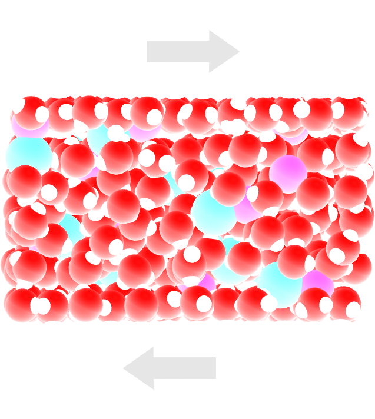

.. figure:: ../figures/level2/nanosheared-electrolyte/nanoconfined-electrolyte-light.png
    :height: 250
    :alt: Electrolyte nano-confined in a slit pore
    :class: only-light
    :align: right

..  container:: justify

    The objective of this tutorial is to
    simulate an electrolyte sheared by two walls. Some properties
    of the sheared fluid, such as the time-averaged velocity profile
    will be extracted. 

..  container:: justify

    This tutorial illustrates the important aspects of
    combining a fluid and a solid in the same simulation.
    Also, contrarily to the :ref:`all-atoms-label` tutorial, a rigid 
    four points water model is used here.

.. include:: ../../non-tutorials/recommand-lj.rst

.. include:: ../../non-tutorials/needhelp.rst

.. include:: ../../non-tutorials/2Aug2023.rst

System generation
=================

..  container:: justify

    Create a new folder called *SystemCreation/*.
    Within *SystemCreation/*, open a blank file
    called *input.lammps*, and copy the following
    lines into it:

..  code-block:: lammps

    # LAMMPS input file

    units real
    atom_style full
    bond_style harmonic
    angle_style harmonic
    pair_style lj/cut/tip4p/long 1 2 1 1 0.1546 12.0
    kspace_style pppm/tip4p 1.0e-4

..  container:: justify

    These lines are used to define the most basic parameters,
    including the *atom*, *bond*, and *angle* styles, as well as 
    interaction potential. Here *lj/cut/tip4p/long* imposes
    a Lennard Jones potential with a cut-off at :math:`12\,\text{Å}`
    and long range Coulomb potential. 

..  container:: justify

    These lines are relatively similar to the 
    previous tutorial (:ref:`all-atoms-label`),
    with two major differences; the use of *lj/cut/tip4p/long*
    and *pppm/tip4p*, instead of *lj/cut/coul/long* and pppm*.
    These two tip4p-specific commands allow us to 
    model a four point water molecule without explicitly 
    defining the fourth massless atom *M*. The value of 
    *0.1546* corresponds to the *O-M* distance in Angstrom and is 
    given by the water model. Here, |TIP4P-2005| is used.

.. |TIP4P-2005| raw:: html

   <a href="http://www.sklogwiki.org/SklogWiki/index.php/TIP4P/2005_model_of_water" target="_blank">TIP4P-2005</a>

.. admonition:: About lj/cut/tip4p/long pair style
    :class: info

    The *lj/cut/tip4p/long* pair style is similar to the conventional 
    Lennard Jones + Coulomb interaction, except that it is made specifically 
    for four point water model (tip4p). The atom of the water model
    will be type 1 (O) and 2 (H). All the other atoms of the simulations 
    are treated *normally* with long range coulomb interaction.

..  container:: justify

    Let us create the box by adding the following lines to *input.lammps*:

..  code-block:: lammps

    lattice fcc 4.04
    region box block -3 3 -3 3 -7 7
    create_box 5 box &
            bond/types 1 &
            angle/types 1 &
            extra/bond/per/atom 2 &
            extra/angle/per/atom 1 &
            extra/special/per/atom 2

..  container:: justify

    The *lattice* command defines the unit
    cell. Here, the face-centered cubic (fcc) lattice with a scale factor of
    4.04 has been chosen for the future positioning of the atoms
    of the walls.

..  container:: justify

    The *region* command defines a geometric
    region of space. By choosing *xlo=-3* and *xhi=3*, and
    because we have previously chosen a lattice with scale
    factor of 4.04, the region box extends from -12.12 Å to 12.12 Å.

..  container:: justify

    The *create_box* command creates a simulation box with 5 types of atoms:
    the oxygen and hydrogen of the water molecules,
    the two ions (:math:`\text{Na}^+`,
    :math:`\text{Cl}^-`), and the
    atom of the walls. The *create_box* command extends over 6 lines thanks to the
    :math:`\&` character. The second and third lines are used to
    indicate that the simulation contains 1 type of bond and 1
    type of angle (both required by the water molecule). The parameters for
    these bond and angle constraints will be given later. The
    three last lines are for memory allocation.

..  container:: justify

    Now, we can add atoms to the system. First, let us create two
    sub-regions corresponding respectively to the two solid
    walls, and create a larger region from the union of the two
    regions. Then, let us create atoms of type 5 (the wall) within the two
    regions. Add the following lines to *input.lammps*:

..  code-block:: lammps

    region rbotwall block -3 3 -3 3 -5 -4
    region rtopwall block -3 3 -3 3 4 5
    region rwall union 2 rbotwall rtopwall
    create_atoms 5 region rwall

..  container:: justify

    Atoms will be placed at the positions of the previously
    defined lattice, thus forming fcc solids.

..  container:: justify

    In order to add the water molecules, we first need to
    download the |download_TIP4P2005.txt|
    and place it within *SystemCreation/*. The template contains all the
    necessary information concerning the water molecule, such as
    atom positions, bonds, and angle.

.. |download_TIP4P2005.txt| raw:: html

   <a href="../../../../../inputs/level2/nanosheared-electrolyte/SystemCreation/RigidH2O.txt" target="_blank">molecule template</a>

..  container:: justify

    Add the following lines to *input.lammps*:

..  code-block:: lammps

    region rliquid block INF INF INF INF -3 3
    molecule h2omol RigidH2O.txt
    lattice sc 3.1
    create_atoms 0 region rliquid mol h2omol 482793

..  container:: justify

    Withing the last four lines, a *region* named *rliquid* for depositing the
    water molecules is created based on the last defined lattice, which is *fcc 4.04*. 

..  container:: justify

    The *molecule* command opens up the molecule template named
    *RigidH2O.txt*, and names the associated molecule *h2omol*.

..  container:: justify

    A new simple cubic lattice is defined in order to place the water
    molecules on it, with a distance of 3.1 Ångstroms between
    each water molecule. Note that the new lattice replaces the
    previous one, as LAMMPS reads a script from top to bottom.

..  container:: justify

    Molecules are created on the *sc 3.1* lattice
    by the *create_atoms* command. The
    first parameter is '0' because we use the atom id from the
    *RigidH2O.txt* file. The number *482793* is a seed that is
    required by LAMMPS, it can be any positive integer.

..  container:: justify

    Finally, let us create 30 ions (15 :math:`\text{Na}^+`
    and 15 :math:`\text{Cl}^-`)
    in between the water molecules, by adding the following commands to *input.lammps*:

..  code-block:: lammps

    create_atoms 3 random 15 52802 rliquid overlap 0.6 maxtry 500
    create_atoms 4 random 15 90182 rliquid overlap 0.6 maxtry 500
    set type 3 charge 1
    set type 4 charge -1

..  container:: justify

    Each *create_atoms* command will add 15 ions at random positions
    within the 'rliquid' region, ensuring that there is no *overlap* with existing
    molecules. Feel free to increase or decrease the salt
    concentration by changing the number of desired ions. To keep the system charge neutral,
    always insert the same number of 
    :math:`\text{Na}^+`
    and :math:`\text{Cl}^-`,
    unless of course there are other charges in the system.

..  container:: justify

    The charges of the newly added ions are specified by the two *set* commands.

..  container:: justify

    Before starting the simulation, we still need to define the parameters of the simulation: the mass
    of the 5 atom types (O, H, :math:`\text{Na}^+`, :math:`\text{Cl}^-`, and wall), the
    pairwise interaction parameters (here the parameters for the
    Lennard-Jones potential), and the bond and angle parameters.
    Copy the following line into input.lammps:

..  code-block:: lammps

    include ../PARM.lammps
    include ../GROUP.lammps

..  container:: justify

    Create a new text file, call it *PARM.lammps*, and copy it
    next to the *SystemCreation/* folder. Copy the following lines
    into PARM.lammps:

..  code-block:: lammps

    mass 1 15.9994 # water
    mass 2 1.008 # water
    mass 3 28.990 # ion
    mass 4 35.453 # ion
    mass 5 26.9815 # wall

    pair_coeff 1 1 0.185199 3.1589 # water
    pair_coeff 2 2 0.0 0.0 # water
    pair_coeff 3 3 0.04690 2.4299 # ion
    pair_coeff 4 4 0.1500 4.04470 # ion
    pair_coeff 5 5 11.697 2.574 # wall

    bond_coeff 1 0 0.9572 # water

    angle_coeff 1 0 104.52 # water

..  container:: justify
    
    Each *mass* command assigns a mass in grams/mole to an atom type. Each
    *pair_coeff* assigns respectively the depth of the LJ potential
    (in Kcal/mole), and the distance (in Ångstrom) at which the
    particle-particle potential energy is 0.

.. admonition:: About the parameters
    :class: info

    The parameters for water
    correspond to the TIP4P/2005 water model, and the parameters
    for :math:`\text{Na}^+` and :math:`\text{Cl}^-`  are
    taken from the CHARMM-27 force field.

..  container:: justify

    As already seen in previous tutorials, only pairwise interaction between atoms of
    identical type were assigned. By default, LAMMPS calculates
    the pair coefficients for the interactions between atoms
    of different types (i and j) by using geometrical
    average: :math:`\epsilon_{ij} = \epsilon_i + \epsilon_j)/2`, 
    :math:`\sigma_{ij} = (\sigma_i + \sigma_j)/2.`
    Other rules for cross coefficients can be set with the
    *pair_modify* command, but for the sake of simplicity,
    let us keep the default option here.

..  container:: justify

    The *bond_coeff*, which is here used for the O-H bond of the water
    molecule, sets both the energy of the harmonic
    potential and the equilibrium distance in Ångstrom. The
    value is *0* for the energy, because we are going to use a
    rigid model for the water molecule. The shape of the
    molecule will be preserved later by the *shake* algorithm.
    Similarly, the angle coefficient here for the H-O-H angle
    of the water molecule sets the energy of the harmonic
    potential (also 0) and the equilibrium angle is in degree.

..  container:: justify

    Let us also create another file called *GROUP.lammps* next
    to *PARM.lammps*, and copy the following lines into it:

..  code-block:: lammps

    group H2O type 1 2
    group Na type 3
    group Cl type 4
    group ions union Na Cl
    group fluid union H2O ions

    group wall type 5
    region rtop block INF INF INF INF 0 INF
    region rbot block INF INF INF INF INF 0
    group top region rtop
    group bot region rbot
    group walltop intersect wall top
    group wallbot intersect wall bot

..  container:: justify

    To avoid potential issues near the 
    box boundaries, let us add the following lines to *input.lammps*
    to delete any overlapping molecules:

..  code-block:: lammps

    delete_atoms overlap 0.8 H2O H2O mol yes

..  container:: justify

    Finally, add the following lines to *input.lammps*:

..  code-block:: lammps

    run 0

    write_data system.data
    write_dump all atom dump.lammpstrj

..  container:: justify

    With *run 0*, the simulation will run for 0 step,
    enough for creating the system and saving the final state.

..  container:: justify

    The *write_data* finally creates a file named *system.data*
    containing all the information required to restart the
    simulation from the final configuration generated by this
    input file.

..  container:: justify

    The *write_dump* command prints the final
    positions of the atoms, and can be opened with VMD
    to visualize the system.

..  container:: justify

    Run the *input.lammps* file using LAMMPS. From the *log* file, make
    sure that atoms have been created by looking at the log file, or simply
    open the *dump.lammpstrj* file with VMD:

.. figure:: ../figures/level2/nanosheared-electrolyte/systemcreation-light.png
    :alt: LAMMPS: electrolyte made of water and salt between walls
    :class: only-light

.. figure:: ../figures/level2/nanosheared-electrolyte/systemcreation-dark.png
    :alt: LAMMPS: electrolyte made of water and salt between walls
    :class: only-dark

..  container:: figurelegend

    Figure: The left panel is a side view of the system. Periodic images are represented in lighter
    color. Water molecules are in red and white, :math:`\text{Na}^+`
    ions in purple, :math:`\text{Cl}^-` ions in lime, and wall atoms in
    gray. The right panel is the top view of the system. Note the absence of
    atomic defect at the cell boundaries.

..  container:: justify

    Always check that your system has been correctly created
    by looking at the periodic images. Atomic defects may
    occur at the boundary.

Energy minimization
===================

.. admonition:: Why is energy minimization necessary?
    :class: info

    It is clear from the way the system has been created that
    the atoms are not at equilibrium distances from each
    others. Indeed, some of the ions added using the *create_atoms*
    commands are too close to the water molecules.
    If we were to start a *normal* molecular dynamics
    simulation now, the atoms
    would exert huge forces on each others, accelerate
    brutally, and the simulation would likely fail.

.. admonition:: Dealing with overlapping atoms
    :class: dropdown

    MD simulations failing due to overlapping atoms are
    extremely common, and I can almost guarantee that you
    will face a similar issue at some point. If it occurs,
    you can either

    - delete the overlapping atoms using the *delete_atoms* command of LAMMPS,
    - move the atoms to more reasonable distances before the simulation starts.

..  container:: justify

    Let us move the atoms and place them
    in more energetically favorable positions before starting the simulation.
    Let us call this step *energy minimization*, although it is not 
    a conventional *minimization* as done for instance
    in tutorial :ref:`lennard-jones-label`.

..  container:: justify

    To perform this energy minimization, let us
    create a new folder named *Minimization/* next to *SystemCreation/*,
    and create a new input file named *input.lammps* in it. Copy the following lines
    in *input.lammps*:

..  code-block:: lammps

    boundary p p p
    units real
    atom_style full
    bond_style harmonic
    angle_style harmonic
    pair_style lj/cut/tip4p/long 1 2 1 1 0.1546 12.0
    kspace_style pppm/tip4p 1.0e-4

    read_data ../SystemCreation/system.data

    include ../PARM.lammps
    include ../GROUP.lammps

..  container:: justify

    The only difference with the previous input is that, instead
    of creating a new box and new atoms, we open the
    previously created file *system.data* located in *SystemCreation/*.
    *system.data* contains the definition of the simulation box and the positions of the atoms.

..  container:: justify

    Now, let us create a first step using a relatively small 
    timestep (:math:`0.5\,\text{fs}`), and a low temperature
    of :math:`T = 1\,\text{K}`:

..  code-block:: lammps

    fix mynve fluid nve/limit 0.1
    fix myber fluid temp/berendsen 1 1 100
    fix myshk H2O shake 1.0e-4 200 0 b 1 a 1
    timestep 0.5

..  container:: justify

    Just like *fix nve*, the fix *nve/limit* performs constant NVE integration to
    update positions and velocities of the atoms at each
    timestep, but also limits the maximum distance atoms can travel at
    each timestep. Here, only the fluid molecules and ions will move, 
    as we anticipate that they are the problematic species in this
    system.

..  container:: justify

    The *temp/berendsen* fix rescales the
    velocities of the atoms to impose their temperature.

..  container:: justify

    The shake algorithm is used in order to maintain the shape
    of water molecules.

..  container:: justify

    Let us also print the atom positions in a *.lammpstrj* file by
    adding the following line to *input.lammps*:

..  code-block:: lammps

    dump mydmp all atom 1000 dump.lammpstrj
    thermo 200

..  container:: justify

    Finally, let us run for 4000 steps. Add the 
    following lines into *input.lammps*:

..  code-block:: lammps

    run 4000

..  container:: justify

    In order to better equilibrate the system, let us perform 
    two additional step with larger timestep and temperature:

..  code-block:: lammps

    fix myber fluid temp/berendsen 300 300 100
    timestep 1.0

    run 4000

    unfix mynve
    fix mynve fluid nve
    timestep 1.0

    run 4000

    write_data system.data

..  container:: justify

    For the last of the 3 steps, fix *nve* is used instead of 
    nve/limit*, which will allow for a better relaxation of the 
    atom positions.

..  container:: justify

    When running the *input.lammps* file with LAMMPS, you should see that the
    total energy of the system decreases during the first 
    of the 3 steps, before re-increasing a little after the 
    temperature is increased from 1 to :math:`300\,\text{K}`,
    as expected:

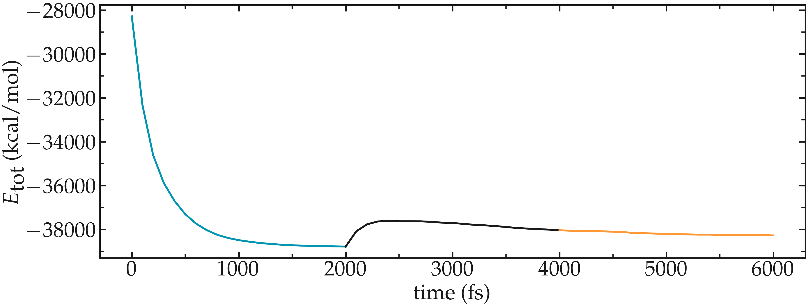

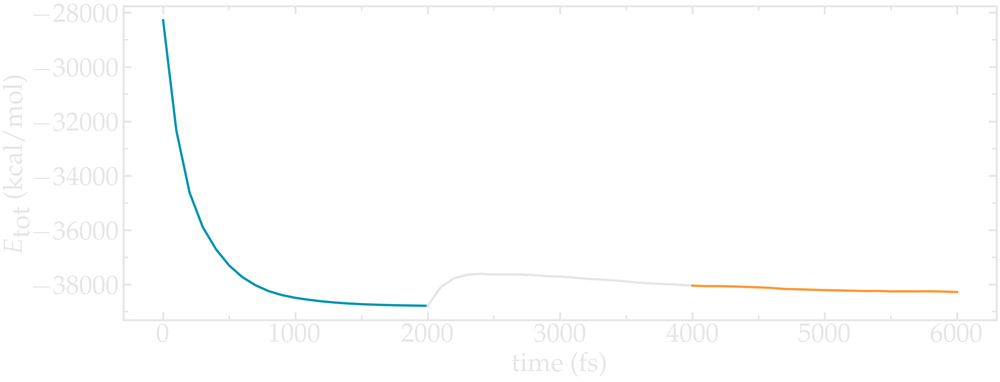

..  container:: figurelegend

    Figure: Energy as a function of time extracted from the log
    file using *Python* and *lammps_logfile*.

.. |lammps_logfile| raw:: html

   <a href="https://pypi.org/project/lammps-logfile/" target="_blank">LAMMPS logfile</a>

..  container:: justify

    If you look at the trajectory using VMD, you will see some
    of the atoms, in particular the one that where initially in problematic
    positions, slightly move from each others, as seen in |youtube_video_lammps|.

.. |youtube_video_lammps| raw:: html

   <a href="https://youtu.be/JWGZnFN4TOo" target="_blank">this video</a>

System equilibration
====================

..  container:: justify

    Now, let us equilibrate further the entire system by letting both
    fluid and piston relax at ambient temperature.

..  container:: justify

    Create a new folder called *Equilibration/* next to 
    the previously created folders, and create a new
    *input.lammps* file in it. Add the following lines into *input.lammps*:

..  code-block:: lammps

    boundary p p p
    units real
    atom_style full
    bond_style harmonic
    angle_style harmonic
    pair_style lj/cut/tip4p/long 1 2 1 1 0.1546 12.0
    kspace_style pppm/tip4p 1.0e-4

    read_data ../Minimization/system.data

    include ../PARM.lammps
    include ../GROUP.lammps

..  container:: justify

    The first two variables allow us to extract the centers of mass of
    the two walls. Then, the :math:`\delta_z`
    variable is used to calculate the distance between
    the two centers of mass.

..  container:: justify

    Finally, let us complete the *input.lammps* file
    by adding the commands to manage the atoms dynamic:

..  code-block:: lammps

    fix mynve all nve
    fix myber all temp/berendsen 300 300 100
    fix myshk H2O shake 1.0e-4 200 0 b 1 a 1
    fix myrct all recenter NULL NULL 0
    timestep 1.0

..  container:: justify

    The fix *recenter* has no influence on the dynamics, but will
    keep the system in the center of the box, which makes the
    visualization easier.

..  container:: justify

    Then, add the following lines to *input.lammps* for
    the trajectory visualization and output:

..  code-block:: lammps

    dump mydmp all atom 1000 dump.lammpstrj
    thermo 500
    variable walltopz equal xcm(walltop,z)
    variable wallbotz equal xcm(wallbot,z)
    variable deltaz equal v_walltopz-v_wallbotz
    fix myat1 all ave/time 100 1 100 v_deltaz file interwall_distance.dat

..  container:: justify

    Finally, let us add the *run* command: 

..  code-block:: lammps

    run 30000
    write_data system.data  

..  container:: justify

    Run the *input.lammps* file using LAMMPS. You can speed-up the 
    calculation by using multiple CPU cores:

..  code-block:: bash

    mpirun -np 4 lmp -in input.lammps

..  container:: justify

    The distance :math:`\delta_z` between the two walls
    reduces until it reaches an equilibrium value. One can have a look
    at the data printed by *fix myat1*:

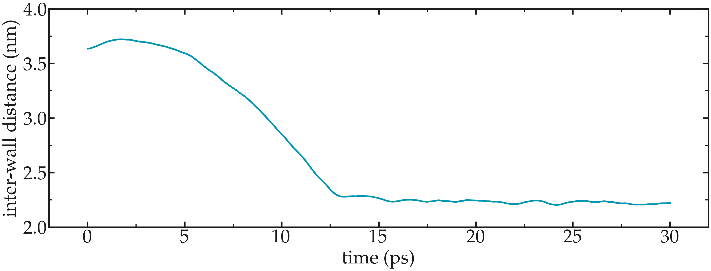

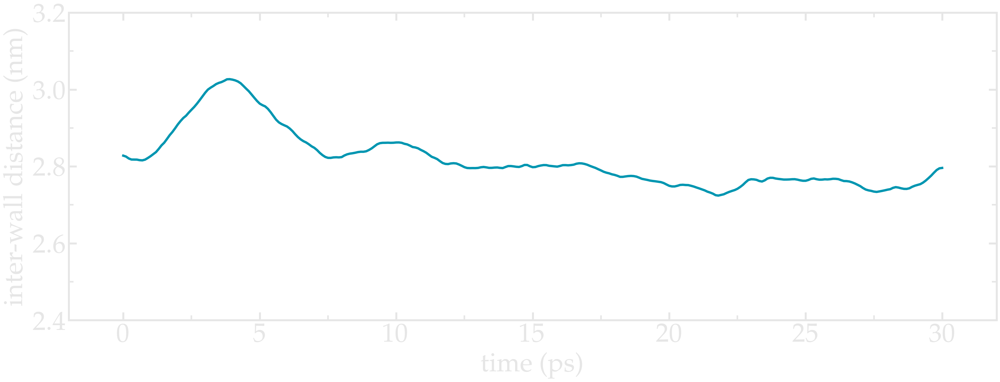

..  container:: figurelegend

    Figure: Distance between the walls as a function of time. After about :math:`15\,\text{ps}`, the 
    distance between the walls is very close to its final equilibrium value. 
    
..  container:: justify

    Note that it is generaly recommended to run longer equilibration.
    Here for instance, the slowest
    process is the ionic diffusion. Therefore the equilibration 
    should in principle be longer than the time
    the ions need to diffuse over the size of the pore
    (:math:`\approx 1.2\,\text{nm}`), i.e. of the order of half a nanosecond.

Imposed shearing
================

..  container:: justify

    From the equilibrated configuration, let us impose a laterial
    motion to the two walls and shear the electrolyte.
    In a new folder called *Shearing/*,
    create a new *input.lammps* file that starts like the previous ones:

..  code-block:: lammps

    boundary p p p
    units real
    atom_style full
    bond_style harmonic
    angle_style harmonic
    pair_style lj/cut/tip4p/long 1 2 1 1 0.1546 12.0
    kspace_style pppm/tip4p 1.0e-4

    read_data ../Equilibration/system.data

    include ../PARM.lammps
    include ../GROUP.lammps

    fix mynve all nve
    compute Tfluid fluid temp/partial 0 1 1
    fix myber1 fluid temp/berendsen 300 300 100
    fix_modify myber1 temp Tfluid
    compute Twall wall temp/partial 0 1 1
    fix myber2 wall temp/berendsen 300 300 100
    fix_modify myber2 temp Twall
    fix myshk H2O shake 1.0e-4 200 0 b 1 a 1
    fix myrct all recenter NULL NULL 0

..  container:: justify

    One difference here is that two thermostats are used,
    one for the fluid (*myber1*) and one
    for the solid (*myber2*). The use of *fix_modify* together
    with *compute* ensures that the right temperature value
    is used by the thermostats.

..  container:: justify

    The use of temperature *compute* with *temp/partial 0 1 1* operations
    is meant to exclude the *x* coordinate from the
    thermalisation, which is important since a large velocity
    will be imposed along *x*. 
    
..  container:: justify

    Then, let us impose the velocity of the two walls 
    by adding the following command to *input.lammps*:

..  code-block:: lammps

        fix mysf1 walltop setforce 0 NULL NULL
        fix mysf2 wallbot setforce 0 NULL NULL
        velocity wallbot set -2e-4 NULL NULL
        velocity walltop set 2e-4 NULL NULL
        
..  container:: justify

    The *setforce* commands cancel the forces on a group of atoms at
    every timestep, so the atoms of the group do not
    experience any force from the rest of the system. In absence of force
    acting on those atoms, they will conserve their initial velocity.

..  container:: justify

    The *velocity* commands act only once and impose
    the velocity of the atoms of the groups *wallbot*
    and *walltop*, respectively.

..  container:: justify

    Finally, let us dump the atom positions, extract the
    velocity profiles using several *ave/chunk* commands, extract the
    force applied on the walls, and then run for :math:`200\,\text{ps}`
    Add the following lines to *input.lammps*:

..  code-block:: lammps

    dump mydmp all atom 5000 dump.lammpstrj
    thermo 500
    thermo_modify temp Tfluid

    compute cc1 H2O chunk/atom bin/1d z 0.0 1.0
    compute cc2 wall chunk/atom bin/1d z 0.0 1.0
    compute cc3 ions chunk/atom bin/1d z 0.0 1.0

    fix myac1 H2O ave/chunk 10 15000 200000 cc1 density/mass vx file water.profile_1A.dat
    fix myac2 wall ave/chunk 10 15000 200000 cc2 density/mass vx file wall.profile_1A.dat
    fix myac3 ions ave/chunk 10 15000 200000 cc3 density/mass vx file ions.profile_1A.dat

    compute cc4 H2O chunk/atom bin/1d z 0.0 0.1
    compute cc5 wall chunk/atom bin/1d z 0.0 0.1
    compute cc6 ions chunk/atom bin/1d z 0.0 0.1

    fix myac4 H2O ave/chunk 10 15000 200000 cc4 density/mass vx file water.profile_0.1A.dat
    fix myac5 wall ave/chunk 10 15000 200000 cc5 density/mass vx file wall.profile_0.1A.dat
    fix myac6 ions ave/chunk 10 15000 200000 cc6 density/mass vx file ions.profile_0.1A.dat

    fix myat1 all ave/time 10 100 1000 f_mysf1[1] f_mysf2[1] file forces.dat

    timestep 1.0
    run 200000
    write_data system.data

..  container:: justify

    Here, two series of *ave/chunk* commands are used. The first series is using 
    a binning of :math:`1\,Å`, the second series is using a binning of :math:`0.1\,Å`.

..  container:: justify

    The averaged velocity profile obtained with a :math:`200\,\text{ps}`
    can be plotted. The velocity increases linearly with the distance :math:`z`.
    One can adjust the velocity profile with a linear fit and deduce an effective
    value of :math:`h = 1.2\,\text{nm}` for the pore size.

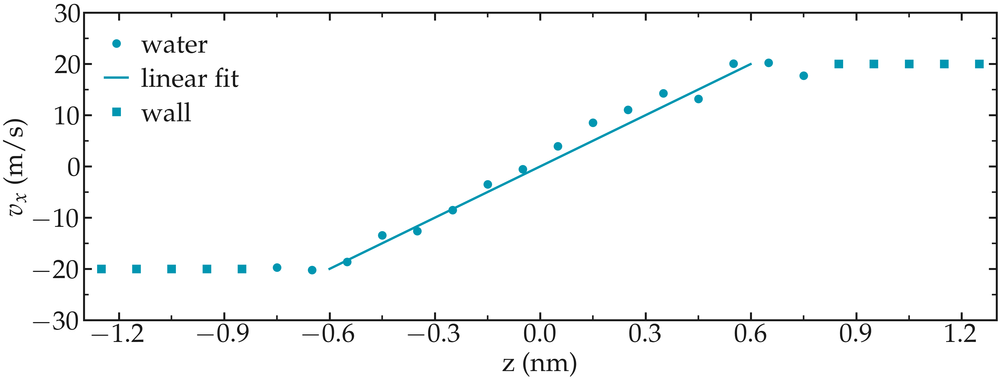

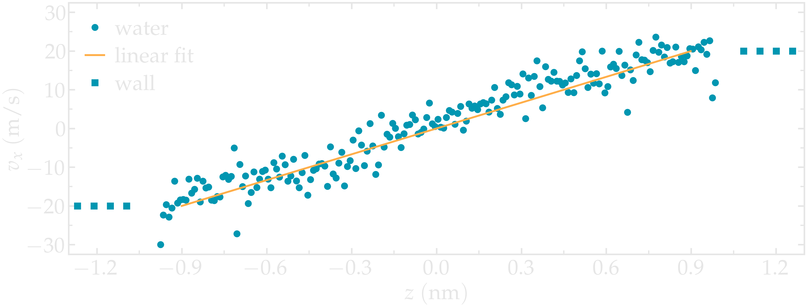

..  container:: figurelegend

    Figure: Velocity profiles for water molecules, ions and walls
    along the *z* axis. The line is a linear fit assuming that 
    the pore size is :math:`h = 1.2\,\text{nm}`.

..  container:: justify

    The averaged density profile for the water is the following:

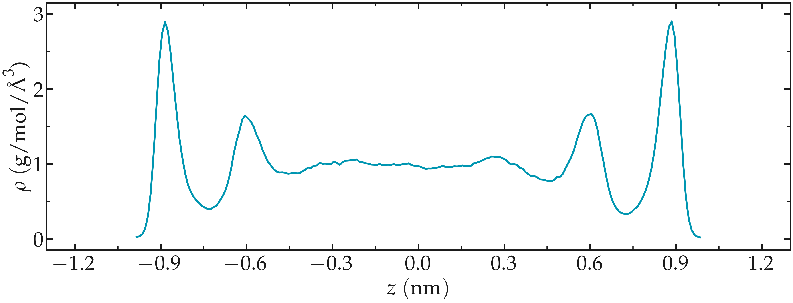

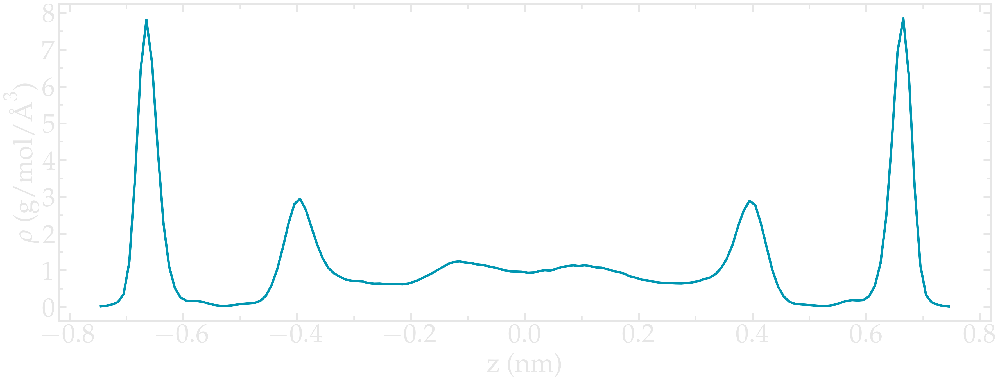

..  container:: figurelegend

    Figure: Water density profiles for water along the *z* axis.

..  container:: justify

    From the force applied by the fluid on the solid, one can
    extract the stress within the fluid, which allows one to
    measure its viscosity :math:`\dot{\eta}` 
    according to |reference_gravelle2021|:
    :math:`\eta = \tau / \dot{\gamma}` where :math:`\tau`
    is the stress applied by the fluid on the shearing wall, and
    :math:`\dot{\gamma}` the shear rate (which is imposed
    here). Here the shear rate
    is approximatively :math:`\dot{\gamma} = 16 \cdot 10^9\,\text{s}^{-1}`,
    and using a surface area of :math:`A = 6 \cdot 10^{-18}\,\text{m}^2`, one
    gets an estimate for the shear viscosity for the confined
    fluid of :math:`\eta = 6.6\,\text{mPa.s}`

..  container:: justify

    The viscosity calculated at such high shear rate may
    differ from the expected *bulk* value. In general, it is recommanded to use a lower
    value for the shear rate. Note that for lower shear rate, the ratio noise-to-signal
    is larger, and longer simulations are needed.

..  container:: justify

    Another important point is that the viscosity of a fluid next to a solid surface is
    typically larger than in bulk due to interaction with the
    walls. Therefore, one expects the present simulation to return 
    a viscosity that is slightly larger than what would be measured in absence of wall.

.. |reference_gravelle2021| raw:: html

   <a href="https://pure.tudelft.nl/ws/portalfiles/portal/89280267/PhysRevFluids.6.034303.pdf" target="_blank">gravelle2021</a>

.. include:: ../../non-tutorials/accessfile.rst

Going further with exercises
============================

.. include:: ../../non-tutorials/link-to-solutions.rst

Make a hydrophobic nanopore
---------------------------

..  container:: justify

    The walls of the nanopore used in the tutorial are extremely hydrophilic, as visible from the 
    density profile showing large peaks near the walls. Play with the interaction
    parameters and make the nanopore more hydrophobic.

.. figure:: ../figures/level2/nanosheared-electrolyte/hydrophobic-pore-light.png
    :alt: hydrophobic vs hydrophilic pores : density profiles
    :class: only-light

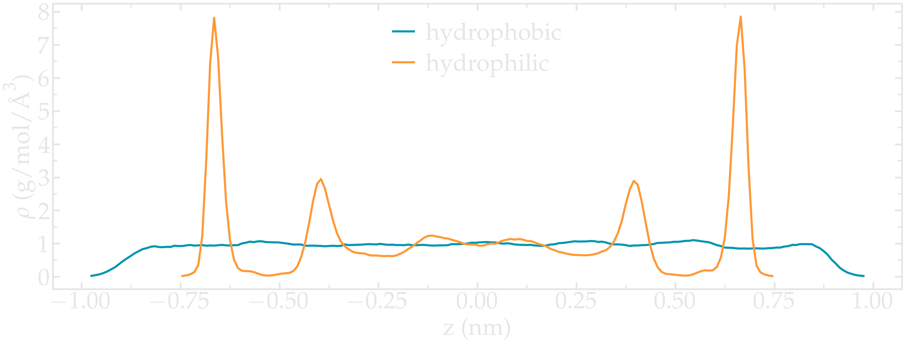

..  container:: figurelegend

    Figure: Density profile for the water along the *z* axis
    comparing the original hydrophilic pore with the hydrophobic pore.

Induce a Poiseuille flow
------------------------

..  container:: justify

    Instead of inducing a shearing of the fluid using the walls,
    induce a net flux of the liquid in the direction tangential
    to the (immobile) walls.

..  container:: justify
    
    Extract the velocity profile, and make sure that the
    resulting velocity profile is consistent with the Poiseuille equation,
    which can be derived from the Stokes equation :math:`\eta \nabla \textbf{v} = - \textbf{f} \rho`
    where :math:`f` is the applied force,
    :math:`\rho` is the fluid density,
    :math:`\eta` is the fluid viscosity, and
    :math:`h = 1.2\,\text{nm}` is the pore size.

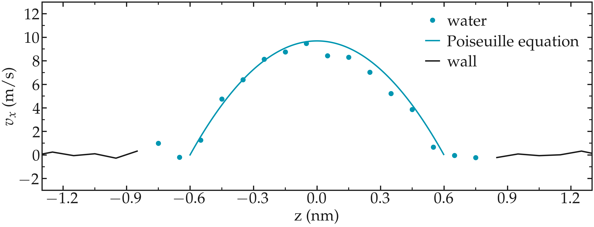

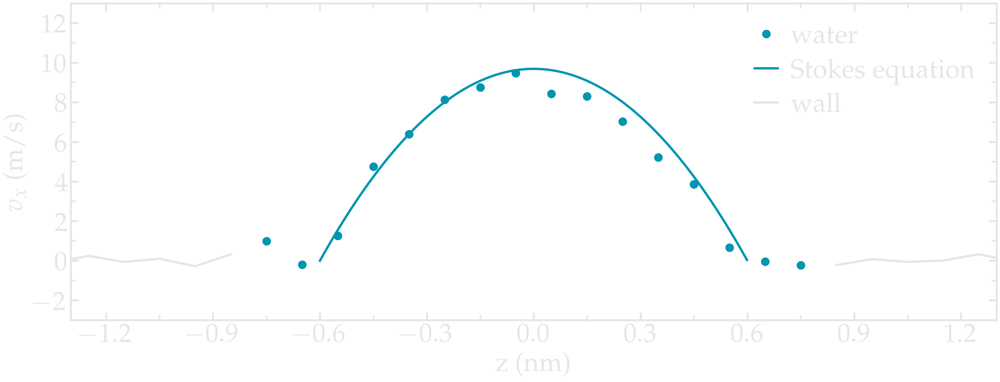

..  container:: figurelegend

    Figure: Velocity profiles of the water molecules along the *z* axis (disks).
    The line is the Poiseuille equation.