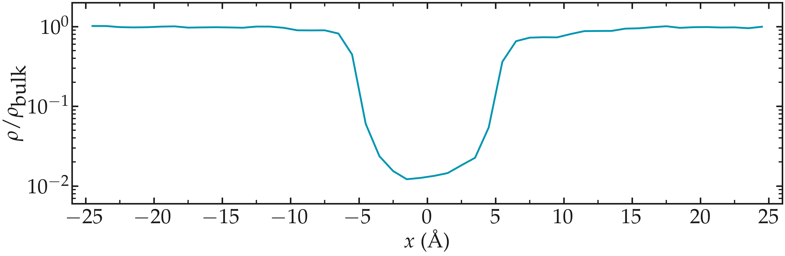
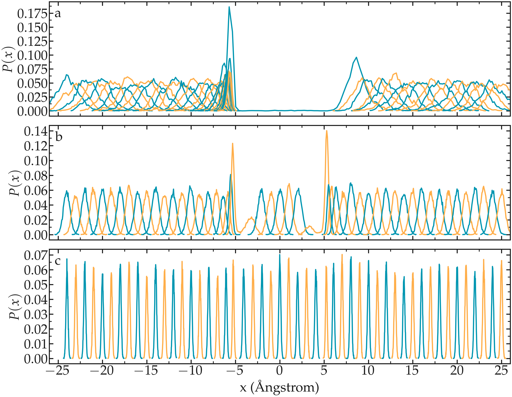

.. _umbrella-sampling-label:

Free energy calculation
***********************

.. container:: hatnote

   Simple sampling of a free energy barrier using umbrella sampling

.. figure:: ../figures/level3/free-energy-calculation/avatar_light.webp
    :height: 250
    :alt: Lennard Jones atoms simulated with LAMMPS
    :class: only-light
    :align: right

.. figure:: ../figures/level3/free-energy-calculation/avatar_dark.webp
    :height: 250
    :alt: Lennard Jones atoms simulated with LAMMPS
    :class: only-dark
    :align: right

..  container:: justify

    The objective of this tutorial is to measure the free
    energy profile across a barrier potential using two methods;
    :ref:`free sampling <method1>` and :ref:`umbrella sampling <method2>`.
    
    For the sake of simplicity and in order to reduce the computation time, the
    barrier potential will be imposed artificially to the atoms.
    The procedure is valid for more complex
    systems, and can be adapted to many other situations, for instance 
    for measuring adsorption barrier near a wall, or for calculating translocation
    barrier through a membrane.

.. include:: ../../contact/recommand-lj.rst

.. include:: ../../contact/needhelp.rst

.. include:: ../../contact/2Aug2023.rst

.. _method1:

Method 1: Free sampling
=======================

..  container:: justify

    The most direct way to calculate a free energy profile is to extract
    the partition function from a classic (unbiased) molecular
    dynamics simulation, and then to estimate the Gibbs free
    energy using 
    
.. math:: \Delta G = -RT \ln(p/p_0),
    
..  container:: justify

    where :math:`\Delta G` is the free energy difference, R the
    gas constant, T the temperature, p the
    pressure, and :math:`p_0` the reference pressure.
    As an illustration, let us apply this method to an
    extremely simple configuration that consists in a few
    particles diffusing in a box in presence of a
    position-dependent repealing force that makes the centre
    of the box a relatively unfavourable area to explore.

Basic LAMMPS parameters
-----------------------

..  container:: justify

    Create a folder named *FreeSampling/*, and create an input script
    named *input.lammps* in it. Copy the following lines:

..  code-block:: lammps
    :caption: *to be copied in FreeSampling/input.lammps*

    # define some variables
    variable sigma equal 3.405 # Angstrom
    variable epsilon equal 0.238 # Kcal/mol
    variable U0 equal 1.5*${epsilon} # Kcal/mol
    variable dlt equal 1.0 # Angstrom
    variable x0 equal 10.0  # Angstrom

    # initialise the simulation
    units real
    atom_style atomic
    pair_style lj/cut 3.822 # 2^(1/6) * 3.405 WCA potential
    pair_modify shift yes
    boundary p p p

..  container:: justify

    Here, we start by defining variables for the Lennard-Jones
    interaction :math:`\sigma` and :math:`\epsilon` and for
    the repulsive potential :math:`U (x)`: :math:`U_0`, :math:`\delta`, and :math:`x_0`, 
    see the analytical expression below.

    The system of unit 'real' (for which energy is in kcal/mol, distance in Ångstrom,
    time in femtosecond) has been chosen for practical reason,
    as the WHAM algorithm we are going to use in the second
    part of the tutorial automatically assumes the energy to
    be in kcal/mol. Atoms will interact through a
    Lennard-Jones potential with a cut-off equal to 
    :math:`\sigma \times 2 ^ {1/6}` (i.e. a WCA repulsive
    potential). The potential is shifted to be equal to 0 at
    the cut-off using the pair_modify.

System creation and settings
----------------------------

..  container:: justify

    Let us define the simulation block and randomly add atoms:

..  code-block:: lammps
    :caption: *to be copied in FreeSampling/input.lammps*

    # define the system
    region myreg block -25 25 -5 5 -25 25
    create_box 1 myreg
    create_atoms 1 random 60 341341 myreg overlap 1.0 maxtry 50

    # settings
    mass * 39.95
    pair_coeff * * ${epsilon} ${sigma}
    neigh_modify every 1 delay 4 check yes

..  container:: justify

    Here I am using the argon's values of the Lennard-Jones parameters :math:`\sigma` and
    :math:`\epsilon`, as well as the mass :math:`m = 39.95`
    grams/mole. 
    
    In the previous subsection, the variables :math:`U_0`, :math:`\delta`, and
    :math:`x_0` were defined. They are used to create the repulsive potential
    restricting the atoms to explore the center of the box: 

.. math::

    U(x) = U_0 \left[ \arctan \left( \dfrac{x+x_0}{\delta} \right) - \arctan \left(\dfrac{x-x_0}{\delta} \right) \right]. 
    
..  container:: justify

    From the derivative of the
    potential with respect to :math:`x`, we obtain the expression
    for the force that will be imposed to the atoms:

.. math::

    F(x)= \dfrac{U_0}{\delta} \left[ \dfrac{1}{(x-x_0)^2/\delta^2+1} - \dfrac{1}{(x+x_0)^2/\delta^2+1} \right].

..  container:: justify

    The potential and force along the :math:`x`
    axis resemble:

.. figure:: ../figures/level3/free-energy-calculation/potential-light.png
   :alt: Imposed potential
   :class: only-light

.. figure:: ../figures/level3/free-energy-calculation/potential-dark.png
   :alt: Averaged density profile
   :class: only-dark

   Potential :math:`U (x)` (top) and force :math:`F (x)` (bottom) imposed to the atoms.

**Energy minimization and equilibration**

..  container:: justify

    Let us apply energy minimization to the system, and then impose
    the force \\(F(x)\\) to all of the atoms in the simulation using the 'addforce' command:

..  code-block:: lammps
    :caption: *to be copied in FreeSampling/input.lammps*

    # --------------------- Run
    minimize 1e-4 1e-6 100 1000
    reset_timestep 0

    variable U atom ${U0}*atan((x+${x0})/${dlt})-${U0}*atan((x-${x0})/${dlt})
    variable F atom ${U0}/((x-${x0})^2/${dlt}^2+1)/${dlt}-${U0}/((x+${x0})^2/${dlt}^2+1)/${dlt}
    fix myadf all addforce v_F 0.0 0.0 energy v_U

..  container:: justify

    Finally, let us combine the fix nve with a Langevin
    thermostat to run a molecular dynamics simulation. With
    these two commands, the MD simulation is effectively in the
    NVT ensemble: constant number of atoms :math:`N`, constant
    volume :math:`V`, and constant temperature :math:`T`. Let us
    perform an equilibration of 500000 steps in total,
    using a timestep of 2 ps (i.e. a total duration of 1
    nanoseconds). To make sure that 1 ns is long enough, let us
    record the evolution of the number of atoms in the central
    (energetically unfavorable) region called *mymes*:

..  code-block:: lammps
    :caption: *to be copied in FreeSampling/input.lammps*

    fix mynve all nve
    fix mylgv all langevin 119.8 119.8 50 1530917

    region mymes block -${x0} ${x0} INF INF INF INF 
    variable n_center equal count(all,mymes)
    fix myat all ave/time 10 50 500 v_n_center file density_evolution.dat

    timestep 2.0
    thermo 10000
    run 500000

Run and data acquisition
------------------------

..  container:: justify

    Finally, let us record the density profile of the atoms
    along the :math:`x` axis using the 'ave/chunk' command. A
    total of ten density profiles will be printed. Step counts are
    reset to 0 to synchronize with the output times of
    density/number, and the fix 'myat' is canceled (it has to be
    canceled before a reset time).

..  code-block:: lammps
    :caption: *to be copied in FreeSampling/input.lammps*

    unfix myat
    reset_timestep 0

    compute cc1 all chunk/atom bin/1d x 0.0 1.0
    fix myac all ave/chunk 10 400000 4000000 cc1 density/number file density_profile_8ns.dat
    dump mydmp all atom 200000 dump.lammpstrj

    thermo 100000
    run 4000000

..  container:: justify

    This simulation with a duration of 8 ns needs a few
    minutes to complete. Feel free to increase the 
    duration of the run for smoother results.
    
    You can visualize the dump file using VMD:

.. figure:: ../figures/level3/free-energy-calculation/system-light.png
   :alt: Lennard jones atoms simulated with LAMMPS MD code
   :class: only-light

.. figure:: ../figures/level3/free-energy-calculation/system-dark.png
   :alt: Lennard jones atoms simulated with LAMMPS MD code
   :class: only-dark

   Notice that the density of atoms is lower in the central part of the box, 
   due to the additional force :math:`F (x)`.

Data analysis
--------------

..  container:: justify

    First, let us make sure that the equilibration duration of 1
    ns is long enough by looking at the 'density_evolution.dat' file:

.. figure:: ../figures/level3/free-energy-calculation/density_evolution-light.png
   :alt: Number of particle in the central region as a function of time
   :class: only-light

.. figure:: ../figures/level3/free-energy-calculation/density_evolution-dark.png
   :alt: Number of particle in the central region as a function of time
   :class: only-dark

   Evolution of the number of atoms in the central region during equilibration. 
   
..  container:: justify

    Here, we can clearly see that the number of atoms in the
    central region, :math:`n_\mathrm{central}`, evolves to its equilibrium value
    after about 0.1 ns.
    
    Let us also plot the equilibrium density profile :math:`\rho`:

.. figure:: ../figures/level3/free-energy-calculation/density_profile-dark.png
   :alt: Averaged density profile
   :class: only-dark

   Averaged density profiles for the 8 ns run. 
   The value for the reference density :math:`\rho_\mathrm{bulk} = 0.0033`
   was estimated from the raw density profiles.

..  container:: justify

    Then, let us plot :math:`-R T \ln(\rho/\rho_\mathrm{bulk})` and compare it
    with the imposed (reference) potential :math:`U`:

.. figure:: ../figures/level3/free-energy-calculation/freesampling-potential-light.png
   :alt: Averaged density profile
   :class: only-light

.. figure:: ../figures/level3/free-energy-calculation/freesampling-potential-dark.png
   :alt: Averaged density profile
   :class: only-dark

   Calculated potential :math:`-R T \ln(\rho/\rho_\mathrm{bulk})` compared to imposed potential.
   The calculated potential is in blue.

..  container:: justify

    The agreement with the expected energy profile is reasonable,
    despite some noise in the central part. 

The limits of free sampling
---------------------------

..  container:: justify

    If we increase the value of :math:`U_0`, the average number of
    atoms in the central region will decrease, making it
    difficult to obtain a good resolution for the free energy
    profile.

    In that case, it is better to use the umbrella sampling method
    to extract free energy profiles, see the next section.

.. include:: ../../contact/supportme.rst

.. _method2:

Method 2: Umbrella sampling
===========================

..  container:: justify

    Umbrella sampling is a biased molecular dynamics method,
    i.e. a method in which additional forces are added to the
    atoms in order to make the unfavourable states more likely
    to occur.
    
    Keeping the present configuration, we are going to force one of the atom to
    explore the central region of the box. To do so, we
    are going to add a potential :math:`V` to one
    of the particle, and force it to move along the axe :math:`x`.
    The chosen path is called the axe of reaction. The final
    simulation will be analyzed using the weighted histogram
    analysis method (WHAM), which allows to remove the effect of
    the bias and eventually deduce the unbiased free energy profile.

LAMMPS input script
-------------------

..  container:: justify

    Create a new folder called *BiasedSampling/*, create a new input file 
    named *input.lammps* in it, and copy the following lines:

..  code-block:: lammps
    :caption: *to be copied in BiasedSampling/input.lammps*

    # define a bunch of variables
    variable sigma equal 3.405 # Angstrom
    variable epsilon equal 0.238 # Kcal/mol
    variable U0 equal 10*${epsilon} # Kcal/mol
    variable dlt equal 0.5 # Angstrom
    variable x0 equal 5.0  # Angstrom
    variable k equal 1.5 # Kcal/mol/Angstrom^2

    # initialise the simulation
    units real
    atom_style atomic
    pair_style lj/cut 3.822 # 2^(1/6) * 3.405 WCA potential
    pair_modify shift yes
    boundary p p p

    # define the system
    region myreg block -25 25 -5 5 -25 25
    create_box 2 myreg
    create_atoms 2 single 0 0 0
    create_atoms 1 random 5 341341 myreg overlap 1.0 maxtry 50

    # settings
    mass * 39.948
    pair_coeff * * ${epsilon} ${sigma}
    neigh_modify every 1 delay 4 check yes
    group topull type 2

    # run
    variable U atom ${U0}*atan((x+${x0})/${dlt})-${U0}*atan((x-${x0})/${dlt})
    variable F atom ${U0}/((x-${x0})^2/${dlt}^2+1)/${dlt}-${U0}/((x+${x0})^2/${dlt}^2+1)/${dlt}
    fix pot all addforce v_F 0.0 0.0 energy v_U

    fix mynve all nve
    fix mylgv all langevin 119.8 119.8 50 1530917
    timestep 2.0
    thermo 100000
    run 500000
    reset_timestep 0

    dump mydmp all atom 1000000 dump.lammpstrj

..  container:: justify

    So far, this code resembles the one of Method 1,
    except for the additional particle of type 2. This
    particle is identical to the particles of type 1 (same
    mass and Lennard-Jones parameters), but will be exposed to the
    biasing potential.

    The value of the potential :math:`U_0` was chosen to be much larger than in part 1, 
    just to proof that umbrella sampling can easily deal with huge potential value,
    while free sampling couldn't.

    Let us create a loop with 50 steps, and move progressively
    the centre of the bias potential by increment of 0.1 nm:

..  code-block:: lammps
    :caption: *to be copied in BiasedSampling/input.lammps*

    variable a loop 50
    label loop
    variable xdes equal ${a}-25
    variable xave equal xcm(topull,x)
    fix mytth topull spring tether ${k} ${xdes} 0 0 0
    run 200000
    fix myat1 all ave/time 10 10 100 v_xave v_xdes file data-k1.5/position.${a}.dat
    run 1000000
    unfix myat1
    next a
    jump SELF loop

..  container:: justify

    A folder named *data-k1.5/* needs to be created within *BiasedSampling/*.

    The spring command serves to impose the
    additional harmonic potential with spring constant :math:`k`.
    Note that the value of :math:`k` should be chosen with care,
    if its too small, the particle wont follow the biasing potential
    center, if its too large, there will be no overlapping between the 
    different windows.

    The centre of the harmonic potential :math:`x_\text{des}`
    successively takes values from -25 to 25. For each value of
    :math:`x_\text{des}`, an equilibration step of 0.4 ns is
    performed, followed by a step of 2 ns during which the
    position along :math:`x` of the particle is saved in data
    files (one data file per value of :math:`x_\text{des}`). You
    can always increase the duration of the runs for better samplings.

WHAM algorithm
--------------

..  container:: justify

    In order to generate the free energy profile from the density distribution, we are going to use
    the WHAM algorithm. You can download it from |Grossfield| website, or alternatively use 
    the |wham-version| I have downloaded, or try your luck with the version 
    i did precompile; |wham-precompiled|. After extraction, it can be compiled by simply running:

.. |Grossfield| raw:: html

   <a href="http://membrane.urmc.rochester.edu/?page_id=126" target="_blank">Alan Grossfield</a>

.. |wham-version| raw:: html

   <a href="../../../../../inputs/level3/free-energy-calculation/BiasedSampling/wham-release-2.0.11.tgz" target="_blank">version 2.0.11</a>

.. |wham-precompiled| raw:: html

   <a href="../../../../../inputs/level3/free-energy-calculation/BiasedSampling/wham" target="_blank">precompiled wham</a>

..  code-block:: bash

    cd wham
    make clean
    make

..  container:: justify

    The compilation creates an executable called *wham* that you can 
    copy in the *BiasedSampling/* folder.

    In order to apply the WHAM algorithm to our simulation, we
    first need to create a metadata file. This file simply
    contains 
    
    - the paths to all the data files,
    - the value of :math:`x_\text{des}`,
    - and the values of :math:`k`.
    
    To generate the *metadata.txt* file, you can run this Python script
    from the *BiasedSampling/* folder:

..  code-block:: python

    import os

    k=1.5 # set the value of  k in kCal/mol
    folder='data-k1.5/'

    f = open("metadata.dat", "w")
    for n in range(-50,50):
        datafile=folder+'position.'+str(n)+'.dat'
        if os.path.exists(datafile):
            # read the imposed position is the expected one
            with open(datafile) as g:
                _ = g.readline()
                _ = g.readline()
                firstline = g.readline()
            imposed_position = firstline.split(' ')[-1][:-1]
            # write one file per file
            f.write(datafile+' '+str(imposed_position)+' '+str(k)+'\n')
    f.close()

..  container:: justify

    The generated file named *metadata.dat* looks like that:

..  code-block:: bash

    ./data-k1.5/position.1.dat -24 1.5
    ./data-k1.5/position.2.dat -23 1.5
    ./data-k1.5/position.3.dat -22 1.5
    (...)
    ./data-k1.5/position.48.dat 23 1.5
    ./data-k1.5/position.49.dat 24 1.5
    ./data-k1.5/position.50.dat 25 1.5

..  container:: justify

    Alternatively, you can download my |download_metadata| file.
    Then, simply run the following command in the terminal:

.. |download_metadata| raw:: html

   <a href="../../../../../inputs/level3/free-energy-calculation/BiasedSampling/metadata.dat" target="_blank">metadata.dat</a>

..  code-block:: bash

    ./wham -25 25 50 1e-8 119.8 0 metadata.dat PMF.dat

..  container:: justify

    where -25 and 25 are the boundaries, 50 the number of bins,
    1e-8 the tolerance, and 119.8 the temperature. A file named
    PMF.dat has been created, and contains the free energy
    profile in Kcal/mol.

**Results**

..  container:: justify

    We can compare the result of the PMF with the imposed potential :math:`U`:

.. figure:: ../figures/level3/free-energy-calculation/freeenergy-light.png
    :alt: Result of the umbrella sampling
    :class: only-light

.. figure:: ../figures/level3/free-energy-calculation/freeenergy-dark.png
    :alt: Result of the umbrella sampling
    :class: only-dark

    Calculated potential using umbrella sampling compared to the imposed potential.
    The calculated potential is in blue.

..  container:: justify

    We can see that the agreement is quite good despite the very short calculation time
    and the very high value for the energy barrier. 

.. include:: ../../contact/accessfile.rst

Side note: on the choice of k
-----------------------------

..  container:: justify

    As already stated, one difficult part of umbrella sampling is to choose the value of :math:`k`.
    Ideally, you want the biasing potential to be strong enough to force
    the chosen atom to move along the axis, and you also want the
    fluctuations of the atom position to be large enough to
    have some overlap in the density probability of two
    neighbor positions, like we have here with :math:`k = 1.5`:

.. figure:: ../figures/level3/free-energy-calculation/overlap-dark.png
    :alt: Averaged density profile
    :class: only-dark

    Density probability for each run with :math:`k = 1.5` Kcal/mol/Å^2.

..  container:: justify

    If :math:`k` is too small, the biasing potential is too weak to force the particle to explores the 
    region of interest, making it impossible to reconstruct the PMF:

.. figure:: ../figures/level3/free-energy-calculation/overlap015-light.png
    :alt: Averaged density profile
    :class: only-light

.. figure:: ../figures/level3/free-energy-calculation/overlap015-dark.png
    :alt: Averaged density profile
    :class: only-dark

    Density probability for each run with :math:`k = 0.15` Kcal/mol/Å^2.

..  container:: justify

    If :math:`k` is too large, the biasing potential is too large 
    compared to the potential one want to probe, which reduces the 
    sensitivity of the method. In that case, note the bad overlap between neighbor windows:

.. figure:: ../figures/level3/free-energy-calculation/overlap15-light.png
    :alt: Averaged density profile
    :class: only-light

.. figure:: ../figures/level3/free-energy-calculation/overlap15-dark.png
    :alt: Averaged density profile
    :class: only-dark

    Density probability for each run with :math:`k = 15` Kcal/mol/Å^2. 

Going further with exercises
============================

.. include:: ../../contact/accesssolution.rst

.. 
    .. include::  ../../contact/requestsolution.rst
            
    Monte Carlo versus molecular dynamics
    -------------------------------------

    ..  container:: justify

        Use a Monte Carlo procedure to equilibrate the system
        instead of molecular dynamics. 
        
        Is it more computationally efficient than molecular dynamics?

    .. admonition:: Hints (click to reveal)
        :class: dropdown

        Monte Carlo displacement can be made using the fix gcmc command.

The binary fluid that wont mix
------------------------------

..  container:: justify

    **1 - Create the system**

    Create a molecular simulation with two species of respective types 1 and 2.
    Apply different potentials :math:`U1` and :math:`U2` on particles of types 1 and 2, respectively,
    so that particles of type 1 are excluded from the center of the box, while at the same time particles
    of type 2 are excluded from the rest of the box, as seen here:

.. figure:: ../figures/level3/free-energy-calculation/exercice2-light.png
    :alt: Particles of type 1 and 2 separated by two different potentials
    :class: only-light

.. figure:: ../figures/level3/free-energy-calculation/exercice2-dark.png
    :alt: Particles of type 1 and 2 separated by two different potentials
    :class: only-dark

.. admonition:: Solution
    :class: dropdown

    ..  container:: justify

        One possibility is to create two groups, here named *t1* and *t2*,
        and apply the two potentials *U1* and *U2* to each group, respectively. 
        To to so, two separate *fix addforce* are used:

    ..  code-block:: lammps
        
        group t1 type 1
        variable U1 atom ${U0}*atan((x+${x0})/${dlt})-${U0}*atan((x-${x0})/${dlt})
        variable F1 atom ${U0}/((x-${x0})^2/${dlt}^2+1)/${dlt}-${U0}/((x+${x0})^2/${dlt}^2+1)/${dlt}
        fix myadf1 t1 addforce v_F1 0.0 0.0 energy v_U1
        fix_modify myadf1 energy yes

        group t2 type 2
        variable U2 atom -${U0}*atan((x+${x0})/${dlt})+${U0}*atan((x-${x0})/${dlt})
        variable F2 atom -${U0}/((x-${x0})^2/${dlt}^2+1)/${dlt}+${U0}/((x+${x0})^2/${dlt}^2+1)/${dlt}
        fix myadf2 t2 addforce v_F2 0.0 0.0 energy v_U2
        fix_modify myadf2 energy yes

    ..  container:: justify

        On the side note, in the above image, created 60 particles of each type, and gave them the exact same 
        properties using:

    ..  code-block:: lammps

        mass * 39.95
        pair_coeff * * ${epsilon} ${sigma}

    ..  container:: justify

        Feel free to insert some size or mass asymmetry in the mixture, and test how/if
        it impacts the potential.

..  container:: justify

    **2 - Measure the PMFs**

    Using the same protocole as the one used in the tutorial (i.e. umbrella sampling with the wham algorithm),
    extract the PMF for each particle type:

.. figure:: ../figures/level3/free-energy-calculation/exercice-binary-light.png
    :alt: PMF in the presence of binary species
    :class: only-light

.. figure:: ../figures/level3/free-energy-calculation/exercice-binary-dark.png
    :alt: PMF in the presence of binary species
    :class: only-dark

    PMFs calculated for both atom types. 

Particles under convection
--------------------------

..  container:: justify

    Use a similar simulation as the one from the tutorial, with a repulsive potential in the center
    of the box. Add a forcing to the particles and force them to flow in the :math:`x` direction.

    Re-measure the potential in presence of the net convection of particles. You should see the 
    potential getting tilted as a consequence of the additional force that makes it easier for 
    the particles to cross the potential in one of the direction. The barrer will also 
    reduced. 

.. figure:: ../figures/level3/free-energy-calculation/exercice-convection-light.png
    :alt: PMF in the presence of forcing
    :class: only-light

.. figure:: ../figures/level3/free-energy-calculation/exercice-convection-dark.png
    :alt: PMF in the presence of forcing
    :class: only-dark

    PMF calculated in the presence of a net forcing inducing the convection of the particles 
    from left to right. 

.. admonition:: Solution
    :class: dropdown

    ..  container:: justify

        Add a forcing to all the particles using:

    ..  code-block:: lammps

        fix myconv all addforce 2e-6 0 0

    ..  container:: justify

        It is crutial to choose a forcing that is not *too large*, or the simulation may crash. 
        A forcing that is *too weak* wont have any effect on the PMF.  
.. 
    ..  container:: justify

        Optional: use particle swapping to exchange between the 2 populations and reach 
        equilibrium faster than with simple molecular dynamics.

Surface adsorption of a molecule
--------------------------------

..  container:: justify

    Apply umbrella sampling to calculate the free energy profile
    of ethanol in the direction normal to a crystal solid surface (here made of sodium chloride). 
    Find the |topology-ethanol|, |parameter-ethanol|, and a |input-ethanol|.

    The PMF normal to a wall indicates the free energy of adsorption, which is
    calculated from the difference between the PMF far from the surface, and the 
    PMF at the wall.

.. figure:: ../figures/level3/free-energy-calculation/ethanol-light.png
    :alt: Ethanol molecule next to NaCl
    :class: only-light

.. figure:: ../figures/level3/free-energy-calculation/ethanol-dark.png
    :alt: Ethanol molecule next to NaCl
    :class: only-dark

..  container:: justify

    The PMF looks like that, with the position of the wall being near :math:`x=0`.
    The PMF mimina near the solid surface indicates the good affinity of the wall with 
    the molecule.

.. figure:: ../figures/level3/free-energy-calculation/exercice-ethanol-dark.png
    :alt: PMF for ethanol molecule next to NaCl
    :class: only-dark

    PMF for a single ethanol molecule next to a NaCl solid surface.

.. |topology-ethanol| raw:: html

   <a href="../../../../../inputs/level3/free-energy-calculation/Exercises/MoleculeAdsorption/system/" target="_blank">topology files</a>

.. |parameter-ethanol| raw:: html

   <a href="../../../../../inputs/level3/free-energy-calculation/Exercises/MoleculeAdsorption/PARM.lammps" target="_blank">parameter file</a>

.. |input-ethanol| raw:: html

   <a href="../../../../../inputs/level3/free-energy-calculation/Exercises/MoleculeAdsorption/input-minimalist.lammps" target="_blank">minimal input file</a>

..  container:: justify

    Alternatively to using ethanol, feel free to download the molecule of your choice, for 
    instance from the  Automated Topology Builder (ATB). You will make your life simpler
    by choosing one small molecule, like for instance CO2, a small alcohol, water, etc.
