.. _reactive-silicon-dioxide-label:

Reactive silicon dioxide
************************

.. container:: hatnote

   Simulating a chemically reactive structure

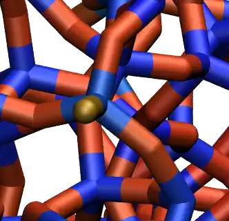

.. figure:: ../figures/level3/reactive-silicon-dioxide/SiO_gif_dark.webp
    :height: 250
    :alt: Figure showing silicon dioxide structure with colored charges as simulated with lammps and reaxff
    :class: only-dark
    :align: right

..  container:: justify

    The objective of this tutorial is to use a 
    reactive force field (*ReaxFF* :cite:`van2001reaxff, zou2012investigation`),
    and calculate the partial charges of a system undergoing
    deformation, as well as chemical bonds formation and breaking.  

..  container:: justify

    The system simulated here is a block of silicon dioxide (SiO2), that is deformed 
    until rupture. A particular attention is given to the evolution of the charges
    of the atoms during the deformation of the structure, and 
    the chemical reactions occurring due to the deformation
    are tracked.

.. include:: ../../non-tutorials/recommand-lj.rst

.. include:: ../../non-tutorials/needhelp.rst

.. include:: ../../non-tutorials/2Aug2023.rst

Prepare and relax
=================

..  container:: justify

    Create a folder, name it *RelaxSilica/*,
    and |download_silica_data| the initial topology of a small
    amorphous silica structure.

.. |download_silica_data| raw:: html

   <a href="../../../../../lammpstutorials-inputs/level3/reactive-silicon-dioxide/RelaxSilica/silica.data" target="_blank">download</a>

.. admonition:: About the initial structure
    :class: info

    The system was created by temperature annealing using another force field 
    named |download_SiO.1990.vashishta|. In case you are
    interested in the input creation, the files
    used for creating the initial topology is available
    |lammps_input_creating|.

.. |download_SiO.1990.vashishta| raw:: html

   <a href="../../../../../lammpstutorials-inputs/level3/reactive-silicon-dioxide/CreateSilica/SiO.1990.vashishta" target="_blank">vashishta</a>

.. |lammps_input_creating| raw:: html

   <a href="../../../../../lammpstutorials-inputs/level3/reactive-silicon-dioxide/CreateSilica/input.lammps" target="_blank">here</a>

..  container:: justify

    If you open the *silica.data* file, you can see 
    by looking at the Atoms section that
    all silicon atoms have the same charge :math:`q = 1.1\,\text{e}`,
    and all oxygen atoms the charge :math:`q = -0.55\,\text{e}`.
    This is common with classical force field, and will change once
    *ReaxFF* is used. Let us keep that in mind for now.

..  container:: justify

    The first step we need to perform here is to relax
    the structure with *ReaxFF*, which we are gonna do using molecular
    dynamics. To make sure that the system equilibrates
    nicely, let us track some changes over time.

..  container:: justify

    Create an input file called *input.lammps* in *RelaxSilica/*,
    and copy the following lines in it: 

..  code-block:: lammps

    units real
    atom_style full

    read_data silica.data

    mass 1 28.0855 # Si
    mass 2 15.999 # O

..  container:: justify

    So far, the input is very similar to what was seen
    in the previous tutorials. Some basic parameters are
    defined (*units*, *atom_style* and *masses*), and 
    the *.data* file is imported by the *read_data* command.
    Now let us enter 3 crucial lines in the *input.lammps* file:

..  code-block:: lammps

    pair_style reaxff NULL safezone 3.0 mincap 150
    pair_coeff * * reaxCHOFe.ff Si O
    fix myqeq all qeq/reaxff 1 0.0 10.0 1.0e-6 reaxff maxiter 400

..  container:: justify

    Here, the *ReaxFF pair_style* is used with no control file.
    The *safezone* and *mincap* keywords have been added
    to avoid memory allocation issue, which sometimes can trigger
    the segmentation faults and bondchk failed errors.

..  container:: justify

    The *pair_coeff* uses
    the |reaxCHOFe| file which is assumed
    to be saved within *RelaxSilica/*.
    For consistency, the atoms of type 1 are set as silicon (Si),
    and the atoms of type 2 as oxygen (O).

..  container:: justify

    Finally, the *fix qeq/reaxff* is used to perform charge equilibration. The charge
    equilibration occurs at every step. The values 0.0 and 10.0
    are the low and the high cutoffs, respectively, and :math:`1.0 \text{e} -6` is a
    tolerance. Finally, *maxiter* sets a upper limit to the number of attempt to
    equilibrate the charge. 

.. admonition:: Note
    :class: info

    If the charge does not
    properly equilibrate despite the 400 attempts, a warning will appear. Such warnings
    are likely to appear at the beginning of the simulation if the initial charges
    are too far from the equilibrium values.

.. |reaxCHOFe| raw:: html

   <a href="../../../../../lammpstutorials-inputs/level3/reactive-silicon-dioxide/RelaxSilica/reaxCHOFe.ff" target="_blank">reaxCHOFe.ff</a>

..  container:: justify

    Then, let us add some commands to the *input.lammps* file 
    to measure the evolution of the charges during the simulation:

..  code-block:: lammps

    group grpSi type 1
    group grpO type 2
    variable qSi equal charge(grpSi)/count(grpSi)
    variable qO equal charge(grpO)/count(grpO)
    
..  container:: justify

    Let us also print the charge in the *.log* file by using *thermo_style*,
    and create a *.lammpstrj* file for visualization.
    Add the following lines to the *input.lammps*:

..  code-block:: lammps

    thermo 5
    thermo_style custom step temp etotal press vol v_qSi v_qO
    dump dmp all custom 100 dump.lammpstrj id type q x y z

..  container:: justify

    Let us also use the *fix reaxff/species* to evaluate what
    species are present within the simulation. It will
    be useful later, when the system is deformed:

..  code-block:: lammps

    fix myspec all reaxff/species 5 1 5 species.log element Si O

..  container:: justify

    Here, the information will be printed every 5 steps in a
    file named *species.log*.

..  container:: justify

    Let us perform a very short run using anisotropic NPT command
    and relax the density of the system. 

..  code-block:: lammps

    velocity all create 300.0 3482028
    fix mynpt all npt temp 300.0 300.0 100 aniso 1.0 1.0 1000
    timestep 0.5

    run 5000

    write_data silica-relaxed.data

..  container:: justify

    Run the *input.lammps* file using LAMMPS. As can be seen from *species.log*,
    only one species is detected, called *Si192O384*, which is the entire system.

..  container:: justify

    As the simulation progresses, you can see that the charges of the atoms are fluctuating
    since the charge of every individual atom is adjusting to its local environnement.

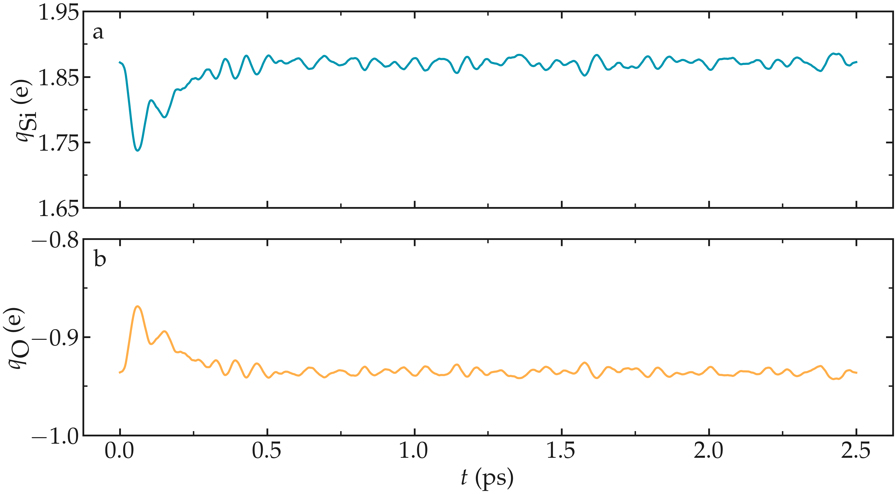

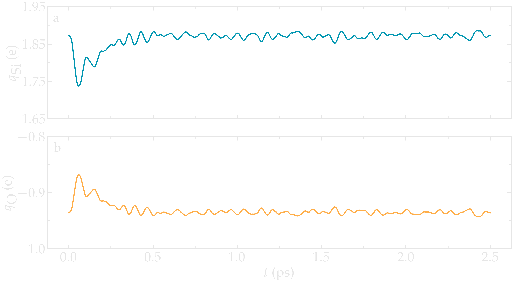

..  container:: figurelegend

    Figure: Average charge per atom of the silicon (a) and oxygen (b)
    atoms during equilibration, as given by the
    *v_qSi* and *v_qO* variables.

..  container:: justify

    One can see that the charges of the atoms are strongly fluctuating
    at the beginning of the simulation. This early fluctuation correlates
    with a rapid volume change of the box, during which
    the inter atomic distances are expected to quickly change.

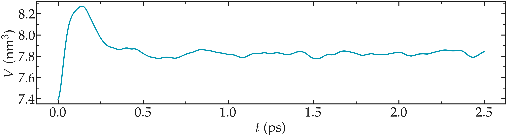

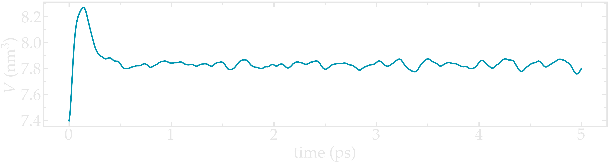

..  container:: figurelegend

    Figure: Volume of the system as a function of time.

..  container:: justify

    Since each atom has a charge that depends on its local environnement,
    the charge values are expected to be different for every atom in the system. We can plot 
    the charge distribution :math:`P(q)`, using the charge values printed in
    the *.lammptrj* file. 
    
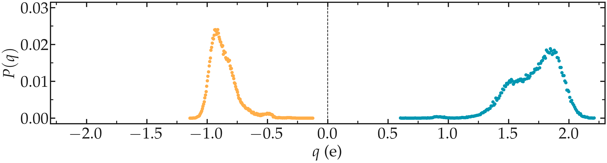

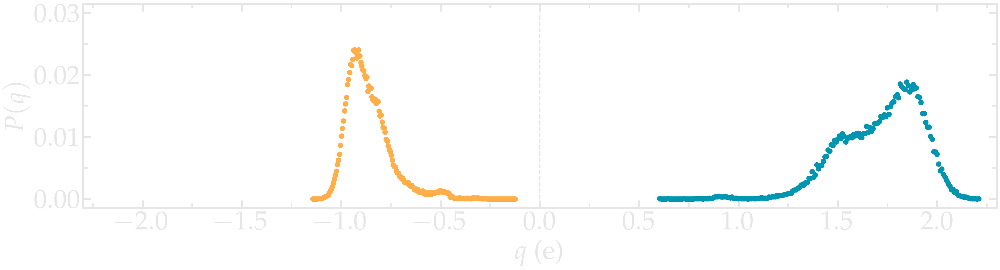

..  container:: figurelegend

    Figure: Probability distribution of charge of silicon (positive, blue)
    and oxygen (negative, orange) atoms during equilibration.

..  container:: justify

    Using VMD and coloring the atoms by their charges, one can see that 
    the atoms with the extreme-most charges are located at defects in the 
    amorphous structure (here at the positions of the dandling oxygen groups).

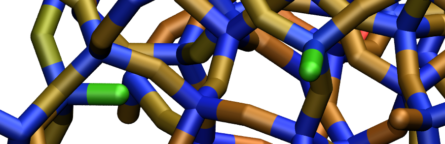

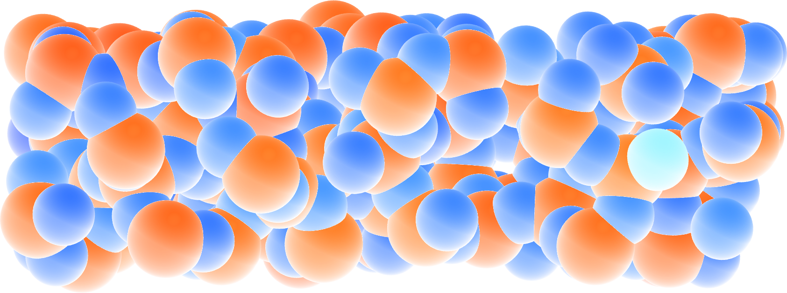

..  container:: figurelegend

    Figure: A slice of the amorphous silica, where atoms are colored by
    their charges. Dandling oxygen groups appear in greenish, bulk Si atoms
    with charge of about 1.8e appear in red/orange, bulk O atoms
    with charge of about -0.9e appear in blue.
    To color the atoms by their charge in VMD, use *Charge* as coloring method in the 
    representation windows, and then tune the *Color scale* in the *Color control windows*.

Deform the structure
====================

..  container:: justify

    Let us apply a deformation to the structure in order to
    force some :math:`\text{Si}-\text{O}` bonds to break and re-assemble. 

..  container:: justify

    Next to *RelaxSilica/*, create a folder, call it *Deform/* and create a
    file named *input.lammps* in it. Copy the same lines
    as previously in *input.lammps*:

..  code-block:: lammps

    units real
    atom_style full

    read_data ../RelaxSilica/silica-relaxed.data

    mass 1 28.0855 # Si
    mass 2 15.999 # O

    pair_style reaxff NULL safezone 3.0 mincap 150
    pair_coeff * * ../RelaxSilica/reaxCHOFe.ff Si O
    fix myqeq all qeq/reaxff 1 0.0 10.0 1.0e-6 reaxff maxiter 400

..  container:: justify

    The only differences with the previous *input.lammps* file
    are the paths to the *.data* and *.ff*
    files located within *RelaxSilica/*.
    Copy the following lines as well:

..  code-block:: lammps

    group grpSi type 1
    group grpO type 2
    variable qSi equal charge(grpSi)/count(grpSi)
    variable qO equal charge(grpO)/count(grpO)

    thermo 5
    thermo_style custom step temp etotal press vol v_qSi v_qO
    dump dmp all custom 100 dump.lammpstrj id type q x y z

    fix myspec all reaxff/species 5 1 5 species.log element Si O

..  container:: justify

    Then, let us use *fix nvt* instead of *fix npt* to apply a
    thermostat:

..  code-block:: lammps

    fix mynvt all nvt temp 300.0 300.0 100
    timestep 0.5

.. admonition:: Note
    :class: info

    Here, no barostat is used because the box volume
    will be imposed by the *fix deform*.

..  container:: justify

    Let us run for 5000 steps without deformation,
    then apply the *fix deform* for elongating
    progressively the box along *x* during 25000 steps.
    Add the following line to *input.lammps*:

..  code-block:: lammps

    run 5000

    fix mydef all deform 1 x erate 5e-5

    run 25000

    write_data silica-deformed.data

..  container:: justify

    During the deformation, the charges progressively change until the structure eventually
    breaks down. After the structure breaks down, the charges equilibrate near new 
    average values that differ from the starting averages. The difference between 
    the initial and the final charges can be explained by
    presence of defects as well as a new solid/vacuum interfaces, and the fact that
    surface atoms typically have different charges compared to bulk atoms.

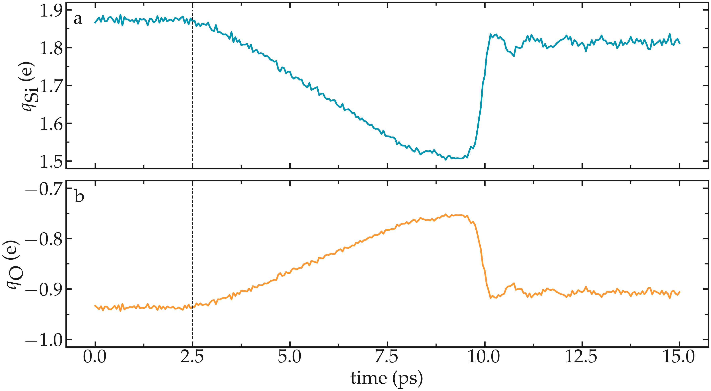

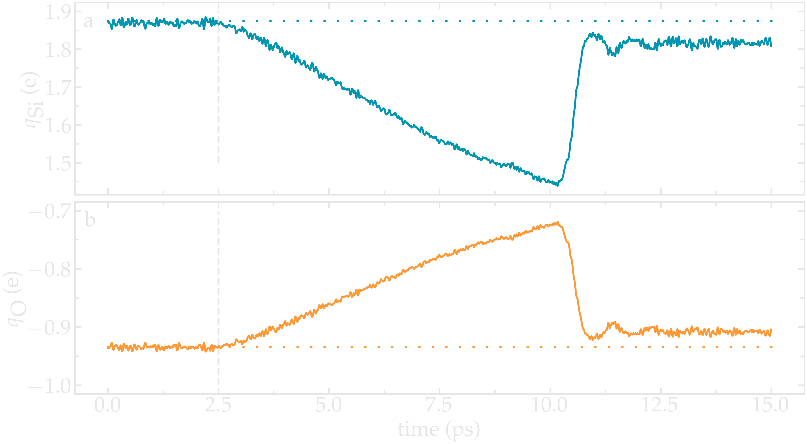

..  container:: figurelegend

    Figure: Average charge per atom of the silicon (a) and oxygen (b).
    The vertical dashed lines marks the beginning of the deformation.

..  container:: justify

    There is also a strong increase in temperature during the rupture of the
    material.

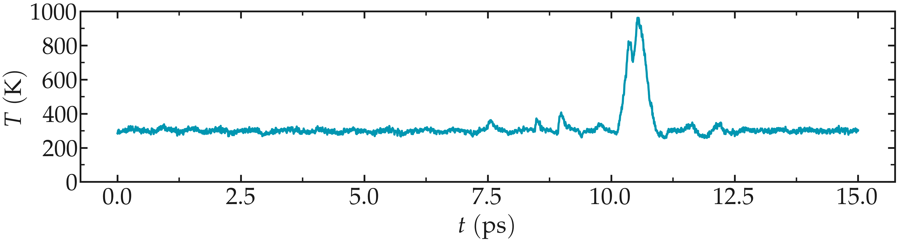

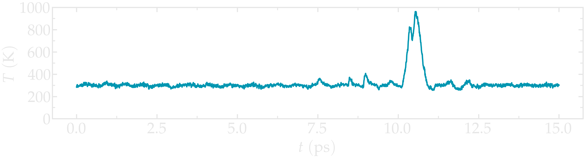

..  container:: figurelegend

    Figure: Temperature of the system over time.

..  container:: justify

    At the end of the deformation, one can visualize the broken material using VMD.
    Notice the different charge values of the atoms located near the vacuum interfaces,
    compared to the atoms located in the bulk of the material.

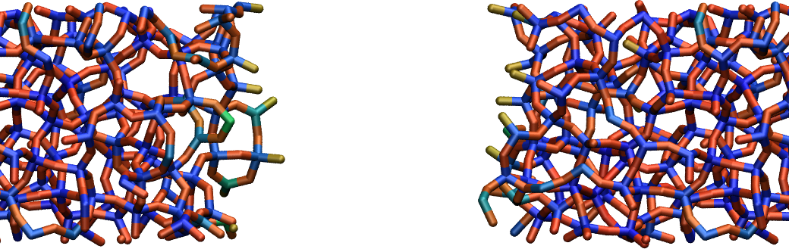

.. figure:: ../figures/level3/reactive-silicon-dioxide/deformed-dark.png
    :alt: Deformed amorphous silica colored by charges using VMD
    :class: only-dark

..  container:: figurelegend

    Figure: Amorphous silicon oxide after deformation. The atoms are colored by
    their charges.

..  container:: justify

    One can have a look at the charge distribution after deformation,
    as well as during the deformation.

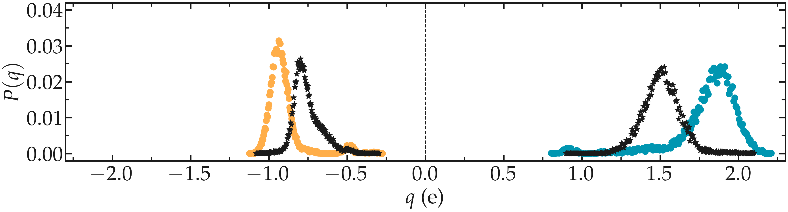

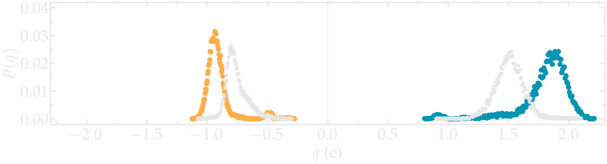

..  container:: figurelegend

    Figure: Distribution of charge of silicon (positive, blue) and oxygen (negative, orange)
    after deformation. The stars correspond to the charge distribution during deformation. 

..  container:: justify

    As expected, the final charge distribution slightly differs from the previously calculated.
    In my case, no new species was formed during the simulation,
    as can be seen from the *species.log* file:

..  code-block:: lammps

    #  Timestep    No_Moles    No_Specs   Si192O384
            5           1           1           1
    (...)
    #  Timestep    No_Moles    No_Specs   Si192O384
        30000           1           1           1

..  container:: justify

    Sometimes, :math:`\text{O}_2` molecules are formed during the
    deformation. If this is the case, the *species.log* file will look like:

..  code-block:: lammps

    #  Timestep    No_Moles    No_Specs   Si192O384
              5           1           1           1
    (...)
    #  Timestep    No_Moles    No_Specs   Si192O382          O2
          30000           1           1           1           1

Decorate the surface
====================

..  container:: justify

    Let us add hydrogen atoms to the cracked silica, and measure how the
    system evolves with time. 

..  container:: justify

    Next to *RelaxSilica/* and *Deform/*, create a folder, call it *Decorate/*.
    Then, let us modify the previously generated data file
    *silica-deformed.data* and make space for a third atom type.
    Copy *silica-deformed.data* from the *Deform/* folder,
    and modify the first lines as follow:

..  code-block:: lammps

    576 atoms
    3 atom types

    -12.15958814509652 32.74516585669389 xlo xhi
    2.316358282925984 18.26921942866687 ylo yhi
    1.3959542953413138 19.189623416252907 zlo zhi

    Masses

    1 28.0855
    2 15.999
    3 1.008

    (...)

..  container:: justify

    Create a file named *input.lammps* 
    into the *Decorate/* folder, and copy
    the following lines into it:

..  code-block:: lammps

    units real
    atom_style full

    read_data silica-deformed.data
    displace_atoms all move -12 0 0 # optional

    pair_style reaxff NULL safezone 3.0 mincap 150
    pair_coeff * * ../RelaxSilica/reaxCHOFe.ff Si O H
    fix myqeq all qeq/reaxff 1 0.0 10.0 1.0e-6 reaxff maxiter 400

..  container:: justify

    Here, the *displace_atoms* command was used to
    move the center of the crack near the center of the box.
    This step is optional, but makes the visualizing
    of the interface in VMD easier.
    A different value for the shift may be needed in your case,
    depending on the location of the crack.

..  container:: justify

    A difference with the previous input, is that
    three atom types are specified in the
    *pair_coeff* command, *Si O H*, instead of two.

..  container:: justify

    Then, let us adapt some familiar commands
    to measure the charges of all three types of atoms,
    and output the charge values into log files:

..  code-block:: lammps

    group grpSi type 1
    group grpO type 2
    group grpH type 3
    variable qSi equal charge(grpSi)/count(grpSi)
    variable qO equal charge(grpO)/count(grpO)
    variable qH equal charge(grpH)/(count(grpH)+1e-10)

    thermo 5
    thermo_style custom step temp etotal press vol &
        v_qSi v_qO v_qH
    fix myspec all reaxff/species 5 1 5 species.log element Si O H

..  container:: justify

    Here, the :math:`+1\text{e}-10` was added to the 
    denominator of the *variable qH* in order to avoid dividing by 0
    at the beginning of the simulation.

..  container:: justify

    Finally, let us use create a loop with 20 steps,
    and create two hydrogens atom at random locations at every step: 

..  code-block:: lammps

    fix mynvt all nvt temp 300.0 300.0 100
    timestep 0.5 

    label loop
    variable a loop 10

    variable seed equal 35672+${a} 
    create_atoms 3 random 2 ${seed} NULL overlap 2.6 maxtry 50
    group grpH type 3
    run 2000
    write_dump all custom dump.${a}.lammpstrj id type q x y z

    next a
    jump SELF loop

    write_data decorated.data
    
..  container:: justify

    Here a different *lammpstrj* file is created for each step of the
    loop, in order to avoid creating dump files with varying number of atoms
    that VMD can't read.

..  container:: justify

    Once the simulation is over, it can be seen from the *species.log*
    file that most of the added hydrogen atoms reacted with 
    the :math:`\text{SiO}_{2}` structure to form hydroxyl (-OH) groups.

..  code-block:: lammps

    # Timestep   No_Moles   No_Specs  Si192O384  H
      5          3          2         1          2
    (...)
    # Timestep   No_Moles No_Specs Si192O384H20
      20000      1        1        1

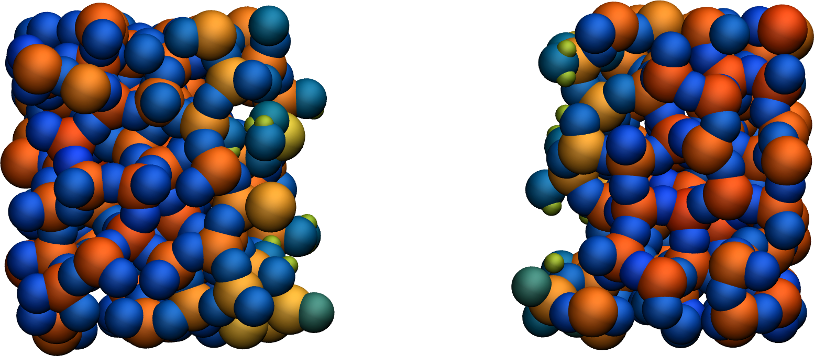

.. figure:: ../figures/level3/reactive-silicon-dioxide/decorated-dark.png
    :alt: Cracked silicon oxide after addition of hydrogen atoms
    :class: only-dark

..  container:: figurelegend

    Figure: Cracked silicon oxide after addition of hydrogen atoms. The atoms are colored by
    their charges.

.. include:: ../../non-tutorials/accessfile.rst

Going further with exercises
============================

.. include:: ../../non-tutorials/link-to-solutions.rst

..
    Add O2 molecules
    ----------------

    ..  container:: justify

        Add :math:`\text{O}_2` molecules to the previously
        equilibrated structure. Equilibrate it again, and
        extract the charge density profile along the :math:`x` axis. 

    ..  container:: justify

        Here, the :math:`\text{O}_2` molecule is simply made of 2 oxygen atoms that are not 
        connected by any bond.

    .. figure:: ../figures/level3/reactive-silicon-dioxide/O2_light.png
        :alt: Silicon oxide with additional O2 molecules
        :class: only-light

    .. figure:: ../figures/level3/reactive-silicon-dioxide/O2_dark.png
        :alt: Silicon oxide with additional O2 molecules
        :class: only-dark

    ..  container:: figurelegend

        Figure: Deformed structure with some :math:`\text{O}_2` molecules

Hydrate the structure
---------------------

..  container:: justify

    Add water molecules to the current structure, and follow the
    reactions over time.

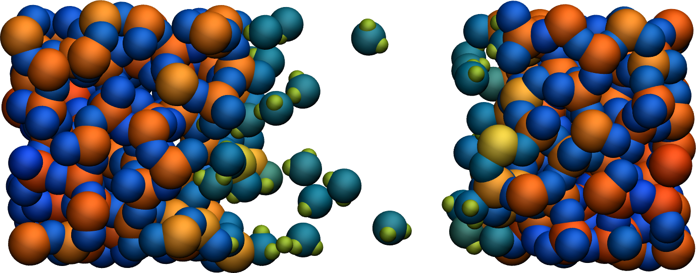

.. figure:: ../figures/level3/reactive-silicon-dioxide/hydrated-dark.png
    :alt: Cracked silicon oxide after addition of water molecule
    :class: only-dark

..  container:: figurelegend

    Figure: Cracked silicon oxide after addition of hydrogen atoms and water molecules.
    The atoms are colored by their charges.

A slightly acidic bulk solution
-------------------------------

..  container:: justify

    Create a bulk water system with a few hydronium ions using *ReaxFF*

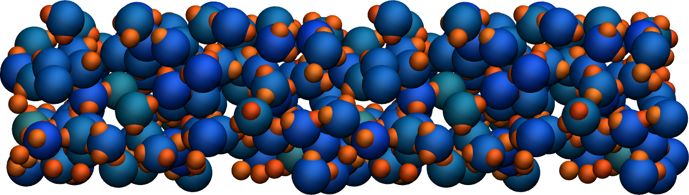

.. figure:: ../figures/level3/reactive-silicon-dioxide/acidic-water-dark.png
    :alt: Acidic bulk water with ReaxFF
    :class: only-dark

..  container:: figurelegend

    Figure: Slightly acidic bulk water simulated with *ReaxFF*.