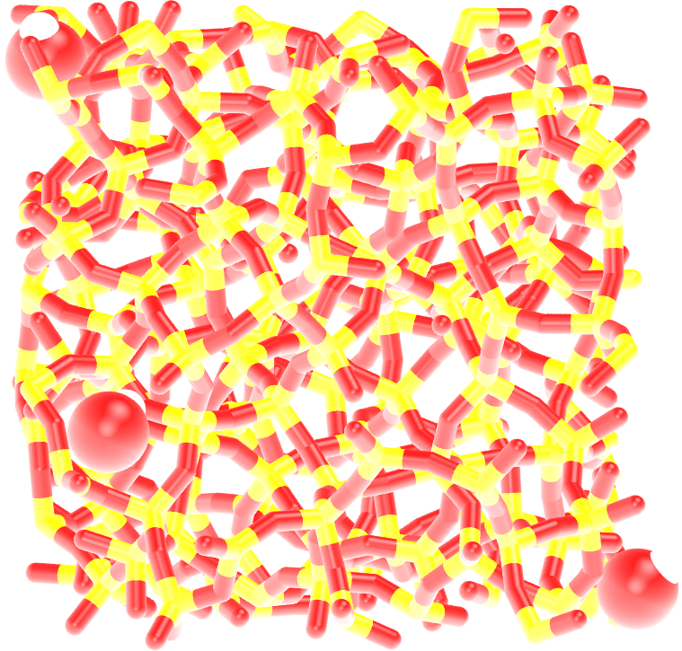

.. _gcmc-silica-label:

Water adsorption in silica
**************************

..  container:: justify

    This tutorial is part of the *Monte Carlo* series.

.. container:: hatnote

    Adsorption of water in a silica crack using the
    grand canonical Monte Carlo method

..  container:: justify

    The objective of this tutorial is to combine molecular
    dynamics and grand canonical Monte Carlo simulations to
    simulate the adsorption of water molecules in a cracked
    silica.

    This tutorial illustrates the use of the grand canonical
    ensemble in molecular simulation, an ensemble in which the number of 
    molecule/atom is not constant.

Generation of the silica block
==============================

..  container:: justify

    Let us generate a block of amorphous silica (SiO2). To do
    so, we are going to replicate a building block containing 3
    Si and 6 O atoms. The data file for the SiO atoms can be
    downloaded by clicking
    `here <../../../../../../inputs/montecarlo/gcmc-silica/SilicaBlock/SiO.data>`__.
    Save it in a folder called SilicaBlock. This data file
    contains the coordinates of the atoms, their masses, and
    their charges, and can be directly read by LAMMPS using the
    read_file command. Let us replicate these atoms using
    LAMMPS, and apply an annealing procedure to obtain a block
    of amorphous silica.

    Create a new input file in the same folder as the downloaded
    dataSiO.data, and copy the following lines in it:

..  code-block:: bash
   :caption: *to be copied in SilicaBlock/input.lammps*

    # Initialization
    units metal
    boundary p p p
    atom_style full
    pair_style vashishta
    neighbor 1.0 bin
    neigh_modify delay 1

    # System definition
    read_data SiO.data
    replicate 4 4 4

..  container:: justify

    Download the Vashishta potential by clicking
    `here <../../../../../../inputs/montecarlo/gcmc-silica/SilicaBlock/SiO.1990.vashishta>`__,
    and copy it within the SilicaBlock folder.

    **About the Vashishta potential:** Metal units are used
    as required by the Vashishta potential. The
    `Vashishta <https://pubmed.ncbi.nlm.nih.gov/9993674/>`__
    potential is a bond-angle energy based potential, it
    deduces the bonds between atoms from their relative
    positions. Therefore, there is no need to provide bond
    and angle information as we do with classic force fields
    like GROMOS or AMBER. Bond-angle energy based potentials
    are more computationally heavy than classical force
    fields and require the use of a smaller timestep, but
    they allow for the modelling of bond formation and
    breaking, which is what we need here as we want to create
    a crack in the silica.

    The system is then replicated four times in all three
    directions of space.

    Then, let us specify the pair coefficients by indicating
    that the first atom is Si, and the second is O. Let us also
    add a dump command for printing out the positions of the
    atoms every 5000 steps:

..  code-block:: bash
   :caption: *to be copied in SilicaBlock/input.lammps*

    # Simulation settings
    pair_coeff * * SiO.1990.vashishta Si O
    dump dmp all atom 5000 dump.lammpstrj

..  container:: justify

    Finally, let us create the last part of our script. The
    annealing procedure is the following: we first start with a
    small phase at 6000 K, then cool down the system to 4000 K
    using a pressure of 100 atm. Then we cool down the system
    further while also reducing the pressure, then perform a
    small equilibration step at the final desired condition, 300
    K and 1 atm.

    *Disclaimer --* I created this procedure by intuition and
    not from proper calibration, do not copy it without
    making your own tests if you intend to publish your
    results.

..  code-block:: bash
   :caption: *to be copied in SilicaBlock/input.lammps*

    # Run
    velocity all create 6000 4928459 rot yes dist gaussian
    fix nvt1 all nvt temp 6000 6000 0.1
    timestep 0.001
    thermo 1000
    run 5000
    unfix nvt1
    fix npt1 all npt temp 6000 4000 0.1 aniso 100 100 1
    run 50000
    fix npt1 all npt temp 4000 300 0.1 aniso 100 1 1
    run 200000
    fix npt1 all npt temp 300 300 0.1 aniso 1 1 1
    run 4000
    write_data amorphousSiO.data

..  container:: justify

    **Anisotropic versus isotropic barostat:** Here an
    anisotropic barostat is used, therefore all three
    directions of space are managed independently. An
    anisotropic barostat is better for a solid phase, 
    as there is no reason for the final solid phase to
    have the same dimensions along all 3 axis, but for a
    liquid of a gas, use an isotropic barostat instead.

    The simulation takes about 15-20 minutes on four cpus.

    After running the simulation, the final configuration
    amorphousSiO.data will be located in the same folder as your
    input file. Alternatively, if you are only interested in the
    next steps of this tutorial, you can download it by clicking
    `here <../../../../../../inputs/montecarlo/gcmc-silica/SilicaBlock/amorphousSiO.data>`__.
    The final system resembles the image below, where the oxygen
    atoms are in red and the silicon atoms in yellow:

    Side and top view of the silica block.

..  container:: justify

    Ideally you want to test the validity of the generated
    structure, for example by measuring the radial
    distribution function and/or the Young modulus, and
    compare them to experimental data. This is beyond the
    scope of this tutorial.

Cracking the silica
===================

..  container:: justify

    We are now going to dilate the block of silica to create a
    crack. Create a new folder, called Cracking, and create a
    new input.lammps file starting with:

..  code-block:: bash
    :caption: *to be copied in Cracking/input.lammps*

    # Initialization
    units metal
    boundary p p p
    atom_style full
    neighbor 1.0 bin
    neigh_modify delay 1

    # System definition
    read_data ../SilicaBlock/amorphousSiO.data

    # Simulation settings
    pair_style vashishta
    pair_coeff * * ../SilicaBlock/SiO.1990.vashishta Si O
    dump dmp all atom 1000 dump.lammpstrj

..  container:: justify

    Then, we are going to progressively increase the size of the
    box over z, thus forcing the silica to crack. To do
    so, we are going to make a loop using the jump command. At
    every step of the loop, the box dimension over z will
    be multiplied by a factor 1.005. For this step, we use a NVT
    thermostat because we want to impose a deformation of the
    volume (therefore NPT would be inappropriate). Add the
    following lines to the input script:

.. code-block:: bash
    :caption: *to be copied in Cracking/input.lammps*

    # Run
    fix nvt1 all nvt temp 300 300 0.1
    timestep 0.001
    thermo 1000
    variable var loop 45
    label loop
    change_box all z scale 1.005 remap
    run 2000
    next var
    jump input.lammps loop
    run 20000
    write_data dilatedSiO.data

..  container:: justify

    Feel free to play with the factor (1.005) and the number of 
    loop (45) to generate more or less large cracking in the silica.

    After the dilatation, a final equilibration step of 20
    picoseconds is performed. If you look at the dump file
    produced after executing this script, or at `this
    video <https://www.youtube.com/watch?v=8rBqYIcTgno&ab_channel=SimonGravelle>`__,
    you can see the dilatation occurring step-by-step and the
    atoms adjusting to the box size. At first, the deformations
    are reversible (elastic regime), but at some point, bonds
    start breaking and dislocations appear (plastic regime). You
    can download the final state directly by clicking
    `here <../../../../../../inputs/montecarlo/gcmc-silica/Cracking/dilatedSiO.data>`__.

    The final system, with the crack, resembles:

.. figure:: ../figures/gcmc-silica/cracked-light.png
    :alt: silica block with crack
    :class: only-light

    Block of silica with holes and deformed bonds.

..  container:: justify

    In ambient conditions, silicon (Si) atoms are chemically
    passivated by forming covalent bonds with hydrogen (H)
    atoms. For the sake of simplicity, we are not going to
    decorate our silica with hydrogen atoms in this tutorial.
    It would require a procedure to properly insert hydrogen
    atoms at the right place, or/and the use of another
    potential.

Adding water
============

..  container:: justify

    In order to add the water molecules to the silica, we are
    going to use the Monte Carlo method in the grand canonical
    ensemble (GCMC). In short, the system is put into contact
    with a virtual reservoir of given chemical potential
    :math:`\mu`, and multiple attempts to insert water
    molecules at random positions are made. Attempts are
    either accepted or rejected based on a Monte Carlo
    acceptance rule.

    In a new folder called Addingwater, add this template file
    for the water molecule :
    `TIP4P2005.txt <../../../../../../inputs/montecarlo/gcmc-silica/AddingWater/TIP4P2005.txt>`__.
    Create a new input file, and copy the following lines into
    it:

..  code-block:: bash
   :caption: *to be copied in Addingwater/input.lammps*

    # Initialization
    units metal
    boundary p p p
    atom_style full
    neighbor 1.0 bin
    neigh_modify delay 1
    pair_style hybrid/overlay vashishta lj/cut/tip4p/long 3 4 1 1 0.1546 10
    kspace_style pppm/tip4p 1.0e-4
    bond_style harmonic
    angle_style harmonic

..  container:: justify

    There are several differences with the previous input files
    used in this tutorial. All these differences are here
    because this simulation will combine water and silica.
    First, we have to combine two force fields, vashishta for
    SiO, and lj/cut/tip4p/long for TIP4P water model. Combining
    force fields in LAMMPS can be done using the hybrid/overlay
    pair style. We also need a kspace solver to solve the long
    range Coulomb interactions associated with tip4p/long.
    Finally, we need to define the style for the bond and angle
    of the water molecules.

    Before going
    further, we need to make a few change to our data file.
    Currently, dilatedSiO.data only includes two atom types, but
    we need four. Copy the previously generated dilatedSiO.data
    file within the present folder. It starts with:

..  code-block:: bash

    LAMMPS data file via write_data, version 30 Jul 2021, timestep = 90000

    576 atoms
    2 atom types

    0.910777522101565 19.67480018949893 xlo xhi
    2.1092682236518137 18.476309487947546 ylo yhi
    -4.1701120819606885 24.75568979356097 zlo zhi

    Masses

    1 28.0855
    2 15.9994

    Atoms # full

    (...)

..  container:: justify

    We need to make some changes for the addition of water
    molecules. Modify the file so that it looks like that 
    (with 4 atom types, 1 bond type, 1 angle type, and four masses):

..  code-block:: bash

    LAMMPS data file via write_data, version 30 Jul 2021, timestep = 90000

    576 atoms
    4 atom types
    1 bond types
    1 angle types

    2 extra bond per atom
    1 extra angle per atom
    2 extra special per atom

    0.910777522101565 19.67480018949893 xlo xhi
    2.1092682236518137 18.476309487947546 ylo yhi
    -4.1701120819606885 24.75568979356097 zlo zhi

    Masses

    1 28.0855
    2 15.9994
    3 15.9994
    4 1.008

    Atoms # full

    (...)

..  container:: justify

    Doing so, we anticipate that there will be 4 atoms types in
    the simulations, with O and H of H2O being indexes 3 and 4,
    respectively. There will also be 1 bond type and 1 angle
    type. The extra bond, extra angle, and extra special lines
    are for memory allocation. 

    We can continue to fill the
    input.lammps file, by adding the system definition:

..  code-block:: bash
   :caption: *to be copied in Addingwater/input.lammps*

    # System definition
    read_data dilatedSiO.data
    molecule h2omol TIP4P2005.txt
    lattice sc 3
    create_atoms 0 box mol h2omol 45585
    lattice none 1

    group SiO type 1 2
    group H2O type 3 4

..  container:: justify

    After reading the data file and defining the h2omol molecule
    from the txt file, the create_atoms command is used to
    include some water molecules in the system on a 
    simple cubic lattice. Not adding a molecule before starting the
    GCMC steps usually lead to failure. Note that here,
    most water molecules are overlapping with the silica. THose 
    overlapping water molecules will be deleted before 
    starting the simulation. 

    Then, add the following
    settings of the simulation:

..  code-block:: bash
   :caption: *to be copied in Addingwater/input.lammps*

    # Simulation settings
    pair_coeff * * vashishta ../SilicaBlock/SiO.1990.vashishta Si O NULL NULL
    pair_coeff * * lj/cut/tip4p/long 0 0
    pair_coeff 1 3 lj/cut/tip4p/long 0.0057 4.42 # epsilonSi = 0.00403, sigmaSi = 3.69
    pair_coeff 2 3 lj/cut/tip4p/long 0.0043 3.12 # epsilonO = 0.0023, sigmaO = 3.091
    pair_coeff 3 3 lj/cut/tip4p/long 0.008 3.1589
    pair_coeff 4 4 lj/cut/tip4p/long 0.0 0.0
    bond_coeff 1 0 0.9572
    angle_coeff 1 0 104.52
    variable oxygen atom "type==3"
    group oxygen dynamic all var oxygen
    variable nO equal count(oxygen)
    fix myat1 all ave/time 100 10 1000 v_nO file numbermolecule.dat
    fix shak H2O shake 1.0e-4 200 0 b 1 a 1 mol h2omol

..  container:: justify

    The force field vashishta applies only to Si and O of SiO,
    and not to the O and H of H2O thanks to the NULL
    parameters. Pair coefficients for lj/cut/tip4p/long are
    defined between O atoms, as well as between
    O(SiO)-O(H2O) and Si(SiO)-O(H2O). Finally, the
    number of oxygen atoms will be printed in the file
    numbermolecule.dat, and the shake algorithm is used to
    maintain the shape of the water molecule over time. Some of
    these features have been seen previously, such as in `this
    tutorial <03-NanoconfinedElectrolyte.html>`__.

    Let us delete the overlapping water molecules, and print the 
    positions in a dump file:

..  code-block:: bash
   :caption: *to be copied in Addingwater/input.lammps*

    delete_atoms overlap 2 H2O SiO mol yes
    dump dmp all atom 1000 dump.init.lammpstrj

..  container:: justify

    Let us make a first equilibration step:

..  code-block:: bash
   :caption: *to be copied in Addingwater/input.lammps*

    # Run
    compute_modify thermo_temp dynamic yes
    compute ctH2O H2O temp
    compute_modify ctH2O dynamic yes
    fix mynvt1 H2O nvt temp 300 300 0.1
    fix_modify mynvt1 temp ctH2O
    compute ctSiO SiO temp
    fix mynvt2 SiO nvt temp 300 300 0.1
    fix_modify mynvt2 temp ctSiO
    timestep 0.001
    thermo 1000
    run 5000

..  container:: justify

    We use two different thermostats for SiO and H2O, which is
    better when you have two species, such as one solid and one
    liquid. It is particularly important to use two thermostats
    here as the number of water molecules will fluctuate with time. We use
    a compute_modify 'dynamic yes' for water to specify that the
    number of molecules is not constant.

    Finally, let us use the gcmc fix and perform the grand
    canonical Monte Carlo steps:

..  code-block:: bash
   :caption: *to be copied in Addingwater/input.lammps*

    variable tfac equal 5.0/3.0
    fix fgcmc H2O gcmc 100 100 0 0 65899 300 -0.5 0.1 mol h2omol tfac_insert ${tfac} group H2O shake shak full_energy pressure 10000
    run 100000
    write_data SiOwithwater.data
    write_dump all atom dump.lammpstrj

..  container:: justify

    The tfac_insert option ensures that the correct estimate is
    made for the temperature of the inserted water molecules by
    taking into account the internal degrees of freedom. Running
    this simulation, you should see the number of molecule
    increasing progressively. When using the pressure argument,
    LAMMPS ignore the value of the chemical potential (here :math:`\mu = -0.5` eV
    which corresponds roughly to ambient conditions (i.e. RH approx 50%).)
    The large pressure value of 10000 bars was chosen to ensure that 
    some successful insertions of molecules would occur during the 
    relatively short duration of the simulation.

    When you run the simulation, make sure that some water molecules 
    remain in the system after the delete_atoms command. 

    Depending on your LAMMPS version, you may have to run LAMMPS
    on a single CPU, due to some restrictions of the fix gcmc.

    You can see that 
    by looking at the log file:

..  code-block:: bash
    :caption: *from the log file*

    Created 972 atoms

..  container:: justify

    In my case 324 molecules were created.

..  code-block:: bash
    :caption: *from the log file*

    Deleted 954 atoms, new total = 594
    Deleted 636 bonds, new total = 12
    Deleted 318 angles, new total = 6

..  container:: justify

    Then 318 molecules where immediately deleted, leaving 16 molecules.

    After 100000 steps, you should see that the number of molecule did fluctuate.
    This number will vary from one simulation to
    another, depending on the space available for insertion. The
    number of molecules also depends on the imposed pressure, 
    temperature, and on the interaction between water
    and silica. 

    In my case, the final state looks like this:

    Cracked silica with a few water molecules.

..  container:: justify

    Note that gcmc simulations of dense phases are usually slow to converge due to the
    very low probability of successfully inserting a molecule. Here 100000 steps (or 100 ps)
    are not enough to reach equilibrium.

.. include:: ../../contact/accessfile.rst

Going further with exercises
============================

.. include::  ../../contact/requestsolution.rst

..  container:: justify

    This tutorial is already quite complicated, but if you want
    to go further, there are several interesting things that can
    be done with this system:

**Relative humidity**

..  container:: justify

    You can link the imposed chemical potential with the value
    of relative humidity (RH). For that, you have to calibrate
    your simulation by measuring the equilibrium amount of water
    in an empty box for varying imposed chemical potential, see
    `one of my
    publication <https://aip.scitation.org/doi/full/10.1063/1.5126481>`__
    for example.

**Isotherm**

..  container:: justify

    You can perform a full adsorption isotherm by varying the
    chemical potential and extracting the equilibrium water
    content as a function of the imposed RH. Isotherms can be
    compared to experimental data, and are used sometimes to
    calibrate force field as it contains a lot of information
    about the fluid-solid interactions.

**Isosteric heat of adsorption**

..  container:: justify

    Using the GCMC procedure, you can measure the heat of
    adsorption by measuring the fluctuations in water molecule
    and total energy of the system. See this `page for
    details <https://github.com/simongravelle/how-to-lammps>`__.

**Hybrid MD/GCMC**

..  container:: justify

    In the grand canonical ensemble, the volume of the box is
    fixed, so its not possible to capture the swelling of a
    material with its water content (most material swells with
    water, like sponges). If you want to model the swelling
    while also performing a GCMC adsorption simulation, you can
    alternate between GCMC steps and molecular dynamics steps in
    the NPT ensemble. This method is called hybrid MD/GCMC.

