.. _reax-silica-label:

Reactive silicon dioxide
************************

.. container:: hatnote

    Deforming a chemically reactive structure using reaxff

.. figure:: figures/reaxff/avatar-light.png
    :height: 250
    :alt: Figure showing silicon dioxide structure with colored charges.
    :class: only-light
    :align: right

.. figure:: figures/reaxff/avatar-dark.png
    :height: 250
    :alt: Figure showing silicon dioxide structure with colored charges.
    :class: only-dark
    :align: right

..  container:: justify

    The objective of this tutorial is to use a molecular
    dynamics system made of silicon dioxide (SiO2), and deform 
    it until it breaks. The reactive force field reaxff is used, and 
    a particular attention is given to the evolution
    of the charge of the atoms during
    the deformation of the structure. 

.. include:: ../contact/recommand-lj.rst

.. include:: ../contact/needhelp.rst

Relax the structure
===================

..  container:: justify

    Create a folder, name it RelaxSilica/, and |download_silica_data|
    the initial topology of a small amorphous silica structure.
    The system was created by temperature annealing using another force field 
    (|download_SiO.1990.vashishta|), therefore the structure is slightly
    different to what is expected from the reaxff force field. 
    For instance, the average bond lengths, angles, or charges 
    can be expected to be slightly different, and the structure will need 
    to be relaxed again using reaxff. 

    If you are interested, the input file used for creating the initial topology is 
    available |lammps_input_creating|, but its description is not part of this tutorial.

    The Atoms section of the *silica.data* file starts like that:

.. |download_silica_data| raw:: html

   <a href="../../../../inputs/reaxff/reax-silica/RelaxSilica/silica.data" target="_blank">download</a>

.. |download_SiO.1990.vashishta| raw:: html

   <a href="../../../../inputs/reaxff/reax-silica/CreateSilica/SiO.1990.vashishta" target="_blank">vashishta</a>

.. |lammps_input_creating| raw:: html

   <a href="../../../../inputs/reaxff/reax-silica/CreateSilica/input.lammps" target="_blank">here</a>

..  code-block:: lammps

    Atoms # full

    132 15 2 -0.55 1.722106654667303 6.0790786378597526 5.627968948336774 -6 4 -5
    172 20 1 1.1 5.755393150671698 3.31535305846982 1.0501387543709164 4 3 2
    231 26 2 -0.55 5.617126717910301 7.487471864752421 1.963810241571427 -16 8 -3
    54 6 2 -0.55 4.060884959755418 1.6283060986470597 4.297860218329581 -7 -4 3
    174 20 1 1.1 2.9926597997825395 2.0364512736354192 0.7520371846065788 -2 -6 -7
    180 20 2 -0.55 3.18438907446254 2.5721052475107857 6.622363526485664 0 -12 1
    121 14 2 -0.55 5.537222937373211 1.456250286791573 6.343752399466858 -9 -12 -4
    111 13 1 1.1 1.7279273441891305 7.28674041911877 6.669158065545038 6 -10 -2
    51 6 2 -0.55 5.366932941422638 4.1504125630630435 2.3740196532457105 0 -1 -3
    202 23 2 -0.55 7.313845702241226 3.321272888336706 3.777618751313188 0 5 -13
    215 24 2 -0.55 6.690317849940269 5.754543737004929 4.103252634559489 -6 2 0
    183 21 1 1.1 1.777618482333677 6.145548171417662 3.999369841948803 -5 -5 -3
    95 11 2 -0.55 4.561227581704491 2.3474960588346616 0.6330321107351076 -1 -6 3
    105 12 2 -0.55 5.0710009155644125 3.8511969818510208 5.143556706337486 -1 0 5
    (...)

..  container:: justify

    Due to the use of vashishta force field, all silicon atoms have the same charge (1.1e),
    and all oxygen atoms as well (-0.55e). This is common to most classical force field. 
    Let us keep that in mind before we start using reaxff.

    The first step is to relax the structure, which we are gonna do using molecular
    dynamcis. To make sure that system equilibrates nicely, let us track the changes in our system
    over time. 

    Create an input file called input.lammps in RelaxSilica/, and copy in it: 

..  code-block:: lammps
    :caption: *to be copied in RelaxSilica/input.lammps*

    units real
    atom_style full

    read_data silica.data

    mass 1 28.0855 # Si
    mass 2 15.999 # O

..  container:: justify

    So far, the input is very similar to what is seen in the other tutorials here,
    with some basic parameters being defined (units, atom_style and masses), and 
    our data file being read. Now let us enter 3 crucial lines:

..  code-block:: lammps
    :caption: *to be copied in RelaxSilica/input.lammps*

    pair_style reaxff NULL safezone 3.0 mincap 150
    pair_coeff * * reaxCHOFe.ff Si O
    fix myqeq all qeq/reaxff 1 0.0 10.0 1.0e-6 reaxff maxiter 400

..  container:: justify

    Here, the reaxff pair_style is used with no control file, and safezone and mincap
    are there for memory allocation issue. If not there, the segmentation faults and bondchk
    failed errors sometimes occur.

    The pair_coeff uses the |reaxCHOFe| file which is assumed to be saved in the same folder as the input. 
    The atoms of type 1 are set as silicon (Si),
    and type 2 as oxygen (O) in order to be consistent with our .data file and previous mass definition.

    Finally, qeq/reaxff is used to perform charge equilibration every timestep. The values 0 and 10.0
    are low and high cutoffs, and 1.0e-6 a tolerance. Finally, maxiter sets a limit to the number of 
    attempt to equilibrate the charge. If the charge does not properly equilibrate
    despite the 400 attempts, a warning will appear. Such warning are likely to appear if the initial 
    charges are too far from equilibrium values. 

    Then, let us insert some familiar commands controlling the building of the 
    neighbor lists. Let us also print thermodynamic information, the charge of both atom types,
    and create a dump file for visualization.

.. |reaxCHOFe| raw:: html

   <a href="../../../../inputs/reaxff/reax-silica/RelaxSilica/reaxCHOFe.ff" target="_blank">reaxCHOFe.ff</a>

..  code-block:: lammps
    :caption: *to be copied in RelaxSilica/input.lammps*

    neighbor 0.5 bin
    neigh_modify every 5 delay 0 check yes 

    group grpSi type 1
    group grpO type 2
    variable totqSi equal charge(grpSi)
    variable totqO equal charge(grpO)
    variable nSi equal count(grpSi)
    variable nO equal count(grpO)
    variable qSi equal v_totqSi/${nSi}
    variable qO equal v_totqO/${nO}

    dump dmp all custom 100 dump.lammpstrj id type q x y z
    thermo 10
    thermo_style custom step temp etotal press vol v_qSi v_qO

..  container:: justify

    Let us perform a very short
    run using anisotropic NPT command, thus allowing for the box
    volume to relax. 

..  code-block:: lammps
    :caption: *to be copied in RelaxSilica/input.lammps*

    velocity all create 300.0 3482028
    fix mynpt all npt temp 300.0 300.0 10 aniso 1.0 1.0 100
    timestep 0.5

    thermo 100
    run 2000

..  container:: justify

    Here, I choose values of 10 fs for the temperature damping parameter and 100 fs
    for the pressure. These choices were made to reach equilibrium faster and 
    allow very short run to be performed. For an actual simulation (and not a tutorial), longer equilibration 
    and larger damping times should be used (100 fs and 1000 fs for temperature and pressure respectively are 
    usually used for atomic systems).

    As the simulation runs, you can see that the charges of the atoms are fluctuating,
    as it adjusts to the topology:

.. figure:: figures/reaxff/average-charge-light.png
    :alt: Charge of silica during equilibration with reaxff and LAMMPS
    :class: only-light

.. figure:: figures/reaxff/average-charge-dark.png
    :alt: Charge of silica during equilibration with reaxff and LAMMPS
    :class: only-dark

    Average charge of the silicon (Si) atoms during equilibration using reaxff.

..  container:: justify

    Moreover, as each atom instantaneously adopts its own charge value, the charges are distributed
    around a mean value:

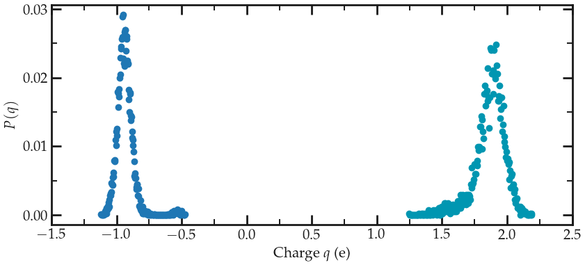

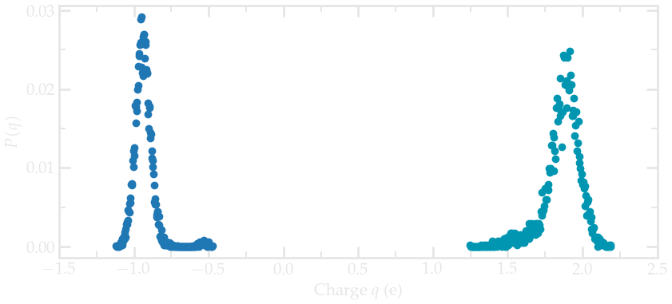

    Distribution of charge of silicon (positive) and oxygen (negative) atoms during equilibration. The data 
    were extracted from the dump.lammpstrj file using python, you can 
    download this |plot_distribution| to plot the charge distribution using Python, NumPy, and Matplotlib. 

.. |plot_distribution| raw:: html

   <a href="../../../../inputs/reaxff/reax-silica/RelaxSilica/plot_distribution.ipynb" target="_blank">notebook</a>

..  container:: justify

    Using VMD and coloring the atoms by their charges, one can see that 
    the atoms with the extreme-most charges are located at defects in the 
    amorphous structure (here at the positions of the dandling oxygen group):

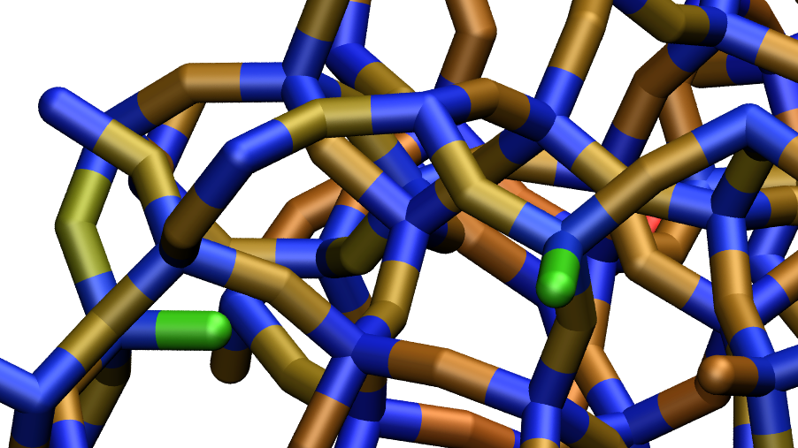

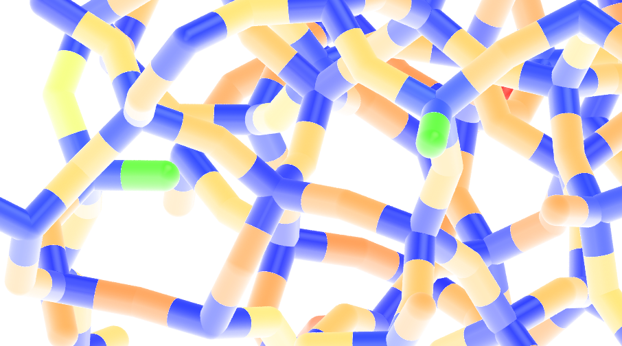

    Amorphous silica colored by charges using VMD. Dandling oxygen groups appear in green.

.. include:: ../contact/supportme.rst

Deform the structure
====================

..  container:: justify

    Now, let us apply a deformation to the structure in order to force some bonds 
    to break and eventually re-form. 

    Next to RelaxSilica/, create a folder, call it Deform/ and create a
    file named input.lammps in it. Copy the following lines:

..  code-block:: lammps
    :caption: *to be copied in Deform/input.lammps*

    # SiO amorphous silica deformed with reaxff potential

    units real
    atom_style full

    read_data ../RelaxSilica/silica-relaxed.data

    mass 1 28.0855 # Si
    mass 2 15.999 # O

    pair_style reaxff NULL safezone 3.0 mincap 150
    pair_coeff * * ../RelaxSilica/reaxCHOFe.ff Si O
    fix myqeq all qeq/reaxff 1 0.0 10.0 1.0e-6 reaxff maxiter 400

    neighbor 0.5 bin
    neigh_modify every 5 delay 0 check yes 

    group grpSi type 1
    group grpO type 2
    variable totqSi equal charge(grpSi)
    variable totqO equal charge(grpO)
    variable nSi equal count(grpSi)
    variable nO equal count(grpO)
    variable qSi equal v_totqSi/${nSi}
    variable qO equal v_totqO/${nO}

    dump dmp all custom 100 dump-deform.lammpstrj id type q x y z
    thermo 100
    thermo_style custom step temp etotal press vol v_qSi v_qO

    fix mydef all deform 1 x erate 5e-5
    fix mynvt all nvt temp 300.0 300.0 100
    timestep 0.5 

    thermo 100
    run 25000
    unfix mydef
    undump dmp

    dump dmp all custom 100 dump.lammpstrj id type q x y z

    run 2000

    write_data silica-deformed.data

..  container:: justify

    The main differences with the previous input are

    - the use of fix deform for elongating progressively the box along x,
    - the use of fix NVT instead of NPT (because the box deformation is already ensured by fix deform).
    
    After a first run of 25000 steps, a short run of 2000 steps is performed 
    in order to extract the final charges of the atoms from an structure that is not 
    under deformation.

    During the deformation, the charges progressively changes, until the structure 
    breaks. After the structure breaks, the charges equilibrates near a new 
    average value that differs from the starting charge, which is expected due to the
    presence of the new solid/vacuum interface:

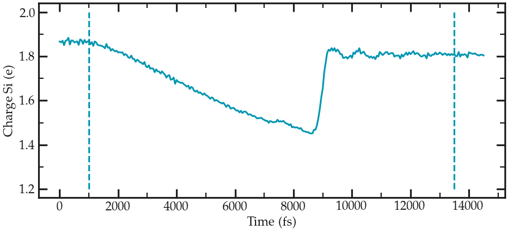

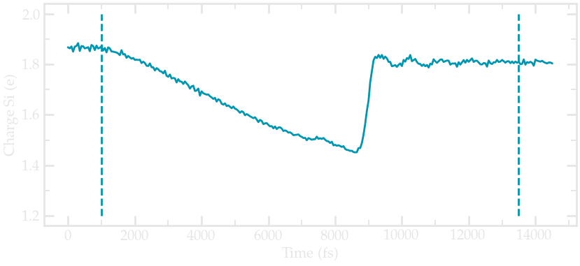

    Charge of silica during deformation of the silicon oxide with reaxff

..  container:: justify

    At the end of the deformation,  one can visualize the brocken material, not
    the different charge of atoms near the interface.

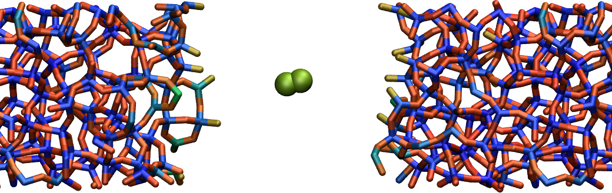

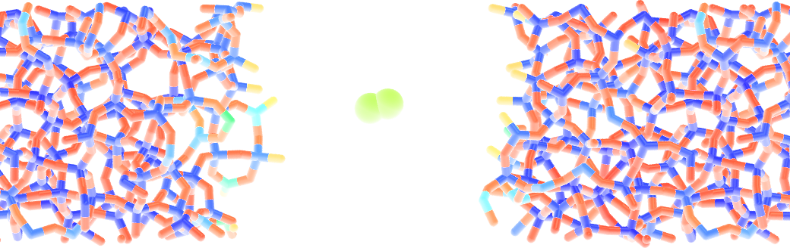

    Amorphous silicon oxide after deformation colored by charges using VMD

..  container:: justify

    One O2 molecule was formed during the process (here appearing in green),
    most likely because the rate of deformation was really high.

    One can have a look at the final charge distribution:

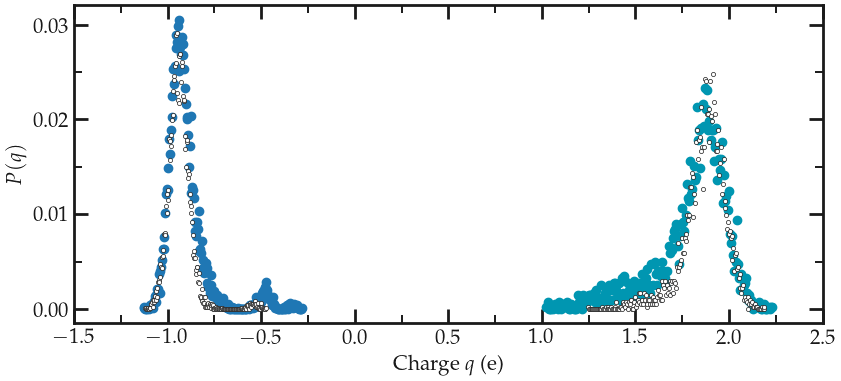

.. figure:: figures/reaxff/deformed-distribution-charge-dark.png
    :alt: Distribution charge of silica and oxygen during equilibration with reaxff
    :class: only-dark

    Distribution of charge of silica (positive) and oxygen (negative) after deformation.

..  container:: justify

    The final charge distribution differs from the previously calculated, as a new peak 
    near -0.5e for the oxygen. 

.. include:: ../contact/accessfile.rst

Going further with exercises
============================

..  container:: justify

    .. include::  ../contact/requestsolution.rst

..  container:: justify

    Under ambient conditions, dandling oxygen are typically terminated by hydrogen atoms. 
    The current structure can be decorated with hydrogen atoms then relaxed using reaxff. 

    Add hydrogen atoms to the dandling oxygens. Then relax the structure using reaxff with LAMMPS.
    Hydrogen atoms can be added using create_atoms command, gcmc, or external python script as I did here:

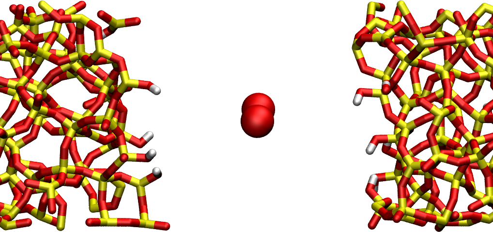

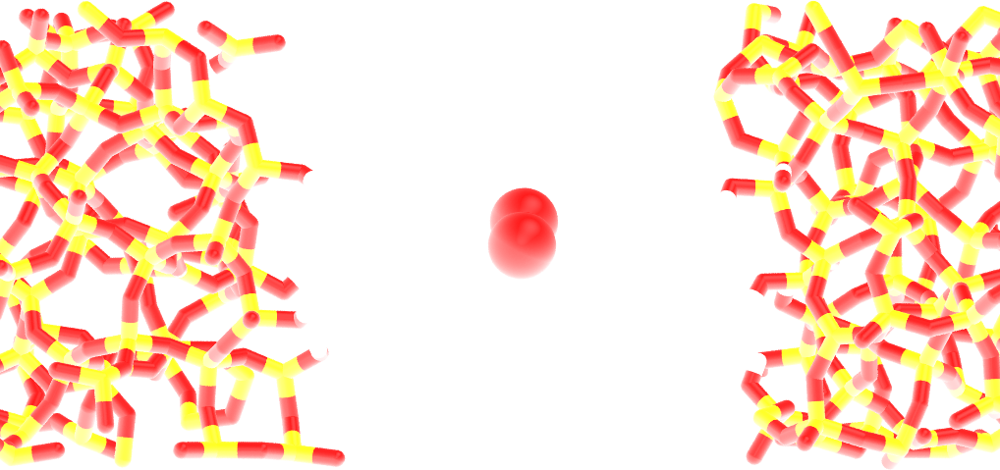

    Hydrogen atoms are in white, oxygen in red, and silicon in yellow.

    .. include:: ../contact/contactme.rst

