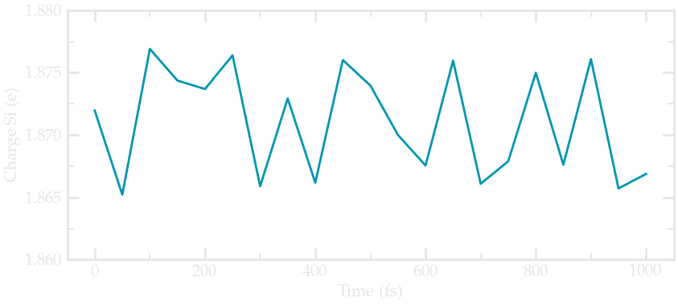

.. _reax-silica-label:

Silicon
*******

..  container:: justify

    This tutorial is part of the *Reaxff* series.

.. container:: hatnote

    Defect silica

.. figure:: ../figures/surfaceprofile/avatar-light.png
    :height: 250
    :alt: Figure showing ethanol molecules adsorbed at the NaCl(100) surface.
    :class: only-light
    :align: right

.. figure:: ../figures/surfaceprofile/avatar-dark.png
    :height: 250
    :alt: Figure showing ethanol molecules adsorbed at the NaCl(100) surface.
    :class: only-dark
    :align: right

..  container:: justify

    The objective of this tutorial is to build a molecular
    dynamics system made of a flat crystal wall (NaCl) and
    ethanol molecules. The molecule topology files will be downloaded from
    the `ATB repository <https://atb.uq.edu.au/>`__.

Relax the amorphous silica structure
====================================

..  container:: justify

    Create a folder, name it RelaxSilica/, and
    `download <../../../../../inputs/reaxff/reax-silica/RelaxSilica/silica.data>`__
    the initial topology of a small amorphous silica structure.
    The system was created by temperature ramp using another force field 
    (`vashishta <../../../../../inputs/reaxff/reax-silica/CreateSilica/SiO.1990.vashishta>`__),
    therefore the bond length, angle values, or charges are different from what is expected
    from reaxff force field. 

    The Atoms section of the *silica.data* file starts like that:

..  code-block:: bash

    Atoms # full

    132 15 2 -0.55 1.722106654667303 6.0790786378597526 5.627968948336774 -6 4 -5
    172 20 1 1.1 5.755393150671698 3.31535305846982 1.0501387543709164 4 3 2
    231 26 2 -0.55 5.617126717910301 7.487471864752421 1.963810241571427 -16 8 -3
    54 6 2 -0.55 4.060884959755418 1.6283060986470597 4.297860218329581 -7 -4 3
    174 20 1 1.1 2.9926597997825395 2.0364512736354192 0.7520371846065788 -2 -6 -7
    180 20 2 -0.55 3.18438907446254 2.5721052475107857 6.622363526485664 0 -12 1
    121 14 2 -0.55 5.537222937373211 1.456250286791573 6.343752399466858 -9 -12 -4
    111 13 1 1.1 1.7279273441891305 7.28674041911877 6.669158065545038 6 -10 -2
    51 6 2 -0.55 5.366932941422638 4.1504125630630435 2.3740196532457105 0 -1 -3
    202 23 2 -0.55 7.313845702241226 3.321272888336706 3.777618751313188 0 5 -13
    215 24 2 -0.55 6.690317849940269 5.754543737004929 4.103252634559489 -6 2 0
    183 21 1 1.1 1.777618482333677 6.145548171417662 3.999369841948803 -5 -5 -3
    95 11 2 -0.55 4.561227581704491 2.3474960588346616 0.6330321107351076 -1 -6 3
    105 12 2 -0.55 5.0710009155644125 3.8511969818510208 5.143556706337486 -1 0 5

..  container:: justify

    Due to the use of vashishta force field, all silicon atoms have the same charge (1.1e), all
    the oxygen atoms have the same charge (-0.55e). This is common to most classical force field. 
    Let us keep that in mind before we start using reaxff.

    The first step is to relax the structure. We are going to track the changes and make 
    sure the system equilibrates nicely. 
    
    Note that this silica structure is too small, all full of defect, but it will 
    make the effect of reaxff more easily more visible.

    Create an input file called input.lammps in RelaxSilica/, and copy in it: 

..  code-block:: bash
   :caption: *to be copied in RelaxSilica/input.lammps*

    units real
    atom_style full

    read_data silica.data

    mass 1 28.0855 # Si
    mass 2 15.999 # O

..  container:: justify

    So far, the input is very silica to what is seen in the other tutorials here.
    Now let us enter the 3 most important line of a reaxff simulation:

..  code-block:: bash
   :caption: *to be copied in RelaxSilica/input.lammps*

    pair_style reaxff NULL safezone 3.0 mincap 150
    pair_coeff * * reaxCHOFe.ff Si O
    fix myqeq all qeq/reaxff 1 0.0 10.0 1.0e-6 reaxff maxiter 400

..  container:: justify

    Here the reaxff pair_style is used with no control file, and safezone and mincap
    are there for memory allocation issue. If not there, the segmentation faults and bondchk
    failed errors sometimes occur.

    The pair_coeff uses the 
    `reaxCHOFe.ff <../../../../../inputs/reaxff/reax-silica/RelaxSilica/reaxCHOFe.ff>`__,
    and we set the type 1 as oxygen, and type 2 as silicon.

    Finally, qeq/reaxff is used to perform charge equilibration every timestep. O and 10.0.
    are low and high cutoff, and 1.0e-6 a tolerance. Finally, maxiter sets a limit to the number of 
    attempt to equilibrate the charge. If the charge does not properly equilibrate
    despite the 400 attempts, a WARNING will appear. It can happens when the initial 
    charges are too far from equilibrium values. 

    Then, let us insert some familiar commands controlling the re-building of the 
    neighbor lists, which seems to be critical for reaxff. Let us also
    print thermodynamic information as well as the charge of both atom types.

..  code-block:: bash
   :caption: *to be copied in RelaxSilica/input.lammps*

    neighbor 0.5 bin
    neigh_modify every 5 delay 0 check yes 

    group grpSi type 1
    group grpO type 2
    variable totqSi equal charge(grpSi)
    variable totqO equal charge(grpO)
    variable nSi equal count(grpSi)
    variable nO equal count(grpO)
    variable qSi equal v_totqSi/${nSi}
    variable qO equal v_totqO/${nO}

    dump dmp all custom 100 dump.lammpstrj id type q x y z
    thermo 10
    thermo_style custom step temp etotal press vol v_qSi v_qO

..  container:: justify

    Let us also print 
    particle charges and positions in a dump file, and let us perform a very short
    run using anisotropic NPT, thus allowing for the box to relax. 

..  code-block:: bash
   :caption: *to be copied in RelaxSilica/input.lammps*

    velocity all create 300.0 3482028
    fix mynpt all npt temp 300.0 300.0 10 aniso 1.0 1.0 100
    timestep 0.5

    thermo 100
    run 2000

..  container:: justify

    As the simulation runs, you can see the charge of the atoms are fluctuating,
    as it adjusts to the topology:

    Average charge of silica during equilibration

..  container:: justify

    Moreover, instantaneously, each atom adopts its own charge value:

.. include:: ../../contact/contactme.rst

