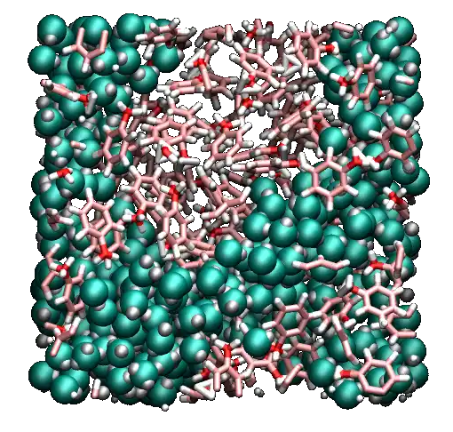
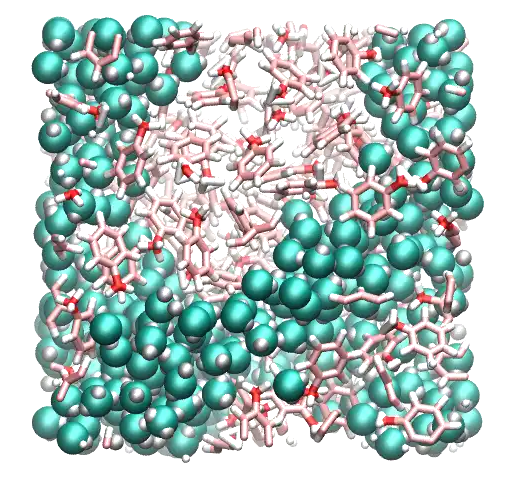
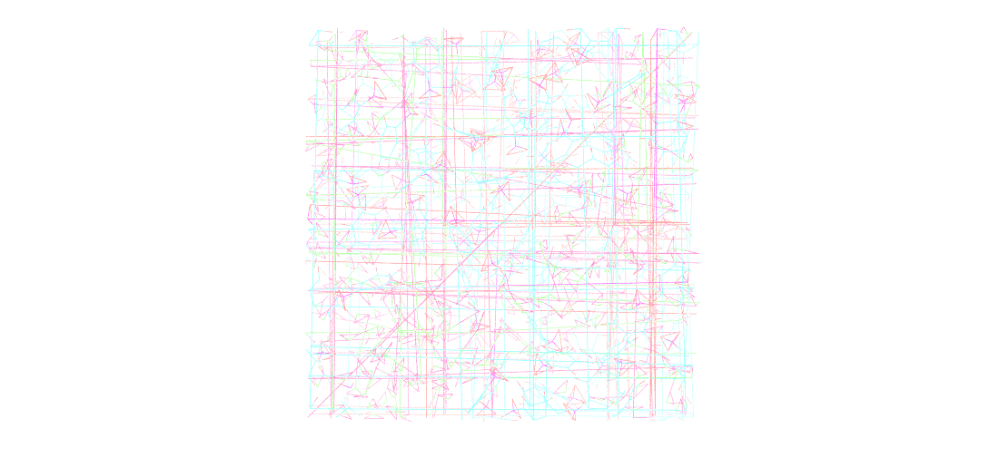
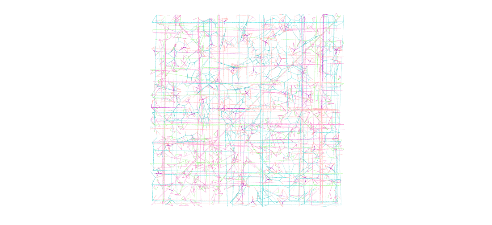
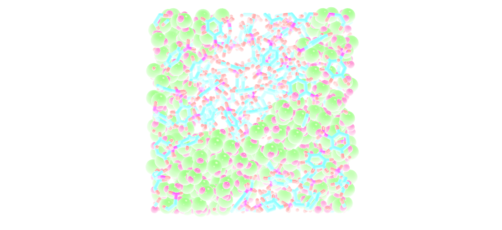
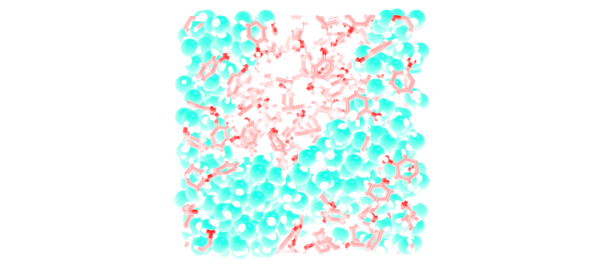
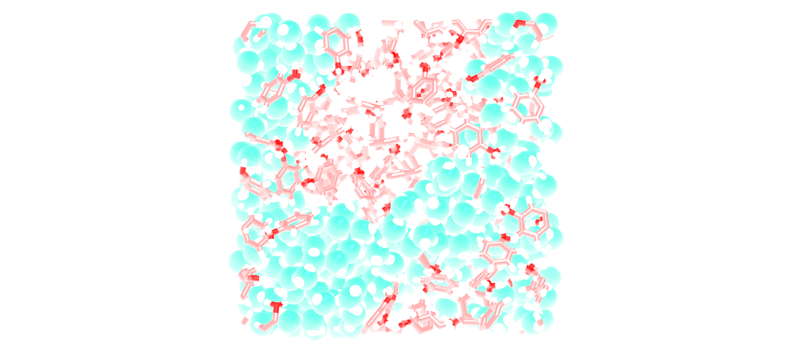
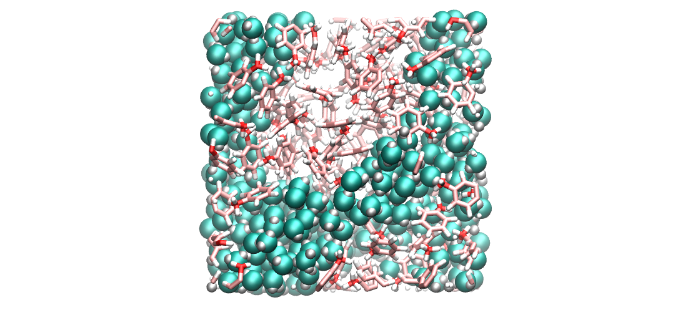

.. _vmd-label:

VMD tutorial
************

.. container:: hatnote

    Generate good looking images and movies with VMD

.. container:: justify

    Visual Molecular Dynamics (VMD) is a free molecular graphics software
    that can be used to visualize molecular dynamics systems. VMD has been
    used to generate all images of molecular systems here. 

.. container:: justify

    The goal of this extra tutorial is to provide some tips
    to make good looking pictures and videos of molecular systems.

Practical example
=================

.. container:: justify

    To follow this tutorial, |dump_download|
    this LAMMPS trajectory file, which corresponds to a
    mixture of water and toluene. As always, the input
    files are shared on Github. 

.. container:: justify

    The water molecules use *types* 1 and 2,
    and the toluene molecules *types* 3, 4, and  5.

.. container:: justify

    With Ubuntu/Linux, the *lammptrj* file can be opened with
    VMD by typing in a terminal:

.. |dump_download| raw:: html

   <a href="../../../../../inputs/miscellaneous/vmd/dump.lammpstrj" target="_blank">download</a>

..  code-block:: bash
    
    vmd dump.lammpstrj

.. container:: justify

    Otherwise, simply open VMD
    and import the *dump.lammpstrj*
    file manually using *File -> New molecule*.

.. container:: justify

    Go to *Display*, change
    the view to *Orthographic*,
    and unselect *Depth Cueing*.

.. container:: figurelegend

    Figure: Initial system in absence of depth cueing and with orthographic view.

The representation
==================

.. container:: justify

    In the main windows of VMD, go to *Graphics, Representations*.
    Within the *Selected Atoms* windows,
    replace *all*
    by *type 1*.
    Here, *type 1* corresponds to the oxygen of the water molecule. 
    Change the *Drawing Method*
    from *Lines*
    to *VDW*.
    Tune the *Sphere Scale*
    to 0.8, and increase the resolution to 42.

.. container:: justify

    Click on *Create Rep* to create a second representation for the hydrogen
    of water, select *type 2*,
    and change the *Sphere Scale* to 0.4.

.. container:: justify

    Create a third representation for *type 3 4 5*,
    i.e. all 3 atom types of toluene, respectively
    hydrogen, oxygen, and carbon atoms.

.. container:: justify

    Choose *DynamicBonds*
    and increase the *bond resolution* to 42.
    With *DynamicBonds*, the ends of the bonds are rough. 
    To smooth out the representation, create the fourth and last representation
    (*VDW* with
    *Sphere Scale* 0.2)
    for *type 3 4 5*.

.. container:: justify

    This is what I see:

.. figure:: ../figures/vmd/vmd-tutorial/step2-light.png
    :alt: VMD tutorial for LAMMPS
    :class: only-light

.. container:: figurelegend

    Figure: Orthographic view with improved representation.

The colors
==========

.. container:: justify

    To change the colors, go to *Graphics, Colors*,
    click on *Display*,
    then *Background*, and choose 
    the color you prefer (white is better for publication, black
    can be good looking on presentation with dark background).

.. container:: justify

    Still in the *Color Controls* windows,
    in *Categories*,
    click *Name*,
    in *Names*
    choose *5* (this is the oxygen atoms),
    and choose red. Then, do the same for 4 (carbon :math:`\to` pink),
    3 (hydrogen :math:`\to` white),
    2 (hydrogen :math:`\to` white),
    
.. container:: justify

    These three colors are standard for oxygen,
    carbon, and hydrogen, respectively. To mark the difference
    between the water and the toluene, let us choose a different
    color for the atoms of type 1 (oxygens of the water molecules) by
    choosing *cyan*, and then modifying it by entering
    manually the values 0, 1.0 and 0.88 in the RGB box.

.. container:: justify

    This is what I see:

.. figure:: ../figures/vmd/vmd-tutorial/step3-light.png
    :alt: VMD tutorial for LAMMPS
    :class: only-light

.. container:: figurelegend

    Figure: Orthographic view with improved representation and color.

The materials
=============

.. container:: justify

    An often neglected aspect is the texture of the representation, given
    by the material. Finding the right degree of shininess is often
    difficult, but it is really important if you want a good looking system. 

.. container:: justify

    In the *Representations* windows, you can choose
    among several materials. I prefer to create my own. To do so, 
    go in *Graphics, Materials*.
    Click on *Opaque*
    (this is the one used by default), and
    hit *Create New* twice.
    
.. container:: justify

    Two new materials should have appeared, called something like *Material23*
    and *Material24*. Rename
    them *MWater*
    and *MToluene*, respectively. 

.. container:: justify

    For *MWater*,
    change *Diffuse*,
    *Specular*, and
    *Shininess*, to 0.43,
    0.48, and 0.35, respectively.
    For *MToluene*,
    use 0.78, 0.33, and 0.32.

.. container:: justify

    Then, from the *Representations* windows, change the
    *Material*
    from *Opaque*
    to *MWater* for the 2 first representations,
    and *MToluene* for the 2 last.

.. container:: justify

    This is what I see:

.. container:: figurelegend

    Figure: Orthographic view with improved representation, color, and material.

Box border
==========

.. container:: justify

    Optionally, you can visualize the borders of the simulation
    box by typing in the VMD terminal:

..  code-block:: bash

    pbc box -center origin -color black -width 2

Saving a state
==============

.. container:: justify

    To avoid redoing all these steps every time
    VMD is re-opened, one can save the VMD state by
    clicking *File → Save vizualisation state*.
    This state can then be used simply by clicking *File* 
    :math:`\to`
    *Load vizualisation state*.

Rendering
=========

.. container:: justify

    To generate high a resolution image, go in *File → Render*,
    choose *Tachyon*,
    hit *Start Rendering*.

.. container:: justify

    Optionally, add *-res 1000 1000* in the *Render command* cell to 
    increase the resolution.

High quality movie
==================

.. container:: justify

    To generate a high resolution movie, go in *Extension, Vizualisation*,
    and *Movie Maker*.
    
.. container:: justify

    If you hit *Make Movie* directly, the movie generated by VMD will be
    of poor quality.
    Instead, it is better to generate a sequence of high resolution
    images, and assemble these images.
    
.. container:: justify

    Go in *Movie Settings*, hit *Trajectory* (so the movie will show
    the system evolving in time, and not rotating on itself),
    Uncheck *Delete image files*.
    In *Rendered*, choose *Tachyon*,
    then hit *Make Movie*. 

.. container:: justify

    From the linux terminal (not the VMD terminal), assemble the images
    (all starting with *untitled*) into a single movie by typing:

..  code-block:: bash

    ffmpeg -r 60 -i untitled.%05d.ppm -vcodec libx264 \
    -crf 0  -pix_fmt yuv420p myvideo.mp4

.. container:: justify

    You may receive the following error:
    
..  code-block:: bash
    
    width not divisible by 2 (1363x1134)

.. container:: justify

    In that case, simply remove one line of pixel with the command:

..  code-block:: bash

    for file in untitled.*.ppm; do convert $file -crop 1362x1134+0+0 $file; done

.. container:: justify

    To convert the video in *webp*, for web integration, use:

..  code-block:: bash

    ffmpeg -i myvideo.mp4 -vcodec libwebp -filter:v fps=fps=20 \
    -lossless 1 -loop 0 -preset default -an -vsync 0 myvideo.webp
