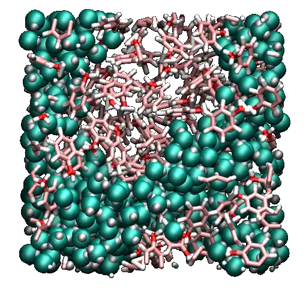
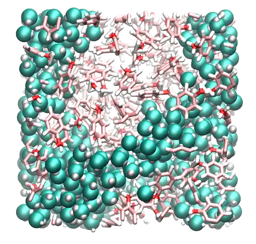
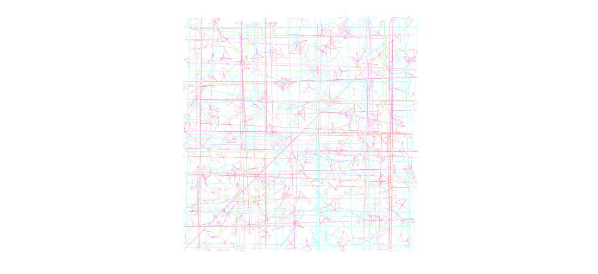
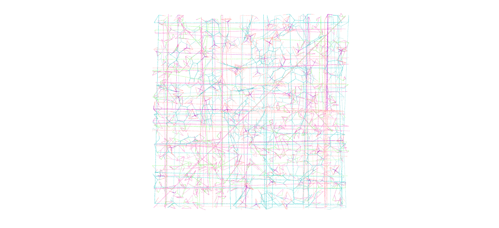
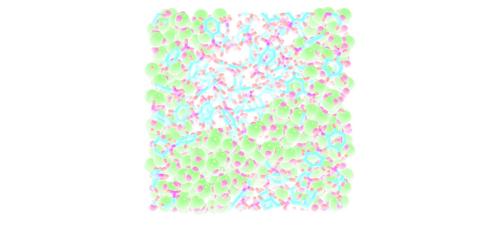
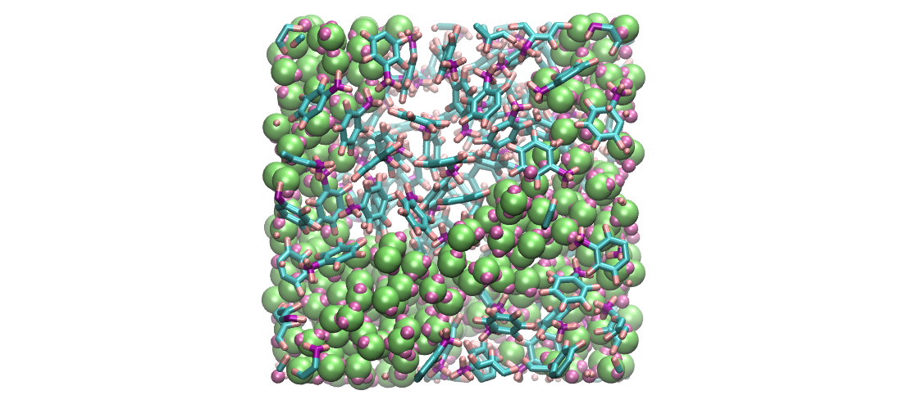
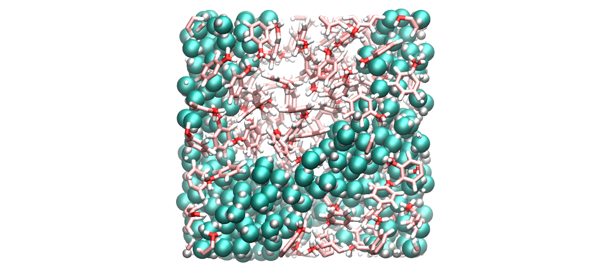
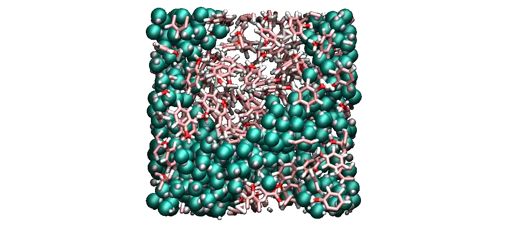

.. _vmd-label:

Make gorgeous image
*******************

.. container:: hatnote

    Generate good looking images and movies with VMD

.. container:: justify

    VMD is a great free software that has been used for all the snapshots
    in this website. Here I provide some tips to make good looking picture
    of molecular systems.

Practical example
=================

.. container:: justify

    To follow this tutorial, |dump_download|
    this LAMMPS trajectory file, which corresponds to a mixture of water and toluene,
    and can be opened with VMD by typing in a terminal:

.. |dump_download| raw:: html

   <a href="../../../../inputs/miscellaneous/vmd/dump.lammpstrj" target="_blank">download</a>

..  code-block:: bash
    
    vmd dump.lammpstrj

.. container:: justify

    Go to **Display**, and change the view to **Orthographic**. 

    This is what I see:

The representation
==================

.. container:: justify

    In the main windows of VMD, go to **Graphics, Representations**.
    Within the *Selected Atoms* windows, replace *all* by *type 1*.
    Here, *type 1* corresponds to the oxygen of the water molecule. 
    Change the **Drawing Method** from *Lines* to *VDW*. Tune the *Sphere Scale*
    to 0.8, and increase the resolution  to 42.

    Click on **Create Rep** to create a second representation for the hydrogen
    of water, select *type 2*, and change the *Sphere Scale* to 0.4.

    Create a third representation for *type 3 4 5*,
    i.e. all 3 atom types of toluene, respectively hydrogen, oxygen, and carbon atoms.

    Choose *DynamicBonds* and increase the *bond resolution* to 42.
    With *DynamicBonds*, the ends of the bonds are rough. 
    To smooth out the representation, create the fourth and last representation
    (*VDW* with *Sphere Scale* 0.2) for *type 3 4 5*.

    This is what I see:

The colors
==========

.. container:: justify

    To change the colors, go to **Graphics, Colors**,
    click on **Display**, then **Background**, and choose 
    the color you prefer (white is better for publication, black
    can be good looking on presentation with dark background).

    Still in the **Color Controls** windows, in *Categories*,
    click *Name*, in *Names* choose *5* (this is the oxygen atoms),
    and choose red. Then, do the same for 4 (carbon → pink),
    3 (hydrogen → white), 2 (hydrogen → white),
    
    These three colors are standard for oxygen,
    carbon, and hydrogen, respectively. To mark the difference
    between the water and the toluene, let us choose a different
    color for the atoms of type 1 (oxygens of the water molecules) by
    choosing *cyan*, and then modyfing it by entering
    manually the values 0, 1.0 and 0.88 in the RGB box.

    This is what I see:

The materials
=============

.. container:: justify

    An often neglected aspect is the texture of the representation, given
    by the material. Finding the right degree of shininess is often
    difficult, but it is really important if you want a good looking system. 
    
    In the **Representations** windows, you can choose
    among several materials. I prefer to create my own. To do so, 
    go in **Graphics, Materials**. Click on **Opaque**
    (this is the one used by default), and hit **Create New** twice.
    
    Two new materials should have appeared, called something like
    Material23 and Material24. You can rename them to MWater and MToluene,
    although it is not important. 

    For MWater, change *Diffuse*, *Specular*, and *Shininess*, to 0.43,
    0.48, and 0.35, respectively. For MToluene, use 0.78, 0.33, and 0.32.

    Then, from the **Representations** windows, change the
    *Material* from *Opaque* to *MWater** for the 2 first representations,
    and *MToluene* for the 2 last.

    This is what I see:

Box border
==========

.. container:: justify

    Optionally, you can visualize the borders of your box by typing in the VMD terminal:

..  code-block:: bash

    pbc box -center origin -color black -width 2

Saving a state
==============

.. container:: justify

    If you don't
    want do redo these steps every time you open VMD, you can save the VMD state by
    clicking **File → Save vizualisation state**. This state can then be re-opened 
    simply by clicking **File → Load vizualisation state**.

Rendering
=========

.. container:: justify

    To generate high a resolution image, go in **File → Render**,
    choose **Tachyon**, hit **Start Rendering**.

    Optionally, add **-res 1000 1000** in the **Render command** cell to 
    increase the resolution.

High quality movie
==================

.. container:: justify

    To generate a high resolution movie, go in **Extension, Vizualisation**,
    and **Movie Maker**.
    
    If you hit **Make Movie** directly, the movie generated by VMD will be
    of poor quality.
    Instead, we are going to generate a sequence of high resolution
    images, and assemble these images ourselves:
    
    Go in **Movie Settings**, hit *Trajectory* (so the movie will show
    the system evolving in time, and not rotating on itself),
    Uncheck *Delete image files*.
    In *Rendered*, choose *Tachyon*, then hit *Make Movie*. 

    From the linux terminal (not the VMD terminal), assemble the images
    (all starting with *untitled*) into a single movie by typing:

..  code-block:: bash

    ffmpeg -r 60 -i untitled.%05d.ppm -vcodec libx264 -crf 0  -pix_fmt yuv420p myvideo.mp4

.. container:: justify

    You may receive the following error **width not divisible by 2
    (1363x1134)**. If that's the case, you can remove one line of pixel
    with the command:

..  code-block:: bash

    for file in untitled.*.ppm; do convert $file -crop 1362x1134+0+0 $file; done

.. container:: justify

    To convert the video in webp, for web integration, use:

..  code-block:: bash

    ffmpeg -i myvideo.mp4 -vcodec libwebp -filter:v fps=fps=20 -lossless 1 -loop 0 -preset default -an -vsync 0 myvideo.webp

.. container:: justify

    This is what I made:

.. figure:: figures/make-gorgeous-image/video-vmd-light.webp
    :alt: VMD tutorial for LAMMPS
    :class: only-light