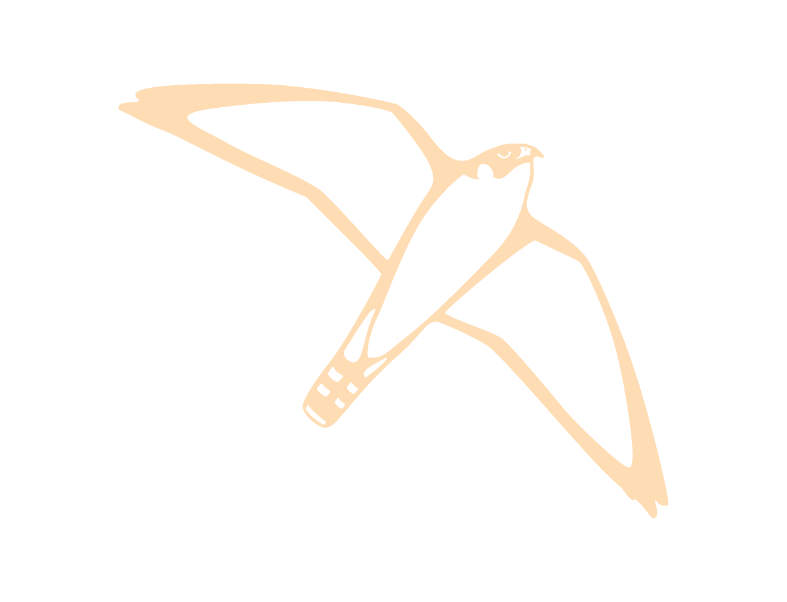
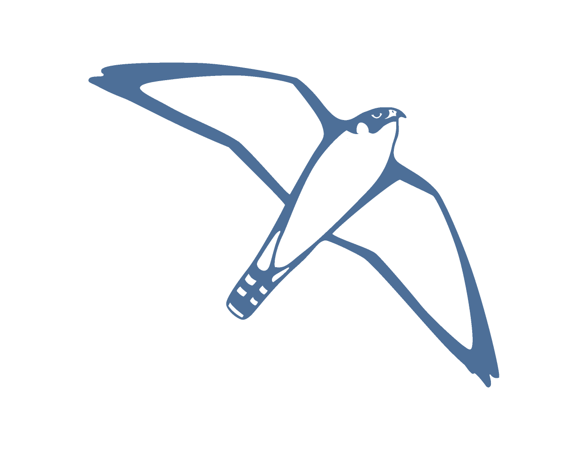

.. gromacs-label:

Use GROMACS instead
*******************

|gromacstutorials| is another molecular dynamics package.

Although less flexible than LAMMPS, GROMACS can be more than **10 times faster**,
which makes it a powerful alternative to LAMMPS in some situations.

.. |gromacstutorials| raw:: html

   <a href="https://gromacstutorials.github.io/" target="_blank">GROMACS</a>
