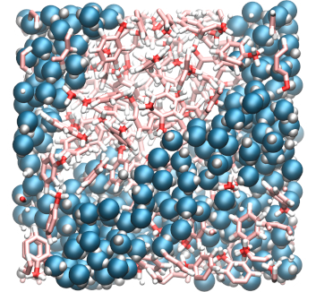

.. _vmd-label:

VMD tips
********

.. container:: hatnote

    Generate good looking image/movie with VMD

Practical example
=================

.. container:: justify

    If you want to try it yourself with the same system, you can 
    `download <../../../../../inputs/miscellaneous/vmd/dump.lammpstrj>`__
    this LAMMPS trajectory file, which corresponds to a mixture of water and toluene,
    and can be opened with VMD by typing in a terminal:

..  code-block:: bash
    
    vmd dump.lammpstrj

The representation
==================

.. container:: justify

    You can change the representation of the atoms by going in
    **Graphics, Representations**, and then choose
    another **Drawing Method**. My 2 favorite representations
    are **dynamic bonds** for large molecules or graphene,
    and **VDW** for single atoms or small molecules like water.
    QuickSurf can also make nice results, like
    `this video <https://www.youtube.com/watch?v=1ipJ8JQT0rc&t=3s>`__.
    You can apply a representation
    only to a group of atoms, by choosing a selection in the windows
    **Selected Atoms**. 
    
    To obtain the same result as me:

    * replace **All** by **type 1** in the windows to select the oxygen of the water molecules,
    * tune the radius to 0.8, and increase the resolution (>32 at least),
    * click on **Create Rep** to create a second representation for the hydrogen of water (type 2), and change the radius to 0.4,
    * create a third representation for all 3 atom types of toluene by entering **type 3 4 5** (hydrogen, oxygen, and carbon atoms),
    * choose **DynamicBonds** and increase the resolution
     
    You can see that 'DynamicBonds' is not really good looking by itself,
    the ends of the bonds are rough. To smooth the representation:

    * create the fourth and last representation (VDW, radius 0.2) for types 3, 4, and 5.