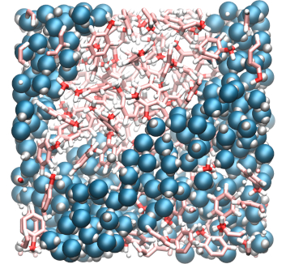

.. _vmd-label:

VMD tips
********

.. container:: hatnote

    Generate good looking image/movie with VMD

Practical example
=================

.. container:: justify

    If you want to try it yourself with the same system, you can 
    `download <../../../../../inputs/miscellaneous/vmd/dump.lammpstrj>`__
    this LAMMPS trajectory file, which corresponds to a mixture of water and toluene,
    and can be opened with VMD by typing in a terminal:

..  code-block:: bash
    
    vmd dump.lammpstrj

The representation
==================

.. container:: justify

    You can change the representation of the atoms by going in
    **Graphics, Representations**, and then choose
    another **Drawing Method**. My 2 favorite representations
    are **dynamic bonds** for large molecules or graphene,
    and **VDW** for single atoms or small molecules like water.
    QuickSurf can also make nice results, like
    `this video <https://www.youtube.com/watch?v=1ipJ8JQT0rc&t=3s>`__.
    You can apply a representation
    only to a group of atoms, by choosing a selection in the windows
    **Selected Atoms**. 
    
    To obtain the same result as me:

    * replace **All** by **type 1** in the windows to select the oxygen of the water molecules,
    * tune the radius to 0.8, and increase the resolution (>32 at least),
    * click on **Create Rep** to create a second representation for the hydrogen of water (type 2), and change the radius to 0.4,
    * create a third representation for all 3 atom types of toluene by entering **type 3 4 5** (hydrogen, oxygen, and carbon atoms),
    * choose **DynamicBonds** and increase the resolution
     
    You can see that 'DynamicBonds' is not really good looking by itself,
    the ends of the bonds are rough. To smooth the representation:

    * create the fourth and last representation (VDW, radius 0.2) for types 3, 4, and 5.

The colors
==========

.. container:: justify

    To change the colurs:
    
    * go to **Graphics, Colors**,
    * click on **Display**, then **Background**, and choose white instead of black,
    * click on **Name**, and **5** (this is the oxygen atoms), and choose red,
    * do the same for 4 (carbon → pink), 3 (hydrogen → white), 2 (hydrogen → white),
    
    These three colours are standard for oxygen,
    carbon, and hydrogen. To mark the difference between the water and
    the toluene:
    
    * choose a different colour for atoms of type 1 by entering manually the values 0 0.6, 0.88 in the RGB box.

The materials
=============

.. container:: justify

    An often neglected aspect is the texture of the representation, given
    by the material. Finding the right degree of shininess is often
    difficult, but it is really important if you want a good looking system. 
    
    In the **Representations** windows, you can choose
    among several materials. I prefer to create my own. To do so, 
    
    *go in **Graphics, Materials**. Click on **Opaque** (this is the one used by default), 

    * hit **Create New** twice
    
    Two new materials should have appeared, called something like Material23 and Material24.
    Rename them to MWater and MToluene. 
    
    For MWater:

    * change **Diffuse**, **Specular**, and **Shininess**, to 0.43, 0.48, and 0.35, respectively,
    * from the **Representations** windows, change the **Material** from **Opaque** to **MWater** for the two representations that concern water molecules,
    * do the same for toluene, with values of 0.78, 0.33, and 0.32 for MToluene.

The view
========

.. container:: justify

    Currently the view is *perspective*, which is not always the best choice:

    * go to **Display**,
    * click **Orthographic**. 

    You can zoom with the mouse wheel. That is it, the
    system is ready to be rendered in high resolution.

    Optionally, you can visualize the borders of your box by typing in the VMD terminal:

..  code-block:: bash

    pbc box -center origin -color black -width 2

Saving a state
==============

.. container:: justify

    If you don't
    want do redo these steps every time you open VMD, you can save the VMD state by
    clicking **File → Save vizualisation state**.

Rendering
=========

.. container:: justify

    To generate high a resolution image:

    * go in **File → Render**,
    * choose **Tachyon**, 
    * add **-res 1000 1000** in the **Render command** cell,
    * hit **Start Rendering**. 

    A high resolution image has been created by VMD. You can remove the borders using GIMP or Inkscape for
    example.

Movie
=====

.. container:: justify

    To generate a high resolution movie:
    
    * go in **Extension, Vizualisation**, and **Movie Maker**.
    
    If hit **Make Movie** directly, the movie generated by VMD will be of poor quality.
    Instead, we are going to generate a sequence of high resolution
    images, and assemble these images ourselves:
    
    * go in **Movie Settings**,
    * hit **Trajectory** (so the movie will show the system evolving in time, and not rotating on itself),
    * uncheck **Delete image files**,
    * In **Rendered**, choose **Tachyon**, then **Make Movie**. 
    
    When its done, you can close VMD. 

    From the terminal, assemble the image into a movie by typing:

..  code-block:: bash

    ffmpeg -r 60 -i untitled.%05d.ppm -vcodec libx264 -crf 0  -pix_fmt yuv420p myvideo.mp4

.. container:: justify

    You may receive the following error **width not divisible by 2
    (1363x1134)**. If that's the case, you can remove one line of pixel
    with the command:

..  code-block:: bash

    for file in untitled.*.ppm; do convert $file -crop 1362x1134+0+0 $file; done

.. container:: justify

    To convert the video in webp, for web integration, use:

..  code-block:: bash

    ffmpeg -i myvideo.mp4 -vcodec libwebp -filter:v fps=fps=20 -lossless 1 -loop 0 -preset default -an -vsync 0 myvideo.webp

.. container:: justify

    The result should look like `this
    video <https://www.youtube.com/watch?v=BSE9Vf6KhRo&ab_channel=LAMMPStutorials>`__.