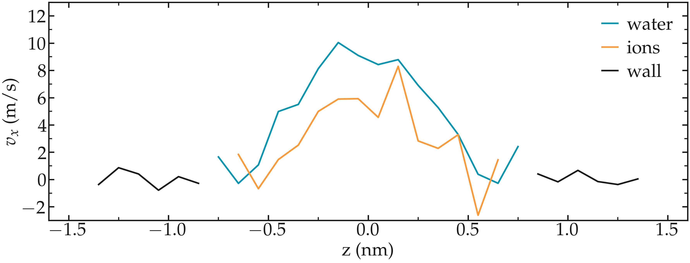
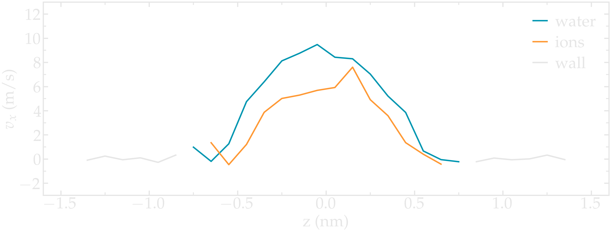
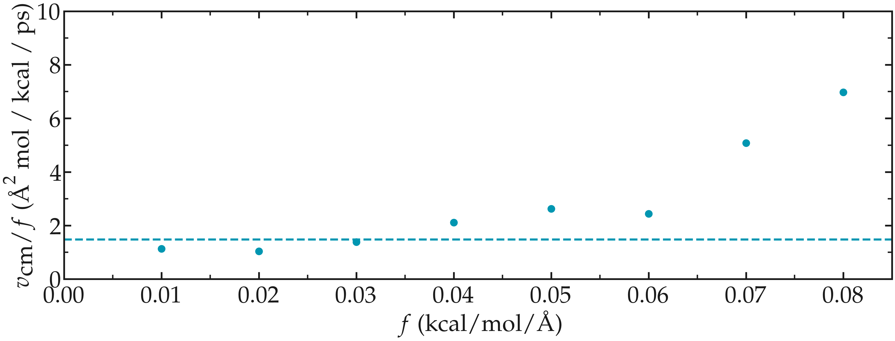
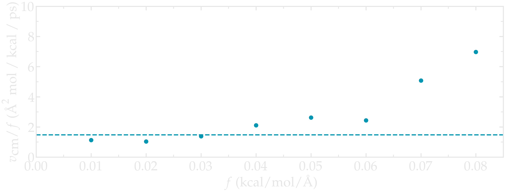
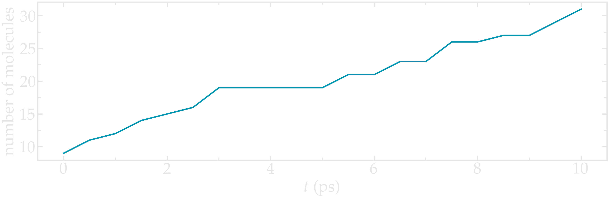
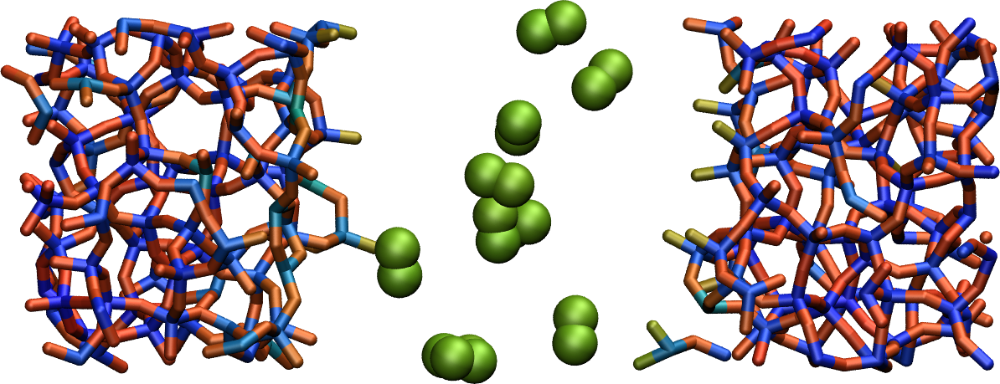
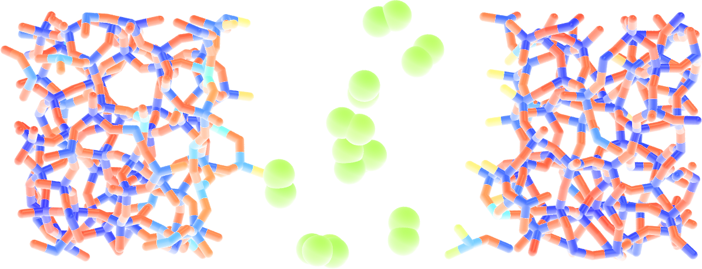

.. _solutions-label:

Solutions to the exercises
**************************

Lennard Jones fluid
===================

Fix a broken input
------------------

.. container:: justify

    You can download the working |input_broken_solution| I wrote.

.. |input_broken_solution| raw:: html

    <a href="../../../../lammpstutorials-inputs/level1/lennard-jones-fluid/exercises/broken/input.lammps" target="_blank">input</a>

.. container:: justify

    The trick to make the simulation starts without error
    is to reduce the initial *timestep* value as well as
    the imposed *temperature*.

..  code-block:: lammps

    fix mylgv all langevin 0.001 0.001 0.001 1530917
    timestep 0.0001

.. container:: justify

    Note that in order to make sure that the temperature of the particles
    quickly reaches a reasonable value, the *damping* parameter
    of the *fix Langevin* was also reduced.

.. container:: justify

    With these commands, you should see that after the first
    *run* finishes, the energy of the system 
    has reduced. Thus, a second *run*
    with the original *timestep* and *Langevin* parameters
    can start without issue. 

.. container:: justify

    In some cases, more than two consecutive *runs* can
    be an appropriate solution:

..  code-block:: lammps

    fix mylgv all langevin 0.0001 0.0001 0.001 1530917
    timestep 0.0001
    run 10000

    timestep 0.001
    run 10000

    timestep 0.01
    run 10000

.. container:: justify

    Use trial and error to determine the best approach for
    a given system.

Create a demixed dense phase
----------------------------

.. container:: justify

    You can download the |input_demixed_solution| I wrote. Note that 
    I use a large number of particles: 8000 for each type. 

.. container:: justify

    The key to create a demixing phase is to play with the Lennard-Jones 
    parameters:

..  code-block:: lammps

    pair_coeff 1 1 5.0 1.0
    pair_coeff 2 2 5.0 1.0
    pair_coeff 1 2 0.05 1.0

.. container:: justify

    First, notice that both particle types have the same :math:`\sigma` value of 1.0
    so that both particles have the same diameter. Second, note the large energy parameter :math:`\epsilon = 5.0`
    for self interaction (i.e.) interaction between particles of same type, and the low 
    energy parameter :math:`\epsilon = 0.05` for interaction between particles of different types.

.. container:: justify

    Finally, for adjusting the box volume and create a liquid looking phase, the 
    pressure was imposed by replacing *fix nve* by *fix nph*:

..  code-block:: lammps

    fix mynph all nph iso 1.0 1.0 1.0

.. container:: justify

    With *fix nph* and a pressure of 1, LAMMPS adjusts the box dimensions until the 
    pressure is close to 1. Here, reaching a pressure of 1 requires reducing the initial box dimensions.

.. |input_demixed_solution| raw:: html

    <a href="../../../../lammpstutorials-inputs/level1/lennard-jones-fluid/exercises/demixion/input.lammps" target="_blank">input</a>

From atoms to molecules
-----------------------

.. container:: justify

    You can download the |input_dumbbell_solution| I wrote to make 
    dumbell molecules. 
    
.. |input_dumbbell_solution| raw:: html

    <a href="../../../../lammpstutorials-inputs/level1/lennard-jones-fluid/exercises/dumbbell/input.lammps" target="_blank">input</a>

.. container:: justify

    The first important change is to choose
    an *atom_style* that allows for the atoms to be connected by bonds.
    It is also necessary to specify the *bond_style*,
    i.e. the type of potential (here harmonic) that will keep the atoms
    together:

..  code-block:: lammps

    atom_style molecular
    bond_style harmonic

.. container:: justify

    When creating the box, it is necessary to make
    memory space for the bond:

..  code-block:: lammps

    create_box 2 simulation_box bond/types 1 extra/bond/per/atom 1

.. container:: justify

    Then, import the *molecule template*, and use the template
    when creating the atoms:

..  code-block:: lammps

    molecule dumbell dumbell.mol
    create_atoms 1 random 500 341341 simulation_box
    create_atoms 0 random 5 678865 simulation_box mol dumbell 8754

.. container:: justify

    You can download the molecule template by clicking |mol_dumbbell_solution|.
    Finally, some parameters for the bond, namely its rigidity (5) and equilibrium
    length (2.5) need to be specified:

..  code-block:: lammps

    bond_coeff 1 5 2.5

.. |mol_dumbbell_solution| raw:: html

    <a href="../../../../lammpstutorials-inputs/level1/lennard-jones-fluid/exercises/dumbbell/dumbell.mol" target="_blank">here</a>

.. container:: justify

    You can download the |input_polymer_solution| and
    |mol_polymer_solution| I wrote to make the short polymer. 
    Note that some additional angular potentials are used to give its
    rigidity to the polymer.
    
.. |input_polymer_solution| raw:: html

    <a href="../../../../lammpstutorials-inputs/level1/lennard-jones-fluid/exercises/polymer/input.lammps" target="_blank">input</a>

.. |mol_polymer_solution| raw:: html

    <a href="../../../../lammpstutorials-inputs/level1/lennard-jones-fluid/exercises/polymer/polymer.mol" target="_blank">molecule template</a>

Pulling on a carbon nanotube
============================

Plot the strain-stress curves
-----------------------------

.. container:: justify

    You can download the |input_stress_strain_solution1|
    and |input_stress_strain_solution2| I wrote.

.. |input_stress_strain_solution1| raw:: html

    <a href="../../../../lammpstutorials-inputs/level1/breaking-a-carbon-nanotube/exercises/stress-strain/breakable-bonds/input.lammps" target="_blank">input for the breakable CNT</a>

.. |input_stress_strain_solution2| raw:: html

    <a href="../../../../lammpstutorials-inputs/level1/breaking-a-carbon-nanotube/exercises/stress-strain/unbreakable-bonds/input.lammps" target="_blank">input for the unbreakable CNT</a>

.. container:: justify

    The stress is calculated as the total force
    induced on the CNT by the pulling divided by the 
    surface area of the CNT. 

.. container:: justify
    
    On the side note, the surface area 
    of a CNT is not a well defined quantity. Here, I choose to 
    define the area as the perimeter of the CNT multiplied by the 
    effective width of the carbon atoms.

.. container:: justify

    Be careful with units, as the force is either in kcal/mol/Å
    when the unit is *real*, i.e. for the unbreakable CNT,
    or in eV/Å when the unit is *metal*, i.e. for the breakable CNT.

Solve the flying ice cube artifact
----------------------------------

.. container:: justify

    The issue occurs because the atoms have a large momentum in the 
    :math:`x` direction, as can be seen by looking at the net velocity 
    of the atoms in the *cnt_molecular.data* file.

..  code-block:: lammps

    Velocities

    24 0.007983439029626362 -6.613056392124822e-05 7.867644943646289e-05
    1 0.007906200203484036 3.252025147011299e-05 -4.4209216231039336e-05
    25 0.007861090484107148 9.95045322688365e-06 -0.00014277147407215768
    (...)

.. container:: justify

    The Berendsen thermostat is trying to adjust the temperature of the
    system by rescaling the velocity of the atoms, but fails due to the
    large momentum of the system that makes it look like the system is
    warm, since in MD temperature is measured from the kinetic energy.

.. container:: justify

    This leads to the system appearing frozen. 
    
.. container:: justify

    The solution is to cancel
    the net momentum of the atoms, for instance by using *fix momentum*,
    re-setting the velocity with the *velocity create* command,
    or use a different thermostat.

Insert gas in the carbon nanotube
---------------------------------

.. container:: justify

    You can download the |input_gas_cnt| I wrote.

.. |input_gas_cnt| raw:: html

    <a href="../../../../lammpstutorials-inputs/level1/breaking-a-carbon-nanotube/exercises/gas/input.lammps" target="_blank">input</a>

.. container:: justify

    The key is to modify the *.data* file
    to make space for the second atom type 2.

..  code-block:: lammps

    670 impropers
    2 atom types
    1 bond types

    (...)

    Masses

    1 12.010700 # CA
    2 39.948 # Ar

.. container:: justify

    The *parm.lammps* must contain the second pair coeff:

..  code-block:: lammps

    pair_coeff 1 1 0.066047 3.4
    pair_coeff 2 2 0.232 3.3952 
    bond_coeff 1 469 1.4

.. container:: justify

    Combine the *region* and
    *create_atoms* commands to
    create the atoms of type 2 within the CNT:

..  code-block:: lammps

    region inside_CNT cylinder z 0 0 2.5 ${zmin} ${zmax}
    create_atoms 2 random 40 323485 inside_CNT overlap 1.8 maxtry 50

.. container:: justify

    It is good practice to thermalize the CNT separately from the 
    gas to avoid having large temperature difference between the two
    type of atoms. 

..  code-block:: lammps

    compute tcar carbon_atoms temp
    fix myber1 all temp/berendsen ${T} ${T} 100
    fix_modify myber1 temp tcar
    compute tgas gas temp
    fix myber2 all temp/berendsen ${T} ${T} 100
    fix_modify myber2 temp tgas

.. container:: justify

    Here I also choose to keep the CNT near its original
    position, 

..  code-block:: lammps

    fix myspr carbon_atoms spring/self 5

Make a membrane of CNTs
-----------------------

.. container:: justify

    You can download the |input_membrane_solution1| I wrote.

.. |input_membrane_solution1| raw:: html

    <a href="../../../../lammpstutorials-inputs/level1/breaking-a-carbon-nanotube/exercises/membrane/input.lammps" target="_blank">input</a>

.. container:: justify

    The CNT can be replicated using the *replicate* command.
    It is recommended to adjust the box size before replicating,
    as done here using the *change_box* command.

.. container:: justify

    To allow for the deformation of the box along the 
    *xy* plane, the box has to be changed to triclinic first:

..  code-block:: lammps

    change_box all triclinic

.. container:: justify

    Deformation can be imposed to the system using:

..  code-block:: lammps

    fix muyef all deform 1 xy erate 5e-5

Polymer in water
================

Extract radial distribution function
------------------------------------

.. container:: justify

    You can download the |input_PEG_RDF| file I wrote. 

.. |input_PEG_RDF| raw:: html

    <a href="../../../../lammpstutorials-inputs/level2/polymer-in-water/exercises/radial-distribution-function/input.lammps" target="_blank">input</a>

.. container:: justify

    I use the *compute rdf* command of LAMMPS
    to extract the RDF between atoms of type 8 (oxygen from water)
    and one of the oxygen type from the PEG (1).
    The 10 first pico seconds are disregarded. Then, once the force
    is applied to the PEG, a second *fix ave/time* is used.

..  code-block:: lammps
        
    compute myRDF_PEG_H2O all rdf 200 1 8 2 8 cutoff 10
    fix myat2 all ave/time 10 4000 50000 c_myRDF_PEG_H2O[*] file PEG-H2O-initial.dat mode vector

Add salt to the mixture
-----------------------

.. container:: justify

    You can download the |input_PEG_salt|,
    |data_PEG_salt|,
    and |parm_PEG_salt| files I wrote. 

.. |input_PEG_salt| raw:: html

    <a href="../../../../lammpstutorials-inputs/level2/polymer-in-water/exercises/salt/input.lammps" target="_blank">input</a>

.. |data_PEG_salt| raw:: html

    <a href="../../../../lammpstutorials-inputs/level2/polymer-in-water/exercises/salt/mix-with-salt.data" target="_blank">data</a>

.. |parm_PEG_salt| raw:: html

    <a href="../../../../lammpstutorials-inputs/level2/polymer-in-water/exercises/salt/PARM-with-salt.lammps" target="_blank">parm</a>
    
.. container:: justify
    
    It is important to 
    make space for the two salt atoms by modifying the data file as follow:

..  code-block:: lammps

    (...)
    11 atom types
    (...)

.. container:: justify

    Additional *mass* and *pair_coeff* lines 
    must also be added to the parm file (be careful to use the 
    appropriate units):

..  code-block:: lammps

    (...)
    mass 10 22.98 # Na
    mass 11 35.453 # Cl
    (...)
    pair_coeff 10 10 0.04690 2.43 # Na
    pair_coeff 11 11 0.1500 4.045
    (...)

.. container:: justify

    Finally, here I choose to add the ions using two separate
    *create_atoms* commands with a very small *overlap*
    values, followed by an energy minimization. 

.. container:: justify

    Note also the presence of the *set* commands to
    give a net charge to the ions.

Evaluate the deformation of the PEG
-----------------------------------

.. container:: justify

    You can download the |input_PEG_dihedral| file I wrote. 

.. |input_PEG_dihedral| raw:: html

    <a href="../../../../lammpstutorials-inputs/level2/polymer-in-water/exercises/structurePEG/input.lammps" target="_blank">input</a>

.. container:: justify

    The key is to combine the *compute dihedral/local*,
    which computes the angles of the dihedrals and returns
    them in a vector, with the *ave/histo* functionalities of LAMMPS:

..  code-block:: lammps

    compute mydihe all dihedral/local phi
    fix myavehisto all ave/histo 10 2000 30000 0 180 500 c_mydihe file initial.histo mode vector

.. container:: justify

    Here I choose to unfix *myavehisto* at the end of the first run,
    and to re-start it with a different file name during the second phase
    of the simulation.

Nanosheared electrolyte
=======================

Induce a Poiseuille flow
------------------------

.. container:: justify

    Here the *input* script written during the last part *Imposed shearing* of the
    tutorial is adapted so that, instead of a shearing induced by the relative motion of the walls,
    the fluid motion is generated by an additional force applied to both water molecules and ions.
    
.. container:: justify

    To do so, here are the most important commands used to properly
    thermalize the system:

..  code-block:: lammps
        
    fix mynve all nve
    compute tliq fluid temp/partial 0 1 1
    fix myber1 fluid temp/berendsen 300 300 100
    fix_modify myber1 temp tliq
    compute twall wall temp
    fix myber2 wall temp/berendsen 300 300 100
    fix_modify myber2 temp twall

.. container:: justify

    Here, since walls wont move, they can be thermalized in all
    3 directions and there is
    no need for recentering. Instead, one can keep the walls 
    in place by adding springs to every atom:

..  code-block:: lammps

    fix myspring wall spring/self 10.0 xyz

.. container:: justify

    Finally, let us apply a force to the fluid group along the :math:`x`
    direction:

..  code-block:: lammps

    fix myadf fluid addforce 3e-2 0.0 0.0

.. container:: justify

    The choice of a force equal to :math:`f = 0.03\,\text{kcal/mol/Å}`
    is discussed below.

.. container:: justify

    One can have a look at the velocity profiles. The fluid shows the characteristic
    parabolic shape of Poiseuille flow in the case of a non-slip solid surface.
    To obtain smooth looking data, I ran the simulation for a total duration of :math:`1\,\text{ns}`. 
    To lower the duration of the computation, don't hesitate to
    use a shorter duration like :math:`100\,\text{ps}`.

..  container:: figurelegend

    Figure: Velocity profiles of the water molecules along the *z* axis (disks).
    The line is the Poiseuille equation.
    
.. container:: justify

    The fitting of the velocity profile was made using the following Poiseuille equation,

.. math::

    v = - \alpha \dfrac{f \rho}{\eta} \left( \dfrac{z^2}{2} - \dfrac{h^2}{8} \right),

.. container:: justify

    which can be derived from the Stokes equation :math:`\eta \nabla \textbf{v} = - \textbf{f} \rho`
    where :math:`f` is the applied force,
    :math:`\rho` is the fluid density,
    :math:`\eta` is the fluid viscosity, and
    :math:`h = 1.2\,\text{nm}` is the pore size.
    A small correction :math:`\alpha = 0.78` was used. This correction 
    compensates the fact that using bulk density and bulk viscosity is obviously
    no correct in such nanoconfined pore. More subtle corrections could be applied
    by correcting both density and viscosity based on independent measurement, but this is 
    beyond the scope of the present exercise.

.. container:: justify

    **Choosing the right force**

.. container:: justify

    The first and most important technical difficulty of any
    out-of-equilibrium simulation is to choose the value of the forcing :math:`f`.
    If the forcing is too large, the system may not be in a linear response regime,
    meaning that the results are forcing-dependent (and likely quite meaningless). If
    the forcing is too small, the motion of the system will be difficult to measure
    due to the low signal-to-noise ratio.

.. container:: justify

    In the present case, one can perform a calibration by running several simulations 
    with different force values :math:`f`, and then by plotting the velocity of
    the center of mass :math:`v_\text{cm}` of the fluid as a function of the force.
    Here, I present the results I have obtained by performing the simulations with 
    different values of the forcing. :math:`v_\text{cm}` can be extracted by adding the following command
    to the *input*:

..  code-block:: lammps

    variable vcm_fluid equal vcm(fluid,x)
    fix myat1 all ave/time 10 100 1000 v_vcm_fluid file vcm_fluid.dat

.. container:: justify

    The results  show that as long as the force is lower
    than about :math:`0.04\,\text{kcal/mol/Å}`, there is reasonable linearity
    between force and fluid velocity.

..  container:: figurelegend

    Figure: Ratio between the velocity of the center of mass :math:`v_\text{cm}` of the fluid
    and the forcing :math:`f` as a function of the forcing

Water adsorption in silica
==========================

Mixture adsorption
------------------

.. container:: justify

    You can download the |input_mixture| for the combine water and CO2
    adsorption.
    One of the first step is to create both type of molecules
    before starting the GCMC:

..  code-block:: lammps

    molecule h2omol H2O.mol
    molecule co2mol CO2.mol
    create_atoms 0 random 5 456415 NULL mol h2omol 454756 overlap 2.0 maxtry 50
    create_atoms 0 random 5 373823 NULL mol co2mol 989812 overlap 2.0 maxtry 50

.. container:: justify

    One must be careful to properly write the parameters of the system,
    with all the proper cross coefficients:

..  code-block:: lammps

    pair_coeff * * vashishta ../../Potential/SiO.1990.vashishta Si O NULL NULL NULL NULL
    pair_coeff * * lj/cut/tip4p/long 0 0
    pair_coeff 1 3 lj/cut/tip4p/long 0.0057 4.42 # epsilonSi = 0.00403, sigmaSi = 3.69
    pair_coeff 1 5 lj/cut/tip4p/long 0.01096 3.158 # epsilonSi = 0.00403, sigmaSi = 3.69
    pair_coeff 1 6 lj/cut/tip4p/long 0.007315 3.2507 # epsilonSi = 0.00403, sigmaSi = 3.69
    pair_coeff 2 3 lj/cut/tip4p/long 0.0043 3.12 # epsilonO = 0.0023, sigmaO = 3.091
    pair_coeff 2 5 lj/cut/tip4p/long 0.0101 2.858 # epsilonO = 0.0023, sigmaO = 3.091
    pair_coeff 2 6 lj/cut/tip4p/long 0.0065 2.9512 # epsilonO = 0.0023, sigmaO = 3.091
    pair_coeff 3 3 lj/cut/tip4p/long 0.008 3.1589
    pair_coeff 3 5 lj/cut/tip4p/long 0.01295 2.8924
    pair_coeff 3 6 lj/cut/tip4p/long 0.0093 2.985
    pair_coeff 4 4 lj/cut/tip4p/long 0.0 0.0
    pair_coeff 5 5 lj/cut/tip4p/long 0.0179 2.625854
    pair_coeff 6 6 lj/cut/tip4p/long 0.0106 2.8114421 

.. container:: justify

    Here, I choose to thermalize all species separately:

..  code-block:: lammps

    compute ctH2O H2O temp
    compute_modify ctH2O dynamic yes
    fix mynvt1 H2O nvt temp 300 300 0.1
    fix_modify mynvt1 temp ctH2O

    compute ctCO2 CO2 temp
    compute_modify ctCO2 dynamic yes
    fix mynvt2 CO2 nvt temp 300 300 0.1
    fix_modify mynvt2 temp ctCO2

    compute ctSiO SiO temp
    fix mynvt3 SiO nvt temp 300 300 0.1
    fix_modify mynvt3 temp ctSiO

.. container:: justify

    Finally, adsorption is made with two separates *fix gcmc* commands
    placed in a loop: 

..  code-block:: lammps

    label loop
    variable a loop 30

    fix fgcmc_H2O H2O gcmc 100 100 0 0 65899 300 -0.5 0.1 mol h2omol tfac_insert ${tfac} group H2O shake shak full_energy pressure 100 region system
    run 500
    unfix fgcmc_H2O

    fix fgcmc_CO2 CO2 gcmc 100 100 0 0 87787 300 -0.5 0.1 mol co2mol tfac_insert ${tfac} group CO2 full_energy pressure 100 region system
    run 500
    unfix fgcmc_CO2

    next a
    jump SELF loop

.. container:: justify

    Here I choose to apply the first *fix gcmc* for the :math:`\text{H}_2\text{O}` for 500 steps,
    then unfix it before starting the second *fix gcmc* for the :math:`\text{CO}_2` for 500 steps as well.
    Then, thanks to the *jump*, these two fixes are applied successively 30 times each, allowing for the 
    progressive adsorption of both species.

.. |input_mixture| raw:: html

    <a href="../../../../lammpstutorials-inputs/level3/water-adsorption-in-silica/Exercises/MixtureH2OCO2/input.lammps" target="_blank">input</a>

Adsorb water in ZIF-8 nanopores
-------------------------------

.. container:: justify

    You can download the |input_zif| for the water adsorption in Zif-8,
    which you have to place in the same folder as the *zif-8.data*,
    *parm.lammps*,
    and *water.mol* files.

.. |input_zif| raw:: html

    <a href="../../../../lammpstutorials-inputs/level3/water-adsorption-in-silica/Exercises/Zif-8/input.lammps" target="_blank">input</a>

.. container:: justify

    Apart from the parameters and topology, the *input* is
    quite similar to the one developped in the case of the crack
    silica.

.. container:: justify

    You should observe an increase of the number of molecule with time.
    Run much longer simulation if you want to saturate the porous material
    with water.

.. figure:: ../tutorials/figures/level3/water-adsorption-in-silica/number_evolution_zif-light.png
    :alt: Water molecule in Zif material with GCMC in LAMMPS
    :class: only-light

..  container:: figurelegend

    Figure: Number of water molecule in Zif-8 during the first :math:`10\,ps`.

Free energy calculation
=======================

The binary fluid that wont mix
------------------------------

..  container:: justify

    You can download the |input_binary_wont_mix| here.

.. |input_binary_wont_mix| raw:: html

    <a href="../../../../lammpstutorials-inputs/level3/free-energy-calculation/Exercises/BinaryFluid/input.lammps" target="_blank">input</a>

..  container:: justify

    The solution chosen here was to create two groups (*t1* and *t2*)
    and apply the two potentials *U1* and *U2* to each group, respectively. 

..  container:: justify

    To to so, two separate *fix addforce* are used:

..  code-block:: lammps
    
    group t1 type 1
    variable U1 atom ${U0}*atan((x+${x0})/${dlt})-${U0}*atan((x-${x0})/${dlt})
    variable F1 atom ${U0}/((x-${x0})^2/${dlt}^2+1)/${dlt}-${U0}/((x+${x0})^2/${dlt}^2+1)/${dlt}
    fix myadf1 t1 addforce v_F1 0.0 0.0 energy v_U1
    fix_modify myadf1 energy yes

    group t2 type 2
    variable U2 atom -${U0}*atan((x+${x0})/${dlt})+${U0}*atan((x-${x0})/${dlt})
    variable F2 atom -${U0}/((x-${x0})^2/${dlt}^2+1)/${dlt}+${U0}/((x+${x0})^2/${dlt}^2+1)/${dlt}
    fix myadf2 t2 addforce v_F2 0.0 0.0 energy v_U2
    fix_modify myadf2 energy yes

..  container:: justify

    60 particles of each type are created, with both types having
    the exact same properties:

..  code-block:: lammps

    mass * 39.95
    pair_coeff * * ${epsilon} ${sigma}

..  container:: justify

    Feel free to insert some size or mass asymmetry in the mixture, and test how/if
    it impacts the final potential.

Particles under convection
--------------------------

..  container:: justify

    Add a forcing to all the particles using:

..  code-block:: lammps

    fix myconv all addforce 2e-6 0 0

..  container:: justify

    It is crutial to choose a forcing that is not *too large*, or the simulation may crash. 
    A forcing that is *too weak* wont have any effect on the PMF.  

..  container:: justify

    One can see from the result that the measured potential
    is tilted, which is a consequence of the additional force that makes it easier for 
    the particles to cross the potential in one of the direction. The barrer is also 
    reduced compared to the case in absence of additional forcing. 

Surface adsorption of a molecule
--------------------------------

..  container:: justify

    You can download the |input_adsorption_ethanol| here.

.. |input_adsorption_ethanol| raw:: html

    <a href="../../../../lammpstutorials-inputs/level3/free-energy-calculation/Exercises/MoleculeAdsorption/input.lammps" target="_blank">input</a>

Reactive silicon dioxide
========================

Add O2 molecules
----------------

.. container:: justify

    In a separate folder, create a new input file,
    and copy the same first lines as previously in it
    (just adapt the path to *silica-deformed.data* accordingly): 

..  code-block:: lammps

    units real
    atom_style full

    read_data ../../Deform/silica-deformed.data

    mass 1 28.0855 # Si
    mass 2 15.999 # O

    pair_style reaxff NULL safezone 3.0 mincap 150
    pair_coeff * * ../RelaxSilica/reaxCHOFe.ff Si O
    fix myqeq all qeq/reaxff 1 0.0 10.0 1.0e-6 reaxff maxiter 400

..  container:: justify

    Optionally, let us shift the structure to recenter it in the box. The best value 
    for the shift may be different in your case. This step is not necessary, but the
    recentered system looks better.

..  code-block:: lammps

    displace_atoms all move -13 0 0 units box

..  container:: justify

    Then, let us import the molecule template *O2.mol* and create 10 molecules. 
    The overlap and maxtry keywords allow us to prevent overlapping
    between the atoms:

..  code-block:: lammps

    molecule O2mol O2.mol
    create_atoms 0 random 10 456415 NULL mol O2mol 454756 overlap 3.0 maxtry 50

..  container:: justify

    Use the following molecule template named *O2.mol*:

..  code-block:: lammps

    2 atoms

    Coords

    1 -0.6 0 0
    2 0.6 0 0

    Types

    1 2
    2 2   

    Charges 

    1 0.0
    2 0.0

..  container:: justify

    The value of 3 Angstroms for the minimum interatomic overlapping is 
    very safe for the present system. Smaller values may lead to molecules being 
    too close from each others.

..  container:: justify

    Finally, let us minimize the energy of the system, and run for :math:`10\,\text{ps}`:

..  code-block:: lammps

    minimize 1.0e-4 1.0e-6 100 1000
    reset_timestep 0

    group grpSi type 1
    group grpO type 2
    variable totqSi equal charge(grpSi)
    variable totqO equal charge(grpO)
    variable nSi equal count(grpSi)
    variable nO equal count(grpO)
    variable qSi equal v_totqSi/${nSi}
    variable qO equal v_totqO/${nO}

    dump dmp all custom 100 dump.lammpstrj id type q x y z
    thermo 5
    thermo_style custom step temp etotal press vol v_qSi v_qO
    fix myspec all reaxff/species 5 1 5 species.log element Si O

    fix mynvt all nvt temp 300.0 300.0 100
    timestep 0.5 

    run 20000

..  container:: justify

    You can vizualise the :math:`\text{O}_2` molecules with VMD, or have a look at the
    *species.log* file:

..  code-block:: lammps

    #  Timestep    No_Moles    No_Specs   Si192O384          O2
              5          11           2           1          10

..  container:: justify

    One can see that some reactions occur in the system, and
    that eventually some of
    the :math:`\text{O}_2` molecules react and reabsorb on the 
    main structure:

..  code-block:: lammps

    #  Timestep    No_Moles    No_Specs   Si192O388          O2
          20000           9           2           1           8

..  container:: figurelegend

    Figure: Deformed structure with some :math:`\text{O}_2` molecules

Decorate dandling oxygens
-------------------------

..  container:: justify

    Space must be made for the hydrogen atoms. Modify the *silica-deformed.data* file
    so that it starts with:

..  code-block:: lammps

    576 atoms
    3 atom types

..  container:: justify

    Also add the mass of the hydrogen:

..  code-block:: lammps

    Masses

    1 28.0855
    2 15.999
    3 1.008

..  container:: justify

    It is also important to change the *pair_coeff*:

..  code-block:: lammps

    pair_coeff * * ../../RelaxSilica/reaxCHOFe.ff Si O H

..  container:: justify

    One can create randomly a few hydrogen atoms:

..  code-block:: lammps

    create_atoms 3 random 10 456415 NULL overlap 3.0 maxtry 50

..  container:: justify

    Equilibrate the system, you should see the hydrogen atoms 
    progressively decorating the surface of the SiO2 structure:

..  code-block:: lammps

    #  Timestep    No_Moles    No_Specs    Si192O384        H
              5          11           2            1       10
    (...)
    #  Timestep    No_Moles    No_Specs Si192O384H10
           5000           1           1            1

.. figure:: ../tutorials/figures/level3/reactive-silicon-dioxide/exercice-light.png
    :alt: Silicon oxide decorated with hydrogens
    :class: only-light

.. figure:: ../tutorials/figures/level3/reactive-silicon-dioxide/exercice-light.png
    :alt: Silicon oxide decorated with hydrogens
    :class: only-dark

..  container:: figurelegend

    Figure: Hydrogen atoms are in white, oxygen in red, and silicon in yellow.