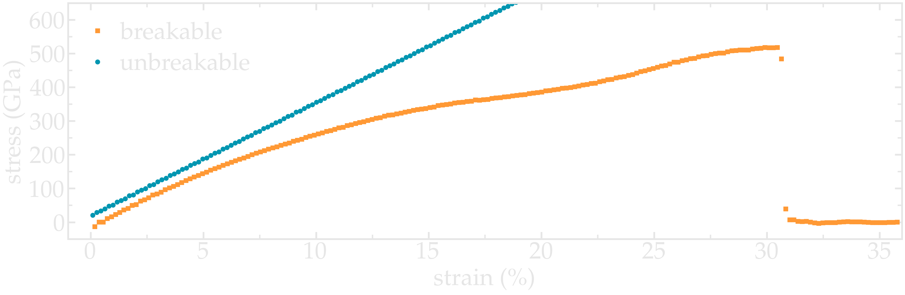
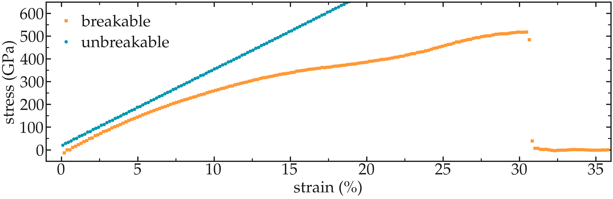

Going further with exercises
============================

Plot the strain-stress curves
-----------------------------

..  container:: justify

    Adapt the current scripts and extract the strain-stress curves for
    the two breakable and unbreakable CNTs:

.. container:: figurelegend

    Figure: Strain-stain curves for the two CNTs, breakable and unbreakable.

Solve the flying ice cube artifact
----------------------------------

The flying ice cube effect is one of the most famous artifacts of
molecular simulations :cite:`wong2016good`.
Download this seemingly simple |input_flying_cube|, which is a simplified
version of the input from the first part of the tutorial.
Run the input with this |data_flying_cube| file
and this |parm_flying_cube| file.

.. |input_flying_cube| raw:: html

    <a href="../../../../../lammpstutorials-inputs/level1/breaking-a-carbon-nanotube/exercises/flying-ice-cube/input.lammps" target="_blank">input</a>

.. |data_flying_cube| raw:: html

    <a href="../../../../../lammpstutorials-inputs/level1/breaking-a-carbon-nanotube/exercises/flying-ice-cube/cnt_molecular.data" target="_blank">data</a>

.. |parm_flying_cube| raw:: html

    <a href="../../../../../lammpstutorials-inputs/level1/breaking-a-carbon-nanotube/exercises/flying-ice-cube/parm.lammps" target="_blank">parameter</a>

When you run this simulation using LAMMPS, you should see that the temperature is
very close to :math:`300\,\text{K}`, as expected.

.. code-block:: bash

    Step   Temp        E_pair      E_mol       TotEng      Press     
    0      327.4142    589.20707   1980.6012   3242.2444   60.344754    
    1000   300.00184   588.90015   1980.9013   3185.9386   51.695282
    (...)

However, if you look at the system using VMD, the atoms are not moving.

Can you identify the origin of the issue, and fix the input?

Insert gas in the carbon nanotube
---------------------------------

Modify the input from the unbreakable CNT, and add atoms of argon
within the CNT. 
    
Use the following *pair_coeff* for the argon,
and a mass of *39.948*:

.. code-block:: lammps

    pair_coeff 2 2 0.232 3.3952 

.. figure:: figures/CNT-gas-dark.png
    :alt: CNT with Argon modeled in LAMMPS
    :class: only-dark

.. figure:: figures/CNT-gas-light.png
    :alt: CNT with Argon modeled in LAMMPS
    :class: only-light

.. container:: figurelegend

    Figure: Argon atoms in a CNT.  See the corresponding |gas_cnt_video|.

.. |gas_cnt_video| raw:: html

    <a href="https://www.youtube.com/watch?v=J4z_fZK7ekA" target="_blank">video</a>

Make a membrane of CNTs
-----------------------

Replicate the CNT along the *x*
and *y* direction, and equilibrate the system to 
create an infinite membrane made of multiple CNTs. 

Apply a shear deformation along *xy*.

.. figure:: figures/membrane-dark.png
    :alt: deformed membrane of CNTs
    :class: only-dark

.. figure:: figures/membrane-light.png
    :alt: deformed membrane of CNTs
    :class: only-light

.. container:: figurelegend

    Figure: Multiple carbon nanotubes forming a membrane.  

.. admonition:: Hint
    :class: info

    The box must be converted to triclinic to support deformation
    along *xy*.

