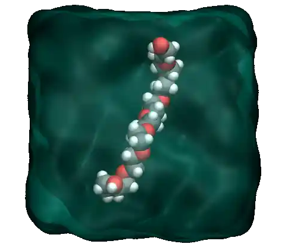
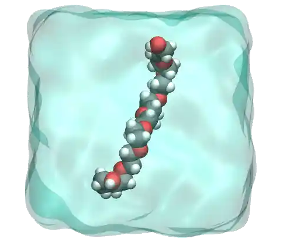

The goal of this tutorial is to use LAMMPS to solvate a small
hydrophilic polymer (PEG - polyethylene glycol) in a reservoir of water. 

Once the water reservoir is properly equilibrated
at the desired temperature and pressure, the polymer molecule is added
and a constant stretching force is applied to both ends of the polymer.
The evolution of the polymer length is measured as a function of time.
The GROMOS 54A7 force field :cite:`schmid2011definition` is used for the
PEG, the SPC/Fw model :cite:`wu2006flexible` is used for the water, and
the long-range Coulomb interactions are solved using the PPPM
solver :cite:`luty1996calculating`.

This tutorial was inspired by a
publication by Liese and coworkers, in which molecular dynamics
simulations are compared with force spectroscopy experiments, see
Ref. :cite:`liese2017hydration`.