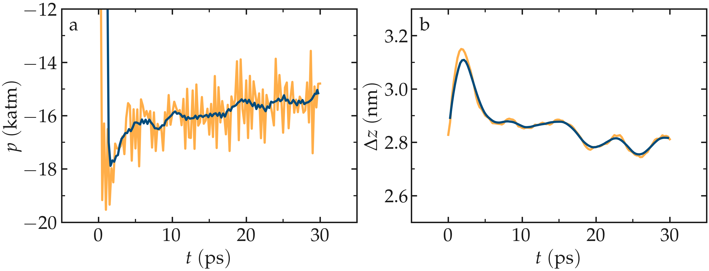

System preparation
==================

The fluid and walls must first be generated, followed by equilibration at the
desired temperature and pressure.

System generation
-----------------

Create a folder if needed and
place the initial input file, **create.lmp**, into it. Then, open the 
file in a text editor of your choice, and copy the following into it:

.. code-block:: lammps

    boundary p p f
    units real
    atom_style full
    bond_style harmonic
    angle_style harmonic
    pair_style lj/cut/tip4p/long O H O-H H-O-H 0.1546 12.0
    kspace_style pppm/tip4p 1.0e-5
    kspace_modify slab 3.0

.. admonition:: If you are using LAMMPS-GUI
    :class: gui

    To begin this tutorial, select ``Start Tutorial 4`` from the
    ``Tutorials`` menu of LAMMPS--GUI and follow the instructions.
    The editor should display the following content corresponding to **create.lmp**

These lines are used to define the most basic parameters, including the
atom, bond, and angle styles, as well as interaction
potential.  Here, ``lj/cut/tip4p/long`` imposes a Lennard-Jones potential with
a cut-off at :math:`12\,\text{Å}` and a long-range Coulomb potential.

.. include:: ../shared/needhelp.rst

So far, the commands are relatively similar to those in the previous tutorial,
:ref:`all-atoms-label`, with two major differences: the use
of ``lj/cut/tip4p/long`` instead of ``lj/cut/coul/long``, and ``pppm/tip4p``
instead of ``pppm``.  When using ``lj/cut/tip4p/long`` and ``pppm/tip4p``,
the interactions resemble the conventional Lennard-Jones and Coulomb interactions,
except that they are specifically designed for the four-point water model.  As a result,
LAMMPS automatically creates a four-point water molecule, assigning type O
atoms as oxygen and type H atoms as hydrogen.  The fourth massless atom (M) of the
TIP4P water molecule does not have to be defined explicitly, and the value of
:math:`0.1546\,\text{Å}` corresponds to the O-M distance of the
TIP4P-2005 water model :cite:`abascal2005general`.  All other atoms in the simulation
are treated as usual, with long-range Coulomb interactions.  Another novelty, here, is
the use of ``kspace modify slab 3.0`` that is combined with the non-periodic
boundaries along the :math:`z` coordinate: ``boundary p p f``.  With the ``slab``
option, the system is treated as periodical along :math:`z`, but with an empty volume inserted
between the periodic images of the slab, and the interactions along :math:`z` effectively turned off.

Let us create the box and the label maps by adding the following lines to **create.lmp**:

.. code-block:: lammps

    lattice fcc 4.04
    region box block -3 3 -3 3 -5 5
    create_box 5 box bond/types 1 angle/types 1 extra/bond/per/atom 2 extra/angle/per/atom 1 &
        extra/special/per/atom 2
    labelmap atom 1 O 2 H 3 Na+ 4 Cl- 5 WALL
    labelmap bond 1 O-H
    labelmap angle 1 H-O-H

The ``lattice`` command defines the unit cell.  Here, the face-centered cubic (fcc) lattice
with a scale factor of 4.04 has been chosen for the future positioning of the atoms
of the walls.  The ``region`` command defines a geometric region of space.  By choosing
:math:`\text{xlo}=-3` and :math:`\text{xlo}=3`, and because we have previously chosen a lattice with a scale
factor of 4.04, the region box extends from :math:`-12.12~\text{Å}` to :math:`12.12~\text{Å}`
along the :math:`x` direction.  The ``create_box`` command creates a simulation box with
5 types of atoms: the oxygen and hydrogen of the water molecules, the two ions (:math:`\text{Na}^+`,
:math:`\text{Cl}^-`), and the atoms from the walls.  The simulation contains 1 type of bond
and 1 type of angle (both required by the water molecules).
The parameters for these bond and angle constraints will be given later.  The ``extra (...)``
keywords are for memory allocation.  Finally, the ``labelmap`` commands assign
alphanumeric type labels to each numeric atom type, bond type, and angle type.

Now, we can add atoms to the system.  First, let us create two sub-regions corresponding
respectively to the two solid walls, and create a larger region from the union of the
two regions.  Then, let us create atoms of type WALL within the two regions.  Add the
following lines to **create.lmp**:

.. code-block:: lammps

    region rbotwall block -3 3 -3 3 -4 -3
    region rtopwall block -3 3 -3 3 3 4
    region rwall union 2 rbotwall rtopwall
    create_atoms WALL region rwall

Atoms will be placed in the positions of the previously defined lattice, thus
forming fcc solids.

To add the water molecules, the molecule template called |water_mol_4|
must be located next to **create.lmp**.  The template contains all the
necessary information concerning the water molecule, such as atom positions,
bonds, and angles.  Add the following lines to **create.lmp**:

.. |water_mol_4| raw:: html

    <a href="https://raw.githubusercontent.com/lammpstutorials/lammpstutorials-inputs/refs/heads/main/tutorial4/water.mol" target="_blank">water.mol</a>

.. code-block:: lammps

    region rliquid block INF INF INF INF -2 2
    molecule h2omol water.mol
    create_atoms 0 region rliquid mol h2omol 482793

Within the last three lines, a ``region`` named ``rliquid`` is
created based on the last defined lattice, ``fcc 4.04``.  ``rliquid``
will be used for depositing the water molecules.  The ``molecule`` command
opens up the molecule template called **water.mol**, and names the
associated molecule ``h2omol``.  The new molecules are placed on the
``fcc 4.04`` lattice by the ``create_atoms`` command.  The first
parameter is 0, meaning that the atom IDs from the **water.mol** file
will be used.  The number ``482793`` is a seed that is required by LAMMPS,
it can be any positive integer.

Finally, let us create 30 ions (15 :math:`\text{Na}^+` and 15 :math:`\text{Cl}^-`) in between
the water molecules, by adding the following commands to **create.lmp**:

.. code-block:: lammps

    create_atoms Na+ random 15 5802 rliquid overlap 0.3 maxtry 500
    create_atoms Cl- random 15 9012 rliquid overlap 0.3 maxtry 500
    set type Na+ charge 1
    set type Cl- charge -1

Each ``create_atoms`` command will add 15 ions at random positions
within the ``rliquid`` region, ensuring that there is no ``overlap``
with existing molecules.  Feel free to increase or decrease the salt concentration
by changing the number of desired ions.  To keep the system charge neutral,
always insert the same number of :math:`\text{Na}^+` and :math:`\text{Cl}^-`, unless there
are other charges in the system.  The charges of the newly added ions are specified
by the two ``set`` commands.

Before starting the simulation, we need to define the parameters of the
simulation: the mass of the 5 atom types (O, H, :math:`\text{Na}^+`, :math:`\text{Cl}^-`,
and wall), the pairwise interaction parameters (in this case, for the
Lennard-Jones potential), and the bond and angle parameters.  Copy the following
lines into **create.lmp**:

.. code-block:: lammps

    include parameters.inc
    include groups.inc

Both |parameters_inc_4| and |groups_inc_4| files
must be located next to **create.lmp**. The **parameters.inc** file contains the masses, as follows:

.. |parameters_inc_4| raw:: html

    <a href="https://raw.githubusercontent.com/lammpstutorials/lammpstutorials-inputs/refs/heads/main/tutorial4/parameters.inc" target="_blank">parameters.inc</a>

.. |groups_inc_4| raw:: html

    <a href="https://raw.githubusercontent.com/lammpstutorials/lammpstutorials-inputs/refs/heads/main/tutorial4/groups.inc" target="_blank">groups.inc</a>

.. code-block:: lammps

    mass O 15.9994
    mass H 1.008
    mass Na+ 22.990
    mass Cl- 35.453
    mass WALL 26.9815

Each ``mass`` command assigns a mass in g/mol to an atom type.
The **parameters.inc** file also contains the pair coefficients:

.. code-block:: lammps

    pair_coeff O O 0.185199 3.1589
    pair_coeff H H 0.0 1.0
    pair_coeff Na+ Na+ 0.04690 2.4299
    pair_coeff Cl- Cl- 0.1500 4.04470
    pair_coeff WALL WALL 11.697 2.574
    pair_coeff O WALL 0.4 2.86645

Each ``pair_coeff`` assigns the depth of the LJ potential (in
kcal/mol), and the distance (in Ångströms) at which the
particle-particle potential energy is 0.  As noted in previous
tutorials, with the important exception of ``pair_coeff O WALL``,
pairwise interactions were only assigned between atoms of identical
types.  By default, LAMMPS calculates the pair coefficients for the
interactions between atoms of different types (i and j) by using
geometric average: :math:`\epsilon_{ij} = \sqrt{\epsilon_{ii} \epsilon_{jj}}`,
:math:`\sigma_{ij} = \sqrt{\sigma_{ii} \sigma_{jj}}`.  However, if the default
value of :math:`1.472\,\text{kcal/mol}` was used for :math:`\epsilon_\text{1-5}`,
the solid walls would be extremely hydrophilic, causing the water
molecules to form dense layers.  As a comparison, the water-water energy
:math:`\epsilon_\text{1-1}` is only :math:`0.185199\,\text{kcal/mol}`.  Therefore,
to make the walls less hydrophilic, the value of
:math:`\epsilon_\text{O-WALL}` was reduced.

Finally, the **parameters.inc** file contains the following two lines:

.. code-block:: lammps

    bond_coeff O-H 0 0.9572
    angle_coeff H-O-H 0 104.52

The ``bond_coeff`` command, used here for the O-H bond of the water
molecule, sets both the spring constant of the harmonic potential and the
equilibrium bond distance of :math:`0.9572~\text{Å}`.  The constant can be 0 for a
rigid water molecule because the SHAKE algorithm will maintain the rigid
structure of the water molecule (see below) :cite:`ryckaert1977numerical, andersen1983rattle`.
Similarly, the ``angle_coeff`` command for the H-O-H angle of the water molecule sets
the force constant of the angular harmonic potential to 0 and the equilibrium
angle to :math:`104.52^\circ`.

Alongside **parameters.inc**, the **groups.inc** file contains
several ``group`` commands to selects atoms based on their types:

.. code-block:: lammps

    group H2O type O H
    group Na type Na+
    group Cl type Cl-
    group ions union Na Cl
    group fluid union H2O ions

The **groups.inc** file also defines the ``walltop`` and ``wallbot``
groups, which contain the WALL atoms located in the :math:`z > 0` and :math:`z < 0` regions, respectively:

.. code-block:: lammps

    group wall type WALL
    region rtop block INF INF INF INF 0 INF
    region rbot block INF INF INF INF INF 0
    group top region rtop
    group bot region rbot
    group walltop intersect wall top
    group wallbot intersect wall bot

Currently, the fluid density between the two walls is slightly too high.  To avoid
excessive pressure, let us add the following lines into **create.lmp**
to delete about :math:`15~\%` of the water molecules:

.. code-block:: lammps

    delete_atoms random fraction 0.15 yes H2O NULL 482793 mol yes

To create an image of the system, add the following ``dump`` image
into **create.lmp**:

.. code-block:: lammps

    dump mydmp all image 200 myimage-*.ppm type type shiny 0.1 box no 0.01 view 90 0 zoom 1.8
    dump_modify mydmp backcolor white acolor O red adiam O 2 acolor H white adiam H 1 &
        acolor Na+ blue adiam Na+ 2.5 acolor Cl- cyan adiam Cl- 3 acolor WALL gray adiam WALL 3

Finally, add the following lines into **create.lmp**:

.. code-block:: lammps

    run 0

    write_data create.data nocoeff

The ``run 0`` command runs the simulation for 0 steps, which is sufficient for
creating the system and saving its state.  The ``write_data`` command
generates a file called **system.data** containing the information required
to restart the simulation from the final configuration produced by this input
file.  With the ``nocoeff`` option, the parameters from the force field are
not included in the **.data** file.  Run the **create.lmp** file using LAMMPS,
and a file named **create.data** will be created alongside **create.lmp**.

.. figure:: figures/systemcreation-dark.png
    :alt: LAMMPS: electrolyte made of water and salt between walls
    :class: only-dark

..  container:: figurelegend

    Figure: Side view of the system.  Periodic images are represented in darker colors.
    Water molecules are in red and white, :math:`\text{Na}^+` ions in pink, :math:`\text{Cl}^-`
    ions in lime, and wall atoms in gray.  Note the absence of atomic defect at the
    cell boundaries.

Energy minimization
-------------------

Let us move the atoms and place them in more energetically favorable positions
before starting the actual molecular dynamics simulation.

.. admonition:: If you are using LAMMPS-GUI
    :class: gui

    Open the **equilibrate.lmp** file that was downloaded alongside
    **create.lmp** during the tutorial setup.

Create a new file, **equilibrate.lmp**, and copy the following into it:

.. code-block:: lammps

    boundary p p f
    units real
    atom_style full
    bond_style harmonic
    angle_style harmonic
    pair_style lj/cut/tip4p/long O H O-H H-O-H 0.1546 12.0
    kspace_style pppm/tip4p 1.0e-5
    kspace_modify slab 3.0

    read_data create.data

    include parameters.inc
    include groups.inc

The only difference from the previous input is that, instead of creating a new
box and new atoms, we open the previously created **create.data** file.

Now, let us use the SHAKE algorithm to maintain the shape of the
water molecules :cite:`ryckaert1977numerical, andersen1983rattle`.

.. code-block:: lammps

    fix myshk H2O shake 1.0e-5 200 0 b O-H a H-O-H kbond 2000

Here the SHAKE algorithm applies to the ``O-H`` bond and the ``H-O-H`` angle
of the water molecules.  The ``kbond`` keyword specifies the force constant that will be
used to apply a restraint force when used during minimization.  This last keyword is important
here, because the spring constants of the rigid water molecules were set
to 0 (see the **parameters.inc** file).

Let us also create images of the system and control
the printing of thermodynamic outputs by adding the following lines
to **equilibrate.lmp**:

.. code-block:: lammps

    dump mydmp all image 1 myimage-*.ppm type type shiny 0.1 box no 0.01 view 90 0 zoom 1.8
    dump_modify mydmp backcolor white acolor O red adiam O 2 acolor H white adiam H 1 &
        acolor Na+ blue adiam Na+ 2.5 acolor Cl- cyan adiam Cl- 3 acolor WALL gray adiam WALL 3

    thermo 1
    thermo_style custom step temp etotal press

Let us perform an energy minization by adding the following lines to **equilibrate.lmp**:

.. code-block:: lammps

    minimize 1.0e-6 1.0e-6 1000 1000
    reset_timestep 0

When running the **equilibrate.lmp** file with LAMMPS, you should observe that the
total energy of the system is initially very high but rapidly decreases.  From the generated
images of the system, you will notice that the atoms and molecules are moving to adopt more favorable positions.

System equilibration
--------------------

Let us equilibrate further the entire system by letting both fluid and piston
relax at ambient temperature.  Here, the commands are written within the same
**equilibrate.lmp** file, right after the ``reset_timestep`` command.

Let us update the positions of all the atoms and use a Nosé-Hoover
thermostat.  Add the following lines to **equilibrate.lmp**:

.. code-block:: lammps

    fix mynvt all nvt temp 300 300 100
    fix myshk H2O shake 1.0e-5 200 0 b O-H a H-O-H
    fix myrct all recenter NULL NULL 0
    timestep 1.0

As mentioned previously, the ``fix recenter`` does not influence the dynamics,
but will keep the system in the center of the box, which makes the
visualization easier.  Then, add the following lines into **equilibrate.lmp**
for the trajectory visualization:

.. code-block:: lammps

    undump mydmp
    dump mydmp all image 250 myimage-*.ppm type type shiny 0.1 box no 0.01 view 90 0 zoom 1.8
    dump_modify mydmp backcolor white acolor O red adiam O 2 acolor H white adiam H 1 &
        acolor Na+ blue adiam Na+ 2.5 acolor Cl- cyan adiam Cl- 3 acolor WALL gray adiam WALL 3

The ``undump`` command is used to cancel the previous ``dump`` command.
Then, a new ``dump`` command with a larger dumping period is used.

To monitor the system equilibration, let us print the distance between
the two walls.  Add the following lines to **equilibrate.lmp**:

.. code-block:: lammps

    variable walltopz equal xcm(walltop,z)
    variable wallbotz equal xcm(wallbot,z)
    variable deltaz equal v_walltopz-v_wallbotz

    thermo 250
    thermo_style custom step temp etotal press v_deltaz

The first two variables extract the centers of mass of the two walls.  The
``deltaz`` variable is then used to calculate the difference between the two
variables ``walltopz`` and ``wallbotz``, i.e. the distance between the
two centers of mass of the walls.

Finally, let us run the simulation for 30 ps by adding a ``run`` command
to **equilibrate.lmp**:

.. code-block:: lammps

    run 30000

    write_data equilibrate.data nocoeff

Run the **equilibrate.lmp** file using LAMMPS.  Both the pressure and the distance
between the two walls show oscillations at the start of the simulation
but eventually stabilize at their equilibrium values toward
the end of the simulation.

.. admonition:: Note
    :class: non-title-info

    Note that it is generally recommended to run a longer equilibration.  In this case,
    the slowest process in the system is likely ionic diffusion.
    Therefore, the equilibration period should, in principle, exceed the time required
    for the ions to diffuse across the size of the pore, i.e. :math:`H_\text{pore}^2/D_\text{ions}`.
    Using :math:`H_\text{pore} \approx 1.2~\text{nm}` as the final pore size
    and :math:`D_\text{ions} \approx 1.5 \cdot 10^{-9}~\text{m}^2/\text{s}`
    as the typical diffusion coefficient for sodium chloride in water at room
    temperature :cite:`mills1955remeasurement`, one finds that the equilibration
    should be on the order of one nanosecond.

.. figure:: figures/NANOSHEAR-equilibration-dm.png
    :class: only-dark
    :alt: Evolution of the pressure and distance for the elecrolyte

..  container:: figurelegend

    Figure: a) Pressure, :math:`p`, of the nanosheared electrolyte system as a function
    of the time, :math:`t`.  b) Distance between the walls, :math:`\Delta z`, as a
    function of :math:`t`.

Imposed shearing
----------------

From the equilibrated configuration, let us impose a lateral motion on the two
walls and shear the electrolyte.

.. admonition:: If you are using LAMMPS-GUI
    :class: gui

    Open the last input file named **shearing.lmp**.

Create a new file, **shearing.lmp**, and copy the following into it:

.. code-block:: lammps

    boundary p p f
    units real
    atom_style full
    bond_style harmonic
    angle_style harmonic
    pair_style lj/cut/tip4p/long O H O-H H-O-H 0.1546 12.0
    kspace_style pppm/tip4p 1.0e-5
    kspace_modify slab 3.0

    read_data equilibrate.data

    include parameters.inc
    include groups.inc

To address the dynamics of the system, add the following lines to
**shearing.lmp**:

.. code-block:: lammps

    compute Tfluid fluid temp/partial 0 1 1
    fix mynvt1 fluid nvt temp 300 300 100
    fix_modify mynvt1 temp Tfluid

    compute Twall wall temp/partial 0 1 1
    fix mynvt2 wall nvt temp 300 300 100
    fix_modify mynvt2 temp Twall

    fix myshk H2O shake 1.0e-5 200 0 b O-H a H-O-H
    fix myrct all recenter NULL NULL 0
    timestep 1.0

One key difference with the previous input is that, here, two thermostats are used,
one for the fluid (``mynvt1``) and one for the solid (``mynvt2``).
The combination of ``fix_modify`` with ``compute temp`` ensures
that the correct temperature values are used by the thermostats.  Using
``compute`` commands for the temperature with ``temp/partial 0 1 1`` is
intended to exclude the :math:`x` coordinate from the thermalization, which is important since a
large velocity will be imposed along the :math:`x` direction.

Then, let us impose the velocity of the two walls by adding the following
commands to **shearing.lmp**:

.. code-block:: lammps

    fix mysf1 walltop setforce 0 NULL NULL
    fix mysf2 wallbot setforce 0 NULL NULL
    velocity wallbot set -2e-4 NULL NULL
    velocity walltop set 2e-4 NULL NULL

The ``setforce`` commands cancel the forces on ``walltop`` and
``wallbot``.  As a result, the atoms in these two groups will not
experience any forces from the rest of the system.  Consequently, in the absence of
external forces, these atoms will conserve the initial velocities imposed by the
two ``velocity`` commands.

Finally, let us generate images of the systems and print the values of the
forces exerted by the fluid on the walls, as given by ``f_mysf1[1]``
and ``f_mysf2[1]``.  Add these lines to **shearing.lmp**:

.. code-block:: lammps

    dump mydmp all image 250 myimage-*.ppm type type shiny 0.1 box no 0.01 view 90 0 zoom 1.8
    dump_modify mydmp backcolor white acolor O red adiam O 2 acolor H white adiam H 1 &
        acolor Na+ blue adiam Na+ 2.5 acolor Cl- cyan adiam Cl- 3 acolor WALL gray adiam WALL 3

    thermo 250
    thermo_modify temp Tfluid
    thermo_style custom step temp etotal f_mysf1[1] f_mysf2[1]

Let us also extract the density and velocity profiles using
the ``chunk/atom`` and ``ave/chunk`` commands.  These commands are
used to divide the system into bins and return the desired quantities, here the velocity
along :math:`x` (``vx``) within the bins.  Add the following lines to **shearing.lmp**:

.. code-block:: lammps

    compute cc1 H2O chunk/atom bin/1d z 0.0 0.25
    compute cc2 wall chunk/atom bin/1d z 0.0 0.25
    compute cc3 ions chunk/atom bin/1d z 0.0 0.25

    fix myac1 H2O ave/chunk 10 15000 200000 &
    cc1 density/mass vx file shearing-water.dat
    fix myac2 wall ave/chunk 10 15000 200000 &
    cc2 density/mass vx file shearing-wall.dat
    fix myac3 ions ave/chunk 10 15000 200000 &
    cc3 density/mass vx file shearing-ions.dat

    run 200000

Here, a bin size of :math:`0.25\,\text{Å}` is used for the density
profiles generated by the ``ave/chunk`` commands, and three
**.dat** files are created for the water, the walls, and the ions,
respectively.  With values of ``10 15000 200000``, the velocity
``vx`` will be evaluated every 10 steps during the final 150,000
steps of the simulations.  The result will be averaged and printed only
once at the 200,000 th step.

Run the simulation using LAMMPS.  The averaged velocity
profile for the fluid is plotted below.
As expected for such Couette flow geometry, the fluid velocity increases
linearly along :math:`z`, and is equal to the walls velocities at the fluid-solid
interfaces (no-slip boundary conditions).

.. figure:: figures/NANOSHEAR-profiles.png
    :class: only-light
    :alt: Velocity profiles for the elecrolyte

..  container:: figurelegend

    Figure: Velocity profiles for water (blue) and walls (orange) along the :math:`z`-axis.

From the force applied by the fluid on the solid, one can extract the stress
within the fluid, which enables the measurement of its viscosity :math:`\eta`
according to

.. math:: 
    :label: eq_eta

    \eta = \tau / \dot{\gamma}

where :math:`\tau` is the stress applied by
the fluid on the shearing wall, and :math:`\dot{\gamma}` the shear rate
:cite:`gravelle2021violations`.  Here, the shear rate is
approximately :math:`\dot{\gamma} = 20 \cdot 10^9\,\text{s}^{-1}`,
the average force on each wall is given by ``f_mysf1[1]`` and ``f_mysf2[1]``
and is approximately :math:`2.7\,\mathrm{kcal/mol/Å}` in magnitude.  Using a surface area
for the walls of :math:`A = 6 \cdot 10^{-18}\,\text{m}^2`, one obtains an estimate for
the shear viscosity for the confined fluid of :math:`\eta = 3.1\,\text{mPa.s}` using Eq. :eq:`eq_eta`.

.. admonition:: Note
    :class: non-title-info
        
    The viscosity calculated at such a high shear rate may differ from the expected
    *bulk* value.  In general, it is recommended to use a lower value for the
    shear rate.  Note that for lower shear rates, the ratio of noise-to-signal is
    larger, and longer simulations are needed.  Another important point to consider
    is that the viscosity of a fluid next to a solid surface is typically larger
    than in bulk due to interaction with the walls :cite:`wolde-kidanInterplayInterfacialViscosity2021`.
    Therefore, one expects the present simulation to yield a viscosity that is slightly
    higher than what would be measured in the absence of walls.

