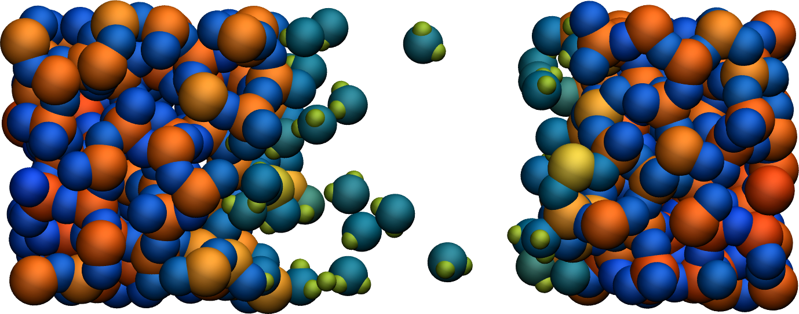
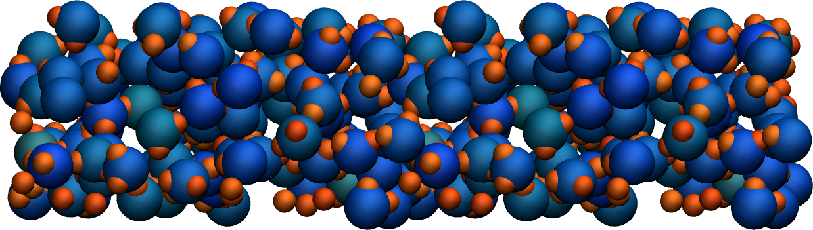

Going further with exercises
============================

Hydrate the structure
---------------------

Add water molecules to the current structure, and follow the reactions over
time.

.. figure:: figures/hydrated-dark.png
    :alt: Cracked silicon oxide after addition of water molecule
    :class: only-dark

..  container:: figurelegend

    Figure: Cracked silicon oxide after the addition of water
    molecules. The atoms are colored by their charges.

A slightly acidic bulk solution
-------------------------------

Create a bulk water system with a few hydronium ions (:math:`H_3O^+`
or :math:`H^+`) using ReaxFF. The addition of hydronium ions will make the
system acidic.

.. figure:: figures/acidic-water-dark.png
    :alt: Acidic bulk water with ReaxFF
    :class: only-dark

..  container:: figurelegend

    Figure: Slightly acidic bulk water simulated with ReaxFF. The atoms are
    colored by their charges.
