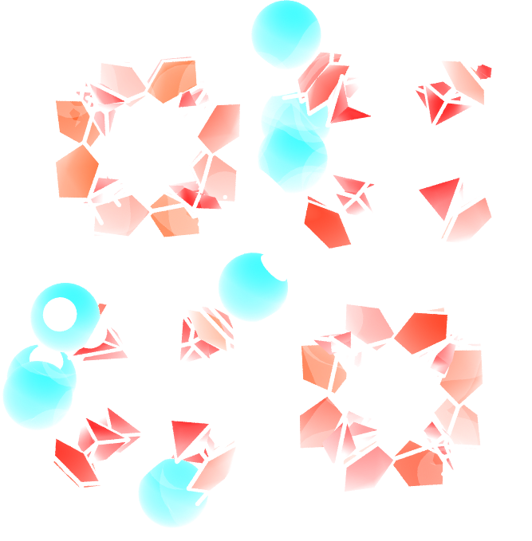
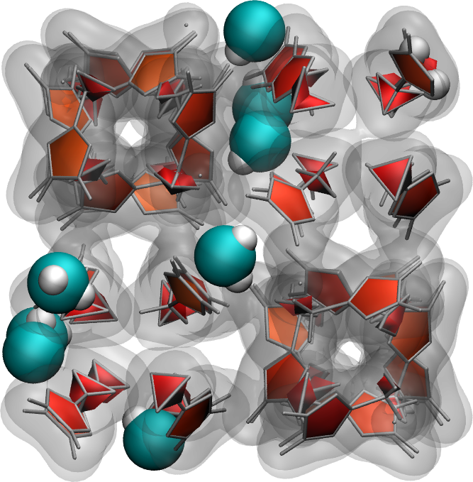

Going further with exercises
============================

.. include:: ../../non-tutorials/link-to-solutions.rst

Mixture adsorption
------------------

Adapt the existing script and insert both :math:`\text{CO}_2` molecules
and water molecules within the silica crack using GCMC. 
Download the |CO2-template|. The parameters for the
:math:`\text{CO}_2`
molecule are the following:

..  code-block:: lammps

    pair_coeff 5 5 lj/cut/tip4p/long 0.0179 2.625854
    pair_coeff 6 6 lj/cut/tip4p/long 0.0106 2.8114421 
    bond_coeff 2 46.121 1.17
    angle_coeff 2 2.0918 180

The atom of type 5 is an oxygen of 
mass 15.9994, and the atom of type 6 is a carbon of mass 12.011.

.. figure:: figures/H2O-CO2-dark.png
    :alt: silica block adsorbed water and CO2
    :class: only-dark

.. figure:: figures/H2O-CO2-light.png
    :alt: silica block adsorbed water and CO2
    :class: only-light

..  container:: figurelegend

    Figure: Cracked silica with adsorbed water and :math:`\text{CO}_2` molecules (in green).

.. |CO2-template| raw:: html

    <a href="../../../../../lammpstutorials-inputs/level3/water-adsorption-in-silica/Exercises/MixtureH2OCO2/CO2.mol" target="_blank">CO2 template</a>

Adsorb water in ZIF-8 nanopores
-------------------------------

Use the same protocol as the one implemented in this tutorial to add water
molecules to a Zif-8 nanoporous material. A snapshot of the system with a 
few water molecules is shown on the right.

Download the initial Zif-8 |Zif-8-structure|,
the |Zif-8-parameters| file, and this
new |water-template|. The ZIF-8 structure is made
of 7 atom types (C1, C2, C3, H2, H3, N, Zn), connected
by bonds, angles, dihedrals, and impropers. It uses the
same *pair_style* as water,
so there is no need to use *hybrid pair_style*.
Your *input* file should start like this:

..  code-block:: lammps

    units real
    atom_style full
    boundary p p p
    bond_style harmonic
    angle_style harmonic
    dihedral_style charmm
    improper_style harmonic

    pair_style lj/cut/tip4p/long 1 2 1 1 0.105 14.0
    kspace_style pppm/tip4p 1.0e-5

    special_bonds lj 0.0 0.0 0.5 coul 0.0 0.0 0.833

An important note: here, water occupies the atom types 1 and 2,
instead of 3 and 4 in the case of SiO2 from the main section 
of the tutorial.

.. |Zif-8-structure| raw:: html

   <a href="../../../../../lammpstutorials-inputs/level3/water-adsorption-in-silica/Exercises/Zif-8/zif-8.data" target="_blank">structure</a>

.. |Zif-8-parameters| raw:: html

   <a href="../../../../../lammpstutorials-inputs/level3/water-adsorption-in-silica/Exercises/Zif-8/parm.lammps" target="_blank">parameters</a>

.. |water-template| raw:: html

    <a href="../../../../../lammpstutorials-inputs/level3/water-adsorption-in-silica/Exercises/Zif-8/water.mol" target="_blank">water template</a>
