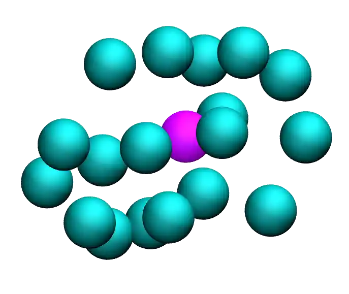
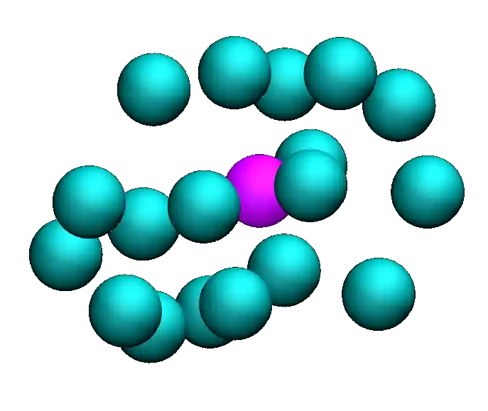

The objective of this tutorial is to measure the free energy profile of
particles through a barrier potential using two methods: free sampling
and umbrella sampling
:cite:`kastner2011umbrella, allen2017computer, frenkel2023understanding`.
To simplify the
process and minimize computation time, the barrier potential will be
imposed on the atoms using an additional force, mimicking the presence
of a repulsive area in the middle of the simulation box without needing
to simulate additional atoms.  The procedure is valid for more complex
systems and can be adapted to many other situations, such as measuring
adsorption barriers near an interface or calculating translocation
barriers through a membrane
:cite:`wilson1997adsorption, makarov2009computer, gravelle2021adsorption, loche2022molecular, hayatifar2024probing`.