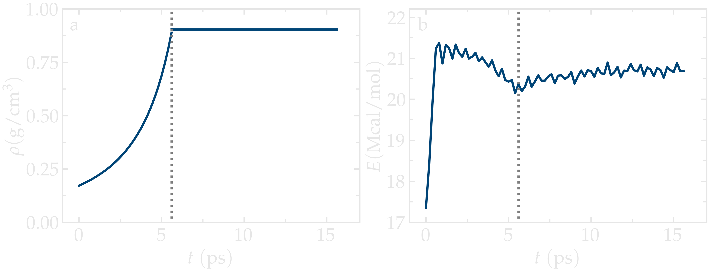
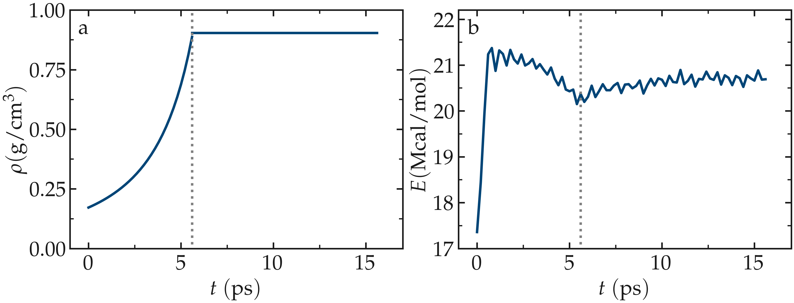
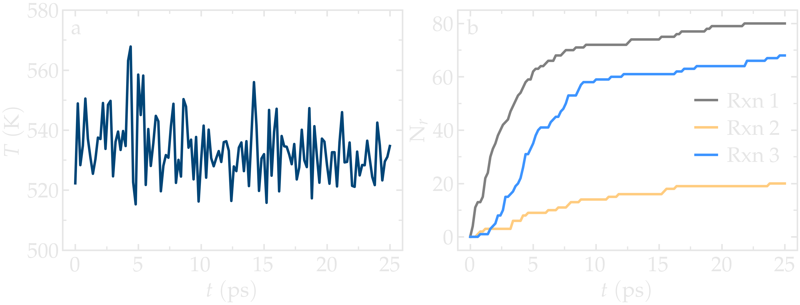
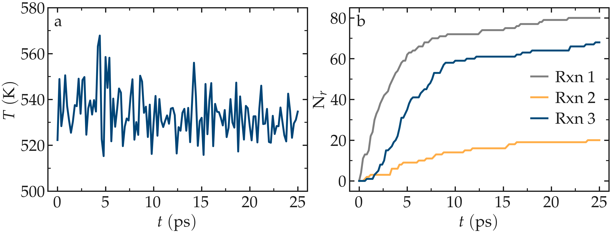

Creating the system
===================

To begin this tutorial, select ``Start Tutorial 8`` from the
``Tutorials`` menu of LAMMPS--GUI and follow the instructions.
The editor should display the following content corresponding to **mixing.lmp**:

.. code-block:: lammps

    units real
    boundary p p p
    atom_style full

    kspace_style pppm 1.0e-5
    pair_style lj/class2/coul/long 8.5
    angle_style class2
    bond_style class2
    dihedral_style class2
    improper_style class2

    pair_modify tail yes mix sixthpower
    special_bonds lj/coul 0 0 1

The ``class2`` styles compute a 6/9 Lennard-Jones potential :cite:`sun1998compass`.
The ``class2`` bond, angle, dihedral, and improper styles are used as
well, see the documentation for a description of their respective potentials.
The ``mix sixthpower`` imposes the following mixing rule for the calculation
of the cross coefficients:

.. math::

    \sigma_{ij} & = & 2^{-1/6} (\sigma^6_i+\sigma_j^6)^{1/6}, ~ \text{and}

    \epsilon_{ij} & = & \dfrac{2 \sqrt{\epsilon_i \epsilon_j} \sigma^3_i \sigma^3_j}{\sigma^6_i+\sigma_j^6}.

Let us read the |CNT_data_8| file, which contains a periodic single-walled
CNT.  Add the following line to **mixing.lmp**:

.. |CNT_data_8| raw:: html

    <a href="https://raw.githubusercontent.com/lammpstutorials/lammpstutorials-inputs/refs/heads/main/tutorial8/CNT.data" target="_blank">CNT.data</a>

.. code-block:: lammps

    read_data CNT.data extra/special/per/atom 20

The CNT is approximately :math:`1.1~\text{nm}` in diameter and :math:`1.6\,\text{nm}` in length, oriented
along the :math:`x`-axis. The simulation box is initially 12.0 nm in the two other dimensions before densification,
making it straightforward to fill the box with styrene. To add 200 styrene molecules to the simulation box,
we will use the |styrene_mol_8| molecule template file. Include the following commands to **mixing.lmp**:

.. |styrene_mol_8| raw:: html

    <a href="https://raw.githubusercontent.com/lammpstutorials/lammpstutorials-inputs/refs/heads/main/tutorial8/styrene.mol" target="_blank">styrene.mol</a>

.. code-block:: lammps

    molecule styrene styrene.mol
    create_atoms 0 random 200 8305 NULL overlap 2.75 maxtry 500 mol styrene 7687
    
Finally, let us use the ``minimize`` command to reduce the potential energy of the system:

.. code-block:: lammps

    minimize 1.0e-4 1.0e-6 100 1000
    reset_timestep 0

Then, let us densify the system to a target value of :math:`0.9~\text{g/cm}^3`
by manually shrinking the simulation box at a constant rate.  The dimension parallel
to the CNT axis is maintained fixed because the CNT is periodic in that direction.
Add the following commands to **mixing.lmp**:

.. code-block:: lammps
        
    velocity all create 530 9845 dist gaussian rot yes
    fix mynvt all nvt temp 530 530 100

    fix mydef all deform 1 y erate -0.0001 z erate -0.0001
    variable rho equal density
    fix myhal all halt 10 v_rho > 0.9 error continue

    thermo 200
    thermo_style custom step temp pe etotal press density

    run 9000

The ``fix halt`` command is used to stop the box shrinkage once the
target density is reached.

For the next stage of the simulation, we will use ``dump image`` to
output images every 200 steps:

.. code-block:: lammps
        
    dump viz all image 200 myimage-*.ppm type type shiny 0.1 box no 0.01 size 1000 1000 view 90 0 zoom 1.8 fsaa yes bond atom 0.5
    dump_modify viz backcolor white acolor cp gray acolor c=1 gray acolor c= gray acolor c1 deeppink &
        acolor c2 deeppink acolor c3 deeppink adiam cp 0.3 adiam c=1 0.3 adiam c= 0.3 adiam c1 0.3 &
        adiam c2 0.3 adiam c3 0.3 acolor hc white adiam hc 0.15

For the following :math:`10~\text{ps}`, let us equilibrate the densified system
in the constant-volume ensemble, and write the final state of the
system in a file named **mixing.data**:

.. code-block:: lammps

    unfix mydef
    unfix myhal
    reset_timestep 0

    group CNT molecule 1
    fix myrec CNT recenter NULL 0 0 units box shift all

    run 10000

    write_data mixing.data

For visualization purposes, the atoms from the CNT ``group`` is moved
to the center of the box using ``fix recenter``.
As the time progresses, the system density,
:math:`\rho`, gradually converges toward the target value
of :math:`0.8`\,g/cm:math:`^3`.
Meanwhile, the total energy of the system initially evolves rapidly, reflecting the
densification process, and then eventually stabilizes.

..  container:: figurelegend

    Figure: a) Evolution of the density, :math:`\rho`, as a function of the
    time, :math:`t`, during equilibration of the system. b) Evolution of the total
    energy, :math:`E`, of the system.
    The vertical dashed lines mark the transition between the different
    phases of the simulation.

Reaction templates
------------------

The REACTER protocol enables the modeling of chemical reactions using
classical force fields.  The user must provide a molecule template for the reactants,
a molecule template for the products, and a ``reaction map`` file that
provides an atom mapping between the two templates.  The reaction map file also includes
additional information, such as which atoms act as initiators for the reaction and which
serve as edge atoms to connect the rest of a long polymer chain in the simulation.

There are three reactions to define: (1) the polymerization of two styrene monomers,
(2) the addition of a styrene monomer to the end of a growing polymer chain, and (3) the
linking of two polymer chains.  Download the three files associated with each reaction.
The first reaction uses the prefix ``M-M`` for the pre-reaction template,
post-reaction template, and reaction map file:

- |M_M_pre_mol_8|,
- |M_M_post_mol_8|,
- |M_M_rxnmap_8|.

The second reaction uses the prefix ``M-P``,

- |M_P_pre_mol_8|,
- |M_P_post_mol_8|,
- |M_P_rxnmap_8|.

The third reaction uses the prefix ``P-P``,

- |P_P_pre_mol_8|,
- |P_P_post_mol_8|,
- |P_P_rxnmap_8|.

Here, the file names for each reaction use the abbreviation `M' for monomer and `P'
for polymer.

.. |M_M_pre_mol_8| raw:: html

    <a href="https://raw.githubusercontent.com/lammpstutorials/lammpstutorials-inputs/refs/heads/main/tutorial8/M-M_pre.mol" target="_blank">M-M_pre.mol</a>

.. |M_M_post_mol_8| raw:: html

    <a href="https://raw.githubusercontent.com/lammpstutorials/lammpstutorials-inputs/refs/heads/main/tutorial8/M-M_post.mol" target="_blank">M-M_post.mol</a>

.. |M_M_rxnmap_8| raw:: html

    <a href="https://raw.githubusercontent.com/lammpstutorials/lammpstutorials-inputs/refs/heads/main/tutorial8/M-M.rxnmap" target="_blank">M-M.rxnmap</a>

.. |M_P_pre_mol_8| raw:: html

    <a href="https://raw.githubusercontent.com/lammpstutorials/lammpstutorials-inputs/refs/heads/main/tutorial8/M-P_pre.mol" target="_blank">M-P_pre.mol</a>

.. |M_P_post_mol_8| raw:: html

    <a href="https://raw.githubusercontent.com/lammpstutorials/lammpstutorials-inputs/refs/heads/main/tutorial8/M-P_post.mol" target="_blank">M-P_post.mol</a>

.. |M_P_rxnmap_8| raw:: html

    <a href="https://raw.githubusercontent.com/lammpstutorials/lammpstutorials-inputs/refs/heads/main/tutorial8/M-P.rxnmap" target="_blank">M-P.rxnmap</a>

.. |P_P_pre_mol_8| raw:: html

    <a href="https://raw.githubusercontent.com/lammpstutorials/lammpstutorials-inputs/refs/heads/main/tutorial8/P-P_pre.mol" target="_blank">P-P_pre.mol</a>

.. |P_P_post_mol_8| raw:: html

    <a href="https://raw.githubusercontent.com/lammpstutorials/lammpstutorials-inputs/refs/heads/main/tutorial8/P-P_post.mol" target="_blank">P-P_post.mol</a>

.. |P_P_rxnmap_8| raw:: html

    <a href="https://raw.githubusercontent.com/lammpstutorials/lammpstutorials-inputs/refs/heads/main/tutorial8/P-P.rxnmap" target="_blank">P-P.rxnmap</a>

Simulating the reaction
-----------------------

The first step, before simulating the reaction, is to import the previously
generated configuration.  Open the file named **polymerize.lmp**,
which should contain the following lines:

.. code-block:: lammps

    units real
    boundary p p p
    atom_style full

    kspace_style pppm 1.0e-5
    pair_style lj/class2/coul/long 8.5
    angle_style class2
    bond_style class2
    dihedral_style class2
    improper_style class2

    pair_modify tail yes mix sixthpower
    special_bonds lj/coul 0 0 1

    read_data mixing.data extra/bond/per/atom 5  extra/angle/per/atom 15 extra/dihedral/per/atom 15 extra/improper/per/atom 25 extra/special/per/atom 25

Here, the ``read_data`` command is used to import the
previously generated **mixing.data** file.  All other commands
have been introduced in earlier parts of the tutorial.

Then, let us import all six molecules templates using the ``molecule`` command:

.. code-block:: lammps

    molecule mol1 M-M_pre.mol
    molecule mol2 M-M_post.mol
    molecule mol3 M-P_pre.mol
    molecule mol4 M-P_post.mol
    molecule mol5 P-P_pre.mol
    molecule mol6 P-P_post.mol

In order to follow the evolution of the reaction with time, let us generate images
of the system using ``dump image``:

.. code-block:: lammps

    dump viz all image 200 myimage-*.ppm type type shiny 0.1 box no 0.01 size 1000 1000 view 90 0 zoom 1.8 fsaa yes bond atom 0.5
    dump_modify viz backcolor white acolor cp gray acolor c=1 gray acolor c= gray acolor c1 deeppink acolor c2 gray acolor c3 deeppink &
        adiam cp 0.3 adiam c=1 0.3 adiam c= 0.3 adiam c1 0.3 adiam c2 0.3 adiam c3 0.3 acolor hc white adiam hc 0.15

Let us use ``fix bond/react`` by adding the following
line to **polymerize.lmp**:

.. code-block:: lammps

    fix rxn all bond/react stabilization yes statted_grp 0.03 react R1 all 1 0 3.0 mol1 mol2 M-M.rxnmap &
        react R2 all 1 0 3.0 mol3 mol4 M-P.rxnmap react R3 all 1 0 5.0 mol5 mol6 P-P.rxnmap

With the ``stabilization`` keyword, the ``bond/react`` command will
stabilize the atoms involved in the reaction using the ``nve/limit``
command with a maximum displacement of :math:`0.03\,\text{Å}`.  By default,
each reaction is stabilized for 60 time steps.  Each ``react`` keyword
corresponds to a reaction, e.g., a transformation of ``mol1`` into ``mol2``
based on the atom map **M-M.rxnmap**.  Implementation details about each reaction,
such as the reaction distance cutoffs and the frequency with which to search for
reaction sties, are also specified in this command.

ADD REACT-final FIGURE: Final configuration.
The atoms from the formed polymer named ``c1``, ``c2``, and
``c3`` are colored in pink.

.. admonition:: Note
    :class: non-title-info
        
    The command ``fix bond/react`` creates several groups of atoms that are dynamically updated
    to track which atoms are being stabilized and which atoms are undergoing
    dynamics with the system-wide time integrator (here, ``fix nvt``).
    When reaction stabilization is employed, there should not be a time integrator acting on
    the group ``all``.  Instead, the group of atoms not currently
    undergoing stabilization is named by appending ``_REACT`` to the user-provided prefix.

Add the following commands to **polymerize.lmp** to operate in the NVT ensemble
while ensuring that the CNT remains centered in the simulation box:

.. code-block:: lammps

    fix mynvt statted_grp_REACT nvt temp 530 530 100
    group CNT molecule 1 2 3
    fix myrec CNT recenter NULL 0 0 shift all

    thermo 1000
    thermo_style custom step temp press density f_rxn[*]

    run 25000

Here, the ``thermo custom`` command is used
to print the cumulative reaction counts from ``fix rxn``.
Run the simulation using LAMMPS.  As the simulation progresses, polymer chains are
observed forming.  During this reaction process, the
temperature of the system remains well-controlled,
while the number of reactions, :math:`N_r`, increases with time.

..  container:: figurelegend

    Figure: a) Evolution of the system temperature, :math:`T`, as a function of
    the time, :math:`t`, during the polymerization step.  b) Evolution of
    the three reaction counts, corresponding respectively to
    the polymerization of two styrene monomers (Rxn 1), the  addition of a styrene
    monomer to the end of a growing polymer chain (Rxn 2), and to the linking
    of two polymer chains (Rxn 3).

