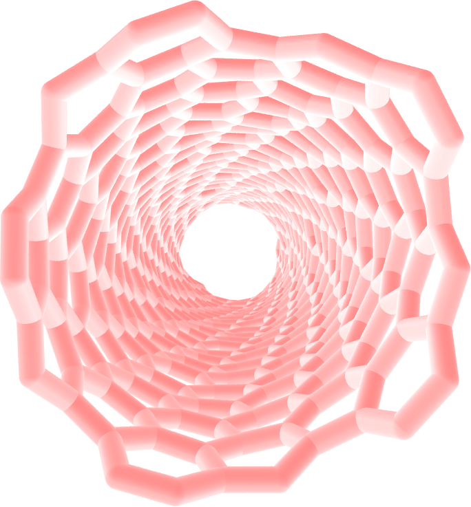

.. _`carbon-nanotube-label`:

Breaking a carbon nanotube
***************************

..  container:: justify

   This tutorial is part of the *2D materials* series.

.. container:: hatnote

   In this tutorial, the breaking of the bonds pf a carbon nanotube under
   extreme deformation is simulated.

.. figure:: ../figures/carbonnanotube/cnt_light.png
    :alt: carbon nanotube image in vacuum
    :height: 250
    :align: right
    :class: only-light

System creation
===============

..  container:: justify

   Use the same protocol as the one used in the
   previous tutorial (:ref:`graphene-label`) to
   generate a carbon nanotube. Use topotool to 
   save the topology in a file called cnt.data.
   Before generating the CNT, untick "bonds".

   The reason the bonds are not needed here is that 
   a reactive force field is used. Such force field 
   deduces the bonds between atoms on the fly based on the positions of the atoms.
   When two initially bonded atoms are separated by a 
   distance that is too large, the bond may break. 

   Alternatively, you can download the file I did generate 
   by clicking `here <../../../../../../inputs/2Dmaterials/carbonnanotube/cnt.data>`__.

Input file
==========

..  container:: justify

   Then, create a LAMMPS input file, call is input.lammps, and type in it:

..  code-block:: bash
   :caption: *to be copied in input.lammps*

   # Initialisation

   variable T equal 300

   units metal
   atom_style full
   boundary p p p
   pair_style airebo 2.5 1 1

   # System definition
   read_data cnt.data

..  container:: justify

   The first difference with the previous tutorial (:ref:`graphene-label`) 
   is the units: 'metal' instead of 'real', a choice
   that is imposed by the force field we are going to use
   (careful, the time is in pico second with 'metal' instead of femto
   second with 'real'). The second
   difference is the pair_style. We use airebo, which is a
   reactive force field.

   Then, let us import the LAMMPS data file, and set the
   pair_coeff:

..  code-block:: bash
   :caption: *to be copied in input.lammps*

   read_data carbon.data
   pair_coeff * * CH.airebo C

..  container:: justify

   The CH.airebo file can be downloaded
   `here <../../../../../../inputs/2Dmaterials/carbonnanotube/CH.airebo>`__.
   The rest of the script is very similar to the previous tutorial (:ref:`graphene-label`):

..  code-block:: bash
   :caption: *to be copied in input.lammps*

   # Simulation settings

   group gcar type 1
   variable zmax equal bound(gcar,zmax)-0.5
   variable zmin equal bound(gcar,zmin)+0.5
   region rtop block INF INF INF INF ${zmax} INF
   region rbot block INF INF INF INF INF ${zmin}
   region rmid block INF INF INF INF ${zmin} ${zmax}

   group gtop region rtop
   group gbot region rbot
   group gmid region rmid

   velocity gmid create ${T} 48455 mom yes rot yes
   fix mynve all nve
   compute Tmid gmid temp
   fix myber gmid temp/berendsen ${T} ${T} 0.1
   fix_modify myber temp Tmid

..  container:: justify

   For a change, let us impose a constant velocity to the atoms
   of one edge, while maintaining the other edge fix. Do to so,
   one needs to cancel the forces (thus the acceleration) on
   the atoms of the edges using the setforce command, and set
   the value of the velocity along the z direction.

Equilibration
=============

   First, as an equilibration step, let us set the velocity to 0.

..  code-block:: bash
   :caption: *to be copied in input.lammps*

   fix mysf1 gbot setforce NULL NULL 0
   fix mysf2 gtop setforce NULL NULL 0
   velocity gbot set NULL NULL 0
   velocity gtop set NULL NULL 0

   variable pos equal xcm(gtop,z)
   fix at1 all ave/time 10 100 1000 v_pos file cnt_deflection.dat
   fix at2 all ave/time 10 100 1000 f_mysf1[1] f_mysf2[1] file force.dat
   dump mydmp all atom 1000 dump.lammpstrj

   thermo 100
   thermo_modify temp Tmid

   # Run
   timestep 0.0005
   run 5000

..  container:: justify

   At the start of the equilibration, you can see that the
   temperature deviates from the target temperature of 300 K
   (after a few picoseconds the temperature reaches the target
   value):

..  code-block:: bash

   Step          Temp          E_pair         E_mol          TotEng         Press     
   0   300           -5084.7276      0             -5058.3973     -1515.7017    
   100   237.49462     -5075.4114      0             -5054.5671     -155.05545    
   200   238.86589     -5071.9168      0             -5050.9521     -498.15029    
   300   220.04074     -5067.1113      0             -5047.7989     -1514.8516    
   400   269.23434     -5069.6565      0             -5046.0264     -174.31158    
   500   274.92241     -5068.5989      0             -5044.4696     -381.28758    
   600   261.91841     -5065.985       0             -5042.9971     -1507.5577    
   700   288.47709     -5067.7301      0             -5042.4111     -312.16669    
   800   289.85177     -5066.5482      0             -5041.1086     -259.84893    
   900   279.34891     -5065.0216      0             -5040.5038     -1390.8508    
   1000   312.27343     -5067.6245      0             -5040.217      -465.74352

Deformation
===========

..  container:: justify

   Then, let us set the velocity to 30 m/s and run for a longer time:

..  code-block:: bash
   :caption: *to be copied in input.lammps*

   # 0.15 A/ps = 30 m/s
   velocity gtop set NULL NULL 0.15
   run 250000

..  container:: justify

   When looking at the lammpstrj file using VMD, you will see
   the bonds breaking, similar to `this
   video <https://www.youtube.com/watch?v=f1ve1j3yA6w>`__. Use
   the DynamicBonds representation.

..  container:: remark2

   Note that VMD guesses bonds based on the distances
   between atoms, and not based on the presence of actual
   bonds in the LAMMPS simulation.

.. include:: ../../contact/accessfile.rst

.. include:: ../../contact/contactme.rst
