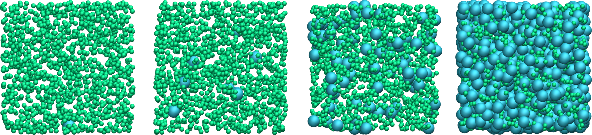

.. _bash-label:

Bash tutorial
*************

.. container:: hatnote

    Handle multiple simulations

.. container:: justify

    Bash scripts can help launch multiple simulations and interact with
    LAMMPS input script, which is useful to efficiently explore a parameter
    space.

.. include:: ../../non-tutorials/needhelp.rst

.. include:: ../../non-tutorials/2Aug2023.rst

Launch multiple simulations
===========================

.. container:: justify

    In this tutorial, a simple LAMMPS input script is launched 
    multiple times using a Bash script. At each iteration,
    the number of particles is increased.

.. container:: figurelegend

    Binary Lennard-Jones fluid with 1500 particles of type 1, and an increasing number of 
    particles of type 2, from 1 (left) to 729 (right).

.. container:: justify

    To follow this tutorial, |input_file|
    this simple LAMMPS input file from :ref:`lennard-jones-label`.

.. |input_file| raw:: html

   <a href="../../../../../lammpstutorials-inputs/bash/varying-number/input.lammps" target="_blank">download</a>

.. container:: justify

    The only changes that were made in this input, compared to :ref:`lennard-jones-label`,
    are the use of a variable *nb2* to control the number of particles of type 2:

..  code-block:: lammps

    create_atoms 1 random 1500 921342 simulation_box overlap 1 maxtry 500
    create_atoms 2 random ${nb2} 225469 simulation_box overlap 1 maxtry 500

.. container:: justify

    In addition, the *overlap* and *maxtry* keywords were added to ensure that the
    the desired number of atoms will always be created.

.. container:: justify

    Next to the downloaded *input.lammps*, create a new empty file called *launch.sh*,
    and copy the following lines into it. 

..  code-block:: bash

    #!/bin/bash
    set -e

    lmp="/path-to-lammps/lmp"

    for i in 1 9 81 729
    do
        ${lmp} -in input.lammps -var nb2 ${i}
        folder=nb${i}
        mkdir ${folder}
        cp dump.lammpstrj ${folder}
    done

.. container:: justify

    Replace */path-to-lammps/lmp* by the proper path to your LAMMPS
    executable. 

.. container:: justify

    The first line *#!/bin/bash* indicates that this is a Bash script,
    and *set -e* tells Bash to exit immediately in the case of an error.

.. container:: justify

    Within the for loop, the variable $i$
    takes on the values 1, 9, 81, and 729 successively.
    The command starting with "${lmp}" calls the LAMMPS input *input.lammps*,
    while also passing the value of *i* as a variable named *nb2*.

.. container:: justify

    Once the LAMMPS simulation is over, a folder named *nbi*, with i = 1, 9, 81, or 729
    is created and the resulting *lammpstrj* file is copied into it.

.. container:: justify

    Finally, execute the Bash script by typing the following command in a
    terminal:

..  code-block:: bash

    bash launch.sh

.. container:: justify

    Alternatively, make the Bash script executable first:

..  code-block:: bash

    chmod +x launch.sh
    ./launch.sh

