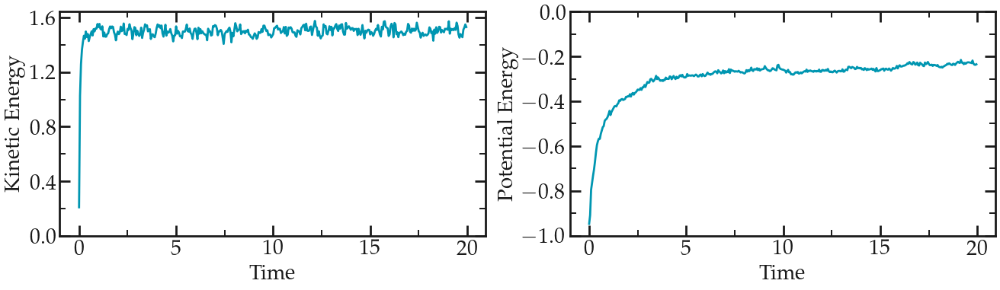
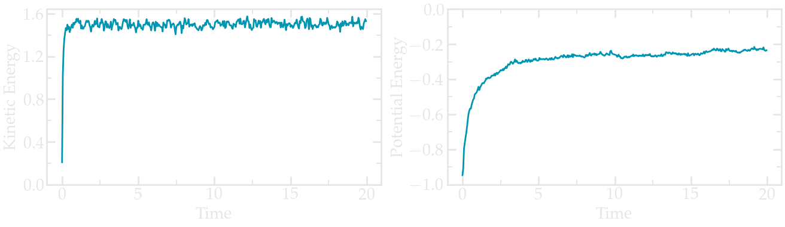
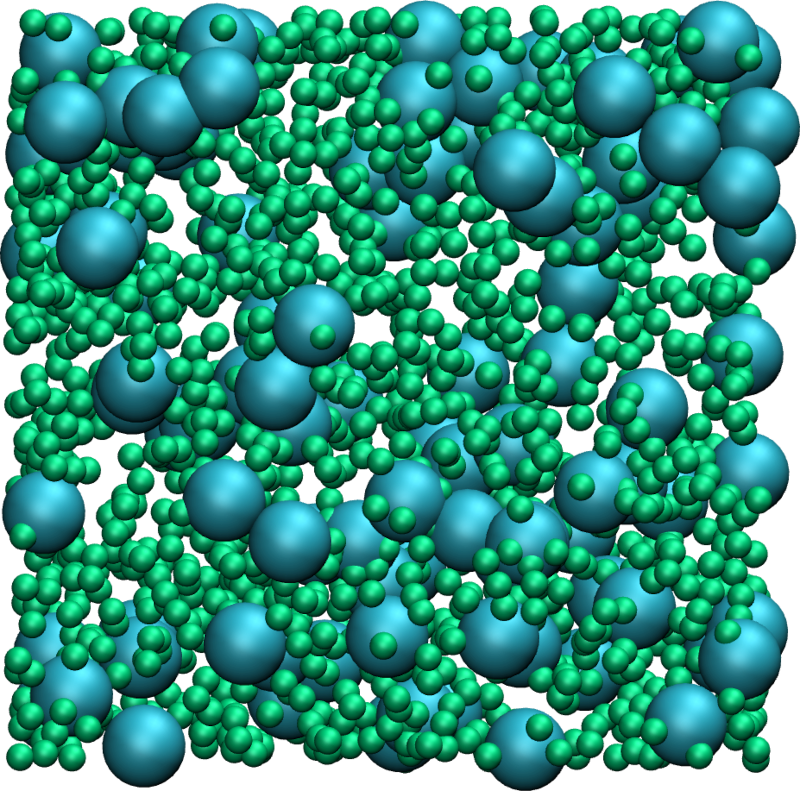
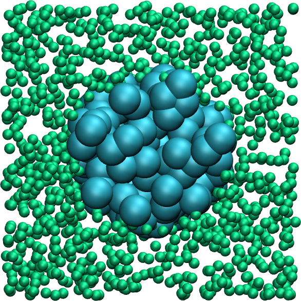
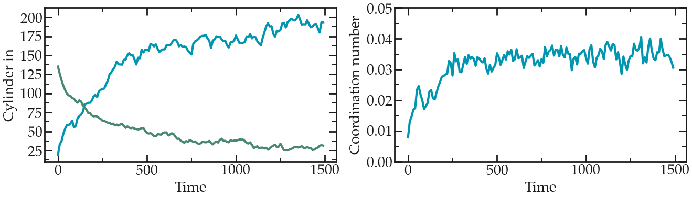
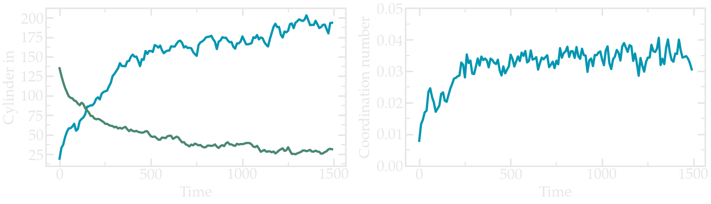

.. _lennard-jones-label:

Lennard Jones fluid
*******************

..  container:: justify

    This tutorial is part of the *Bulk fluids* series.

.. container:: hatnote

    The very basics of LAMMPS through a simple example:
    a Lennard-Jones binary fluid

.. figure:: ../figures/lennardjones/binary_LJ_fluid.webp
    :alt: video of a binary fluid
    :height: 250
    :align: right

..  container:: justify

    The objective of this tutorial is to use the
    LAMMPS to perform a simple molecular dynamics simulation
    of a binary fluid in the NVT ensemble (see the video on 
    the right). The system is a simple Lennard-Jones fluid
    made of neutral dots with a Langevin thermostating. The
    simulation box is cubic with periodic boundary conditions.

    This tutorial illustrates the use of several ingredients of
    molecular dynamics simulations, such as system initialization,
    energy minimisation, integration of the equations of motion,
    and trajectory visualisation.

    All inputs and data files can be found on the
    Github repository of LAMMPStutorials.

Required softwares
==================

..  container:: justify

    Download and install LAMMPS by following the instructions of the |LAMMPS website|.
    Alternatively, if you are using Ubuntu OS, you can simply execute the
    following command in a terminal:

..  code-block:: bash

   sudo apt-get install lammps
   
..  container:: justify

    You can verify that LAMMPS is indeed installed on your
    computer by typing in a terminal :

..  code-block:: bash

    lmp

..  container:: justify

    You should see the version of LAMMPS that has been
    installed. On my computer I see

..  code-block:: bash

    LAMMPS (29 Sep 2021 - Update 2)

..  container:: justify

    In addition to LAMMPS, you will also need |(1) a basic text editing software|
    such as Vim, Gedit, or Notepad++, |(2) a visualization software|, here I
    will use VMD (note: VMD is free but you have to register to
    the uiuc website in order to download it. If you don't want
    to, you can also use Ovito.), |(3) a plotting tool| like
    XmGrace or pyplot.

.. |LAMMPS website| raw:: html

   <a href="https://lammps.sandia.gov" target="_blank">LAMMPS website</a>

.. |(1) a basic text editing software| raw:: html

   <a href="https://help.gnome.org/users/gedit/stable/" target="_blank">(1) a basic text editing software</a>

.. |(2) a visualization software| raw:: html

   <a href="https://www.ks.uiuc.edu/Research/vmd/" target="_blank">(2) a visualization software</a>

.. |(3) a plotting tool| raw:: html

   <a href="https://plasma-gate.weizmann.ac.il/Grace/" target="_blank">(3) a plotting tool</a>

The input script
================

..  container:: justify

    In order to run a simulation using LAMMPS, one needs to
    write a series of commands in an input script. For clarity,
    the input will be divided into five categories which we are going to
    fill up one by one. Create a blank text file, call it
    'input1.lammps', and copy the following lines in it:

..  code-block:: bash
   :caption: *to be copied in input1.lammps*

    # PART A - ENERGY MINIMIZATION
    # 1) Initialization
    # 2) System definition
    # 3) Simulation settings
    # 4) Visualization
    # 5) Run

.. container:: justify

    *Remark -* These five categories are not required in every
    input script, and should not necessarily be in that
    exact order. For instance parts 3 and 4 could be inverted, or
    part 4 could be omitted, or there could be several
    consecutive runs.

    A line starting with a brace (#) is a comment
    that is ignored by LAMMPS. Use comments to structure 
    your inputs and make them readable by others.

    In the first section of the script, called 'Initialization',
    let us indicate to LAMMPS the type of simulation we are
    going to execute by specifying the most basic information,
    such as the conditions at the boundaries of the box (e.g
    periodic, non-periodic) or the type of atoms (e.g. uncharged
    single dots, spheres with angular velocities). Enter the
    following lines:

..  code-block:: bash
   :caption: *to be copied in input1.lammps*

    # 1) Initialization
    units lj
    dimension 3
    atom_style atomic
    pair_style lj/cut 2.5
    boundary p p p

..  container:: justify

    **Explanations:** The first line indicates that we want to
    use the system of unit called 'lj' for which all quantities
    are unitless. The second line indicates that the simulation
    is 3D, the third line that the atomic style
    will be used, therefore atoms are just a dot with a mass.
    The fourth line indicates that atoms are going to interact
    through a Lennard-Jones potential with a cut-off equal to
    2.5 (unitless), and the last line indicates that the
    periodic boundary conditions will be used along all three
    directions of space (the three 'p' stand for 'x', 'y', 'z',
    respectively).

    At this point, you have a LAMMPS script that does nothing.
    You can execute it to verify that there is no mistake by
    running the following command in the terminal:

..  code-block:: bash

    lmp -in input_01.lammps

..  container:: justify

    Which should return something like

..  code-block:: bash

    LAMMPS (29 Sep 2021 - Update 2)
    Total wall time: 0:00:00

..  container:: justify

    If there is a mistake in the input script, for example if
    'atom_stile' is written instead of 'atom_style', LAMMPS
    gives you a warning:

..  code-block:: bash

    LAMMPS (29 Sep 2021 - Update 2)
    ERROR: Unknown command: atom_stile  atomic (src/input.cpp:232)
    Last command: atom_stile    atomic

..  container:: justify

    Let us fill the second part the of the input script:

..  code-block:: bash
   :caption: *to be copied in input1.lammps*

    # 2) System definition
    region simulation_box block -20 20 -20 20 -20 20
    create_box 2 simulation_box
    create_atoms 1 random 1500 341341 simulation_box
    create_atoms 2 random 100 127569 simulation_box

..  container:: justify

    **Explanations:** The first line creates a region of space
    named *simulation_box* that is a block (a rectangular cuboid) and
    extends from -20 to 20 along all 3 directions of space, all expressed in
    non-dimensional units because we are using the lj system
    of units. The second line creates a simulation box based on
    the region *simulation_box* with '2' types of atoms. The third
    command specifies that 1500 atoms of type 1 must be created
    randomly in the region *simulation_box*. The integer *341341* is a
    seed that can be changed in order to create different
    initial conditions for the simulation. The fourth line
    creates 100 atoms of type 2.

    If you run LAMMPS, you should see the following in the
    terminal:

..  code-block:: bash

    LAMMPS (29 Sep 2021 - Update 2)
    Created orthogonal box = (-20.000000 -20.000000 -20.000000) to (20.000000 20.000000 20.000000)
    1 by 1 by 1 MPI processor grid
    Created 1500 atoms
    using lattice units in orthogonal box = (-20.000000 -20.000000 -20.000000) to (20.000000 20.000000 20.000000)
    create_atoms CPU = 0.001 seconds
    Created 100 atoms
    using lattice units in orthogonal box = (-20.000000 -20.000000 -20.000000) to (20.000000 20.000000 20.000000)
    create_atoms CPU = 0.000 seconds
    Total wall time: 0:00:00

..  container:: justify

    From what is printed in the terminal, it is clear that
    LAMMPS correctly interpreted the commands, and first created
    the box with desired dimensions, then 1500 atoms, then 100
    atoms.

    Let us fill the third section of the input script, the settings:

..  code-block:: bash
   :caption: *to be copied in input1.lammps*

    # 3) Simulation settings
    mass 1 1
    mass 2 1
    pair_coeff 1 1 1.0 1.0
    pair_coeff 2 2 0.5 3.0

..  container:: justify

    **Explanations:**\ The two first commands attribute a mass
    equal to 1 (unitless) to both atoms of type 1 and 2,
    respectively. The third line sets the Lennard-Jones
    coefficients for the interactions between atoms of type 1,
    respectively the depth of the potential well
    :math:`\epsilon` and the distance at which the
    particle-particle potential energy is zero :math:`\sigma`. 
    The last line sets the Lennard-Jones coefficients for
    the interactions between atoms of type 2.
   
.. container:: remark2

    **About cross parameters**

    By default, LAMMPS calculates the cross coefficients
    (here for the interactions between atoms of type 1 and 2)
    using geometric average: 
    :math:`\epsilon_{ij} = \sqrt{\epsilon_{ii} \epsilon_{jj}}`,
    :math:`\sigma_{ij} = \sqrt{\sigma_{ii} \sigma_{jj}}`. 
    Note that the arithmetic rule, where 
    :math:`\epsilon_{ij} = \sqrt{\epsilon_{ii} \epsilon_{jj}}`,
    :math:`\sigma_{ij} = (\sigma_{ii}+\sigma_{jj})/2`, 
    is more commonly used. However neither the geometric nor the
    arithmetic rule is based on rigorous argument, so here
    the geometric rule will do just fine. Cross parameters
    can also be explicitly specified using 'pair_coeff 1 2'.

..  container:: justify

    The input script is almost done, let us just fill the
    'Visualization' and 'Run' sections:

..  code-block:: bash
   :caption: *to be copied in input1.lammps*

    # 4) Visualization
    thermo 10

    # 5) Run
    minimize 1.0e-4 1.0e-6 1000 10000

..  container:: justify

    **Explanations:** The thermo command asks LAMMPS to print
    thermodynamic information (e.g. temperature, energy) in the
    terminal every 10 timesteps. The second line asks LAMMPS to
    perform an energy minimization of the system.

..  container:: justify

    **About energy minimization**
    An energy minimization procedure consists in adjusting
    the coordinates of the atoms until one of the stopping
    criteria is reached. Here there are four stopping
    criteria:

    #. The change in energy between two iterations is less than 1.0e-4,
    #. The maximum force between two atoms in the system is lower than 1.0e-6,
    #. The maximum number of iterations is 1000,
    #. The maximum number of times the force and the
        energy have been evaluated is 10000.

    Now running the simulation, we can see how the thermodynamics
    variables evolve with time:

..  code-block:: bash

    Step         Temp       E_pair        E_mol       TotEng         Press
       0            0     78840982            0     78840982       7884122 
      10            0    169.90532            0    169.90532     17.187291 
      20            0  -0.22335386            0  -0.22335386 -0.0034892297 
      30            0  -0.31178296            0  -0.31178296 -0.0027290466 
      40            0  -0.38135002            0  -0.38135002 -0.0016419218 
      50            0  -0.42686621            0  -0.42686621 -0.0015219081 
      60            0  -0.46153953            0  -0.46153953 -0.0010659992 
      70            0  -0.48581568            0  -0.48581568 -0.0014849169 
      80            0  -0.51799572            0  -0.51799572 -0.0012995545 

..  container:: justify

    **Explanations:** These lines give us information concerning
    the progress of the energy minimization. First, at the start
    of the simulation (step 0), the energy in the system is
    huge: 78840982 (unitless). This was expected because
    the atoms have been created at random positions within the
    simulation box, and some of them are probably overlapping,
    resulting in a large initial energy which is the consequence
    of the repulsive part of the Lennard-Jones interaction
    potential. As the energy minimization progresses, the energy
    rapidly decreases and reaches a negative and also more
    acceptable value, indicating that the atoms have been
    displaced at reasonable distances from one another. Other
    useful information have been printed in the terminal, for
    example, LAMMPS tells us that the first of the four criteria
    to be satisfied was the energy:

..  code-block:: bash

    Minimization stats:
    Stopping criterion = energy tolerance

..  container:: justify

    The system is ready, now let us start the second part of the
    input script, the molecular dynamics simulation. In the same
    script, after the minimization command, add the following
    lines:

..  code-block:: bash
   :caption: *to be copied in input1.lammps*

    # PART B - MOLECULAR DYNAMICS
    # 4) Visualization
    thermo 1000
    variable kinetic_energy equal ke
    variable potential_energy equal pe
    variable pressure equal press
    fix myat1 all ave/time 10 1 10 v_kinetic_energy v_potential_energy file energy.dat

    # 5) Run
    fix mynve all nve
    fix mylgv all langevin 1.0 1.0 0.1 1530917
    timestep 0.005
    run 10000

..  container:: justify

    **Some remarks:**
    Since LAMMPS reads the input from top to
    bottom, these lines will be executed after the energy
    minimization. There is no need to initialize the system
    (part 1), define it (part 2), or specify the settings
    again (part 3). The thermo command is called a second time,
    so the previously entered value of '10' will be replaced
    by the value of '1000' as soon as the second run starts.

..  container:: justify

    **Explanations:** Three variables have been defined in order
    to print the kinetic energy and the potential energy 
    of the system in the file named *energy.dat*. Then,
    in the run section, the fix *nve* is used to update the
    positions and the velocities of the atoms in the group
    *all* (this is the most important command here). The second
    fix applies a Langevin thermostat to the atoms of group
    *all*, with a desired temperature of 1 and a damping
    parameter of 0.1. The number *1530917* is a seed, you can
    change it to perform statistically independent simulations
    with the same system. Finally we choose the timestep
    and we ask LAMMPS to run for 10000 timesteps. After running
    the simulation, you should see the following information in
    the terminal:

..  code-block:: bash

    Step         Temp       E_pair        E_mol       TotEng        Press
     388            0  -0.95476642            0  -0.95476642 -0.000304834
    1000    0.9880227  -0.31773089            0    1.1633769  0.021818374 
    2000    1.0434396  -0.26534383            0    1.2988374   0.02287591 
    3000   0.97269039  -0.23946371            0      1.21866  0.022394592 
    4000    1.0192798  -0.23174747            0    1.2962167  0.024978385 
    5000    1.0319547  -0.23284134            0    1.3141233  0.024342347 
    6000   0.98137972  -0.22477315            0    1.2463764  0.022074749 
    7000    1.0144842  -0.23803792            0    1.2827372  0.023846178 
    8000    1.0102062  -0.23305477            0    1.2813075     0.023146 
    9000    1.0236358  -0.22539436            0    1.3090996  0.024357378 
   10000   0.98915906  -0.22159572            0    1.2612155   0.02397044 
   10388   0.99354192  -0.22377029            0    1.2656111  0.022751609 

..  container:: justify

    The second column shows that the temperature
    starts from 0, but rapidly reaches the
    expected value near :math:`T=1`, as requested. 
    Note that  In the terminal, you may also see

..  code-block:: bash

    Total (number) of neighbors = 8560
    Ave neighs/atom = 5.35
    Neighbor list builds = 999
    Dangerous builds = 998
    Total wall time: 0:00:02

..  container:: justify

    Note : If you see 'Dangerous builds = 0', as could be
    the case with some LAMMPS versions, you can ignore
    the next part.

    During the simulation, they have been 998 dangerous builds.
    This is an indication that something is wrong: some atoms
    have moved more than expected in between two calculations of
    the neighbor lists. Let us add the following command in the
    'Simulation settings' section:

..  code-block:: bash
    :caption: *to be copied in input1.lammps*

    neigh_modify every 1 delay 5 check yes

..  container:: justify

    With this command, LAMMPS will rebuild the neighbour lists
    more often. Re-run the simulation, and you should see a more
    positive outcome with 0 dangerous build:

..  code-block:: bash

    Total (number) of neighbors = 2024
    Ave neighs/atom = 1.2650000
    Neighbor list builds = 1253
    Dangerous builds = 0
    Total wall time: 0:00:02

..  container:: justify

    From what has been printed in the energy.dat file, let us
    plot the potential energy and the pressure of
    the system over time:

    Both quantities rapidly evolve at the beginning of the simulation, before reaching
    an equilibrium value.

Trajectory visualisation
========================

..  container:: justify

    The simulation is running well, but we would like to
    visualize the trajectories of the atoms. To do so, we need
    to dump the positions of the atoms in a file at a regular
    interval. Add the following command in the 'visualization'
    section of PART 2:

..  code-block:: bash

    dump mydmp all atom 1000 dump.lammpstrj

..  container:: justify

    Run LAMMPS again. A file named dump.lammpstrj must appear in
    the same folder as your input. This file can be opened using
    VMD or Ovito. In Ubuntu, if VMD is installed, you can simply
    execute in the terminal:

..  code-block:: bash

    vmd dump.lammpstrj

..  container:: justify

    Otherwise, you can open VMD and import the dump.lammpstrj
    file manually using file -> molecule. You should see a cloud
    of lines, but you can improve the representation and make it
    look like the figure on the right, or the video at the 
    top of this page. 

Improving the script
====================

..  container:: justify

    Let us improve the input script and perform slightly more
    advanced operations.

    Let us create the atoms of type 1 and 2 in two separate
    regions, respectively. Create a new input script, and call
    it input2.lammps. Similarly to what has been done
    in the previous part, copy the following lines
    into the input script:

..  code-block:: bash
    :caption: *to be copied in input2.lammps*

    # 1) Initialization
    units lj
    dimension 3
    atom_style atomic
    pair_style lj/cut 2.5
    boundary p p p

..  container:: justify

    Let us create a box from a predefined region,
    and create two additional regions and generate
    atoms of type 1 and 2 in each region respectively.

..  code-block:: bash
    :caption: *to be copied in input2.lammps*

    # 2) System definition
    region simulation_box block -20 20 -20 20 -20 20
    create_box 2 simulation_box
    region mycylin cylinder z 0 0 10 INF INF side in
    region mycylou cylinder z 0 0 10 INF INF side out
    create_atoms 1 random 1000 341341 mycylou
    create_atoms 2 random 150 127569 mycylin

..  container:: justify

    **Explanations:** The *side in* and *side out* keywords
    allow us to define regions that are respectively inside the
    cylinder, and everything that is not inside the cylinder.

    We can write the remaining of the input script as follow:

..  code-block:: bash
    :caption: *to be copied in input2.lammps*

    # 3) Simulation settings
    mass 1 1
    mass 2 1
    pair_coeff 1 1 1.0 1.0
    pair_coeff 2 2 0.5 3.0
    neigh_modify every 1 delay 5 check yes

    # 4) Visualization
    thermo 10
    dump mydmp all atom 10 dump.min.lammpstrj

    # 5) Run
    minimize 1.0e-4 1.0e-6 1000 10000
    write_data minimized_coordinate.data

..  container:: justify

    **Explanations:** The novelty with respect to the previous
    input script is the command 'write_data'. This command
    asks LAMMPS to print the final state of the simulation in
    a file named 'minimized_coordinate.data'. This file will
    be used later to restart the simulation from the final
    state of the energy minimisation step.

    Run LAMMPS using the input2.lammps script. If everything
    goes well, a dump file named dump.min.lammpstrj will
    appear in the folder, allowing you to visualize the atoms
    trajectories during minimization. In
    addition, a file named minimized_coordinate.data will be
    created. If you open this file, you will see that it
    contains all the information necessary to restart the
    simulation, such as the number of atoms and the size of
    the box:

..  code-block:: bash

    1150 atoms
    2 atom types

    -20 20 xlo xhi
    -20 20 ylo yhi
    -20 20 zlo zhi

..  container:: justify

    The minimized_coordinate.data file also contains the final
    positions and velocities of all the atoms:

..  code-block:: bash

    Atoms # atomic

    345 1 -2.8836527978635523e+01 -2.9323791349242530e+01 0.0000000000000000e+00 0 0 0
    979 1 -2.9382597284003467e+01 -2.8335352105920894e+01 0.0000000000000000e+00 0 0 0
    435 1 -2.5412729704650008e+01 -2.9697644643809667e+01 0.0000000000000000e+00 0 0 0
    533 1 -2.5033422381244598e+01 -2.8519424750144708e+01 0.0000000000000000e+00 0 0 0
    347 1 -2.4330866813628781e+01 -2.9373591404712414e+01 0.0000000000000000e+00 0 0 0
    448 1 -2.3610197298718113e+01 -2.8518785172533800e+01 0.0000000000000000e+00 0 0 0
    (...)

..  container:: justify

    **Explanations:** The columns of the Atoms section
    correspond (from left to right) to the atom indexes (from 1
    to the total number of atoms, 1150), the atom types (1 or 2
    here), the atoms positions :math:`x`, :math:`y`, :math:`z` and the
    atoms velocities :math:`v_x`, :math:`v_y`, :math:`v_z`.

Restarting from a saved configuration
=====================================

..  container:: justify

    We are going to create a new input file and start a
    molecular dynamics simulation directly from the previously
    saved configuration. In the same folder, create a new file
    named input3.lammps and copy the same lines as previously:

..  code-block:: bash
    :caption: *to be copied in input3.lammps*

    # 1) Initialization
    units lj
    dimension 3
    atom_style atomic
    pair_style lj/cut 2.5
    boundary p p p

..  container:: justify

    Now, instead of creating a new region and adding atoms, we
    simply add the following command:

..  code-block:: bash
   :caption: *to be copied in input3.lammps*

    # 2) System definition
    read_data minimized_coordinate.data

..  container:: justify

    By visualizing the previously generated dump.min.lammpstrj
    file, you may have noticed that some atoms have moved from
    one region to the other during minimisation, as seen in
    `this video <https://www.youtube.com/embed/gfJ_n33-F6A>`__.
    In order to start the simulation from a clean state, with
    only atoms of type 2 within the cylinder and atoms of type
    1 outside the cylinder, let us delete the misplaced atoms
    by adding the following commands:

..  code-block:: bash
   :caption: *to be copied in input3.lammps*

    region mycylin cylinder z 0 0 10 INF INF side in
    region mycylou cylinder z 0 0 10 INF INF side out
    group mytype1 type 1
    group mytype2 type 2
    group incyl region mycylin
    group oucyl region mycylou
    group type1in intersect mytype1 incyl
    group type2ou intersect mytype2 oucyl
    delete_atoms group type1in
    delete_atoms group type2ou

..  container:: justify

    **Explanations:** These commands will respectively recreate
    the previously defined regions (regions are not saved by the
    write_data command), create groups, and finally delete the
    atoms of type 1 that are located within the cylinder, as
    well as the atoms of type 2 that are located outside the
    cylinder. If you run LAMMPS, you can see in the terminal how
    many atoms are in each group, and how many atoms have been
    deleted:

..  code-block:: bash

    1000 atoms in group mytype1
    150 atoms in group mytype2
    149 atoms in group incyl
    1001 atoms in group oucyl
    0 atoms in group type1in
    1 atoms in group type2ou
    Deleted 0 atoms, new total = 1150
    Deleted 1 atoms, new total = 1149

..  container:: justify

    Similarly to previously, add the following simulation
    settings:

..  code-block:: bash
   :caption: *to be copied in input3.lammps*

    # 3) Simulation settings
    mass 1 1
    mass 2 1
    pair_coeff 1 1 1.0 1.0
    pair_coeff 2 2 0.5 3.0
    neigh_modify every 1 delay 5 check yes
    group type1 type 1
    group type2 type 2

    # 4) Visualization
    thermo 1000
    dump mydmp all atom 1000 dump.run.lammpstrj

..  container:: justify

    Note that 2 atom groups have been defined, they are useful
    here to extract the coordination number between atoms of
    type 1 and 2. Let us extract this coordination number, as
    well as the number of atoms of each type in each region, by
    adding the following commands to the input file:

..  code-block:: bash
   :caption: *to be copied in input3.lammps*

    variable Ntype1in equal count(mytype1,mycylin)
    variable Ntype1ou equal count(mytype1,mycylou)
    variable Ntype2in equal count(mytype2,mycylin)
    variable Ntype2ou equal count(mytype2,mycylou)
    fix myat1 all ave/time 10 200 2000 v_Ntype1in v_Ntype1ou file population1vstime.dat
    fix myat2 all ave/time 10 200 2000 v_Ntype2in v_Ntype2ou file population2vstime.dat
    compute coor12 type1 coord/atom cutoff 2.0 group type2
    compute sumcoor12 all reduce ave c_coor12
    fix myat3 all ave/time 10 200 2000 c_sumcoor12 file coordinationnumber12.dat

..  container:: justify

    **Explanations:** As seen previously, the fixes ave/times
    allow to evaluate previously defined variables and print
    the values (here every 10000 steps, averaged 10 times)
    into data file. The variables Ntype:math:`*` are used to count
    the number of atoms of a specific group in a specific
    region. The compute ave is used to average the per atom
    coordination number resulting of the coord/atom compute.
    Finally, let us complete the script by adding the run
    section:

..  code-block:: bash
   :caption: *to be copied in input3.lammps*

    # 5) Run
    velocity all create 1.0 4928459 mom yes rot yes dist gaussian
    fix mynve all nve
    fix mylgv all langevin 1.0 1.0 0.1 1530917 zero yes
    timestep 0.005
    run 300000
    write_data mixed.data

..  container:: justify

    **Explanations:** There are a few differences with the
    previous input script. First, the 'velocity create'
    command attributes an initial velocity to all the atoms.
    The initial velocity is chosen so that the initial
    temperature is equal to 1 (unitless). The additional
    keywords ensure that no linear momentum and no angular
    momentum are given to the system, and that the generated
    velocities are distributed as a Gaussian. Another novelty
    is the 'zero yes' keyword in the Langevin thermostat, that
    ensures that the total random force is equal to zero.
    After running the simulation, you can observe the number
    of atoms in each region from the generated data files, as
    well as the evolution of the coordination number due to
    mixing:

    Evolution of the poputation with time, as well as evolution of the coordination number. 

Going further with exercises
============================

.. include:: ../../contact/requestsolution.rst

..  container:: justify

    **Preamble : on the importance of energy minimisation**
    A good way to master LAMMPS and molecular dynamics
    simulations is to play around with a script that is already
    working and observe the differences and/or errors occurring.
    For example, with the input file input_01.lammps, we can
    explore what happens if we don't perform a minimisation step
    and start the molecular dynamics directly. To do so, comment
    the two following lines:

..  code-block:: bash

    # thermo 10
    # minimize  1.0e-4 1.0e-6 1000 10000

..  container:: justify

    If you run LAMMPS again, you should get something like:

..  code-block:: bash

    Step Temp E_pair E_mol TotEng Press
    0 5.8997404e+14 0 5.8997404e+14 1.5732641e+15
    ERROR: Lost atoms: original 1600 current 272 (src/thermo.cpp:438)
    Last command: run 10000

..  container:: justify

    **Explanations:** The message indicates that LAMMPS lost
    some of the atoms, then stopped. This is one of the most
    common error message that you will see. It is usually the
    consequence of badly constructed system or inappropriate
    dynamics. In the present case, atoms are too close to each
    others initially, so the forces are huge, leading to
    enormous acceleration. As a consequence, atoms are moving by
    large distances during the firsts timesteps, and LAMMPS
    loses them.

..  container:: justify

    **Exercise 1 : perform a minimization using fix langevin only**
    Perform an energy minimization without using the minimize
    command (this is sometimes usefull, particularly for rigid
    water models using shake for whiches the minimize command
    cant be used).

    *Hint --* adjust both the value of the timestep and the
    damping factor of the fix langevin

    *Hint --* perform several consecutive runs (the very
    first run with small timestep, the last one with normal
    timestep)

    *Hint --* have a look at fix nve/limit, this command is
    made explicitely to prevent an unequilibrated system for
    exploding

    **Exercise 2 : perform an actual NVE simulation**
    Despite using the NVE fix, simulations here are not
    performed in the NVE ensemble (because of the use of the
    thermostat). Starting from the system of the Exercise 2a,
    perform a simulation in the NVE ensemble and extract the
    energy over time. Is it conserved as expected? What if you
    do the same with a 2D simulation?

    *Hint --* a smaller value for the timestep gives better
    energy conservation

    **Exercise 3 : induce a net flow**

    So far, atoms were freely diffusing. Add an external
    acceleration to induce a net flow of atoms in aone
    direction. The value for the acceleration must be chosen so
    that the system is not *too* out-of-equilibrium.
