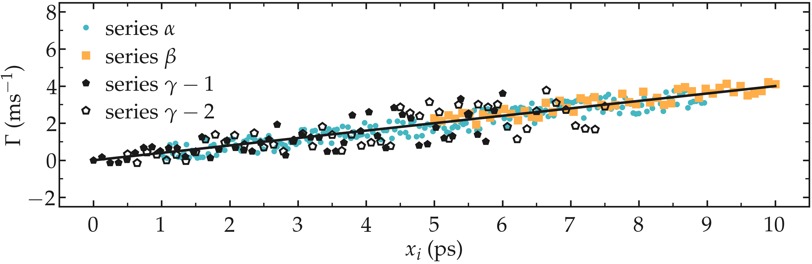
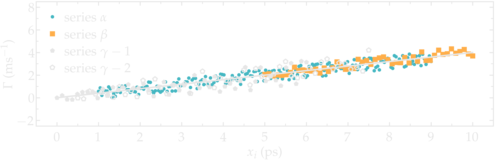

# Matplotlib Pyplot functions

Personal functions for making [Pyplot](https://matplotlib.org/3.5.3/api/_as_gen/matplotlib.pyplot.html) figures compatible with Latex documents. These functions are also
in use on [LAMMPS tutorials](https://lammpstutorials.github.io) and 
[NMRforMD](https://nmrformd.readthedocs.io).

## Example

The best of the two images depends on dark-mode / light mode you are using.

For light mode:

For dark mode:

