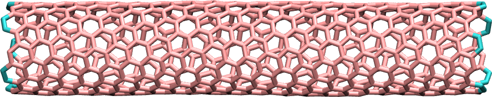
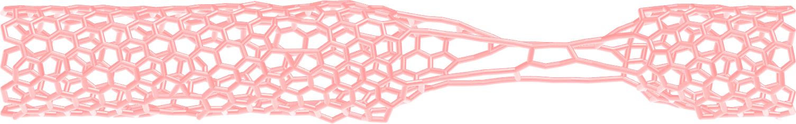
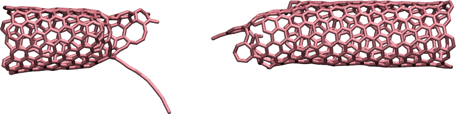
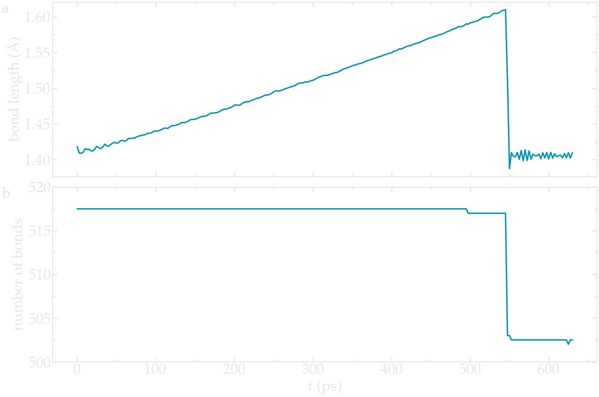
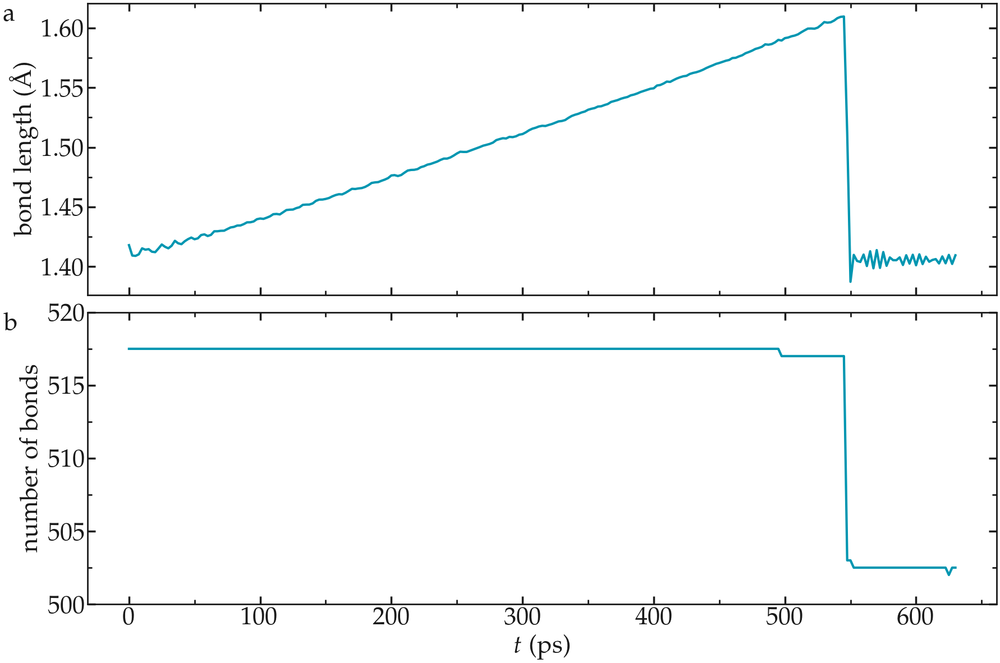
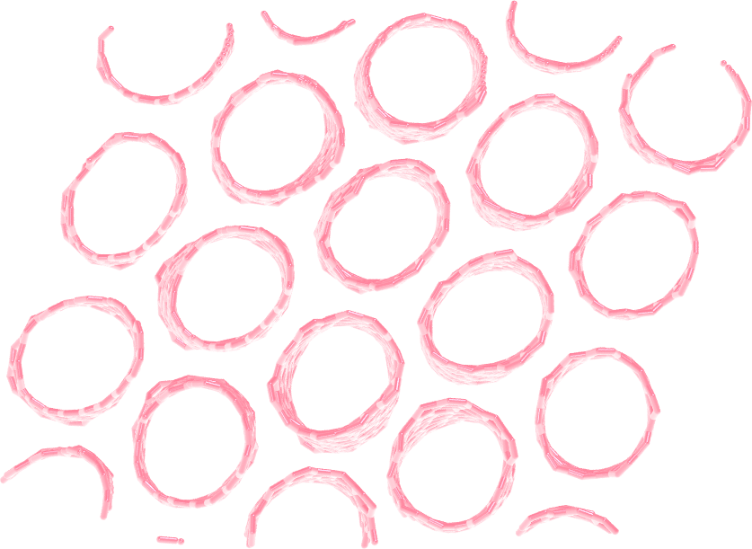

.. _`carbon-nanotube-label`:

Breaking a carbon nanotube
***************************

.. container:: hatnote

    Breaking the bonds of a carbon nanotube under deformation

.. figure:: ../figures/level1/breaking-a-carbon-nanotube/CNT_gif_dark.webp
    :alt: carbon nanotube image in vacuum
    :height: 250
    :align: right
    :class: only-dark

.. figure:: ../figures/level1/breaking-a-carbon-nanotube/CNT_gif_light.webp
    :alt: carbon nanotube image in vacuum
    :height: 250
    :align: right
    :class: only-light
   
.. container:: justify
   
    In this tutorial, two force fields, a classic one and a reactive one (airebo) 
    are used to simulate the deformation of a carbon nanotube (CNT). With the reactive 
    force field, the breaking of the C-C bonds during the plastic deformation of the CNT is 
    simulated.

.. include:: ../../contact/recommand-lj.rst

.. include:: ../../contact/needhelp.rst

Unbreakable bonds
=================

System creation
---------------

.. container:: justify

    The initial configuration (atoms positions, bonds, angles,
    etc.) is generated using |VMD_uiuc|. Open VMD,
    and go to Extensions, Modeling, Nanotube Builder. A window
    named Carbon Nanostructures opens up, allowing us to choose
    between generating sheet or nanotube of graphene or BN. For
    this tutorial, let us generate a carbon nanotube.
    Keep all default values, and click on "Generate
    Nanotube". You should something like the image on the top right 
    of this page.

    At this point, this is not a molecular dynamics simulation,
    but a cloud of unconnected dots. In the VMD terminal, set the
    box dimensions by typing the following commands in the VMD terminal:

.. code-block:: bw
    :caption: *to be written in the VMD terminal*

    molinfo top set a 80  
    molinfo top set b 80            
    molinfo top set c 80 

.. container:: justify

    The values of 80 in each direction have been chosen
    so that the box is much larger than the carbon nanotube.

    In order to generate the initial LAMMPS data file, let us use Topotool:
    to generate the LAMMPS data file, enter the following command:

.. code-block:: bw
    :caption: *to be written in the VMD terminal*

    topo writelammpsdata cnt_molecular.data molecular

.. container:: justify

    Here molecular refers to the LAMMPS atom_style, and cnt_molecular.data
    to the name of the file. 

.. admonition:: About TopoTools
    :class: dropdown

    Note that I am using TopoTools v1.7. Older or newer versions 
    may require slightly different commands. 

    More details about these commands can be found on the
    personal page of |Axel_webpage|.
    In short, Topotools deduces the location of bonds, angles,
    dihedrals, and impropers from the positions of the atoms,
    and generates a file that can be read by LAMMPS.

.. |Axel_webpage| raw:: html

   <a href="https://sites.google.com/site/akohlmey/software/topotools" target="_blank">Axel Kohlmeyer</a>

.. container:: justify

    The parameters of the constraints (bond length,
    dihedral coefficients, etc.) will be given later.

    A new file named "cnt_molecular.data" has been created, it starts
    like that:

.. code-block:: lammps

    LAMMPS data file. CGCMM style. atom_style molecular generated by VMD/TopoTools v1.7 on Fri Aug 04 11:29:35 CEST 2023
    700 atoms
    1035 bonds
    2040 angles
    4030 dihedrals
    670 impropers
    1 atom types
    1 bond types
    1 angle types
    1 dihedral types
    1 improper types
    -40.000000 40.000000  xlo xhi
    -40.000000 40.000000  ylo yhi
    -12.130411 67.869589  zlo zhi
    
    (...)

.. container:: justify

    The cnt_molecular.data file contains information
    about the positions of the carbons atoms, as well as the
    identity of the atoms that are linked by bonds, angles, dihedrals,
    and impropers constraints.

    Save the "cnt_molecular.data" file in the same folder as your
    future LAMMPS input script.

    We are done with the system
    generation, we can start the molecular dynamics simulations.

    Alternatively, you can download the file I did generate 
    by clicking  |download_cnt_molecular_data|, and continue with the tutorial.

.. |download_cnt_molecular_data| raw:: html

   <a href="../../../../../inputs/level1/breaking-a-carbon-nanotube/unbreakable-bonds/cnt_molecular.data" target="_blank">here</a>

.. |VMD_uiuc| raw:: html

   <a href="https://www.ks.uiuc.edu/Research/vmd/" target="_blank">VMD</a>

Generic options
---------------

.. container:: justify

   Create a new text file and name it "input.lammps". Copy the
   following lines in it:

.. code-block:: lammps
   :caption: *to be copied in input.lammps*

   # Initialisation

   variable T equal 300

   units real
   atom_style molecular
   boundary f f f
   pair_style lj/cut 14

   bond_style harmonic
   angle_style harmonic
   dihedral_style opls
   improper_style harmonic

   special_bonds lj 0.0 0.0 0.5

   read_data cnt_molecular.data

.. container:: justify

    The chosen unit system is real (distances are in Angstrom, time in femtosecond),
    atom style is molecular (atoms are dots that can be bonded with each other),
    and the boundary conditions are fixed. The boundary conditions
    do not matter much here, as the box boundaries are far from the graphene sheet. 

    Here the pair style is lj/cut (i.e. a Lennard Jones potential 
    with a short range cutoff) with
    parameter 14, which means that the atoms closer than 14
    Angstroms from each others interact through a Lennard-Jones
    potential. Notice that there is no Coulombic interaction
    because there are no partial charges.

    The bond, angle, dihedral, and improper styles specify the
    different potentials used to restrain the positions of the
    atoms. For more details, have a look at the LAMMPS website
    (see for example the page of the |OPLS|).

.. |OPLS| raw:: html

    <a href="https://lammps.sandia.gov/doc/dihedral_opls.html" target="_blank">OPLS dihedral style</a>

.. container:: justify

    The last command (read_data) imports the carbon.data file
    previously generated with VMD, which contains the
    information about the box size, atoms positions, etc.

.. admonition:: About interaction between neighbors atoms
    :class: info
        
    Atoms connected by a bond do not typically interact through
    Lennard-Jones interaction. This is ensured here by the
    special_bonds command. The three numbers of the
    special_bonds command are weighting factors for the
    Lennard-Jones interaction between atoms connected by bond
    (respectively directly bounded C-C, separated by two bonds C-C-C,
    and separated by three bonds C-C-C-C). For instance, the
    first weighting factor, with a
    value of 0, imposes that two atoms connected by a bond do
    not interact through a Lennard-Jones potential (therefore
    they only interact through the harmonic potential that bond the atoms
    of the graphene).

Parameters
----------

.. container:: justify

    We need to specify the parameters of both bonded and
    non-bonded functions. Create a new text file in the same
    folder and name it "parm.lammps". Copy the following lines
    in it:

.. code-block:: lammps
    :caption: *to be copied in parm.lammps*

    pair_coeff 1 1 0.066047 3.4
    bond_coeff 1 469 1.4
    angle_coeff 1 63 120
    dihedral_coeff 1 0 7.25 0 0
    improper_coeff 1 5 180

.. container:: justify

    The pair_coeff command sets the Lennard-jones parameters
    :math:`\epsilon` and :math:`\sigma` for the only type of
    atom of the simulation: carbon atom of type 1. The
    bond_coeff provides the equilibrium distance :math:`r_0` as
    well as the spring constant :math:`K` for the harmonic
    potential imposed between two neighboring carbon atoms,
    where the potential is :math:`E = K_r ( r - r_0)^2`. The
    angle_coeff gives the equilibrium angle \\(\\theta_0\\) and
    constant for the potential between three neighbors atoms :
    :math:`E = K_\theta ( \theta - \theta_0)^2`. The dihedral_coeff
    and improper_coeff give the potential for the constraints
    between 4 atoms. The file PARM.lammps need to be included in the
    simulation by adding the following line to input.lammps:

.. code-block:: lammps
    :caption: *to be copied in input.lammps*

    include parm.lammps

Prepare initial state
---------------------

.. container:: justify

    Depending on VMD and topotool version, the CNT may or may not be centered in 
    the box. Let us make sure that we start from a clean initial state by
    recentering the CNT at the origin (0, 0, 0). In addition, the box boundaries 
    are not symmetric with respect to (0, 0, 0):

.. code-block:: lammps
    :caption: *what I see in cnt_molecular.data*

    -40.000000 40.000000  xlo xhi
    -40.000000 40.000000  ylo yhi
    -12.130411 67.869589  zlo zhi
    
.. container:: justify

    Let us recenter the CNT:

.. code-block:: lammps
    :caption: *to be copied in input.lammps*

    group carbon_atoms type 1
    variable carbon_xcm equal -1*xcm(carbon_atoms,x)
    variable carbon_ycm equal -1*xcm(carbon_atoms,y)
    variable carbon_zcm equal -1*xcm(carbon_atoms,z)
    displace_atoms carbon_atoms move ${carbon_xcm} ${carbon_ycm} ${carbon_zcm}

.. container:: justify

    The first command includes all of the atoms of type one
    (i.e. all the atoms here) in a group named 'carbon_atoms'. 
    The 3 variables measure the current position of the group carbon_atoms
    along all 3 directions, respectively. Then, the displace atoms 
    command move the group carbon_atoms, ensuring that its center of mass 
    is located at the origin (0, 0, 0).

    Let us also change the box boundaries:

.. code-block:: lammps
    :caption: *to be copied in input.lammps*

    change_box all x final -40 40 y final -40 40 z final -40 40

.. admonition:: Note
    :class: info

    Such cleaner and more symmetrical initial state can simplify
    future data analysis.

.. container:: justify

    In order to impose a force to the edges of the CNT, let us isolate the
    atoms from the two edges of the CNT and place them into different groups.
    Later, the displacement will be applied to the atoms of the edges.
    Add the following lines to the input script :

.. code-block:: lammps
    :caption: *to be copied in input.lammps*

    variable zmax equal bound(carbon_atoms,zmax)-0.5
    variable zmin equal bound(carbon_atoms,zmin)+0.5
    region rtop block INF INF INF INF ${zmax} INF
    region rbot block INF INF INF INF INF ${zmin}
    region rmid block INF INF INF INF ${zmin} ${zmax}

.. container:: justify
   
    The variable :math:`z_\mathrm{max}` corresponds to
    the coordinate of the last atoms along \\(z\\) minus 0.5
    Angstroms, and :math:`z_\mathrm{min}` to the coordinate of
    the first atoms along :math:`z` plus 0.5 Angstroms. Then, 3
    regions are defined, and correspond respectively to: :math:`z < z_\mathrm{min}`, (bottom)
    :math:`z_\mathrm{min} > z > z_\mathrm{max}` (middle), and  
    :math:`z > z_\mathrm{max}` (top).

    Finally, let us define 3 groups of atoms
    corresponding to the atoms located in each of the 3 regions,
    respectively:

.. code-block:: lammps
    :caption: *to be copied in input.lammps*

    group carbon_top region rtop
    group carbon_bot region rbot
    group carbon_mid region rmid

.. container:: justify

    The atoms of the edges as selected within the carbon_top and carbon_bot groups 
    are represented with a different color:

.. figure:: ../figures/level1/breaking-a-carbon-nanotube/dark_colored_edges.png
    :alt: CNT in graphene in vacuum image VMD with selected groups at the edges
    :class: only-dark

.. admonition:: Tip
    :class: info

    .. container:: justify

        When running a simulation, the number of atoms in each
        group is printed in the terminal (and in the log.lammps
        file). Always make sure that the number of atoms in each group 
        is reasonable, just like here:

    .. code-block:: bash

        10 atoms in group carbon_top
        10 atoms in group carbon_bot
        680 atoms in group carbon_mid

Thermalisation and dynamics
---------------------------

.. container:: justify

   Let us specify the thermalisation and the dynamics of the
   system. Add the following lines to input.lammps:

.. code-block:: lammps
    :caption: *to be copied in input.lammps*

    velocity carbon_mid create ${T} 48455 mom yes rot yes
    fix mynve all nve
    compute Tmid carbon_mid temp
    fix myber carbon_mid temp/berendsen ${T} ${T} 100
    fix_modify myber temp Tmid

.. container:: justify

    The "velocity_create" command gives initial velocities to
    the atoms of the middle group carbon_mid, ensuring an initial temperature
    of 300 K for these atoms with no overall translational momentum (mom yes)
    nor rotational momentum (rot yes).

    The fix "nve" is applied to all atoms so that all atom positions are recalculated
    every timestep. 
    
    A Berendsen thermostat is applied to the atoms
    of the group carbon_mid only. The "fix_modify myber" ensures that the
    fix Berendsen uses the temperature of the group carbon_mid as an
    input, instead of the temperature of whole system. This is necessary
    to make sure that the frozen edges won't bias the temperature. Note that the atoms
    of the edges do not need a thermostat because their motion will
    be restrained, see below.

.. admonition:: Deal with semi-frozen system
    :class: info

    Always be careful when part of a system is frozen. In that 
    case, the total temperature of the system is effectively lower
    than the applied temperature because the frozen atoms 
    have no thermal motion. If you have any doubt about the procedure
    you are using, simply check the temperature of the non-frozen group, for
    example using the fix ave/time:

    .. code-block:: lammps
        :caption: *to be copied in input.lammps*

        fix at1 all ave/time 10 100 1000 c_Tmid file temperature_middle_group.dat

Deal with frozen edges
----------------------

.. container:: justify

   To restrain the motion of the atoms at the edges, let us add the
   following commands:

.. code-block:: lammps
   :caption: *to be copied in input.lammps*

    fix mysf1 carbon_top setforce 0 0 0
    fix mysf2 carbon_bot setforce 0 0 0
    velocity carbon_top set 0 0 0
    velocity carbon_bot set 0 0 0

.. container:: justify

   The two "setforce" commands cancel the forces applied on the
   atoms of the two edges, respectively. A fix setforce applies at every step of the
   simulation, and are here applying along all 3 directions: :math:`x`, :math:`y`
   and :math:`z`. The two velocity commands set the initial velocities along :math:`x`,
   :math:`y`, and :math:`z` to 0 for the atoms of the edges. 
   
   As a consequence of these last four commands, the atoms of the edges will remain
   immobile during the simulation (or at least they would if no other command was
   applied to them).

.. admonition:: On imposing a constant velocity to a system
    :class: info

    The 'velocity set' commands impose the velocity of a group of atoms *when it is 
    read*, but do not enforce the velocity during the entire simulation. 

    When 'velocity set' is used in combination with 'setforce 0 0 0', the atoms
    wont feel any force during the entire simulation. According to the Newton equation,
    no force means no acceleration, meaning that the initial velocity will persist.

Data extraction
---------------

.. container:: justify

    Next, in order to measure the strain and stress suffered by the
    CNT, let us extract the distance :math:`L` between
    the two edges as well as the force applied on the edges. Let
    us also add a command to print the atom coordinates in a
    lammpstrj file every 1000 steps:

.. code-block:: lammps
    :caption: *to be copied in input.lammps*

    variable L equal xcm(carbon_top,z)-xcm(carbon_bot,z)
    fix at2 all ave/time 10 100 1000 v_L file length.dat
    fix at3 all ave/time 10 100 1000 f_mysf1[3] f_mysf2[3] file force.dat
    dump mydmp all atom 1000 dump.lammpstrj

.. admonition:: About `f_`, `v_`, and `c_`
    :class: info

    Notice that the values of the force on each edge are
    extracted from the fixes setforce 'mysf1' and 'mysf2', simply by
    calling them using `f_`, the same way variables are called
    using `v_` and computes are called using `c_`. A fix
    setforce cancels all the forces on a group of atoms at every
    step, but allows one to extract the values of the force
    before its cancellation.

Molecular dynamics run
----------------------

.. container:: justify

    Let us run a small equilibration step to bring the system 
    to the required temperature without applying any deformation:

.. code-block:: lammps
    :caption: *to be copied in input.lammps*

    thermo 100
    thermo_modify temp Tmid

    timestep 1.0
    run 5000

.. container:: justify

    With the 'thermo_modify' command, we specify to LAMMPS that we
    want the temperature :math:`T_\mathrm{mid}` to be printed in
    the terminal, not the temperature of the entire system
    (because of the frozen edges, the temperature of the entire
    system is not relevant). 
    
Option A: Incremental deformation
---------------------------------
    
.. container:: justify

    The first possibility to deform the CNT is to 
    use the loop function of LAMMPS. 

    Let us perform a loop:

.. code-block:: lammps
    :caption: *to be copied in input.lammps*

    variable var loop 50
        label loop
        displace_atoms carbon_top move 0 0 0.1
        displace_atoms carbon_bot move 0 0 -0.1
        run 1000
        next var
        jump input.lammps loop

.. container:: justify
    
    At each step of the loop, the edges are slightly displaced, and
    the simulation runs for 1000. Then the variable 'var' is iterated
    by the 'next var', and the simulation 'jumps' back to the beginning of 
    the loop. It will be repeated 50 times, for a total elongation
    equal to 2 x 0.1 x 50 = 10 Angstroms. Increase the number of iteration 
    for larger deformation.

    You should observe the CNT being progressively elongated
    and being deformed.

    With the present force field, no matter how large is the
    imposed deformation, the bonds will never break. To study
    such bond breaking, one has to use a reactive force
    field, which is done in some other tutorials here (like :ref:`carbon-nanotube-label`).

Option B: Constant-velocity
---------------------------

.. container:: justify

    To ensure a smooth step-less deformation of the sheet,
    let us impose a constant velocity deformaiton by combining
    the "velocity set" command with the "fix setforce". 

    To obtain the same elongation as previously (i.e. 5 Angstrom 
    per edge) when using a velocity for each edge of 0.0005 Angstroms per
    femtosecond (or 50 meters per second), the simulation 
    must last 5 / 0.0005 = 10000 femtoseconds. 

    Remove the previous loop and replace it with:

.. code-block:: lammps
    :caption: *to be copied in input.lammps*

    velocity carbon_top set NULL NULL 0.0005
    velocity carbon_bot set NULL NULL -0.0005
    run 10000

.. include:: ../../contact/accessfile.rst

Breakable bonds
===============

.. container:: justify

    Let us do the same type of simulation, but using a reactive force field 
    instead, allowing for the bonds to break.

Input file
----------

.. container:: justify

    In a different folder, create a LAMMPS input file, call it
    input.lammps, and type in it:

.. code-block:: lammps
    :caption: *to be copied in input.lammps*

    # Initialisation
    variable T equal 300

    units metal
    atom_style molecular
    boundary p p p
    pair_style airebo 2.5 1 1

.. container:: justify

    A difference with the previous part
    is the unit system, here 'metal' instead of 'real', a choice
    that is imposed by the airebo force field.

.. admonition:: About metal units
    :class: info

    With metal units, the time is in pico second, 
    distances are in Angstrom, and the energy is in eV.

.. container:: justify

    Let us prepare the data file. Duplicate the 
    previous file *cnt_molecular.data*, name the copy *cnt_atom.data*,
    place it within the 
    current folder, and remove all bond, angle, and dihedral 
    information so that *cnt_atom.data* look like that: 

.. code-block:: lammps
    :caption: *what cnt_atom.data should look like:*

    700 atoms
    1 atom types
    -40.000000 40.000000  xlo xhi
    -40.000000 40.000000  ylo yhi
    -12.130411 67.869589  zlo zhi

    Masses

    1 12.010700 # CA

    Atoms # molecular

    1 1 1 5.162323 0.464617 8.843235 # CA CNT
    2 2 1 4.852682 1.821242 9.111212 # CA CNT
    (...)

.. container:: justify

    Remove also everything that comes after for *Bonds*
    keyword, so that the last lines of the file look like that:

.. code-block:: lammps
    :caption: *what cnt_atom.data should look like:*

    (...)
    697 697 1 4.669892 -2.248901 45.824036 # CA CNT
    698 698 1 5.099893 -0.925494 46.092010 # CA CNT
    699 699 1 5.162323 -0.464617 47.431896 # CA CNT
    700 700 1 5.099893 0.925494 47.699871 # CA CNT

.. container:: justify

    The reason the bond information is not needed here is that 
    a reactive force field is used. Such force field 
    deduces the bonds between atoms on the fly based on the positions of the atoms.
    When two initially bonded atoms are separated by a 
    distance that is too large, the bond may break. 

    You can also download the file I did generate 
    by clicking |download_CNT.data|.

.. |download_CNT.data| raw:: html

   <a href="../../../../../inputs/level1/breaking-a-carbon-nanotube/breakable-bonds/cnt_atom.data" target="_blank">here</a>

.. include:: ../../contact/supportme.rst

.. container:: justify

    Then, let us import the LAMMPS data file, and set the
    pair coefficients:

.. code-block:: lammps
    :caption: *to be copied in input.lammps*

    # System definition
    read_data cnt_atom.data
    pair_coeff * * CH.airebo C

.. container:: justify

    Here, there is one single atom type. We impose this type
    to be carbon by using the the letter C.

    The CH.airebo file can be downloaded |download_CH.airebo|.
    The rest of the script is very similar to the previous one:

.. |download_CH.airebo| raw:: html

    <a href="../../../../../inputs/level1/breaking-a-carbon-nanotube/breakable-bonds/CH.airebo" target="_blank">here</a>

.. code-block:: lammps
    :caption: *to be copied in input.lammps*

    change_box all x final -40 40 y final -40 40 z final -60 60

    group carbon_atoms type 1
    variable carbon_xcm equal -1*xcm(carbon_atoms,x)
    variable carbon_ycm equal -1*xcm(carbon_atoms,y)
    variable carbon_zcm equal -1*xcm(carbon_atoms,z)
    displace_atoms carbon_atoms move ${carbon_xcm} ${carbon_ycm} ${carbon_zcm}

    variable zmax equal bound(carbon_atoms,zmax)-0.5
    variable zmin equal bound(carbon_atoms,zmin)+0.5
    region rtop block INF INF INF INF ${zmax} INF
    region rbot block INF INF INF INF INF ${zmin}
    region rmid block INF INF INF INF ${zmin} ${zmax}

    group carbon_top region rtop
    group carbon_bot region rbot
    group carbon_mid region rmid

    velocity carbon_mid create ${T} 48455 mom yes rot yes
    fix mynve all nve
    compute Tmid carbon_mid temp
    fix myber carbon_mid temp/berendsen ${T} ${T} 0.1
    fix_modify myber temp Tmid

.. container:: justify

    Note that a larger distance was used for the box size along 
    the z axis, to allow for larger deformation. The change_box
    was placed before the displace_atoms to avoid issue with the 
    CNT crossing the edge of the box.

    Let us impose a constant velocity deformation using the atoms
    of one edge, while maintaining the other edge fix. Do to so,
    one needs to cancel the forces (thus the acceleration) on
    the atoms of the edges using the setforce command, and set
    the value of the velocity along the z direction.

Equilibration
-------------

.. container:: justify

    First, as an equilibration step, let us set the velocity to 0
    for the atoms of the edge. Let us fully constraint the bottom edge, 
    and constraint the top edge only along z.

.. code-block:: lammps
    :caption: *to be copied in input.lammps*

    fix mysf1 carbon_bot setforce 0 0 0
    fix mysf2 carbon_top setforce NULL NULL 0
    velocity carbon_bot set 0 0 0
    velocity carbon_top set NULL NULL 0

    variable pos equal xcm(carbon_top,z)
    fix at1 all ave/time 10 100 1000 v_pos file cnt_deflection.dat
    fix at2 all ave/time 10 100 1000 f_mysf1[3] f_mysf2[3] file edge_force.dat
    dump mydmp all atom 1000 dump.lammpstrj

    thermo 100
    thermo_modify temp Tmid

    timestep 0.0005
    run 5000

.. container:: justify

    At the start of the equilibration, you can see that the
    temperature deviates from the target temperature of 300 K, but
    after a few picoseconds it reaches the target value:

.. code-block:: bw

   Step          Temp          E_pair         E_mol          TotEng         Press     
   0   300           -5084.7276      0             -5058.3973     -1515.7017    
   100   237.49462     -5075.4114      0             -5054.5671     -155.05545    
   200   238.86589     -5071.9168      0             -5050.9521     -498.15029    
   300   220.04074     -5067.1113      0             -5047.7989     -1514.8516    
   400   269.23434     -5069.6565      0             -5046.0264     -174.31158    
   500   274.92241     -5068.5989      0             -5044.4696     -381.28758    
   600   261.91841     -5065.985       0             -5042.9971     -1507.5577    
   700   288.47709     -5067.7301      0             -5042.4111     -312.16669    
   800   289.85177     -5066.5482      0             -5041.1086     -259.84893    
   900   279.34891     -5065.0216      0             -5040.5038     -1390.8508    
   1000   312.27343     -5067.6245      0             -5040.217      -465.74352
   (...)

Deformation
-----------

.. container:: justify

   Afer equilibration, let us set the velocity to 30 m/s and run for
   a longer time:

.. code-block:: lammps
   :caption: *to be copied in input.lammps*

   # 0.15 A/ps = 30 m/s
   velocity carbon_top set NULL NULL 0.15
   run 280000

.. container:: justify

   The CNT should break around the step 250000. If not, either 
   run for a longer time or for a slightly larger velocity.

   When looking at the lammpstrj file using VMD, you will see
   the bonds breaking, similar to |video_lammps_cnt|. Use
   the DynamicBonds representation.

.. |video_lammps_cnt| raw:: html

   <a href="https://www.youtube.com/watch?v=f1ve1j3yA6w" target="_blank">this video</a>

.. container:: justify

   Figure : Carbon nanotube after being broken.

.. admonition:: About bonds in VMD
   :class: info

   Note that VMD guesses bonds based on the distances
   between atoms, and not based on the presence of actual
   bonds between atoms in the LAMMPS simulation. Therefore what is seen
   in VMD can sometimes be misleading.

Post-mortem analysis (Python)
-----------------------------

.. container:: justify

   There are two main ways to analyse data from a MD simulation:
   (1) on-the-fly analysis, like what we did with the two fix ave/time,
   and (2) post-mortem analysis. Post-mortem analysis can be performed using
   the atom coordinate saved in the lammpstrj file.

   Here, let us use the open source Python library MDAnalysis.

   Open a new Jupyter notebook within the same folder, call it
   bond_evolution.ipynb. First, let us import libraries:

.. code-block:: python
   :caption: *to be copied in bond_evolution.ipynb*

   import MDAnalysis as mda
   import numpy as np

.. container:: justify

   Then, let us create a MDAnalysis universe using the LAMMPS
   data file (for the topology information) and the dump file 
   (for the coordinate evolution over time). Let us detect the
   original bonds using the bond guesser of MDAnalysis. Let us also create 
   a single atom group containing all the carbon atoms: 

.. code-block:: python
   :caption: *to be copied in bond_evolution.ipynb*

   # create a universe from the dump file
   # guess bond based on distance from the initial topology
   u = mda.Universe("cnt_atom.data", "dump.lammpstrj",
                  topology_format="data", format="lammpsdump",
                  guess_bonds=True, vdwradii={'1':1.7})
   # create a group
   cnt = u.select_atoms("type 1")

.. container:: justify

   Note : The bond guesser of MDAnalysis will not update the list of bond
   over time, so we will need to use a few trick.

   Then, let us loop over the trajectory and extract bond length and number
   over time:

.. code-block:: python
   :caption: *to be copied in bond_evolution.ipynb*

   nbond_vs_time = []
   lbond_vs_time = []
   # loop over trajectory
   for ts in u.trajectory:
      # sabe the bond of the timestep ts in a list
      all_bonds_ts = []
      # loop over all initially detected bond
      for id1, id2 in cnt.atoms.bonds.indices:
         # detect positions
         pos1 = u.atoms.positions[u.atoms.indices == id1]
         pos2 = u.atoms.positions[u.atoms.indices == id2]
         d = pos1-pos2
         r = np.sqrt(d[:, 0]**2 + d[:, 1]**2 + d[:, 2]**2)
         if r < 1.8: # assume that bond longer than 1.8 angstroms are broken
               all_bonds_ts.append(r)
      lbond_vs_time.append([ts.time*5000*0.0005, np.mean(all_bonds_ts)]) 
      nbond_vs_time.append([ts.time*5000*0.0005, len(all_bonds_ts)/2]) # divide by 2 to avoid counting twice
   nbond_vs_time = np.array(nbond_vs_time)
   lbond_vs_time = np.array(lbond_vs_time)

.. container:: justify

   The array nbond_vs_time contains the number of bond as a function of time, and 
   lbond_vs_time the bond length:

   Evolution of the bond length (left) and number (right) as a function of time.

.. include:: ../../contact/accessfile.rst

Going further with exercises
============================

.. include:: ../../contact/requestsolution.rst

Isolated nanotube
-----------------

.. container:: justify

    When a rubber band is streched up, it heats up due to entropy change. 
    In the current simulation, the constant exchange of enerrgy with the 
    thermostat prevents the temperature to evolve significantly, even under
    strong deformation.

    Remove the thermostat and observe the evolution of the temperature of an
    'isolated' carbon nanotube being deformed. Does it heat-up?

.. figure:: ../figures/level1/breaking-a-carbon-nanotube/shared-light.png
    :alt: deformed membrane of CNT
    :width: 200
    :align: right
    :class: only-light

Deforming membrane
------------------

.. container:: justify

    Replicate the CNT along x and y, and equilibrate the system to 
    create a membrane, just like the image on the right. 

    Then, apply a shear deformation along xy.

.. admonition:: Hints (click to reveal)
    :class: dropdown

    The box must be converted to triclinic to support deformation
    along xy.

.. figure:: ../figures/level1/breaking-a-carbon-nanotube/CH-light.png
    :alt: CNT with hydrogen atoms and N2 molecule
    :width: 200
    :align: right
    :class: only-light

Decorate the CNT
----------------

.. container:: justify

   Add hydrogen atoms randomly to the system (using the same force field). 

   Equilibrate the system. After some time, some hydrogen atoms will 
   decorate the free carbon atoms at the edge of the CNT. Some 
   other hydrogen atoms will bond and form H2 molecules. 

Strain-stress curve
-------------------

..  container:: justify

    Adapt the current script and extract a full strain-stress curve.

.. figure:: ../figures/level1/breaking-a-carbon-nanotube/strain-stain-curve-dark.png
    :alt: strain stain curve for determining the young modulus of a CNT
    :class: only-dark

.. figure:: ../figures/level1/breaking-a-carbon-nanotube/strain-stain-curve-light.png
    :alt: strain stain curve for determining the young modulus of a CNT
    :class: only-light

.. admonition:: Hints
    :class: dropdown

    The following steps are optional, but give a better result:

    - only record data during the production run, not the equilibration
    - reduce the velocity to perform a nice and slow pulling of the graphene sheet
    - increase the magnitude of the total elongation