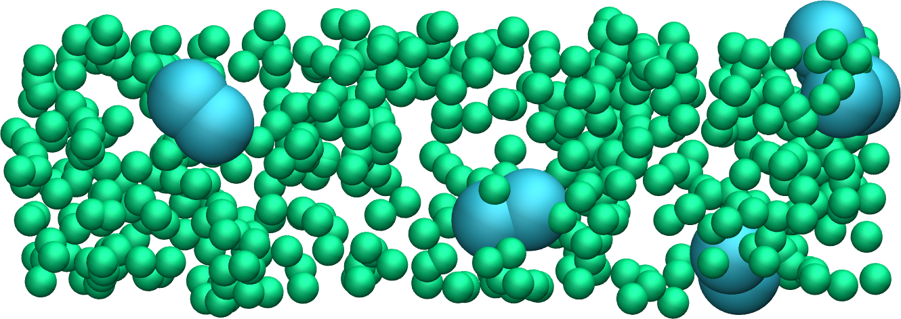

.. _lennard-jones-label:

Lennard-Jones fluid
*******************

.. container:: hatnote

   The very basics of LAMMPS through a simple example

..  container:: abstract

    The objective of this tutorial is to perform a simple molecular
    dynamics simulation of a binary fluid using LAMMPS.
    
..  container:: abstract

    The system is a Lennard-Jones fluid made of neutral
    particles with two different diameters in a cubic box with periodic
    boundary conditions. The temperature of the system is imposed
    using a Langevin thermostat :cite:`schneider1978molecular`, and some
    basic quantities are extracted
    from the system, such as the potential and kinetic energies. 

..  container:: abstract

    This tutorial illustrates several key ingredients of
    molecular dynamics simulations, such as system initialization,
    energy minimization, integration of the equations of motion,
    and trajectory visualization.

.. include:: ../../non-tutorials/needhelp.rst

.. include:: ../../non-tutorials/2Aug2023.rst

My first input
==============

..  container:: justify

    In order to run a simulation using LAMMPS, one needs to
    write a series of commands in an input script. For clarity,
    this script will be divided into five categories which we are going to
    fill up one by one. 
    
..  container:: justify

    Create a folder, call it *my-first-input/*, and then create a blank
    text file in it called *input.lammps*. Copy the following lines
    in *input.lammps*, where a line starting with a brace (#)
    is a comment that is ignored by LAMMPS:

.. code-block:: lammps

    # PART A - ENERGY MINIMIZATION
    # 1) Initialization
    # 2) System definition
    # 3) Simulation settings
    # 4) Visualization
    # 5) Run

.. container:: justify

    These five categories are not required in every
    input script, and should not necessarily be in that
    exact order. For instance parts 3 and 4 could be inverted, or
    part 4 could be omitted. Note however that LAMMPS reads input
    file from top to bottom, therefore the *Initialization* and 
    *System definition* categories must appear at the top of the
    input, and the *Run* category at the bottom.

System creation
---------------

.. container:: justify

    In the first section of the script, called *Initialization*,
    let us indicate to LAMMPS the most basic information
    about the simulation, such as:

    - the conditions at the boundaries of the box (periodic, non-periodic, ...),
    - the type of atoms (uncharged single dots, spheres with angular velocities, ...).

    Enter the following lines in *input.lammps*:

..  code-block:: lammps

    # 1) Initialization
    units lj
    dimension 3
    atom_style atomic
    pair_style lj/cut 2.5
    boundary p p p

..  container:: justify

    The first line, *units lj*, indicates that we want to
    use the system of unit called *LJ*, for Lennard-Jones, for
    which all quantities are unitless. 
    
.. admonition:: About Lennard-Jones (LJ) units
    :class: info

    Lennard-Jones (LJ) units are a dimensionless system of units.
    LJ units are often used in molecular simulations
    and theoretical calculations. When using LJ units:

    - energies are expressed in units of :math:`\epsilon`, where :math:`\epsilon` is the
      depth of the potential of the LJ interaction,
    - distances are expressed in units of :math:`\sigma`, where :math:`\sigma` is the distance
      at which the particle-particle potential energy is zero,
    - masses are expressed in units of the atomic mass :math:`m`.

    All the other quantities are normalized by a combination of :math:`\epsilon`, :math:`\sigma`,
    and :math:`m`. For instance, time is expressed in units of :math:`\sqrt{ \epsilon / m \sigma^2}`.
    Find on details on the |LAMMPS_units|.
    
.. |LAMMPS_units| raw:: html

    <a href="https://docs.lammps.org/units.html" target="_blank">LAMMPS website</a>

..  container:: justify

    The second line, *dimension 3*, indicates that the simulation
    is 3D. The third line, *atom_style atomic*, that the *atomic* style
    will be used, therefore each atom is just a dot with a mass.

.. admonition:: About the atom style
    :class: info

    While we are keeping things as simple as possible in this tutorial,
    different *atom_style* will be used in the following tutorials.
    These other *atom_style* will allow us to create atoms with
    charges, chemical bonds, etc.

..  container:: justify

    The fourth line, *pair_style lj/cut 2.5*, indicates that atoms
    will be interacting through a Lennard-Jones potential with
    a cut-off equal to :math:`r_c = 2.5` (unitless):
    
.. math::

    E_{ij} (r) = 4 \epsilon_{ij} \left[ \left( \dfrac{\sigma_{ij}}{r} \right)^{12} - \left( \dfrac{\sigma_{ij}}{r} \right)^{6} \right], ~ \text{for} ~ r < r_c,

..  container:: justify

    where :math:`r` is the inter-particles distance,
    :math:`\epsilon_{ij}` the depth of potential well that sets the interaction strength, and
    :math:`\sigma_{ij}` the distance parameter or particle effective size.
    Here, the index *ij* refer to the particle types *i* and *j*.

.. admonition:: About Lennard-Jones potential
    :class: info

    The Lennard-Jones potential offers a simplified representation that captures the fundamental
    aspects of interactions among atoms. It depicts a scenario where two
    particles exhibit repulsion at extremely close distances, attraction at moderate
    distances, and no interaction at infinite separation. The repulsive part of the 
    Lennard-Jones potential (i.e. the term :math:`\propto r^{-12}`) is associated
    with the Pauli exclusion principle. The attractive part (i.e. the term in :math:`\propto - r^{-6}`)
    is linked with the van der Waals forces.

..  container:: justify
    
    The last line, *boundary p p p*, indicates that the
    periodic boundary conditions will be used along all three
    directions of space (the 3 *p* stand for *x*, *y*, and *z*,
    respectively).

..  container:: justify

    At this point, the *input.lammps* is a 
    LAMMPS input script that does nothing.
    You can run it using LAMMPS to verify that the *input* contains
    no mistake by running the following command in the terminal
    from the *my-first-input/*  folder:

..  code-block:: bw

    lmp -in input.lammps

..  container:: justify

    Here *lmp* is linked to my compiled LAMMPS version.
    Running the previous command should return:

..  code-block:: bw

    LAMMPS (2 Aug 2023 - Update 1)
    Total wall time: 0:00:00

..  container:: justify

    In case there is a mistake in the input script, for example if
    *atom_stile* is written instead of *atom_style*, LAMMPS
    gives you an explicit warning:

..  code-block:: bw

    LAMMPS (2 Aug 2023 - Update 1)
    ERROR: Unknown command: atom_stile  atomic (src/input.cpp:232)
    Last command: atom_stile atomic

..  container:: justify

    Let us fill the *System definition* category of the input script:

..  code-block:: lammps

    # 2) System definition
    region simulation_box block -20 20 -20 20 -20 20
    create_box 2 simulation_box
    create_atoms 1 random 1500 341341 simulation_box
    create_atoms 2 random 100 127569 simulation_box

..  container:: justify

    The first line, *region simulation_box (...)*, creates a region
    named *simulation_box* that is a block (i.e. a rectangular cuboid) that
    extends from -20 to 20 (no unit) along all 3 directions of space.
    
..  container:: justify

    The second line, *create_box 2 simulation_box*, creates a simulation box based on
    the region *simulation_box* with *2* types of atoms.
    
..  container:: justify

    The third line, *create_atoms (...)* creates 1500 atoms of type 1
    randomly within the region *simulation_box*. The integer *341341* is a
    seed that can be changed in order to create different
    initial conditions for the simulation. The fourth line
    creates 100 atoms of type 2.

..  container:: justify

    If you run LAMMPS, you should see the following information in the
    terminal:

..  code-block:: bw

    (...)
    Created orthogonal box = (-20 -20 -20) to (20 20 20)
    (...)
    Created 1500 atoms
    (...)
    Created 100 atoms
    (...)

..  container:: justify

    From what is printed in the terminal, it is clear that
    LAMMPS correctly interpreted the commands, and first created
    the box with desired dimensions, then 1500 atoms, and then 100
    atoms.

..  container:: justify

    Let us fill the *Simulation Settings* category section of
    the *input* script:

..  code-block:: lammps

    # 3) Simulation settings
    mass 1 1
    mass 2 1
    pair_coeff 1 1 1.0 1.0
    pair_coeff 2 2 0.5 3.0

..  container:: justify

    The two first commands, *mass (...)*, attribute a mass
    equal to 1 (unitless) to both atoms of type 1 and 2,
    respectively.alternatively, one could have written
    these two commands into one single line: *mass * 1*,
    where the star symbol
    means *all* the atom types of the simulation. 
    
..  container:: justify
    
    The third line, *pair_coeff 1 1 1.0 1.0*, sets the Lennard-Jones
    coefficients for the interactions between atoms of type 1,
    respectively the energy parameter
    :math:`\epsilon_{11} = 1.0` and the distance parameter :math:`\sigma_{11} = 1.0`. 

..  container:: justify

    Similarly, the last line sets the Lennard-Jones coefficients for
    the interactions between atoms of type 2, :math:`\epsilon_{22} = 0.5`,
    and :math:`\sigma_{22} = 3.0`.
   
.. admonition:: About cross parameters
    :class: info

    By default, LAMMPS calculates the cross coefficients between the different atom types
    using geometric average: 
    :math:`\epsilon_{ij} = \sqrt{\epsilon_{ii} \epsilon_{jj}}`,
    :math:`\sigma_{ij} = \sqrt{\sigma_{ii} \sigma_{jj}}`. 
    In the present case, and even without specifying it explicitly, we thus have:

    - :math:`\epsilon_{ij} = \sqrt{1.0 \times 0.5} = 0.707`, and 
    - :math:`\sigma_{ij} = \sqrt{1.0 \times 3.0} = 1.732`.

    When necessary, cross parameters can be explicitly specifie
    by adding the following 
    line to the input file: *pair_coeff 1 2 0.707 1.732*. 

    Note that the arithmetic rule, where 
    :math:`\epsilon_{ij} = \sqrt{\epsilon_{ii} \epsilon_{jj}}`,
    :math:`\sigma_{ij} = (\sigma_{ii}+\sigma_{jj})/2`, 
    is more common than the geometric rule. However, neither the geometric nor the
    arithmetic rule are based on rigorous arguments, so here
    the geometric rule will do just fine. 

..  container:: justify

    Due to the chosen Lennard-Jones parameters, the two types of particles
    are given different effective diameters, as can be seen by plotting
    :math:`E_{11} (r)`, 
    :math:`E_{12} (r)`,
    and :math:`E_{22} (r)`.

.. figure:: ../figures/level1/lennard-jones-fluid/lennard-jones-light.png
    :alt: Lennard jones potential
    :class: only-light
    :name: fig-lennard-jones

.. figure:: ../figures/level1/lennard-jones-fluid/lennard-jones-dark.png
    :alt: Lennard jones potential
    :class: only-dark

..  container:: figurelegend

    Figure: The Lennard-Jones potential :math:`E_{ij} (r)`, where
    :math:`i, j = 1 ~ \text{or} ~ 2`.

Energy minimization
-------------------

..  container:: justify

    The system is now fully parametrized. Let us fill the two last remaining sections
    by adding the following lines to *input.lammps*:

..  code-block:: lammps

    # 4) Visualization
    thermo 10
    thermo_style custom step temp pe ke etotal press

    # 5) Run
    minimize 1.0e-4 1.0e-6 1000 10000

..  container:: justify

    The *thermo* command asks LAMMPS to print
    thermodynamic information (e.g. temperature, energy) in the
    terminal every given number of steps, here 10 steps. 
    The *thermo_style custom* requires LAMMPS to print 
    the system temperature (*temp*), potential energy (*pe*),
    kinetic energy (*ke*), total energy (*etotal*),
    and pressure (*press*). Finally, the *minimize* line
    asks LAMMPS to perform an energy minimization of the system.

.. admonition:: About energy minimization
    :class: info

    An energy minimization procedure consists in adjusting
    the coordinates of the atoms that are too close to each other until one of the stopping
    criteria is reached. By default, LAMMPS uses the conjugate gradient (CG) algorithm.
    Here, there are four stopping criteria:

    - The change in energy between two iterations is less than 1.0e-4,
    - The maximum force between two atoms in the system is lower than 1.0e-6,
    - The maximum number of iterations is 1000,
    - The maximum number of times the force and the energy have been evaluated is 10000.

..  container:: justify

    Now running the simulation, we can see how the thermodynamic
    variables evolve with time:

..  code-block:: bw

   Step  Temp  PotEng         KinEng    TotEng         Press     
   0     0     78840982       0         78840982       7884122      
   10    0     169.90532      0         169.90532      17.187291    
   20    0    -0.22335386     0        -0.22335386    -0.0034892297 
   30    0    -0.31178296     0        -0.31178296    -0.0027290466 
   40    0    -0.38135002     0        -0.38135002    -0.0016419218 
   50    0    -0.42686621     0        -0.42686621    -0.0015219081 
   60    0    -0.46153953     0        -0.46153953    -0.0010659992 
   70    0    -0.48581568     0        -0.48581568    -0.0014849169 
   80    0    -0.51799572     0        -0.51799572    -0.0012995545 
   (...)

..  container:: justify

    These lines give us information about
    the progresses of the energy minimization. First, at the start
    of the simulation (Step 0), the energy in the system is
    huge: 78840982 (unitless). This was expected because
    the atoms have been created at random positions within the
    simulation box, and some of them are probably overlapping,
    resulting in a large initial energy which is the consequence
    of the repulsive part of the Lennard-Jones interaction
    potential. As the energy minimization progresses, the energy
    rapidly decreases and reaches a negative value, indicating that the atoms have been
    displaced at reasonable distances from each others.
    
..  container:: justify

    Other useful information has been printed in the terminal, for
    example, LAMMPS tells us that the first of the four criteria
    to be satisfied was the energy:

..  code-block:: bw

    Minimization stats:
    Stopping criterion = energy tolerance

Molecular dynamics
------------------

..  container:: justify

    The system is now ready. Let us continue filling up the
    input script and adding commands in order to perform an actual molecular dynamics
    simulation that will start from the final state of the energy minimization.

.. admonition:: Background Information -- What is molecular dynamics?
    :class: info

    Molecular dynamics (MD) is based on the numerical solution of the Newtonian
    equations of motion for every atom :math:`i`,

    .. math::

        \sum_{j \ne i} \boldsymbol{F}_{ji} = m_i \times \boldsymbol{a}_i,

    where :math:`\sum` is the sum over all the atoms other than :math:`i`, 
    :math:`\boldsymbol{F}_{ji}` the force between the atom pairs :math:`j-i`,
    :math:`m_i` the mass of atom :math:`i`, and :math:`\boldsymbol{F}_i` its acceleration. 
    The Newtonian equations are solved every timestep to predict the
    evolution of the positions and velocities of atoms and molecules over time. 
    
    At every step, the following operations usually occur when 
    performing a MD simulation:

    - the forces between the atoms are calculated from the potential (here Lennard-Jones),
    - the acceleration of each atom is evaluated from the Newtonian equation,
    - the velocity and position of each atom are updated according to the calculated acceleration, typically using the Verlet algorithm, or similar.

..  container:: justify

    In the same input script, after the *minimization* command, add the following
    lines:

..  code-block:: lammps

    # PART B - MOLECULAR DYNAMICS
    # 4) Visualization
    thermo 50

    # 5) Run
    fix mynve all nve
    fix mylgv all langevin 1.0 1.0 0.1 1530917
    timestep 0.005
    run 10000

..  container:: justify

    Since LAMMPS reads the input from top to
    bottom, these lines will be executed after the energy
    minimization. There is no need to re-initialize the system
    re-define it, or re-specify the settings. The *thermo* command
    is called a second time within the same input, so the previously
    entered value of *10* will be replaced by the value of *50*
    as soon as *PART B* starts.

..  container:: justify

    In the run section, the *fix nve* is used to update the
    positions and the velocities of the atoms in the group
    *all*. Therefore, *fix nve* contains the time integrator and is
    the most important command here.
    
.. admonition:: What is a fix?
    :class: info
    
    In LAMMPS, a *fix* corresponds to an operation that is applied
    to the system.
    
..  container:: justify
    
    The second fix applies a Langevin thermostat to the atoms of group
    *all*, with a desired temperature of 1 and a *damping*
    parameter of 0.1. The number *1530917* is a seed, you can
    change it to perform statistically independent simulations.
    Finally we choose the *timestep* and we ask LAMMPS to
    run for 10000 steps. After running the simulation, you
    should see the following information in the terminal:

..  code-block:: bw

   Step   Temp          PotEng         KinEng       TotEng        Press     
   388    0             -0.95476642    0           -0.95476642   -0.000304834
   400    0.68476875    -0.90831467    1.0265112    0.11819648    0.023794293  
   500    0.97168188    -0.56803405    1.4566119    0.88857783    0.02383215   
   600    1.0364167     -0.44295618    1.5536534    1.1106972     0.027985679  
   700    1.010934      -0.39601767    1.5154533    1.1194356     0.023064983  
   800    0.98641731    -0.37866057    1.4787012    1.1000406     0.023131153  
   900    1.0074571     -0.34951264    1.5102412    1.1607285     0.023520785 
   (...)

..  container:: justify

    The second column shows that the temperature *Temp*
    starts from 0, but rapidly reaches the
    requested value and stabilize itself near :math:`T=1`. 

..  container:: justify

    From what has been printed in the *log* file, one can
    plot the potential energy (:math:`p_\text{e}`)
    and the kinetic energy (:math:`k_\text{e}`) of
    the system over time (see the figure below).

.. figure:: ../figures/level1/lennard-jones-fluid/energy-light.png
    :alt: Result tutorial molecular dynamics simulation: Energy plot over time
    :class: only-light

.. figure:: ../figures/level1/lennard-jones-fluid/energy-dark.png
    :alt: Result tutorial molecular dynamics simulation: Energy plot over time
    :class: only-dark

..  container:: figurelegend

    Figure: a) The potential energy (:math:`p_\text{e}`) rapidly decreases during
    energy minimization (orange). Then, after the molecular dynamics starts,
    :math:`p_\text{e}` increases until it reaches a plateau value of about -0.25 (blue). 
    b) The kinetic energy (:math:`k_\text{e}`) is equal to zero during energy minimization,
    then increases during molecular dynamics until it reaches a plateau value of about 1.5.

Trajectory visualization
------------------------

..  container:: justify

    The simulation is running well, but we would like to
    visualize the trajectories of the atoms. To do so, we need
    to dump the positions of the atoms in a file at a regular
    interval.
    
..  container:: justify

    Add the following command to the *input.lammps* file,
    in the *visualization* section of PART B:

..  code-block:: lammps

    dump mydmp all atom 100 dump.lammpstrj

..  container:: justify

    Run the *input.lammps* using LAMMPS again. A file named *dump.lammpstrj*
    must appear within *my-first-input/*. A *.lammpstrj* file can
    be opened using VMD. With Ubuntu/Linux,
    you can simply execute in the terminal:

..  code-block:: bw

    vmd dump.lammpstrj

..  container:: justify

    Otherwise, you can open VMD and import the *dump.lammpstrj*
    file manually using *File -> New molecule*.
    
..  container:: justify

    By default, you should see a cloud
    of lines, but you can improve the representation (see this :ref:`vmd-label`
    for basic instructions).

.. figure:: ../figures/level1/lennard-jones-fluid/first-input-light.png
    :alt: binary fluid simulated by LAMMPS and visualized with VMD
    :class: only-light

.. figure:: ../figures/level1/lennard-jones-fluid/first-input-dark.png
    :alt: binary fluid simulated by LAMMPS and visualized with VMD
    :class: only-dark

..  container:: figurelegend

    Figure: View of a slice of the system using VMD, with both
    types of atoms represented as spheres. See the corresponding |my_first_input_video|.

.. |my_first_input_video| raw:: html

    <a href="https://youtu.be/vdSIJM5fVJE" target="_blank">video</a>

Improving the script
====================

..  container:: justify

    Let us improve the input script and perform slightly more
    advanced operations, such as imposing a specific initial
    positions to the atoms, and restarting the simulation
    from a previously saved configuration. 

Control the initial atom positions
----------------------------------

..  container:: justify

    Let us create the atoms of type 1 and 2 in two separate
    regions, respectively, instead of creating them both randomly 
    within the entire space as we did previously. 
    
..  container:: justify

    Create a new folder next to *my-first-input/*, and call
    it *improved-input/*. Then, create a new input 
    and call it *input.min.lammps*.
    
..  container:: justify
    
    Similarly to what has been done previously, copy the following lines
    into *input.min.lammps*:

..  code-block:: lammps

    # 1) Initialization
    units lj
    dimension 3
    atom_style atomic
    pair_style lj/cut 2.5
    boundary p p p

..  container:: justify

    Let us create three separate regions: A cubic region
    for the simulation box and two additional regions
    for placing the atoms:

..  code-block:: lammps

    # 2) System definition
    region simulation_box block -20 20 -20 20 -20 20
    create_box 2 simulation_box
    region region_cylinder_in cylinder z 0 0 10 INF INF side in
    region region_cylinder_out cylinder z 0 0 10 INF INF side out
    create_atoms 1 random 1000 341341 region_cylinder_out
    create_atoms 2 random 150 127569 region_cylinder_in

..  container:: justify

    The *side in* and *side out* keywords
    are used to define regions that are respectively inside
    and outside of the cylinder of radius 10. Then, copy similar lines
    as previously into *input.min.lammps*:

..  code-block:: lammps

    # 3) Simulation settings
    mass 1 1
    mass 2 1
    pair_coeff 1 1 1.0 1.0
    pair_coeff 2 2 0.5 3.0

    # 4) Visualization
    thermo 10
    thermo_style custom step temp pe ke etotal press
    dump mydmp all atom 10 dump.min.lammpstrj

    # 5) Run
    minimize 1.0e-4 1.0e-6 1000 10000
    write_data minimized_coordinate.data

..  container:: justify

    The main novelty, with respect to the previous
    input script, is the *write_data* command. This command
    is used to print the final state of the simulation in
    a file named *minimized_coordinate.data*. Note that 
    the *write_data* command is placed after the *minimize*
    command. This *.data* file will be used later to restart
    the simulation from the final
    state of the energy minimisation step.

..  container:: justify

    Run the *input.min.lammps* script using LAMMPS. A new
    dump file named *dump.min.lammpstrj* will
    appear in the folder, allowing you to visualize the atoms
    trajectories during minimization. In
    addition, a file named *minimized_coordinate.data* will be created. 
    
..  container:: justify
    
    If you open *minimized_coordinate.data*, you will see that it
    contains all the information necessary to restart the
    simulation, such as the number of atoms and the size of
    the box. The *.data* file even contains the atoms *masses* and *pair_coeffs*:

..  code-block:: lammps

    1150 atoms
    2 atom types

    -20 20 xlo xhi
    -20 20 ylo yhi
    -20 20 zlo zhi

    Masses

    1 1
    2 1

    Pair Coeffs # lj/cut

    1 1 1
    2 0.5 3
    (...)

..  container:: justify

    The *minimized_coordinate.data* file also contains the final
    positions and velocities of all the atoms:

..  code-block:: lammps

    (...)
    Atoms # atomic

    970 1 4.4615279184230525 -19.88248310680258 -19.497251754277872 0 0 0
    798 1 1.0773937287460968 -17.57843015813612 -19.353475858951473 0 0 0
    21 1 -17.542385434367777 -16.647460269156497 -18.93914807895693 0 0 0
    108 1 -15.96241088290946 -15.956274144833264 -19.016419910024062 0 0 0
    351 1 0.08197850837343444 -16.852380573900156 -19.28249747472579 0 0 0
    402 1 -5.270160783673711 -15.592291204068946 -19.6382667867645 0 0 0
    (...)

..  container:: justify

    The columns of the *Atoms* section
    correspond (from left to right) to the atom indexes (from 1
    to the total number of atoms, 1150), the atom types (1 or 2
    here), the atoms positions :math:`x`, :math:`y`, :math:`z`.
    The last three columns are image flags that keep track of which
    atoms crossed the periodic boundary.

Restarting from a saved configuration
-------------------------------------

..  container:: justify

    Let us create a new input file and start a
    molecular dynamics simulation directly from the previously
    saved configuration. Within *improved-input/*, create a new file
    named *input.md.lammps* and copy the same lines as previously:

..  code-block:: lammps

    # 1) Initialization
    units lj
    dimension 3
    atom_style atomic
    pair_style lj/cut 2.5
    boundary p p p

..  container:: justify

    Now, instead of creating a new region and adding atoms to it, we
    can simply add the following command:

..  code-block:: lammps

    # 2) System definition
    read_data minimized_coordinate.data

..  container:: justify

    By visualizing the previously generated dump.min.lammpstrj
    file, you may have noticed that some atoms have moved from
    one region to the other during minimisation.
    In order to start the simulation from a clean state, with
    only atoms of type 2 within the cylinder and atoms of type
    1 outside the cylinder, let us delete the misplaced atoms
    by adding the following commands to *input.md.lammps*:

..  code-block:: lammps

    read_data minimized_coordinate.data
    region region_cylinder_in cylinder z 0 0 10 INF INF side in
    region region_cylinder_out cylinder z 0 0 10 INF INF side out
    group group_type_1 type 1
    group group_type_2 type 2
    group group_region_in region region_cylinder_in
    group group_region_out region region_cylinder_out
    group group_type_1_in intersect group_type_1 group_region_in
    group group_type_2_out intersect group_type_2 group_region_out
    delete_atoms group group_type_1_in
    delete_atoms group group_type_2_out

..  container:: justify

    The two first *region* commands recreate
    the previously defined regions, which is necessary since
    regions are not saved by the *write_data* command.

..  container:: justify

    The first two *group* commands create atom groups based on their types.
    The next two *group* commands create atom groups based on their
    positions at the beginning of the simulation, i.e. when the commands
    are being read by LAMMPS.
    The last two *group* commands create atom groups based on intersection
    between the previously defined groups.
    
..  container:: justify

    Finally, the two *delete_atoms* commands delete the
    atoms of type 1 that are located within the cylinder, as
    well as the atoms of type 2 that are located outside the
    cylinder, respectively. 
    
..  container:: justify

    When you run the *input.md.lammps* input using LAMMPS, you
    can see in the *log* file how many atoms are in each group,
    and how many atoms have been deleted:

..  code-block:: bw

    1000 atoms in group group_type_1
    150 atoms in group group_type_2
    149 atoms in group group_region_in
    1001 atoms in group group_region_out
    0 atoms in group group_type_1_in
    1 atoms in group group_type_2_out
    Deleted 0 atoms, new total = 1150
    Deleted 1 atoms, new total = 1149

..  container:: justify

    Add the following lines to *input.md.lammps*.
    Note the absence of *Simulation settings* section,
    because the settings are taken from the *.data* file.

..  code-block:: lammps

    # 4) Visualization
    thermo 1000
    dump mydmp all atom 1000 dump.md.lammpstrj
    
..  container:: justify
    
    Let us extract the number of atoms of each type
    inside the cylinder as a function of time, by
    adding the following commands to *input.md.lammps*:

..  code-block:: lammps

    variable number_type1_in equal count(group_type_1,region_cylinder_in)
    variable number_type2_in equal count(group_type_2,region_cylinder_in)
    fix myat1 all ave/time 10 200 2000 v_number_type1_in &
        file output-population1vstime.dat
    fix myat2 all ave/time 10 200 2000 v_number_type2_in &
        file output-population2vstime.dat

..  container:: justify

    The 2 *variables* are used to count
    the number of atoms of a specific group in the *region_cylinder_in* region. 

..  container:: justify

    The two *fix ave/time*
    are calling the previously defined variables and are printing
    their values into text files.
    By using *10 200 2000*, variables are evaluated every 10 steps, 
    averaged 200 times, and printed in the *.dat* files every 2000 steps.

..  container:: justify

    Let us also extract the coordination number per atom between atoms 
    of type 1 and 2, i.e. the average number of atoms of type 2 in the vicinity 
    of the atoms of type 1. This coordination number will be used as
    an indicator of the degree of mixing of our binary mixture. 
    Add the folloxing lines into *input.md.lammps*:
    
..  code-block:: lammps

    compute coor12 group_type_1 coord/atom cutoff 2.0 group group_type_2
    compute sumcoor12 all reduce ave c_coor12
    fix myat3 all ave/time 10 200 2000 &
        c_sumcoor12 file coordinationnumber12.dat
    
..  container:: justify

    The *compute ave* is used to average the per atom
    coordination number that is calculated by the *coord/atom* compute.
    This averaging is necessary as *coord/atom* returns an array where each value corresponds 
    to a certain couple of atom i-j. Such array can't be printed by *fix ave/time*. 
    Finally, let us complete the script by adding the following lines 
    to *input.md.lammps*:

..  code-block:: lammps

    # 5) Run
    velocity all create 1.0 4928459 mom yes rot yes dist gaussian
    fix mynve all nve
    fix mylgv all langevin 1.0 1.0 0.1 1530917 zero yes
    timestep 0.005
    run 300000
    write_data mixed.data

..  container:: justify

    There are a few differences with the previous simulation.
    First, the *velocity create*
    command attributes an initial velocity to every atom.
    The initial velocity is chosen so that the average initial
    temperature is equal to 1 (unitless). The additional
    keywords ensure that no linear momentum (*mom yes*) and no angular
    momentum (*rot yes*) are given to the system, and that the generated
    velocities are distributed as a Gaussian. Another improvement
    is the *zero yes* keyword in the Langevin thermostat, that
    ensures that the total random force is equal to zero.

..  container:: justify

    Run *input.md.lammps* using LAMMPS and vizualize the trajectory
    using VMD:

.. figure:: ../figures/level1/lennard-jones-fluid/mixing-vmd-light.png
    :alt: LAMMPS VMD tutorial molecular dynamics simulation
    :class: only-light

.. figure:: ../figures/level1/lennard-jones-fluid/mixing-vmd-dark.png
    :alt: LAMMPS VMD tutorial molecular dynamics simulation
    :class: only-dark

.. container:: figurelegend

    Figure: Evolution of the atom populations during mixing.

..  container:: justify

    After running *input.md.lammps* using LAMMPS, you can observe the number
    of atoms in each region from the generated data files, as
    well as the evolution of the coordination number due to mixing:

.. figure:: ../figures/level1/lennard-jones-fluid/mixing-light.png
    :alt: Result tutorial molecular dynamics simulation: Energy plot over time
    :class: only-light

.. figure:: ../figures/level1/lennard-jones-fluid/mixing-dark.png
    :alt: Result tutorial molecular dynamics simulation: Energy plot over time
    :class: only-dark

.. container:: figurelegend

    Figure: Evolution of the number of atoms within the *region_cylinder_in* region
    as a function of time (a), and evolution of the coordination number (b). 

.. include:: ../../non-tutorials/accessfile.rst

Going further with exercises
============================

.. include:: ../../non-tutorials/link-to-solutions.rst

Solve Lost atoms error
----------------------

.. container:: justify

    For this exercise, the following input script is provided:
    
..  code-block:: lammps

    units lj
    dimension 3
    atom_style atomic
    pair_style lj/cut 2.5
    boundary p p p

    region simulation_box block -20 20 -20 20 -20 20
    create_box 1 simulation_box
    create_atoms 1 random 1000 341841 simulation_box

    mass 1 1
    pair_coeff 1 1 1.0 1.0

    dump mydmp all atom 100 dump.lammpstrj
    thermo 100
    thermo_style custom step temp pe ke etotal press

    fix mynve all nve
    fix mylgv all langevin 1.0 1.0 0.1 1530917
    timestep 0.005

    run 10000

.. container:: justify
 
    As it is, this input returns one of the most common
    error that you will encounter using LAMMPS:

..  code-block:: bash

    ERROR: Lost atoms: original 1000 current 984

.. container:: justify

    The goal of this exercise is to fix the *Lost atoms* error without 
    using any other command than the ones already present. You can 
    only play with the values of the parameters and/or replicate every
    command at many times as needed.

..  admonition:: Note
    :class: info

    This script is failing because particles are created
    randomly in space, some of them are likely overlapping,
    and no energy minimization is performed prior
    to start the molecular dynamics simulation.

Create a demixed dense phase
----------------------------

..  container:: justify

    Starting from one of the *input* created in this tutorial,
    fine tune the parameters such as particle numbers and interaction
    to create a simulation with the following properties:

    - the density in particles must be high,
    - both particles of type 1 and 2 must have the same size,
    - particles of type 1 and 2 must demix. 

.. figure:: ../figures/level1/lennard-jones-fluid/demixing-light.png
    :alt: VMD/LAMMPS exercice molecular dynamics simulation: demixing lennard jones fluids
    :class: only-light

.. figure:: ../figures/level1/lennard-jones-fluid/demixing-dark.png
    :alt: VMD/LAMMPS exercice molecular dynamics simulation: demixing lennard jones fluids
    :class: only-dark

.. container:: figurelegend

    Figure: Snapshots taken at different times showing the particles of type 1 
    and type 2 progressively demixing and forming large demixed areas.  

..  admonition:: Hint
    :class: info

    An easy way to create a dense phase is to allow the box dimensions 
    to relax until the vacuum disapears. You can do that 
    by replacing the *fix nve* by *fix nph*.

From atoms to molecules
-----------------------

..  container:: justify

    Add a bond between particles of *type 2* to create
    dumbbell molecules instead of single paticles.

.. figure:: ../figures/level1/lennard-jones-fluid/dumbell-dark.png
    :alt: Dumbbell Lennard-Jones molecules simulated using LAMMPS
    :class: only-dark

.. container:: figurelegend

    Figure: Dumbbell molecules made of 2 large spheres
    mixed with smaller particles (small spheres). 
    See the corresponding |dumbell_video|.

.. |dumbell_video| raw:: html

    <a href="https://youtu.be/R_oHonOQi68" target="_blank">video</a>

..  container:: justify

    Similarly to the dumbbell molecules, create a small polymer,
    i.e. a long chain of particles linked by bonds and angles.

.. figure:: ../figures/level1/lennard-jones-fluid/polymer-dark.png
    :alt: Polymer Lennard-Jones molecules simulated using LAMMPS
    :class: only-dark

.. figure:: ../figures/level1/lennard-jones-fluid/polymer-light.png
    :alt: Polymer Lennard-Jones molecules simulated using LAMMPS
    :class: only-light 

.. container:: figurelegend

    Figure: A single small polymer molecule made of
    9 large spheres mixed with smaller particles. 
    See the corresponding |polymer_video|.

.. |polymer_video| raw:: html

    <a href="https://youtu.be/LfqcfP3ZQcY" target="_blank">video</a>

.. admonition:: Hints
    :class: info

    ..  container:: justify

        Use a *molecule template* to easily insert as many atoms connected
        by bonds (i.e. molecules) as you want. A molecule 
        template typically begins as follow:

    ..  code-block:: lammps

        2 atoms
        1 bonds

        Coords

        1 0.5 0 0
        2 -0.5 0 0

        (...)

    ..  container:: justify

        A bond section also needs to be added.